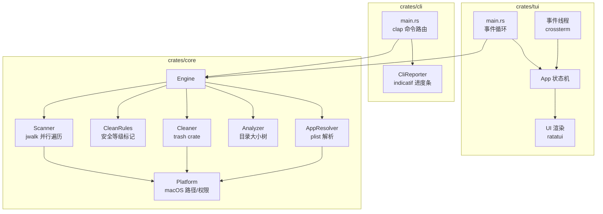
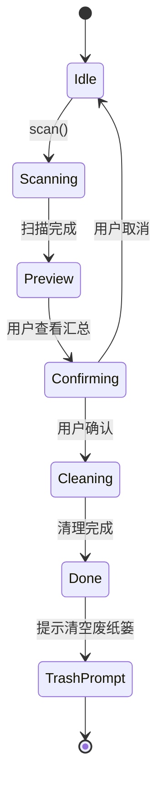

# feat: macCleaner v1 — Rust Mac 清理工具

## Summary

从零构建 macCleaner v1：一个 Rust 编写的 Mac 清理工具，Cargo workspace 架构（core lib + cli bin + tui bin），提供 clean / uninstall / analyze / purge 四个核心命令，安全三级分类（safe/moderate/risky），废纸篓优先删除，并发扫描目标 < 30 秒。

---

## Problem Frame

Mac 用户的磁盘空间被开发缓存、应用残留、系统日志等"隐形垃圾"持续蚕食。现有清理工具要么收费昂贵，要么用恐吓式营销，要么有隐私和误删风险。开源替代品（如 Mole）扫描性能差、交互粗糙。需要一个免费、透明、快速、安全的清理工具。(see origin: docs/brainstorms/2026-06-03-macCleaner-v1-requirements.md)

---

## Requirements

**核心引擎**

R1. 引擎提供统一的扫描、分析、删除 API，CLI 和 TUI 共享同一引擎，无重复逻辑。

R2. 扫描采用并发执行（jwalk 并行遍历），全盘扫描目标 < 30 秒。

R3. 每个可清理项标记安全等级：safe / moderate / risky。safe 项默认勾选。

R4. 所有删除操作默认移到 macOS 废纸篓。仅 `--permanent` 标志时永久删除。

R5. 清理完成后，提示废纸篓大小，询问是否清空。

**clean 命令**

R6. 扫描类别：系统缓存、应用日志、临时文件、浏览器缓存。

R7. 按类别分组展示，每组显示文件数和总大小。

**uninstall 命令**

R8. 列出已安装应用，支持搜索/过滤。

R9. 通过 bundle ID 在标准路径查找关联文件。

R10. 卸载前展示应用本体和关联文件列表，确认后执行。

**analyze 命令**

R11. 交互式磁盘用量浏览器：树状目录大小，支持导航。

R12. 自动标记大文件（默认 100MB，`--threshold` 可调）。

R13. TUI 模式提供可视化空间占用展示。

**purge 命令**

R14. 默认扫描 `~/`，支持指定路径。

R15. 识别开发产物：node_modules、target、.venv、__pycache__、dist/build、.gradle、DerivedData、Pods。

R16. 按项目分组展示，可勾选/取消勾选。

**CLI 交互**

R17. 所有命令支持 `--preview` / `--dry-run`。

R18. 所有命令支持 `--yes` / `-y`（仅 safe 项）。

R19. 支持 `--json` 输出。

R20. 执行前显示分类汇总并要求确认。

**TUI 交互**

R21. 主菜单列出四个命令，键盘导航。

R22. 扫描实时进度（路径、项数、大小）。

R23. 分类列表，展开/折叠到文件级，全选/取消。

R24. 颜色区分安全等级：safe（绿）、moderate（黄）、risky（红）。

---

## Key Technical Decisions

**KTD1: Cargo workspace 三 crate 架构** — `crates/core`（library，零 UI 依赖）+ `crates/cli`（binary）+ `crates/tui`（binary）。core 通过 `ProgressReporter` trait 和 `crossbeam-channel` 向 UI 层推送进度，UI 层各自消费。这确保引擎逻辑不与任何 UI 框架耦合，未来 Tauri GUI 只需再加一个 crate。

**KTD2: jwalk 作为主遍历引擎** — jwalk 基于 rayon 的并行目录遍历，比 walkdir（单线程）快 2-5 倍。支持遍历中过滤跳过子树（`process_read_dir`），适合按规则裁剪扫描范围。macCleaner 不需要 gitignore 支持（反而需要扫描被 ignore 的目录如 node_modules），因此不选 `ignore` crate。

**KTD3: trash crate 实现废纸篓操作** — 使用 `trash` crate（v5.x），底层通过 `NSFileManager.trashItemAtURL` 实现，是 Apple 官方推荐的 API。比 osascript 方案快几个数量级（无进程 fork 开销），且正确处理外部卷的 `.Trashes` 目录。

**KTD4: 纯文件系统遍历查找应用残留，不依赖 Spotlight** — uninstall 通过读取 .app 的 `Info.plist` 获取 bundle ID，然后在 `~/Library` 下的标准路径（Caches、Preferences、Application Support 等）匹配。覆盖 90%+ 的应用残留，实现简单可靠。Spotlight 增强留到 v2。

**KTD5: 安全等级作为引擎核心数据模型** — 每条清理规则自带安全等级（safe/moderate/risky），引擎在扫描阶段即标记，UI 层根据等级决定展示和默认勾选。这是产品信任基石——等级定义错误会导致误删。

**KTD6: clap derive API + ratatui component 模式** — CLI 用 clap 4.x derive API（简洁、类型安全）。TUI 用 ratatui + crossterm，App 状态机驱动，独立事件线程轮询键盘和引擎进度。

**KTD7: 符号链接安全策略** — `follow_links(false)` 不跟随符号链接；用 `symlink_metadata()` 获取大小；删除时只删链接本身。避免循环引用、重复计算和误删链接目标。

**KTD8: DECIMAL 格式显示文件大小** — 使用 `humansize` crate 的 DECIMAL 格式（1 GB = 1,000,000,000 bytes），与 macOS Finder 显示一致，避免用户困惑。

---

## High-Level Technical Design



**引擎状态流转（以 clean 命令为例）：**



---

## Output Structure

```
macCleaner/
├── Cargo.toml                    # workspace root
├── Cargo.lock
├── crates/
│   ├── core/
│   │   ├── Cargo.toml
│   │   └── src/
│   │       ├── lib.rs            # 公开 API
│   │       ├── engine.rs         # Engine 主结构
│   │       ├── scanner.rs        # 并发文件扫描
│   │       ├── cleaner.rs        # 删除/废纸篓操作
│   │       ├── analyzer.rs       # 磁盘分析/目录树
│   │       ├── app_resolver.rs   # 应用 bundle ID 解析
│   │       ├── rules.rs          # 清理规则定义
│   │       ├── models.rs         # 核心数据类型
│   │       ├── progress.rs       # ProgressReporter trait
│   │       └── platform.rs       # macOS 路径/权限/废纸篓
│   ├── cli/
│   │   ├── Cargo.toml
│   │   └── src/
│   │       ├── main.rs           # clap 入口
│   │       ├── commands/
│   │       │   ├── mod.rs
│   │       │   ├── clean.rs
│   │       │   ├── uninstall.rs
│   │       │   ├── analyze.rs
│   │       │   └── purge.rs
│   │       ├── output.rs         # 格式化输出/JSON
│   │       └── reporter.rs       # CLI 进度报告
│   └── tui/
│       ├── Cargo.toml
│       └── src/
│           ├── main.rs           # 事件循环入口
│           ├── app.rs            # App 状态机
│           ├── event.rs          # 事件线程
│           ├── ui/
│           │   ├── mod.rs
│           │   ├── menu.rs       # 主菜单
│           │   ├── scan.rs       # 扫描进度
│           │   ├── results.rs    # 结果列表
│           │   ├── confirm.rs    # 确认对话框
│           │   └── analyzer.rs   # 磁盘分析浏览器
│           └── reporter.rs       # TUI 进度报告
├── tests/
│   └── integration/
│       ├── clean_test.rs
│       ├── uninstall_test.rs
│       ├── analyze_test.rs
│       └── purge_test.rs
└── fixtures/                     # 测试用模拟目录
```

---

## Implementation Units

### U1. Workspace 脚手架和核心数据模型

**Goal:** 搭建 Cargo workspace 骨架，定义核心数据类型（ScanResult、CleanItem、SafetyLevel、Category 等）和 ProgressReporter trait。

**Requirements:** R1

**Dependencies:** 无

**Files:**
- `Cargo.toml`（workspace root）
- `crates/core/Cargo.toml`
- `crates/core/src/lib.rs`
- `crates/core/src/models.rs`
- `crates/core/src/progress.rs`
- `crates/cli/Cargo.toml`
- `crates/cli/src/main.rs`（占位）
- `crates/tui/Cargo.toml`
- `crates/tui/src/main.rs`（占位）

**Approach:** 在 workspace 根 `Cargo.toml` 中用 `[workspace.dependencies]` 统一管理依赖版本。core crate 零 UI 依赖。`models.rs` 定义 `SafetyLevel`（enum: Safe/Moderate/Risky）、`ScanItem`（path + size + safety + category）、`ScanResult`（按类别分组的结果）、`CleanReport`（清理报告）。`progress.rs` 定义 `ProgressReporter` trait（on_scanning、on_progress、on_complete）和 `ProgressEvent` enum（用于 channel 推送）。

**Patterns to follow:** Rust workspace 惯例，`[workspace.dependencies]` 统一版本管理。

**Test scenarios:**
- workspace 所有 crate 编译通过 `cargo build --workspace`
- `SafetyLevel` 序列化/反序列化正确
- `ScanResult` 正确计算总大小和文件数

**Verification:** `cargo build --workspace` 和 `cargo test --workspace` 通过。

---

### U2. macOS 平台层（路径、权限、废纸篓）

**Goal:** 封装 macOS 特定操作：标准路径获取、Full Disk Access 检测、废纸篓操作、plist 解析。

**Requirements:** R4, R5, R9

**Dependencies:** U1

**Files:**
- `crates/core/src/platform.rs`
- `crates/core/src/app_resolver.rs`
- `crates/core/Cargo.toml`（添加 trash、plist、dirs 依赖）
- `crates/core/tests/platform_test.rs`

**Approach:**
- `platform.rs`：使用 `dirs` crate 获取 home 目录，定义 `get_cache_paths()`、`get_log_paths()` 等返回标准 macOS 路径。`check_full_disk_access()` 尝试读取 `~/Library/Mail` 检测权限，失败时优雅降级（跳过受保护目录并提示用户）。废纸篓操作通过 `trash::delete_all()` 实现，`get_trash_size()` 遍历 `~/.Trash` 计算大小。`empty_trash()` 通过 `osascript` 或直接删除 `~/.Trash` 内容实现。
- `app_resolver.rs`：使用 `plist` crate 读取 `.app/Contents/Info.plist`，提取 `CFBundleIdentifier`、`CFBundleName`。`find_app_leftovers(bundle_id)` 在标准路径（Caches、Preferences、Application Support、LaunchAgents、Saved Application State）匹配。使用 `symlink_metadata()` 避免跟随符号链接。

**Test scenarios:**
- `get_cache_paths()` 返回的路径列表包含 `~/Library/Caches`
- `check_full_disk_access()` 在无权限时返回 false，不 panic
- `trash::delete_all` 对测试文件正确移到废纸篓（在 fixtures 临时目录测试）
- `read_app_info` 正确解析 `Info.plist` 中的 bundle ID 和应用名
- `find_app_leftovers` 在模拟目录中找到匹配 bundle ID 的文件
- `find_app_leftovers` 不跟随符号链接

**Verification:** 单元测试通过；在真实 macOS 环境手动验证废纸篓操作。

---

### U3. 清理规则引擎和安全等级分类

**Goal:** 定义内建清理规则，每条规则关联安全等级和扫描路径模式。引擎按规则扫描时自动标记安全等级。

**Requirements:** R3, R6, R15

**Dependencies:** U1, U2

**Files:**
- `crates/core/src/rules.rs`
- `crates/core/tests/rules_test.rs`

**Approach:** `CleanRule` 结构体包含 name、description、paths（Vec\<PathPattern\>）、safety（SafetyLevel）。`PathPattern` 支持 Exact（绝对路径）和 DirName（目录名匹配，用于 purge 的 node_modules 等）。内建规则分三组：
- **clean 规则**：系统缓存（safe）、应用日志（safe）、临时文件（safe）、浏览器缓存（safe）
- **purge 规则**：node_modules（safe）、target（safe）、.venv（safe）、__pycache__（safe）、DerivedData（safe）、Pods（safe）、.gradle（safe）、dist/build（moderate）
- **uninstall 规则**：由 app_resolver 动态生成，残留文件标记为 safe

**Test scenarios:**
- 每条内建规则都有正确的安全等级
- `PathPattern::Exact` 匹配绝对路径
- `PathPattern::DirName` 匹配目录名（如 "node_modules"）且忽略 `.` 开头的隐藏目录
- safe 规则不包含任何用户数据路径（Documents、Desktop、Downloads）
- 空规则集返回空扫描结果

**Verification:** 规则覆盖需求中列出的所有清理类别（R6、R15）。

---

### U4. 并发扫描引擎

**Goal:** 实现基于 jwalk 的并发文件扫描，按规则匹配文件，报告进度，收集扫描结果。

**Requirements:** R1, R2, R7, R16, R22

**Dependencies:** U1, U2, U3

**Files:**
- `crates/core/src/scanner.rs`
- `crates/core/src/engine.rs`
- `crates/core/tests/scanner_test.rs`

**Approach:** `Scanner` 使用 `jwalk::WalkDir` 并行遍历，`follow_links(false)`。`process_read_dir` 回调中跳过不需要扫描的目录（如 `.git`、系统目录）。每个发现的文件与清理规则匹配，命中则创建 `ScanItem`（携带路径、大小、安全等级、所属类别）。通过 `crossbeam-channel` 向 UI 推送 `ProgressEvent`。扫描完成后，结果按类别分组汇总。

`Engine` 是面向 UI 的主入口，持有 `Scanner`、`Cleaner`、`Rules`。提供 `scan(command, reporter)`、`clean(items, mode, reporter)`、`dry_run(items)` 方法。

**Test scenarios:**
- 扫描包含 node_modules 和 .venv 的模拟目录，正确识别开发产物
- 扫描结果按类别分组，每组包含正确的文件数和总大小
- 符号链接不被跟随，不计入大小
- 空目录返回空结果集
- 大量文件（1000+）的扫描不 panic，进度事件持续推送
- 扫描过程中 ProgressEvent 包含当前路径和已发现大小

**Verification:** 在 fixtures 目录构造测试场景，验证扫描准确性和并发正确性。

---

### U5. 清理执行和废纸篓集成

**Goal:** 实现文件清理执行逻辑：移到废纸篓、永久删除、清理完成汇报、废纸篓清空提示。

**Requirements:** R4, R5, R17, R18

**Dependencies:** U2, U4

**Files:**
- `crates/core/src/cleaner.rs`
- `crates/core/tests/cleaner_test.rs`

**Approach:** `Cleaner` 提供 `execute(items, mode, reporter)` 方法。`DeleteMode::Trash` 调用 `trash::delete_all()`，`DeleteMode::Permanent` 调用 `fs::remove_file`/`fs::remove_dir_all`。执行后构建 `CleanReport`（已删除文件数、释放空间、失败项及原因）。`dry_run(items)` 只构建报告不执行。

权限失败时逐项降级——标记失败项并继续处理其余文件，最终报告中列出失败项。

**Test scenarios:**
- Covers AE3. 文件移到 `~/.Trash` 后，原路径不存在
- dry-run 模式不实际删除文件
- 永久删除模式（`--permanent`）后文件不可恢复
- 部分文件权限不足时，其余文件仍被清理，失败项在报告中列出
- 清理 0 个文件时返回空报告，不报错
- `--yes` 模式仅执行 safe 级别的项

**Verification:** 在临时目录验证文件确实被移到废纸篓/删除。

---

### U6. CLI 命令路由和 clean 命令

**Goal:** 实现 CLI 入口（clap derive）和 clean 子命令的完整流程。

**Requirements:** R6, R7, R17, R18, R19, R20

**Dependencies:** U4, U5

**Files:**
- `crates/cli/src/main.rs`
- `crates/cli/src/commands/mod.rs`
- `crates/cli/src/commands/clean.rs`
- `crates/cli/src/output.rs`
- `crates/cli/src/reporter.rs`
- `crates/cli/Cargo.toml`（添加 clap、indicatif 等依赖）
- `tests/integration/clean_test.rs`

**Approach:** `main.rs` 用 clap derive 定义顶级 CLI 结构和全局标志（`--dry-run`、`--yes`、`--json`）。子命令路由到各 commands 模块。`reporter.rs` 实现 `CliReporter`（基于 indicatif 的进度条/spinner）。`output.rs` 处理格式化输出（人类可读和 JSON 两种模式）。

`clean.rs` 流程：创建 Engine → 调用 `scan(CleanCommand)` → 格式化展示汇总 → 等待确认（或 `--yes` 跳过）→ 调用 `clean(items)` → 展示结果 → 提示废纸篓。

**Test scenarios:**
- Covers AE1. `mc clean` 展示分类汇总，safe 项默认勾选
- Covers AE2. `mc clean --preview` 展示汇总但不删除
- `mc clean --json` 输出有效 JSON 结构
- `mc clean --yes` 跳过确认直接执行 safe 项
- 无可清理项时显示"无需清理"

**Verification:** 在模拟环境下 `cargo run --bin mc -- clean --preview` 正确输出。

---

### U7. CLI uninstall 命令

**Goal:** 实现 uninstall 子命令：列出应用、搜索过滤、展示关联文件、确认卸载。

**Requirements:** R8, R9, R10

**Dependencies:** U2, U5, U6

**Files:**
- `crates/cli/src/commands/uninstall.rs`
- `tests/integration/uninstall_test.rs`

**Approach:** 列出 `/Applications` 和 `~/Applications` 下的 `.app`，用 `app_resolver` 读取 bundle ID 和应用名。支持 `--search` 参数过滤。选择应用后调用 `find_app_leftovers(bundle_id)` 查找关联文件，展示完整列表（应用本体 + 关联文件 + 总大小），确认后执行清理。

**Test scenarios:**
- 列出 `/Applications` 下所有 .app 及其大小
- `--search chrome` 只显示匹配的应用
- 展示的关联文件列表包含 Caches、Preferences、Application Support 等标准路径
- 确认后应用和关联文件都被移到废纸篓
- 没有找到关联文件时只删除应用本体

**Verification:** 手动对一个已知应用测试卸载流程。

---

### U8. CLI analyze 命令

**Goal:** 实现 analyze 子命令：扫描目录大小、展示树状结构、标记大文件。

**Requirements:** R11, R12

**Dependencies:** U4, U6

**Files:**
- `crates/cli/src/commands/analyze.rs`
- `crates/core/src/analyzer.rs`（在 U4 基础上扩展）
- `tests/integration/analyze_test.rs`

**Approach:** `analyzer.rs` 构建 `DirNode` 树（path、size、children），用 jwalk 并行统计每个目录大小。CLI 模式下以缩进文本展示 top-N 目录（默认 top 20），标记超过阈值的大文件。支持 `--path` 指定分析目录（默认 `~/`），`--threshold` 调整大文件阈值。

TUI 模式的交互式浏览器在 U11 中实现。

**Test scenarios:**
- 分析包含已知大小文件的 fixtures 目录，输出大小正确
- `--threshold 50` 标记 50MB 以上的文件
- 输出按大小降序排列
- 空目录分析正确（大小为 0，无子项）

**Verification:** 对 `~/Library` 运行 analyze，输出合理。

---

### U9. CLI purge 命令

**Goal:** 实现 purge 子命令：扫描开发产物、按项目分组展示、勾选清理。

**Requirements:** R14, R15, R16

**Dependencies:** U3, U4, U5, U6

**Files:**
- `crates/cli/src/commands/purge.rs`
- `tests/integration/purge_test.rs`

**Approach:** purge 使用 Scanner 配合 purge 规则组，在指定目录下查找匹配 `DirName` 模式的目录（node_modules、target 等）。结果按「项目」分组——项目由产物的父目录界定（如 `~/workspace/project-a/node_modules` 归属 `project-a`）。CLI 展示每个项目的产物类型和大小，用户可通过编号选择要清理的项目。

**Test scenarios:**
- Covers AE4. `mc purge ~/workspace` 按项目分组展示
- fixtures 中包含 node_modules 和 target 的模拟项目，正确识别
- 用户取消勾选某个项目后，该项目不被清理
- `--preview` 只展示不清理
- 指定不存在的路径时给出友好错误信息

**Verification:** 在模拟的多项目目录下运行 purge。

---

### U10. TUI 基础框架

**Goal:** 搭建 TUI 应用骨架：事件循环、App 状态机、主菜单、进度展示。

**Requirements:** R21, R22, R24

**Dependencies:** U1, U4

**Files:**
- `crates/tui/src/main.rs`
- `crates/tui/src/app.rs`
- `crates/tui/src/event.rs`
- `crates/tui/src/ui/mod.rs`
- `crates/tui/src/ui/menu.rs`
- `crates/tui/src/ui/scan.rs`
- `crates/tui/src/reporter.rs`
- `crates/tui/Cargo.toml`（添加 ratatui、crossterm 依赖）

**Approach:** `app.rs` 定义 `AppState` 状态机（Idle → Scanning → Results → Confirming → Cleaning → Done）。`event.rs` 在独立线程轮询 crossterm 键盘事件和引擎进度 channel，统一为 `AppEvent` enum。`main.rs` 驱动 事件接收 → 状态更新 → UI 渲染 的主循环。`reporter.rs` 实现 `TuiReporter`，通过 channel 向 App 推送进度。

主菜单（`menu.rs`）列出 Clean / Uninstall / Analyze / Purge 四个选项，方向键选择，Enter 进入。扫描进度页面（`scan.rs`）显示 spinner + 当前路径 + 已发现项数 + 已统计大小。颜色编码：safe（绿）、moderate（黄）、risky（红）。

**Test scenarios:**
- App 状态机正确从 Idle → Scanning → Results 转换
- 键盘事件（上下方向键、Enter、q 退出）正确路由
- 进度事件从 channel 接收后更新 App 状态
- 状态机不允许非法转换（如 Idle → Cleaning）

**Verification:** `cargo run --bin mc-tui` 启动后显示主菜单，可导航。

---

### U11. TUI 扫描结果和 clean/purge/uninstall 交互

**Goal:** 实现 TUI 的扫描结果展示、勾选/取消、确认执行流程。覆盖 clean、purge、uninstall 三个命令的 TUI 交互。

**Requirements:** R7, R10, R16, R20, R23, R24

**Dependencies:** U5, U10

**Files:**
- `crates/tui/src/ui/results.rs`
- `crates/tui/src/ui/confirm.rs`

**Approach:** `results.rs` 渲染分类列表，每个类别可展开/折叠显示具体文件。空格键勾选/取消，Tab 键展开/折叠，`a` 全选/取消全选。每个项目显示安全等级颜色标签。底部状态栏显示已选项数和总大小。`confirm.rs` 渲染确认对话框（"确认清理 X 个文件，释放 Y？[Y/n]"）。

**Test scenarios:**
- 渲染正确：safe 项绿色、moderate 黄色、risky 红色
- 空格键切换勾选状态
- 展开/折叠正确切换
- 全选仅勾选 safe 项（不自动勾选 moderate/risky）
- 确认后触发清理流程

**Verification:** TUI 中完成一次完整的 clean 流程。

---

### U12. TUI analyze 交互式浏览器

**Goal:** 实现 analyze 命令的 TUI 交互式磁盘分析浏览器，支持目录导航和可视化。

**Requirements:** R11, R12, R13

**Dependencies:** U8, U10

**Files:**
- `crates/tui/src/ui/analyzer.rs`

**Approach:** 基于 `DirNode` 树渲染目录列表，每行显示目录名 + 大小 + 占父目录百分比的条形图。Enter 进入子目录，Backspace/Esc 返回上级，`d` 标记删除。大文件用高亮颜色标记。右侧区域显示选中项的详细信息（完整路径、文件数、最后修改时间）。

**Test scenarios:**
- 目录列表按大小降序
- Enter 进入子目录后 breadcrumb 路径更新
- Backspace 返回上级目录
- 大于阈值的文件/目录以高亮显示
- 空目录正确显示"(空)"

**Verification:** 对 `~/Library` 运行 TUI analyze，交互流畅。

---

## Scope Boundaries

**Deferred for later (v2+):**
- GUI 界面（Tauri + Web 前端）
- optimize 命令（系统维护）
- status 命令（系统监控）
- installer 命令（安装包扫描）
- 增量扫描缓存
- Spotlight (`mdfind`) 增强应用残留发现
- 跨平台支持

**Outside this product's identity:**
- 杀毒/恶意软件扫描
- 系统性能优化/加速
- 遥测/数据收集
- 付费功能/订阅

**Deferred to Follow-Up Work:**
- Homebrew formula 创建和分发
- Shell 补全生成（clap 支持但需额外配置）
- 国际化/多语言支持

---

## Risks & Dependencies

**R-RISK1: Full Disk Access 权限** — macOS TCC 限制可能导致部分目录不可扫描。缓解：检测权限失败后优雅降级，跳过受保护目录并提示用户。

**R-RISK2: 废纸篓清空操作** — `empty_trash()` 可能需要通过 `osascript` 调用 Finder，行为依赖 macOS 版本。缓解：实现时先验证 API，必要时回退为直接删除 `~/.Trash` 内容。

**R-RISK3: 误删风险** — 清理规则定义错误可能导致删除用户重要文件。缓解：默认只勾选 safe 级别；所有删除先移废纸篓；规则内建且经过测试。

**R-RISK4: 并发扫描的文件锁/竞态** — 扫描过程中文件可能被其他程序修改或删除。缓解：扫描使用只读操作（stat/readdir），删除阶段对不存在的文件静默跳过。

---

## Acceptance Examples

AE1. **safe 级别自动勾选** — 执行 `mc clean`，扫描完成后 safe 级别项默认勾选，moderate/risky 未勾选。Covers R3, R20.

AE2. **dry-run 不执行删除** — 执行 `mc clean --preview`，展示汇总，不删除。退出码 0。Covers R17.

AE3. **废纸篓流程** — 确认清理后文件移到 `~/.Trash`，显示释放空间，提示清空废纸篓。Covers R4, R5.

AE4. **purge 按项目分组** — 执行 `mc purge ~/workspace`，按项目分组展示，可取消勾选单个项目。Covers R15, R16.

---

## Sources / Research

- [tw93/Mole](https://github.com/tw93/Mole) — 参考其清理规则定义和路径知识，改进其性能瓶颈（Shell 开销 + 顺序扫描）
- Rust crate 生态调研：jwalk（并行遍历）> walkdir（单线程），trash crate > osascript（性能），plist crate（Info.plist 解析）
- CleanMyMac X / BleachBit / AppCleaner 的 UX 模式：两步确认 + 安全分级 + 废纸篓优先
