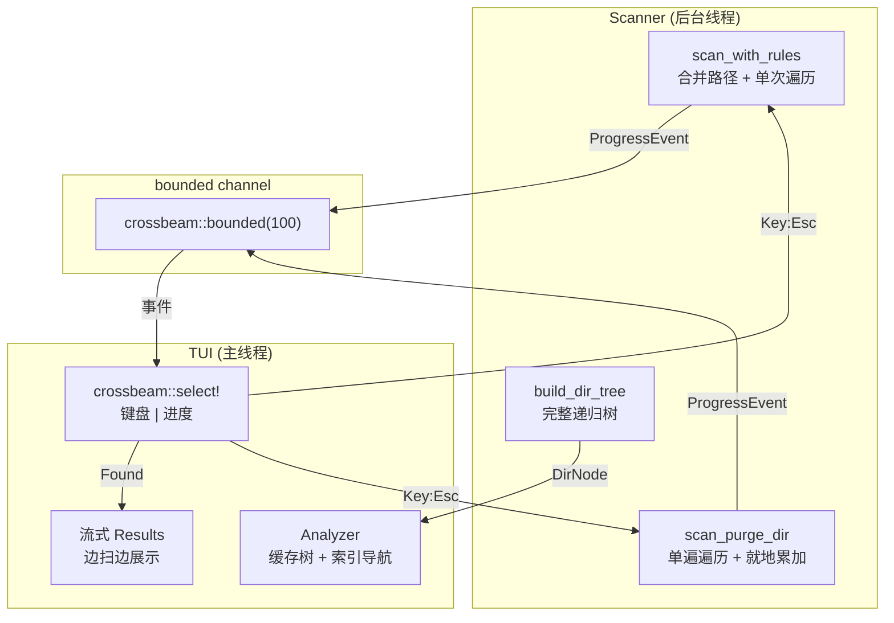

# perf: P1 性能与体验优化

## Summary

优化 macCleaner 的扫描引擎、TUI 渲染、扫描-UI 通信和交互反馈，解决用户反馈的"卡死"和"非常慢"问题。核心改动：消除 scanner 的冗余遍历和串行 dir_size 瓶颈，将 TUI 从定时渲染改为事件驱动渲染，增加扫描取消和进度指示，缓存 Analyzer 目录树实现即时导航。

## Problem Frame

当前版本存在多个性能瓶颈：(1) `scan_purge_dir` 先遍历收集匹配目录，再对每个串行调用 `dir_size()` 做完整重新遍历——20 个 node_modules 意味着 20 次串行 jwalk；(2) `scan_with_rules` 对 6 条 clean 规则逐条启动独立 jwalk，`~/Library/Caches` 和浏览器缓存子目录存在包含关系导致 4 次重复遍历和大小双重计算；(3) Analyzer 每次进入子目录都全量重扫；(4) TUI 每 200ms 无条件重绘。用户反馈"直接卡死"和"非常慢"。Strategy 目标 <30s 全盘扫描。

---

## Requirements

**扫描性能**

- R1. purge 扫描采用单遍遍历，不再对匹配目录做二次 dir_size 遍历
- R2. clean 扫描合并存在包含关系的 Exact 路径，每个文件只被遍历和计入一次
- R3. macOS 上 jwalk 线程数限制为 3，线程栈 128KB

**TUI 渲染**

- R4. TUI 采用事件驱动渲染，静态页面不产生 CPU 开销
- R5. stdout 使用 BufWriter 缓冲

**交互体验**

- R6. 扫描过程中支持 Esc 取消并返回菜单
- R7. Clean 扫描显示规则级进度（N/M 格式）
- R8. 扫描结果边扫边展示，第一个 Found 事件后即可浏览
- R9. Analyzer 导航基于缓存树，Enter 进入子目录为即时响应（<50ms）

---

## Key Technical Decisions

- **单遍遍历不剪枝匹配目录：** purge 的 `process_read_dir` 匹配到目录后不再 `return false` 剪枝，而是标记该路径并继续深入。遍历完成后已有完整的 size 累加，无需二次 dir_size。匹配路径和 size 通过 `Arc<Mutex<HashMap<PathBuf, MatchInfo>>>` 在回调和主线程间共享。选择此方案而非"剪枝 + rayon 并行 dir_size"的原因：单遍遍历的 I/O 总量更少（不重复读目录），且避免了多个 jwalk 实例竞争 I/O 的问题。

- **规则路径合并策略：** clean 扫描前对所有 Exact 路径排序，如果路径 A 是 B 的前缀（`B.starts_with(A)`），只遍历 A。遍历中通过 `entry.path().starts_with(child_path)` 判断文件归属哪条子规则，未匹配任何子规则的文件归入父规则。同时修复当前的大小双重计算 bug。

- **channel 关闭即取消：** 借鉴 dua-cli 的模式，不引入 AtomicBool。UI 端 drop channel receiver 或停止消费，scanner 的 `progress_tx.send()` 返回 Err 即退出。在 `process_read_dir` 回调中也检查一个共享的 `Arc<AtomicBool>` 来提前终止 jwalk（因为 channel sender 在回调中不可用）。

- **事件驱动渲染取代 Tick：** 去掉 Tick 线程，主循环使用 `crossbeam::select!` 同时监听键盘 channel 和进度 channel。静态页面纯阻塞等待事件。Scanning/Cleaning 状态下使用 `crossterm::event::poll(Duration::from_millis(100))` 作为 spinner 动画驱动。

- **流式结果的确认保护：** 扫描未完成时允许浏览已发现的结果，但确认清理时显示"扫描仍在进行中，当前结果可能不完整"的警告。用户可选择等待完成或继续确认。

- **Analyzer 缓存全树：** `build_dir_tree` 构建完整递归树（不限 depth=1），缓存在 `App` 的 `Arc<DirNode>` 字段。Enter 导航通过 `Vec<usize>` 索引路径切换视图，不移动数据。Backspace 弹出索引。初次遍历可能较慢（大目录），但后续导航为 O(1)。

---

## High-Level Technical Design

---

## Implementation Units

### U1. jwalk 线程调优 + BufWriter

**Goal:** 最小改动获得即时性能提升——macOS 3 线程、128KB 栈、BufWriter 包装 stdout。

**Requirements:** R3, R5

**Dependencies:** 无

**Files:**
- Modify: `crates/core/src/scanner.rs` — jwalk 创建时传入自定义线程池配置
- Modify: `crates/tui/src/lib.rs` — `CrosstermBackend::new(BufWriter::new(stdout()))`
- Test: `crates/core/src/scanner.rs` (inline tests)

**Approach:** 在 scanner 中创建 jwalk walker 时使用自定义 rayon ThreadPool（3 线程、128KB 栈），复用同一线程池。TUI 初始化时用 `std::io::BufWriter::with_capacity(8192, stdout())` 包装 stdout。

**Patterns to follow:** dua-cli `common.rs:240-254` 的 ThreadPoolBuilder 配置。

**Test scenarios:**
- 验证 jwalk walker 使用自定义线程池而非全局 rayon pool
- 验证 BufWriter 不影响 TUI 正常渲染（手动测试）

**Verification:** `cargo build --release` 成功，TUI 功能正常，扫描无回归。

---

### U2. 事件驱动渲染重构

**Goal:** 将 TUI 从 200ms 定时渲染改为事件驱动渲染，消除静态页面的 CPU 开销。

**Requirements:** R4

**Dependencies:** U1

**Files:**
- Modify: `crates/tui/src/event.rs` — 去掉 Tick 线程，改用 `crossbeam::select!`
- Modify: `crates/tui/src/lib.rs` — 重构主循环为 select! 模式
- Modify: `crates/tui/src/app.rs` — 可能需要增加 `needs_animation()` 方法
- Test: `crates/tui/src/event.rs` (inline tests)

**Approach:** 移除 EventHandler 中的 Tick 线程和 AppEvent::Tick 变体。主循环改为：

1. 静态状态（Menu/Results/Done/Confirming）：阻塞等待键盘或进度事件
2. 动画状态（Scanning/Cleaning）：使用 `crossterm::event::poll(Duration::from_millis(100))` 超时，超时时重绘 spinner
3. Analyzing 状态：阻塞等待键盘事件

键盘事件通道保持 unbounded（输入量小）。进度事件通道改为 `bounded(100)`。

**Patterns to follow:** dua-cli `eventloop.rs:128-194` 的 `crossbeam::select!` 模式。当前 `event.rs` 的三线程模式作为反面参考。

**Test scenarios:**
- Menu 页面静止时无 CPU 开销（手动用 Activity Monitor 验证）
- Scanning 页面 spinner 正常旋转
- 键盘事件在所有状态下都能即时响应
- 进度事件正常驱动扫描页面更新

**Verification:** 所有页面功能正常。Menu 页面 CPU 占用 <1%。Scanning 页面 spinner 流畅。

---

### U3. 扫描取消支持

**Goal:** 允许用户在扫描/分析过程中按 Esc 取消并返回菜单。

**Requirements:** R6

**Dependencies:** U2（依赖事件循环重构）

**Files:**
- Modify: `crates/core/src/progress.rs` — ProgressReporter 增加取消检查方法
- Modify: `crates/core/src/scanner.rs` — 扫描循环中检查取消信号
- Modify: `crates/tui/src/lib.rs` — Scanning 状态下响应 Esc 键，触发取消
- Modify: `crates/tui/src/ui/scan.rs` — 底部提示加 "Esc 取消"

**Approach:** 引入 `Arc<AtomicBool>` 取消标志（不能纯靠 channel 关闭，因为 `process_read_dir` 回调中无法检查 channel 状态）。UI 端按 Esc 时设置标志并清理状态。scanner 在三个位置检查：(1) `scan_with_rules` 的 rule 循环间；(2) `scan_purge_dir` 的 process_read_dir 回调中；(3) `build_dir_tree` 的 jwalk 回调中。检测到取消后立即返回空结果或已有的部分结果。

**Patterns to follow:** dua-cli 的 channel 关闭模式作为参考，但因 process_read_dir 回调的限制需要 AtomicBool 辅助。

**Test scenarios:**
- 扫描进行中按 Esc，200ms 内回到菜单
- 取消后 scanner 线程正确退出，不残留
- Analyze 扫描中按 Esc 取消，回到菜单
- 取消后可以正常发起新的扫描

**Verification:** 在 TUI 中对大目录启动扫描，按 Esc 后快速回到菜单。

---

### U4. 规则路径合并 + 双重计算修复

**Goal:** 合并存在包含关系的 Exact 路径，消除冗余遍历，修复大小双重计算 bug。

**Requirements:** R2

**Dependencies:** U3（复用取消检查基础设施）

**Files:**
- Modify: `crates/core/src/scanner.rs` — 重写 `scan_with_rules`
- Modify: `crates/core/src/rules.rs` — 可能需要增加路径合并辅助函数
- Test: `crates/core/src/scanner.rs` (inline tests)

**Approach:** 在 `scan_with_rules` 开始前：
1. 收集所有 (rule, Exact path) 对
2. 按路径排序（短路径优先）
3. 如果 path_B.starts_with(path_A)，将 B 标记为 A 的子规则
4. 只对根路径启动 jwalk walker
5. 遍历中，每个文件检查是否匹配某个子规则路径前缀——匹配则归入子规则的 category，否则归入根规则的 category

当前 bug：`~/Library/Caches` 下的 Chrome 缓存文件既被"System Caches"规则计入，又被"Chrome Cache"规则重复计入。合并后每个文件只归入最具体的匹配规则。

**Test scenarios:**
- 创建嵌套目录结构（parent/child/），parent 和 child 各有规则，验证文件不被双重计入
- 不相交的路径仍然分别遍历
- 子规则匹配的文件归入子规则 category，不归入父规则
- 空目录不崩溃
- 进度事件正确反映合并后的规则结构（每个根路径完成时发 Found）

**Verification:** `mc clean` 输出的 total_size 不再包含双重计算。扫描速度可测量提升。

---

### U5. purge 单遍遍历引擎

**Goal:** 消除 scan_purge_dir 的二次 dir_size 遍历，改为单遍遍历就地累加。

**Requirements:** R1

**Dependencies:** U3（复用取消检查）

**Files:**
- Modify: `crates/core/src/scanner.rs` — 重写 `scan_purge_dir`
- Test: `crates/core/src/scanner.rs` (inline tests)

**Approach:** 重写 `scan_purge_dir` 核心逻辑：

1. `process_read_dir` 回调匹配到目录时，不再 `return false` 剪枝，而是将路径记录到 `Arc<Mutex<HashMap<PathBuf, MatchInfo>>>` 并 `return true` 继续遍历
2. `MatchInfo` 结构包含：`safety`, `category`, `size: AtomicU64`
3. 遍历所有 entry 时，对每个文件检查其路径是否以某个匹配目录为前缀——如果是，将 file size 累加到对应的 MatchInfo.size
4. 遍历完成后，matched_dirs 中已有完整的 size，直接构建 ScanItem

**性能关键：** 路径前缀匹配需要高效。使用排序后的匹配路径列表 + 二分查找，或将匹配路径存为 trie。鉴于匹配目录数量通常 <100，排序列表 + linear scan 即可。

**嵌套匹配处理：** 如果 node_modules 内部嵌套了另一个 node_modules，外层匹配的 size 应包含内层。当前行为是只匹配外层并剪枝内层（`return false`），改为不剪枝后自然包含内层。但需要避免内层被单独计为一个匹配——在 `process_read_dir` 中检查：如果当前目录已经在某个已匹配目录内部，跳过匹配。

**Test scenarios:**
- 与现有 `test_scan_purge_finds_node_modules_and_venv` 行为一致
- 单遍遍历后 size 与串行 dir_size 计算结果一致
- 嵌套 node_modules 只匹配外层，size 包含内层
- Cargo.toml 验证逻辑保持正确
- 取消信号在遍历中正确响应
- 空目录返回空结果

**Verification:** `mc purge ~/code` 结果与优化前一致（文件列表和大小相同），扫描速度显著提升。

---

### U6. 规则级进度指示

**Goal:** Clean 扫描时显示 [N/M] 规则级进度，让用户知道还要等多久。

**Requirements:** R7

**Dependencies:** U4（规则合并后进度基于合并后的根路径数量）

**Files:**
- Modify: `crates/core/src/progress.rs` — 增加 `RuleProgress` 事件变体
- Modify: `crates/core/src/scanner.rs` — 在每条根规则开始和完成时发送进度
- Modify: `crates/tui/src/app.rs` — AppState::Scanning 增加 `rule_current/rule_total` 字段
- Modify: `crates/tui/src/lib.rs` — handle_progress 处理 RuleProgress
- Modify: `crates/tui/src/ui/scan.rs` — 渲染规则级进度条
- Modify: `crates/cli/src/commands/clean.rs` — CLI CliReporter 处理 RuleProgress

**Approach:** ProgressEvent 增加 `RuleProgress { current: usize, total: usize, name: String }`。scan_with_rules 在开始前计算合并后的根路径数量作为 total，每完成一个根路径发送 current。TUI 渲染为 `[3/6] 浏览器缓存` 格式，在 spinner 下方显示。Purge 模式暂不添加（目录数量未知）。

**Test scenarios:**
- Clean 扫描发出正确数量的 RuleProgress 事件（current 从 1 递增到 total）
- TUI 正确渲染进度文本
- Purge 扫描不发 RuleProgress（不崩溃）
- CLI 模式下 RuleProgress 更新 indicatif 进度条

**Verification:** TUI Clean 扫描时可见 [N/M] 进度指示。

---

### U7. 流式结果展示

**Goal:** 扫描过程中边发现边展示结果，用户无需等待全部扫描完成。

**Requirements:** R8

**Dependencies:** U2, U6

**Files:**
- Modify: `crates/tui/src/app.rs` — 增加 `ScanningWithResults` 状态或修改 Scanning 状态支持结果浏览
- Modify: `crates/tui/src/lib.rs` — handle_progress 中 Found 事件触发状态切换；handle_key 在扫描中支持结果浏览
- Modify: `crates/tui/src/ui/scan.rs` — 合并扫描进度和结果展示
- Modify: `crates/tui/src/ui/results.rs` — 支持"扫描中"标记
- Modify: `crates/tui/src/ui/confirm.rs` — 扫描未完成时显示警告

**Approach:** 状态机改动方案：收到第一个 Found 事件后，将 Scanning 状态扩展为支持结果浏览的混合状态。顶部保持扫描进度条和 spinner，下方显示已发现的 category 列表（复用现有 Results 渲染逻辑）。用户可以用方向键浏览、展开分类、切换选中。收到 Complete 事件后，进度条消失，变为纯 Results 视图。

确认清理保护：如果用户在扫描未完成时按 Enter 确认，在 Confirming 页面顶部显示警告"扫描仍在进行中，当前结果可能不完整"。

**Test scenarios:**
- 第一个 Found 事件后，界面从纯 spinner 切换为带结果的混合视图
- 扫描中可以用方向键浏览已发现的分类
- 扫描中可以展开/折叠分类
- Complete 事件后进度条消失，变为标准 Results
- 扫描中确认清理时显示警告
- Esc 取消后，已发现的结果仍可浏览

**Verification:** TUI Clean 扫描时，第一个分类发现后即可浏览。完整功能流程正常。

---

### U8. Analyzer 缓存树

**Goal:** 首次构建完整目录树，后续导航基于内存缓存，不再重新扫描。

**Requirements:** R9

**Dependencies:** U2, U3

**Files:**
- Modify: `crates/tui/src/lib.rs` — 重写 `build_dir_tree` 为构建完整递归树；重写 analyzer 导航为索引路径模式
- Modify: `crates/tui/src/app.rs` — Analyzing 状态改用 `Arc<DirNode>` + `Vec<usize>` 索引路径替代 `node` + `breadcrumb`
- Modify: `crates/core/src/models.rs` — DirNode 的 children 默认排序（by size desc）
- Modify: `crates/tui/src/ui/analyzer.rs` — 适配新的导航数据结构

**Approach:**

1. `build_dir_tree` 重写：使用 jwalk 单遍遍历，用深度栈模式（参考 dua-cli `traverse.rs:370-423`）递归构建完整 DirNode 树。每个目录节点的 children 按 size 降序排列。根节点通过 `Arc<Mutex<Option<DirNode>>>` 传回主线程。

2. 导航模式重写：`Analyzing` 状态持有 `tree_root: Arc<DirNode>` 和 `nav_path: Vec<usize>`（每个元素是 children 中的索引）。当前显示的节点通过 `tree_root -> children[nav_path[0]] -> children[nav_path[1]] -> ...` 定位。Enter 时 push 当前 cursor 到 nav_path。Backspace 时 pop。无 I/O，无数据移动。

3. 内存考量：对于 `~/` 目录，完整树可能有数十万节点。每个 DirNode 约 100 bytes（PathBuf + String + u64 + Vec + bool），100 万节点约 100MB。如果内存成为问题，可在后续版本限制遍历深度。

**Patterns to follow:** dua-cli 的 `navigation.rs` bookmark 模式；dua-cli 的深度栈聚合模式。

**Test scenarios:**
- 构建多层目录树（3 层以上），验证递归结构正确
- children 按 size 降序排列
- Enter 进入子目录后数据正确（对应 children[cursor]）
- Backspace 返回上级后 cursor 恢复到之前位置
- 多次 Enter/Backspace 交替操作不出错
- 空目录 Enter 不崩溃
- 取消信号在构建过程中正确响应
- 大目录（创建 1000+ 文件）构建完成后导航延迟 <50ms

**Verification:** TUI Analyze 功能——初次扫描后，所有子目录导航为即时响应。

---

## Scope Boundaries

### In scope
- 扫描引擎性能优化（单遍遍历、路径合并、线程调优）
- TUI 渲染架构优化（事件驱动、BufWriter）
- 扫描交互改进（取消、进度、流式结果）
- Analyzer 缓存树性能修复

### Deferred to Follow-Up Work
- Analyzer 产品重设计（服务于清理的定位调整，见 ideation 文档 Open Product Questions）
- 扫描结果持久化缓存（mtime 增量扫描）
- core::fs 统一模块（4 处 dir_size 合并）
- CLI 命令 scan-confirm-execute 流程去重
- 测试补全（scan_clean、CLI 命令、TUI 逻辑）
- Arena 树数据结构重构
- dist/build purge 规则收紧

---

## Risks & Dependencies

- **单遍遍历的并发安全：** `process_read_dir` 回调在 jwalk 的 rayon 线程池中执行，修改共享的 `Arc<Mutex<HashMap>>` 需要注意锁粒度。建议每个回调只做一次 lock，减少竞争。
- **规则路径合并的边界情况：** 同一个文件可能被多条规则匹配（如 `~/Library/Caches/Google/Chrome/Default/Cache` 同时匹配 System Caches 和 Chrome Cache）。需要明确"最长前缀匹配"策略。
- **Analyzer 大目录内存：** 完整树缓存 `~/` 目录可能消耗 100MB+。P1 暂不限制，如果用户反馈内存问题再加 max_depth。
- **事件循环重构范围：** U2 改动了 TUI 的核心事件循环，所有后续 Unit 都依赖它。需要优先验证稳定性。
