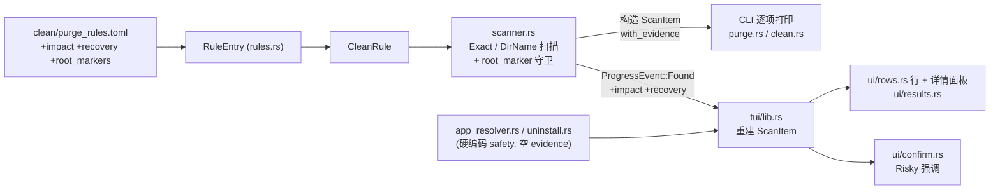

# refactor: 清理安全分级模型重构

## 概述

把清理功能的 `SafetyLevel` 从模糊的"删了麻不麻烦"重构为清晰的**"删了会不会丢不可再生数据"**单轴模型：写下成文 rubric、按 rubric 逐条重评级两个规则表、给每条规则补 `impact`/`recovery` 证据文案并让 TUI/CLI 逐项展示、把按目录名匹配的规则加上项目根守卫消除误报、并把默认预选边界从 `== Safe` 改为 `!= Risky`（零丢失即勾）。目标：让用户看得懂依据、信得过分级、敢按确认——且不牺牲一键清理的释放量。

改动横跨 `core`（模型/规则/扫描/事件）、`cli`（逐项打印）、`tui`（分级渲染/预选/删除确认）三个 crate，全量覆盖 origin 文档的 R1–R9。

---

## 问题背景

（详见 origin: `docs/brainstorms/2026-07-05-cleanup-safety-model-requirements.md`）

当前 `SafetyLevel`（`Safe`/`Moderate`/`Risky`）硬编码在 `crates/core/src/clean_rules.toml` 与 `purge_rules.toml`，经 `scanner.rs` 流转到 `ScanItem`，驱动配色、形状标记（●/▲/✕）和默认预选（`crates/core/src/models.rs:32`，`selected = safety == Safe`）。四个相互关联的问题：

1. **分级依据没成文 → 跨语言不一致**：Maven `.m2` 标 Moderate 而同类 Cargo/Go/npm/pip 全 Safe；Rust `target` 标 Safe 而 `dist`/`build` 标 Moderate。
2. **匹配不精确 → 扫出不合理**：只有 `target` 有 `Cargo.toml` 守卫（`crates/core/src/scanner.rs:342`，硬编码特例），`dist`/`build`/`Pods`/`venv`/`node_modules` 全无守卫，纯按目录名匹配。
3. **分级把恢复代价与数据丢失混成一轴 → 真正危险的被低估**：Docker `Data/vms`（抹掉全部镜像/容器/命名卷）与 Xcode Archives（含 dSYM）只标 Moderate；当前无一条规则是 Risky。
4. **看不到依据 → 不敢删几十 G**：每条只有一行 `description`，界面只有颜色/形状，从不说明"为什么安全、删了失去什么、怎么拿回来"。

---

## 关键技术决策

**KTD1 — `impact`/`recovery` 作为一等字段，从规则流转到展示层。** 在 `RuleEntry`/`CleanRule`（`crates/core/src/rules.rs`）、`ScanItem`（`crates/core/src/models.rs`）、`ProgressEvent::Found`（`crates/core/src/progress.rs:6`）三处同步新增两个 `String` 字段。展示（结果视图 + 确认框）在扫描完成后发生，但 TUI 的项是从流式 `Found` 事件重建的（`crates/tui/src/lib.rs:685/690`），因此 `Found` 必须携带这两字段，否则 TUI 侧拿不到。

**KTD2 — 用非破坏式方式扩展 `ScanItem`，控制构造点涟漪。** `ScanItem::new` 有约 12 处调用点（scanner ×3、tui/lib ×3、uninstall、app_resolver、多处测试）。为避免全量改签名，保持 `ScanItem::new(path,size,safety,category)` 原签名、把 `impact`/`recovery` 默认为空串，另加一个链式 setter（如 `with_evidence(impact, recovery)`）供规则扫描路径调用；非规则来源（uninstall/app_resolver）保持空默认。`ProgressEvent::Found` 无法同样默认（枚举变体），其构造点（**实为 `scanner.rs:302/397/467` + `app_resolver.rs:110`，共 6 处含 2 处测试**，非 `ScanItem::new` 那几行）按机械改动补齐。

> **⚠ 评审修正（feasibility F1，关键）**：`with_evidence` setter 只解决"调用点签名不变"，**不解决数据搬运**。`impact`/`recovery` 是 per-规则数据，必须从 `CleanRule` 一路搬到 `with_evidence`/`Found` 调用处。scanner 现有中间集合全都只携带 `(·, SafetyLevel, String)`，**必须逐一加宽**（建议把 safety+impact+recovery 打包成一个小结构体线程化）：clean 路径 `all_paths`(`:89`)、`RootEntry.children`(`:107`)、尤其 `cat_safety` 映射(`:163-171`，需并列新增 `cat_impact`/`cat_recovery`，供 `flush_category_deltas` 的 `Found`(`:467`) 读取)；purge 路径 `dirname_rules`(`:259`)、`exact_entries`(`:273`)、`exact_results`(`:292`)、`matched_dirs`(`:320`)、`dir_sizes`(`:388`)。**若不加宽，即便 U2 填了 TOML，展示层也永远拿到空串——功能静默失效**。clean 流式路径按分类聚合 evidence（每个 clean 分类 ≈ 一条规则，可接受）。此加宽工作纳入 U1（结构）+ U2（值）。

**KTD3 — 分级轴 = 数据丢失风险，三档 rubric 成文。** 判据："删了会不会丢不可再生的东西"——会→Risky；不会但需用户手动重建一个项目→Moderate；不会且自动按需补回→Safe。rubric 写入两个 `.toml` 头部注释与 `SafetyLevel` 枚举的 doc 注释（`crates/core/src/models.rs`），作为评级唯一判据。（origin R1）

**KTD4 — 默认预选边界 = `!= Risky`。** 把**五处**（CLI clean/purge 逻辑相同、可视作一处）`== Safe` 判定统一改为"非 Risky 即预选"：`models.rs:32`、`crates/tui/src/app.rs:248-254`（`init_results`，TUI 实际预选来源）、`crates/tui/src/app.rs:354`（`select_all_safe`，`a` 键）、CLI `crates/cli/src/commands/clean.rs:90` 与 `purge.rs:76`（`--yes` 过滤）。Risky 保持不预选。（origin R8）

> **⚠ 评审修正（adversarial F3，诚实口径）**：此改动使默认勾选集合从 `{Safe}` 扩为 `{Safe ∪ Moderate}`。大件（node_modules/target/DerivedData 等）本就是旧 Safe、仍勾选，语义不变；但 **`Maven` 原为 Moderate（未勾）、现变为默认勾选**——默认删除的"爆炸半径"确实**扩大**了，而非 origin 所说的"基本不变"。成功标准应从"释放量不低于重构前"改述为"如实说明新增哪些类别进入默认勾选"。

> **预选覆盖（已决 D2）**：预选并非纯 `!= Risky`。新增**规则级 `preselect` 布尔**（默认 true）：最终 `ScanItem.selected = (safety != Risky) && rule.preselect`。`dist/build` 规则设 `preselect = false`（仍扫出、仍可手动勾，但不预选）。该字段随 impact/recovery 一并从规则流转到 `ScanItem`（并入 U1 结构 / U2 值 / KTD1 数据流）。

**KTD5 — 项目根守卫泛化为 per-规则标记机制。** 把 `target`→`Cargo.toml` 的硬编码特例（`scanner.rs:342-347`）抽象为规则级 `root_markers`，含两种位置语义：**sibling**（标记存在于匹配目录的父级，如 `node_modules` 旁的 `package.json`、`target` 旁的 `Cargo.toml`）、**inside**（标记存在于匹配目录内部，如 `venv` 内的 `pyvenv.cfg`）。无 `root_markers` 的 DirName 规则维持纯名字匹配——**唯一允许无守卫的是 `__pycache__`**（名称足够独特）；其余每条 DirName 规则必须配守卫（含 `.gradle`，见 D1）。

**标记组合语义（评审修正 coherence#3 / adversarial F8）**：当前每条规则恰好一个 marker，命中即通过。为避免为安全守卫定下 fail-open 默认，组合子设为 **per-规则、默认 AND（全部命中）**，需要 OR 的规则显式声明。（origin R5）

**KTD6 — TUI 逐项依据用"光标详情面板"，不逐行内联。** 现有行模型 `FlatRow`（`crates/tui/src/app.rs:497-505`）只有 `Separator/Category/Item` 三态、无单项详情区，展开态是分类级。为保列表可扫描，在结果页底部（`crates/tui/src/ui/results.rs:11` 的 `three_row_layout`）新增一个详情面板，展示**当前高亮项**的 `impact`/`recovery`，而非在每个 `Item` 行内联铺开。（origin R7，已用户确认）

**KTD7 — 删除确认框携带 safety + impact + recovery 以强调 Risky。** 现有 `confirm_delete: Option<Vec<(PathBuf, u64)>>`（`crates/tui/src/app.rs:95`）不含 safety。扩展该清单元素携带 `safety`、`impact`、`recovery`（**origin R9 要求展示 `impact`＝删了会怎样，如"删后无法符号化线上崩溃日志"；不能只带 recovery**）。在确认框（`crates/tui/src/ui/confirm.rs`）把 Risky 项**单列为醒目分区置顶**并显示其 impact/recovery。

> **⚠ 评审修正（design#3/#4/#5）**：（a）Risky 分区**必须豁免 `MAX_SHOWN=8` 截断**（`confirm.rs:21`），否则 Risky 项可能被折叠进"……还有 N 项"而看不到，违背 R9 本意——Risky 全量单列于普通清单之上。（b）Risky 用 **red**（`theme::safety_color(Risky)`），把既有黄色留给"过滤视图外仍删除"警示（`confirm.rs:57-67`），定好堆叠次序（Risky 块最上）。（c）颜色非唯一通道：确认框与详情面板都要带 `safety_symbol()`（✕）或"危险"文本标签，保证 `NO_COLOR`/色盲下仍可辨，并补一条 NO_COLOR 断言。（origin R9）

**KTD8 — 消费链一并加宽（评审修正 feasibility F2）。** 加宽 `confirm_delete` 元素类型会波及其消费方：`collect_marked`(`lib.rs:1052`，`out: &mut Vec<(PathBuf,u64)>`) 供 analyzer 赋值(`lib.rs:1254`)——签名要改，且 analyzer 源自 `DirNode`（**无 SafetyLevel**），需为其定一个默认 safety（建议 `Safe` 或"未知"）；`take()`→删除线程链 `start_cleaning`(`lib.rs:996`)/`start_cleaning_from_analyzer`(`lib.rs:1010`)/`spawn_trash_thread`(`lib.rs:964`) 均为 `Vec<(PathBuf,u64)>`。**决策：在 `lib.rs:297` 的 take() 边界把加宽清单映射回 `(PathBuf,u64)`**，保持删除线程签名不变，只有确认框渲染消费新字段。`confirm.rs:19/40` 的解构随之更新。

---

## 高层技术设计

### 字段流转管线（impact/recovery + safety）

*（指导性示意：展示管线的组件与方向关系，非实现规格。）*

### rubric 与重评级（KTD3，权威内容见 origin R2–R4）

| 分组 | 级别 | 判据 | 与现状差异 |
|---|---|---|---|
| 系统缓存（Library/Caches、Logs、/tmp、浏览器缓存） | Safe | 自动按需重建 | 不变 |
| 下载缓存（Homebrew、**Maven**、Go mod、Cargo registry/git、npm/pnpm/yarn、pip、JetBrains、.gradle） | Safe | 共享缓存，按需透明重下 | **Maven Moderate→Safe**（消除跨语言不一致），其余不变 |
| `__pycache__` | Safe | 运行时自动重建 | 不变 |
| 项目本地产物（node_modules、target、venv、Pods、DerivedData、dist/build） | Moderate | 清空后需手动重装/重建 | **node_modules/target/venv/Pods/DerivedData：Safe→Moderate**；dist/build 不变 |
| Docker `Data/vms`、Xcode Archives、Android AVD | Risky | 可能丢不可再生数据/状态 | **Moderate→Risky** |
| Android SDK `.temp`（从 AVD/SDK 规则拆出） | Safe | 临时文件 | **新拆分规则** |

---

## 需求追溯

| 需求 (origin) | 覆盖单元 |
|---|---|
| R1 成文 rubric | U1（枚举/TOML 注释） |
| R2 系统缓存维持 Safe | U2 |
| R3 开发产物重评级 | U2 |
| R4 拆分 AVD/SDK 规则 | U2 |
| R5 项目根守卫 | U3 |
| R6 impact/recovery 必填字段 | U1（字段）+ U2（填值）；展示由 U5/U6 消费 |
| R7 逐项展示依据 | U5（TUI）+ U6（CLI） |
| R8 默认预选 Safe+Moderate | U4 |
| R9 删除确认强调 Risky | U7 |

---

## 实现单元

### 阶段 A：核心模型与规则数据

### U1. 规则/项模型扩展 + 成文 rubric

- **目标**：为规则与扫描项引入 `impact`/`recovery`/`root_markers` 字段，并把三档 rubric 写成代码注释。建立后续单元依赖的类型基础。
- **需求**：R1、R6（字段部分）
- **依赖**：无
- **文件**：
  - `crates/core/src/rules.rs`（`RuleEntry` 加 `impact`/`recovery`/`root_markers`/`preselect`(默认 true) 反序列化字段；`CleanRule` 加对应字段；`parse_rules_toml` 搬运）
  - `crates/core/src/models.rs`（`ScanItem` 加 `impact`/`recovery` 字段；保持 `new` 原签名默认空串，新增 `with_evidence(impact, recovery)` setter；预选计算改为 `selected = safety != Risky && preselect`（见 U4/KTD4）；`SafetyLevel` 枚举加 rubric doc 注释）
  - `crates/core/src/progress.rs`（`ProgressEvent::Found` 加 `impact`/`recovery` 字段）
  - `crates/core/src/clean_rules.toml`、`crates/core/src/purge_rules.toml`（头部注释写入三档 rubric 判据；本单元只加注释，数据值留给 U2）
  - 各 `ScanItem::new` / `Found` 构造点随签名/字段变化补齐以通过编译：`scanner.rs:205/313/409`、`lib.rs:685/690/972`、`uninstall.rs:91`、`app_resolver.rs:264`、测试构造点（`cleaner.rs:104`、`app.rs:517-519`、`scanner.rs` 测试、`lib.rs` 测试 `:1418/1499`）
- **方法**：`root_markers` 用带位置语义的结构（sibling / inside）——见 KTD5；本单元只定义字段与解析，守卫逻辑在 U3。非规则来源（uninstall/app_resolver）的 `Found`/`ScanItem` 一般传空 `impact`/`recovery`——**例外（D3）**：`app_resolver.rs` 的 `find_leftovers` 对 `Application Support` 子目录残留赋非空 evidence（见范围边界 D3 文案）。
- **执行提示**：字段加完后先跑 `cargo build` 让编译器列出所有构造点，逐一补齐再进入 U2。
- **遵循模式**：`RuleEntry`→`CleanRule` 的现有映射（`rules.rs:70-77`）；`serde` `#[derive(Deserialize)]` 现有用法。
- **测试场景**：
  - TOML 解析：一条含 `impact`/`recovery`/`root_markers` 的规则被正确读入 `CleanRule`（值非空、markers 解析出位置语义）。
  - 缺省兼容：不含 `root_markers` 的规则解析为"无守卫"，不报错。
  - `ScanItem::new` 默认 `impact`/`recovery` 为空串；`with_evidence` 正确写入。
  - `ProgressEvent::Found` 可携带并读回 impact/recovery。
- **验证**：`cargo build` 全 workspace 通过；`cargo test -p mc-core` 现有测试在补齐构造后全绿。

### U2. 按 rubric 重评级两个规则表 + 填充证据文案

- **目标**：把 rubric 落到数据——重评级、填 `impact`/`recovery`、拆分 AVD/SDK 规则。这是本计划面向用户的核心交付。
- **需求**：R2、R3、R4、R6（填值部分）
- **依赖**：U1
- **文件**：
  - `crates/core/src/clean_rules.toml`（维持全 Safe；为每条填 impact/recovery）
  - `crates/core/src/purge_rules.toml`（按 origin R3 表重评级：Maven→Safe；node_modules/target/venv/Pods/DerivedData→Moderate；Docker vms/Xcode Archives/Android AVD→Risky；填 impact/recovery；为 DirName 规则填 root_markers）
  - **D1**：`.gradle` 规则从 `{ dir_name = ".gradle" }` 改为 `{ exact = ".gradle/caches" }`（只删缓存，保 `gradle.properties`/`init.gradle`），随之不再是 DirName 规则、无需 root_marker
  - **D2**：`dist/build` 规则设 `preselect = false`（保持 Moderate，不默认勾选）
  - 拆分 "Android AVD/SDK"：`.android/avd`（Risky）与 `Library/Android/sdk/.temp`（Safe）为两条独立规则
  - `crates/core/src/rules.rs`（`mod tests`：重写 `clean_rules_all_safe`、`purge_rules_safety_levels`、`purge_rules_categories_correct` 等断言以匹配新分类）
- **方法**：证据文案按 origin 示例风格（impact 描述后果、最坏情况优先；recovery 描述恢复方式，不可恢复明确写"不可恢复"）。root_markers 建议：node_modules→sibling `package.json`；target→sibling `Cargo.toml`；venv/.venv→inside `pyvenv.cfg`；dist/build→sibling `package.json`；Pods→sibling `Podfile`。
- **遵循模式**：现有 TOML 规则条目结构（`purge_rules.toml`）。
- **测试场景**：
  - Covers R2/R3. 所有下载缓存类规则 safety == Safe；所有项目本地产物类规则 safety == Moderate；Docker vms / Xcode Archives / Android AVD safety == Risky。
  - Covers R6. 断言 `all_rules()` 中每条规则 `impact` 与 `recovery` 均非空。
  - Covers R4. 存在两条独立规则分别对应 `.android/avd`（Risky）与 Android SDK `.temp`（Safe）。
  - Covers D1. `.gradle` 规则为 `exact = ".gradle/caches"`（非 dir_name），断言其 pattern 指向 `~/.gradle/caches`、不匹配 `~/.gradle` 根。
  - Covers D2. `dist/build` 规则 `preselect == false`；其余规则 `preselect == true`（默认）。
  - 无重复规则名、patterns 非空（沿用现有 `no_duplicate_rule_names`/`no_empty_patterns`，确认拆分后仍通过）。
- **验证**：`cargo test -p mc-core rules` 全绿；手工核对 origin R3 表逐行与 TOML 一致。

---

### 阶段 B：匹配精度

### U3. 项目根守卫泛化

- **目标**：把 `target` 的硬编码 `Cargo.toml` 检查泛化为 per-规则 `root_markers` 机制，消除 dist/build/venv/Pods 等的误报。
- **需求**：R5
- **依赖**：U1（`root_markers` 字段）
- **文件**：
  - `crates/core/src/scanner.rs`（`scan_purge_dir` 的 DirName 匹配分支 `:340-358`：用 `root_markers` 通用判定替换 `if dir_name == "target"` 特例 `:342-347`；实现 sibling（检查匹配目录父级存在标记）与 inside（检查匹配目录内部存在标记）两种语义）
  - `crates/core/src/scanner.rs`（`mod tests`：扩展/新增守卫测试）
- **方法**：命中 DirName 规则的目录，仅当其 `root_markers` 满足（组合子默认 AND，见 KTD5；当前每规则单 marker）才计入结果。**唯一无守卫的规则是 `__pycache__`**（`node_modules` 按 U2/origin R5 配 sibling `package.json` 守卫，不在豁免之列）。保留现有剪枝语义（匹配即 `return false` 不再下钻，`scanner.rs:356`）。
- **遵循模式**：现有 `target`/`Cargo.toml` 检查（`scanner.rs:342-347`）；`process_read_dir` 剪枝回调结构。
- **测试场景**：
  - Covers AE(误报被守卫拦截). sibling 语义：父级无 `package.json` 的 `build` 目录不计入；有 `package.json` 的 `dist` 计入。
  - inside 语义：内部含 `pyvenv.cfg` 的 `venv` 计入；不含的同名目录不计入。
  - 回归：`target` 旁有 `Cargo.toml` 仍计入、无则不计入（原 `scanner.rs:902-926` 测试语义保持）。
  - Covers R5 成功标准. **守卫覆盖断言**：遍历所有 DirName 规则，除 allowlist（`__pycache__`）外每条都必须配置了 `root_markers`（对应 origin `成功标准` 中"每条 dir_name 规则均配守卫"，按 origin 允许的 `__pycache__` 例外收窄）。
  - 剪枝不变：匹配目录的子树不再被重复扫描/计入。
- **验证**：`cargo test -p mc-core scanner` 全绿；`cargo run -- purge ~` 抽查不再出现家目录下非项目的同名目录。

---

### 阶段 C：默认预选语义

### U4. 默认预选改为 `!= Risky`（零丢失即勾）

- **目标**：让 Safe 与 Moderate 默认勾选、Risky 不勾，四处判定统一，保住释放量。
- **需求**：R8
- **依赖**：U1（safety 枚举语义无变化，但与 U1 同触规则/模型文件，排在其后避免冲突）
- **文件**：
  - `crates/core/src/models.rs:32`（`selected = safety != SafetyLevel::Risky`）
  - `crates/tui/src/app.rs:248-254`（`init_results`：收集 `safety != Risky` 的 path 入 `marked`）
  - `crates/tui/src/app.rs:354`（`select_all_safe`：`a` 键改为选 `!= Risky`；视语义考虑重命名为 `select_all_default` 或保留名+改注释）
  - `crates/cli/src/commands/clean.rs:90`、`crates/cli/src/commands/purge.rs:76`（`--yes` 过滤：`i.selected && i.safety != Risky`，与预选语义对齐）
- **方法**：预选语义 = `safety != Risky && rule.preselect`（含 **D2** 的 `preselect` 覆盖，见 KTD4）。四/五处判定保持一致。Risky 与 `preselect=false` 项仍在结果中显示、仅不预选（origin R8：不隐藏）。`init_results` 需按 `ScanItem.selected`（已含 preselect 计算）收集，而非重新判 safety。
- **遵循模式**：现有 `== Safe` 判定点。
- **测试场景**：
  - Covers R8. `init_results` 后 `marked` 含 Safe+Moderate 的 path、不含 Risky。
  - Covers D2. `dist/build` 项（Moderate 但 `preselect=false`）默认**未**勾选；其余 Moderate 项默认勾选。
  - `a` 键全选：勾选集合含 Moderate（含 dist/build，手动全选覆盖 preselect）、不含 Risky。
  - CLI `--yes`：Moderate 项被纳入删除、Risky 不被纳入。
  - 回归（释放量）：给定 Safe+Moderate 大件与 Risky 项的构造场景，默认勾选总大小 == 应勾项之和。
- **验证**：`cargo test -p mc-tui`、`-p mc-cli` 相关测试全绿；TUI 手工打开 purge 结果，大件（node_modules 等）默认勾选、Docker/Archives 默认不勾。

---

### 阶段 D：展示依据（TUI + CLI）

### U5. TUI 逐项依据展示（光标详情面板）

- **目标**：在结果页展示当前高亮项的 `impact`/`recovery`，让"依据"可见。
- **需求**：R6、R7
- **依赖**：U1
- **文件**：
  - `crates/tui/src/ui/results.rs:9-62`（**新增一个 results 专用布局**，勿改共享的 `chrome::three_row_layout`（`chrome.rs:69`，被 `scan.rs`/`analyzer.rs` 复用，改它会连带位移三个页面）；在 footer 之上加详情面板区）
  - `crates/tui/src/ui/rows.rs`（如需暴露当前项的 impact/recovery 取值辅助）
  - `crates/tui/src/app.rs`（新增"当前高亮行"访问器；注意 `result_cursor` 索引 `build_flat_rows()`，光标可落在 `Separator`/`Category` 而非仅 `Item`）
  - 新增渲染测试（`ui/` 下目前仅 `analyzer.rs` 有测试，rows/results 无——需自建）
- **方法**：详情面板显示高亮项的 `impact`（删了会怎样）与 `recovery`（如何恢复）；Risky 项带 red **且** ✕/"危险"文本（KTD7 c）。**各光标行态明确定义**（design#1/#2）：
  - `Item` 行 → 该项 impact/recovery。
  - `Category` 行 → 该分类主导等级的 rubric 一句话（或聚合说明）。
  - `Separator` 行 → 该等级 rubric 一句话或留空。
  - `Item` 但 evidence 为空（uninstall/app_resolver 源）→ 显示占位"无恢复信息"（**非空白**，与结构行区分；呼应 D3）。
- **布局降级**（design#8）：面板固定高度（建议 impact/recovery 各一行，共 2 行）；当列表可用高度低于阈值（如 < 6 行）面板折叠隐藏；仅剩 1 行时优先显示 `recovery`。不改每行内联（保持 `rows.rs:146-153` 现状）。
- **遵循模式**：`theme.rs:37-52` 配色/符号；`results.rs` 现有三段布局；`rows.rs` 的 Separator 中文文案风格。
- **测试场景**：
  - Covers R7. 高亮一个 Moderate 项，详情面板渲染其 impact/recovery 文本。
  - 切换高亮到不同 safety 项，面板内容随之更新；Risky 项带 red + ✕/"危险"标签。
  - 光标在 `Category` 行：面板显示该分类 rubric 说明、不 panic。
  - 光标在 `Separator` 行：面板显示等级 rubric 或留空、不 panic。
  - 空 evidence 的 Item（uninstall 源）：面板显示"无恢复信息"占位（非空白）。
  - `NO_COLOR` 下 Risky 仍可辨（✕/文本标签存在）。
  - 布局：面板加入后列表/footer 高度分配正确；列表过窄时面板折叠。
- **验证**：`cargo test -p mc-tui`；`verify-tui` 技能在 tmux 中实际查看 purge 结果页详情面板随光标更新。

### U6. CLI 逐项依据展示

- **目标**：CLI（尤其 purge 的逐项打印）追加 impact/recovery。
- **需求**：R6、R7
- **依赖**：U1
- **文件**：
  - `crates/cli/src/commands/purge.rs:115-132`（逐项打印在文件名/大小后追加 recovery 或 impact 简述）
  - `crates/cli/src/commands/clean.rs:155-172`（clean 为分类级打印，视情况在分类摘要补一行 rubric 说明；可轻量）
  - `crates/cli/src/commands/uninstall.rs`（空 evidence，保持不打印额外文案）
- **方法**：CLI 保持精简，一行一项，避免刷屏；建议只追加简短 recovery（如"重装即可恢复"/"不可恢复"）。
- **遵循模式**：`purge.rs:119-124` 的 `match item.safety` emoji + `println` 结构。
- **测试场景**：
  - Covers R7. purge 打印函数对一条含 recovery 的项输出包含该文案（若逻辑可单测；否则以 snapshot/字符串断言辅助函数覆盖）。
  - Risky 项输出含 🔴 与其 recovery。
  - uninstall 空 evidence 不产生多余行。
  - `Test expectation`：若打印为直接 `println!` 难以单测，则抽出格式化辅助函数并对其单测。
- **验证**：`cargo run -- purge ~` 逐项可见依据文案；`cargo test -p mc-cli`。

---

### 阶段 E：删除确认强调

### U7. 删除确认框强调 Risky

- **目标**：待删集合含 Risky 时，确认框单列强调并显示不可恢复提示。
- **需求**：R9
- **依赖**：U1、U4
- **文件**：
  - `crates/tui/src/app.rs:95`（`confirm_delete` 元素从 `(PathBuf, u64)` 扩为携带 `safety`+`impact`+`recovery`）
  - `crates/tui/src/app.rs:435-447`（`results_delete_list`：构建时带上 safety/impact/recovery）
  - `crates/tui/src/lib.rs:1052`（`collect_marked` 的 `out` 类型随之加宽）+ `lib.rs:1254`（analyzer 赋值，源自 `DirNode` 无 safety → 默认 safety + 空 evidence，见 KTD8）
  - `crates/tui/src/lib.rs:956`、`:1256`（confirm_delete 赋值点补字段）
  - `crates/tui/src/lib.rs:297`（take() 边界把加宽清单**映射回 `(PathBuf,u64)`** 交给删除线程，见 KTD8——删除线程 `:964/996/1010` 签名不变）
  - `crates/tui/src/ui/confirm.rs:13-95`（渲染：Risky 单列醒目分区**置顶且豁免 `MAX_SHOWN` 截断**，red + ✕/文本标签 + impact/recovery；`:57-67` 黄色留给过滤警示；`:69-73` 废纸篓文案保留；`:19/40` 解构更新；**含 Risky 时渲染 type-to-confirm 输入行 + 真实后果文案**）
  - `crates/tui/src/app.rs`（确认框状态扩展：记录是否需 type-to-confirm、已输入 token；Enter 不触发含-Risky 的确认，仅 token 匹配后由确认键触发）
  - `crates/tui/src/keymap.rs` / `crates/tui/src/lib.rs`（确认态按键：含 Risky 时进入输入模式，键入 token，非 Enter 键确认）
  - `crates/cli/src/commands/{purge,clean,uninstall}.rs`（交互删除默认 No；`--force`/`--yes` 旁路含 Risky 时仍生效供脚本）
  - 新增 confirm 渲染 + 交互测试
- **方法**：确认框**置顶**独立区块全量列出 Risky 项（red + ✕ + impact/recovery，不受 8 项截断）；非 Risky 项维持现有清单样式。
- **D4（已决）分级摩擦**：
  - 待删集合**不含 Risky**：维持现有单次确认（默认 y/N 为 No；废纸篓即 undo）。
  - 待删集合**含 Risky**：升级为 **type-to-confirm**——要求用户输入一个非平凡 token（如 `delete` 或类别名）才可执行；**Enter 不绑定到确认动作**（GNOME HIG：不可逆动作不绑 Enter）；确认框写明**真实后果**而非仅文件名（如"删除后 Docker 全部镜像/容器/命名卷丢失，含数据库"）。
  - CLI：保留 `--force`/`--yes` 旁路供脚本；交互式默认 No。
- 依据：clig.dev severe 档（含"显示效果低估真实影响"）、NN/g、GNOME HIG、Apple HIG（见"已决安全项 D4"）。
- **遵循模式**：`confirm.rs:57-67` 现有黄色警示样式；`theme.rs` red。
- **测试场景**：
  - Covers R9. 待删清单含一个 Risky 项时，确认框渲染出置顶强调分区与其 **impact**（及 recovery）文案。
  - Risky 截断豁免：清单含 ≥8 个非 Risky 项 + 1 个 Risky 项时，Risky 项仍完整可见（不被"还有 N 项"折叠）。
  - 全部非 Risky 时，确认框不出现 Risky 分区（回归现状样式）。
  - analyzer 来源（默认 safety、空 evidence）的项不 panic；take() 后删除线程仍收到 `(PathBuf,u64)`。
  - `NO_COLOR` 下 Risky 分区仍可辨（✕/文本标签）。
  - Covers D4. 待删含 Risky：Enter **不**触发确认；输入正确 token 后方可执行；不含 Risky：单次确认即可。
  - Covers D4. 确认框对含 Risky 项显示真实后果文案（非仅文件名）。
  - Covers D4. CLI `--force` 在含 Risky 时仍能非交互执行。
  - 废纸篓提示文案仍存在。
- **验证**：`cargo test -p mc-tui`；`verify-tui` 手工：手动勾选一个 Docker/Archives 项后触发确认，看到强调分区。

---

## 范围边界

### 本次不做（Deferred for later，见 origin）
- **用户自定义/可编辑规则**：规则仍编译进二进制（`include_str!`）。
- **精确预估"重新下载多少 GB"**：`recovery` 只定性描述。
- **双轴矩阵分级模型**：已否决。

### Deferred to Follow-Up Work（本计划实现层面）
- **删除 Risky 项的二次按键确认**：U7 采用"独立强调分区"而非强制二次确认；若后续需要更强摩擦，单独跟进。
- **`select_all_safe` 重命名**：语义已从"全选 Safe"变为"全选非 Risky"，函数改名属可选整洁项，不阻塞。

### 不在范围（out of scope）
- **Uninstall 的分级重评级**：uninstall 项 safety 是代码内硬编码（`crates/core/src/app_resolver.rs:110-115`/`:264-267`、`crates/cli/src/commands/uninstall.rs:91-95`），不走 rules.toml，origin 重评级表未涉及。其 impact/recovery 一般传空默认——**例外（D3）**：`find_leftovers` 对 `Application Support` 子目录的残留项赋非空 evidence（`impact`:"含应用数据，删除后不可恢复"；`recovery`:"已移废纸篓，可从废纸篓找回"），仍保持默认勾选（符合卸载器惯例）。

---

## 系统级影响

- **Uninstall 连带行为变化（KTD4 副作用）**：默认预选改为 `!= Risky` 后，uninstall 的主 App 项（硬编码 Moderate，`app_resolver.rs:110-115`）将**首次变成默认勾选**。判断符合卸载语义（用户本就要卸该 app），但属行为变化——需在 U4 验证并保留一条测试确认 uninstall 主 App 默认被勾、其残留（Safe）也被勾。若日后判定不当，可给 uninstall 单独的预选策略。
- **`app_resolver.rs:510` 测试** `test_all_leftovers_marked_safe`：残留仍标 Safe，U1/U4 改动后需确认该断言不被破坏。
- **性能**：U3 的 root_marker 守卫在 DirName 命中时增加最多一次文件存在性检查（sibling/inside），命中项数量有限，对扫描性能影响可忽略；`crates/core/benches/scan_purge_bench.rs` 可跑一次确认无明显回归。

---

## 已决安全项（评审引入，已确认 2026-07-05）

对抗性评审发现四处真实数据丢失路径；用户已就每条拍板（均采纳保守/研究推荐解）。以下为最终结论，已落到对应单元：

- **D1 —〔已定〕`.gradle` 窄化为 `.gradle/caches`（exact）。** 与 `.m2/repository`、`.cargo/registry|git` 同一模式，只删缓存、不碰 `~/.gradle/gradle.properties`（签名密钥/凭据）、`init.gradle`。规则从 `dir_name` 改为 home-relative `exact`。落到 U2；U3 不再为 `.gradle` 配 DirName 守卫。依据：Gradle 官方回收空间推荐删 `caches/` 而非整树。
- **D2 —〔已定〕`dist/build` 保持 Moderate 但不默认勾选。** 守卫只能证明"是 JS 项目"（sibling `package.json`），分不清 electron-builder 的 `build/`（手工 `entitlements.mac.plist`/图标/provisioning，不可再生输入）。仍扫出、仍可手动勾，但不预选。依据：npkill/kondo 等不按名盲删 build/dist。落到 U4（预选覆盖）。
- **D3 —〔已定〕uninstall 残留 `Application Support` 保持默认勾选，但补非空文案 + 走废纸篓 + 占位非空白。** 符合专业卸载器惯例（卸载=彻底移除），但必须消除"看不到依据却默认删"：给该类残留 `impact`/`recovery`（"含应用数据，删除后不可恢复；已移废纸篓可找回"），详情面板对空 evidence 显示"无恢复信息"占位。落到 app_resolver + U5。
- **D4 —〔已定〕Risky 删除用 type-to-confirm + 不绑 Enter + 写明真实后果 + 保留 `--force` 旁路。** Docker 卷/dSYM 名义可恢复（废纸篓）但实质不可逆（Docker 不重认领、用户常清空废纸篓腾空间），按 clig.dev "severe"（含"显示效果低估真实影响"）处理。Safe/Moderate 维持单次确认。落到 U7。依据：clig.dev / NN/g / GNOME HIG / Apple HIG。

> 残留假设（非阻断）：`Library/Caches` 整树 Safe 对极少数把非缓存数据存于此的应用仍有风险——在其 impact/recovery 文案注明即可，与 origin 已决"R2 不变"一致。

---

## 风险与依赖

- **构造点涟漪（U1）**：`ScanItem::new`/`Found` 构造点众多。缓解：KTD2 用非破坏式 setter + 默认空串，把强制改动集中到 `Found`（约 5 处）；先 `cargo build` 让编译器列全清单。
- **TUI 布局空间（U5）**：详情面板占用行高，可能挤压结果列表（origin 假设已记）。缓解：面板设为固定 1–2 行或按可用高度降级；`verify-tui` 实测。
- **root_marker "全部 vs 任一"语义（U3）**：需在实现前定死。建议"任一命中即通过"（dist/build 常只有 package.json）。已作为 KTD5/U3 方法记录。
- **依赖链**：U1 是所有单元的前置；U2/U3/U4/U5/U6/U7 依赖 U1，U7 另依赖 U4。U3/U4 可在 U1 后并行。

---

## 来源与研究

- **Origin**：`docs/brainstorms/2026-07-05-cleanup-safety-model-requirements.md`（R1–R9、rubric、重评级表、验收示例、假设）。
- **既有相关计划**：`docs/plans/2026-06-04-004-feat-purge-results-risk-grouping-plan.md`——TUI 已按 `dominant_safety` 分区渲染（`build_flat_rows`，Safe→Moderate→Risky + 分隔行）；重评级后 Risky 分区将首次真正出现，U2/U4/U5 需与该分区逻辑保持一致。
- **代码锚点**：`crates/core/src/{rules.rs,models.rs,progress.rs,scanner.rs,app_resolver.rs,cleaner.rs}`、`crates/cli/src/commands/{clean,purge,uninstall}.rs`、`crates/tui/src/{app.rs,lib.rs,theme.rs,ui/results.rs,ui/rows.rs,ui/confirm.rs}`（行号见各单元 Files）。
- **外部研究**：无——纯内部重构，代码库已有强本地模式。
