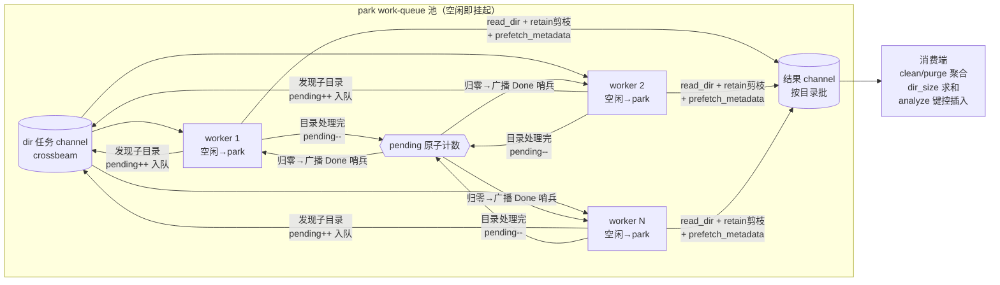

# perf: park 式并行遍历替代 jwalk 自旋（扫描引擎）

## Summary

扫描期进程 CPU 稳定 150-200%，其中 ~25% 是 jwalk 0.8.1 并行遍历的**消费端固定 sched_yield 自旋**（`for entry in walker` 拉 in-order 结果时忙等，且与池线程数无关）。本计划用**自写的阻塞式（空闲即 park）work-queue 遍历器**替换 jwalk 的自旋式并行：空闲 worker 挂起（0 CPU）而非自旋，把那 25% 自旋样本变成 0-CPU 挂起等待。原型已由 Fable 5 探索并由主 agent 独立复现——合成树 CPU **6.4→2.3 CPU 秒（−2.8×）、墙钟持平/更快**，`~/workspace` **CPU −50%、墙钟 −44%、3/3 轮全胜、结果逐字节一致**（详见 issue #20 证据表）。

范围（已与用户确认）：**全覆盖** clean/purge/dir_size（结果与顺序无关，近 drop-in）+ **analyze 的 `IncrementalTreeBuilder` 重构**（jwalk 严格 DFS 序 → 路径键控插入，吸收 park 的完成序交付）。上线方式：**flag 门控、默认仍走 jwalk**，等无 EDR Mac 复测确认不退化再切默认。

---

## Problem Frame

- **现象**：TUI 扫描期 CPU 150-200%，Analyze/Clean 尤甚（走满全树 + 每文件 stat）。
- **已核实归因**（issue #20 / `sample` 归因）：on-CPU 时间 ≈ 48% `close`/`closedir`（本机阿里 EDR 的 Endpoint Security 回调税，**不可控、不代表真实用户**）+ **25% `sched_yield` 自旋（可控浪费）** + 17% 真实 `getdirentries`/`lstat`。
- **自旋根因**：jwalk 0.8.1 `OrderedQueueIter::next` 在消费端（Strict 序）与 worker 取活端（Relaxed 序）都是**无条件 `thread::yield_now()` 忙等**；`busy_timeout` 只是死锁检测超时、**不可调**。空闲线程不 park 而自旋烧 CPU。
- **关键否证**：自旋**与池线程数无关**（walk 池 2/3/4/10 线程 CPU 全 ~130%，只有无池 Serial ~31%）——所以"减线程数"无效，真凶是并行迭代器的固定消费端忙等。
- **已否决的弯路**：① walk 默认改 Serial（`perf/walk-serial-default` 分支）——CPU 降了但 **analyze 慢 76%**（全树 stat 被 EDR 拖慢的 syscall 全串起来），只适合 walk 很轻的 purge；② 调 jwalk 线程数——自旋与线程数无关，无意义。

---

## Requirements

- **R1**：扫描期进程 CPU 相对 jwalk 现状显著下降（目标 ≥40%），以**总 CPU 秒 + `swtch_pri` 样本占比**为准（非墙钟——EDR 方差大）。
- **R2**：墙钟不退化——本机 ≤ jwalk；**干净（无 EDR）机 ≤5% 退化**（需无 EDR Mac 复测，见 R7/风险）。
- **R3（不变错·结果对账）**：clean/purge/analyze 三操作发现结果 **files/dirs/bytes 逐字节一致**——lstat 语义、不跟随符号链接、大小求和均不变（承接 plan 009 R4/R5、`docs/solutions/design-patterns/streaming-aggregation-key-is-action-granularity.md`）。
- **R4**：取消及时——遍历每若干 entry 查 `reporter.is_cancelled()`，复用池下仍能中止。
- **R5**：TUI analyze 实时树填充/按体积降序/跟随最大项**不回退**（承接 `docs/solutions/design-patterns/render-layer-sort-permutation-indices.md`）。
- **R6**：不引入新 `unsafe`（`unsafe_code = "deny"`，唯一例外 `scanner.rs` 的 `setiopolicy_np`）；pedantic clippy 零警告；`cargo test` 全绿。
- **R7**：**flag 门控**——新 walker 经 `MC_WALK_ENGINE`（默认 `jwalk`）开启；jwalk 路径保持不变；**干净机复测确认不退化前不切默认**。

---

## Key Technical Decisions

### KTD1 — 自写阻塞 work-queue 池，不引 `ignore` crate
Fable 原型（`walk_ab.rs`）已验证：crossbeam unbounded channel 取活 + 空闲 worker park + pending 原子计数归零广播 Done 哨兵 + 按目录批流式发结果 + 每目录一次协作取消。`ignore` crate（ripgrep）实测零自旋（空闲 1ms sleep 轮询）但回调式架构**最终仍需同样的 channel + 键控插入**、还带进 gitignore 机器且**无 `client_state` 预取模型**——不如自写省依赖、贴合现有 `prefetch_metadata` 语义。

### KTD2 — 遍历后端抽象 + flag 路由，两后端并存
定义共同遍历接口（统一"每目录读回调：retain 剪枝 + prefetch_metadata"+"entry 流"），jwalk 与 park 两后端实现之；`MC_WALK_ENGINE` env 路由（默认 `jwalk`）。`create_walker`/`create_walker_serial` 的 jwalk 路径**原样保留**，零风险回退。这满足 R7 门控，也让 A/B 对照用同一二进制切换。

### KTD3 — 消费序解耦：聚合类直接接，analyze 改路径键控插入
park 按**完成序**（非 DFS 序）交付每目录批。clean/purge/`dir_size` 只做聚合/剪枝、**与顺序无关**——近 drop-in。analyze 的 `IncrementalTreeBuilder` 现硬依赖 jwalk 严格 DFS 序（深度栈导航）——改成 **`HashMap<PathBuf, 树内位置>` 路径键控插入**。park 按目录批交付，**祖先目录必先于其子目录被读**（子目录只在父目录读完后才入队），故父节点必先到达，O(1) 查父插入，无需等待/重排。

### KTD4 — 测量以 CPU 秒 + swtch_pri 占比为准，非墙钟
本机墙钟方差极大（同配置 2–5s 跳动，EDR agent 负载所致）。R1 验收看**总 CPU 秒**（轮间方差 <5%）与 `sample` 的 `swtch_pri` 叶子占比；墙钟只作 R2 的辅助不退化判据。基准：扩展 `scan_purge_bench` + 新增 analyze 全树基准（合成 tempfile 树）。见 `docs/solutions/tooling-decisions/edr-syscall-tax-distorts-cpu-measurement.md`。

### KTD5 — 默认不切换，等干净机复测
本机 park 甚至更快，部分来自"自旋线程抢 EDR agent 的 CPU"——**干净机（无 EDR）上该增益会缩水**，可能退化为"墙钟持平 + CPU 大降"（仍净赚，但需证实不为负）。故 R7：默认仍 jwalk，切默认是干净机复测通过后的独立后续动作（本计划留 U8 占位 + 验收清单）。

---

## High-Level Technical Design

park 遍历器的并发结构（对比 jwalk 的自旋消费端）：

关键点：worker 无活时**阻塞在 channel recv（park，0 CPU）**，而非 jwalk 的 `thread::yield_now()` 自旋；终止靠 pending 计数归零广播 Done 哨兵（无需 join 顺序）；结果按**完成序**成批交付。

后端抽象（KTD2）与消费序（KTD3）的路由：

| 操作 | 消费逻辑 | 对顺序 | 接入成本 |
|---|---|---|---|
| clean（`scan_with_rules`） | 按最长前缀归类 + delta 上报 | 无关 | 近 drop-in |
| purge（`scan_purge_dir`） | 剪枝收集匹配目录 + dir_size | 无关 | 近 drop-in |
| `dir_size` | 求和 | 无关 | 近 drop-in |
| analyze（`IncrementalTreeBuilder`） | 增量建树 + 实时降序 | **依赖 DFS 序** | 改路径键控插入（U4） |

---

## Implementation Units

### U1. park 遍历引擎核心模块
**Goal**：在 mc-core 落地阻塞式 work-queue 并行遍历器，从已验证的 `walk_ab.rs` 原型提炼为产品实现。
**Requirements**：R1, R3, R4, R6
**Dependencies**：无
**Files**：
- `crates/core/src/park_walk.rs`（新模块：worker 池 + dir 任务 channel + pending 计数终止 + 结果批交付 + 每目录 read 回调钩子）
- `crates/core/src/lib.rs`（导出）
- `crates/core/src/park_walk.rs` 内联 `#[cfg(test)]`
**Approach**：crossbeam unbounded channel 分发目录任务；N worker 空闲阻塞在 recv（park）；每目录 `read_dir` → 回调（retain 剪枝 + `prefetch_metadata` 填 size）→ 子目录 `pending++` 入队、结果按目录批送结果 channel、目录完 `pending--`；pending 归零广播 Done 哨兵终止所有 worker。每目录一次 `is_cancelled` 检查。语义严格对齐现有 jwalk 路径：`lstat` 取大小、`follow_links(false)`、`skip_hidden(false)`。原型参考：分支 `worktree-agent-abd7c241abd8c2ac3` 的 `crates/core/examples/walk_ab.rs`（`park` 模式，~120 行）。
**Patterns to follow**：`crates/core/src/scanner.rs` 的 `prefetch_metadata`、`create_walker_serial`（client_state 预取模型）；`build_dir_size_pool` 的池构造。
**Test scenarios**：
- 遍历一棵合成 tempfile 树，files/dirs/bytes 与 jwalk 遍历**逐字节一致**（多次运行——完成序不影响聚合）。
- 空目录 / 不存在路径 / 单文件根：与 jwalk 行为一致。
- `Covers R3.` 符号链接不跟随（造一个指向外部的软链，大小不计入）。
- `Covers R4.` 取消：置 `is_cancelled` 后遍历及时停止（大树中途取消，已发现项 < 全量且无 panic）。
- 深度不平衡树（一个巨型子树 + 众多小目录）：worker 不死锁、pending 计数正确归零、Done 广播终止。
- 池 worker 数 1 / 2 / 8：结果不变，均正常终止。
**Verification**：`cargo test -p mc-core park_walk::` 全绿；与 jwalk 对账脚本 files/dirs/bytes 一致。

### U2. 遍历后端抽象 + `MC_WALK_ENGINE` flag 路由
**Goal**：定义 jwalk 与 park 共用的遍历接口，`MC_WALK_ENGINE`（默认 `jwalk`）运行时切后端，jwalk 路径零改动。
**Requirements**：R7, R2, R6
**Dependencies**：U1
**Files**：
- `crates/core/src/scanner.rs`（抽象接口 + 后端路由；`create_walker`/`create_walker_serial` 保留 jwalk）
- `crates/core/src/park_walk.rs`（实现接口）
**Approach**：抽象统一"每目录读回调（retain 剪枝 + prefetch_metadata）"+"entry 流消费"两个消费端所需能力，jwalk 用现有 `process_read_dir` + 迭代器实现、park 用批交付实现。`MC_WALK_ENGINE` 缺省 `jwalk`（行为与现状完全一致），`park` 时走新引擎。**串行场景**（`dir_size` 的 `create_walker_serial`）单独处理：park 引擎池线程数=1 即等价单线程、无自旋，或保留 jwalk Serial——由 U7 基准定。
**Patterns to follow**：现有 `walk_parallelism()` 的 env 注入（`MC_WALK_THREADS`）。
**Test scenarios**：
- `MC_WALK_ENGINE` 未设 → 走 jwalk，行为/结果与改动前一致（既有 purge/clean 测试全绿）。
- `MC_WALK_ENGINE=park` → 走 park 引擎，结果与 jwalk 一致。
- 非法值 → 回退默认 jwalk（不 panic）。
- `Test expectation`：抽象层不改变任一后端的发现结果（复用 U3/U5 的对账）。
**Verification**：两后端跑既有 mc-core 测试均绿；同一二进制 env 切换 A/B 可行。

### U3. clean / purge / dir_size 接入新后端
**Goal**：三条聚合/剪枝路径经抽象层消费 park 交付，结果与顺序无关、近 drop-in。
**Requirements**：R1, R3, R4
**Dependencies**：U2
**Files**：
- `crates/core/src/scanner.rs`（`scan_with_rules` clean 遍历、`scan_purge_dir` 剪枝遍历、`dir_size` 求和三处的消费改经抽象层）
**Approach**：clean 的最长前缀归类 + delta 上报、purge 的剪枝收集匹配目录、dir_size 求和均不依赖交付顺序，直接消费 park 的按目录批。purge 剪枝逻辑（`root_markers` 守卫 + `PURGE_SKIP_DIRS`）移入统一读回调。dir_size 的 `setiopolicy_np` I/O 降级：park worker 的 start hook 挂同一降级（保 `#[allow(unsafe_code)]` 注释与理由）。
**Patterns to follow**：现有三处消费循环；`build_dir_size_pool` 的 `setiopolicy_np` start_handler。
**Test scenarios**：
- `Covers R3.` `test_scan_purge_finds_node_modules_and_venv`、`test_dirname_root_guards_sibling_and_inside`、`test_rust_target_requires_cargo_toml` 在 `MC_WALK_ENGINE=park` 下全绿。
- `Covers R3.` clean 流式 delta 累加不变式：`(category, base_path)` 按 PathBuf 聚合、path 集合一致（承接 plan 009 R4）。
- `Covers R3./R5.` `dir_size` 大小语义：`test_dir_size_sums_files`、`test_symlinks_not_followed`、`test_scan_purge_does_not_descend_into_matched_dirs` 在 park 下全绿。
- `Covers R4.` purge ≥8 匹配目录并行算大小，park 下无死锁、取消及时。
**Verification**：`MC_WALK_ENGINE=park cargo test -p mc-core` 全绿；clean/purge `--json` 输出路径集合与 jwalk 逐条一致。

### U4. IncrementalTreeBuilder 路径键控插入重构
**Goal**：把 analyzer 增量建树从"依赖 jwalk 严格 DFS 序 + 深度栈"改成"路径键控插入"，以吸收 park 的完成序交付。
**Requirements**：R3, R5
**Dependencies**：无（可与 U1-U3 并行；纯 TUI 侧重构，先在 jwalk 交付下保持等价）
**Files**：
- `crates/tui/src/tree_builder.rs`（`IncrementalTreeBuilder`：`HashMap<PathBuf, 树内位置>` 键控插入替代深度栈导航）
- `crates/tui/src/tree_builder.rs` 内联测试
**Approach**：每来一个 entry，用其父路径 O(1) 查父节点位置后插入。park 按目录批交付保证父先于子到达（子目录只在父读完后入队），DFS 序下同样成立——故**先在现有 jwalk 交付下重构并验证等价**（解耦风险），U5 再切 park 交付。守 `render-layer-sort-permutation-indices.md` 三不变式：稳定排序、跨系访问走 `.get()`、finalize 后重置 cursor/nav_path。
**Patterns to follow**：`docs/solutions/design-patterns/render-layer-sort-permutation-indices.md`；现有 `IncrementalTreeBuilder` 的 `size_desc_order` 与 finalize 路径。
**Test scenarios**：
- `Covers R3.` 同一组 entry，键控插入建出的树与旧深度栈版**结构/大小一致**。
- 乱序交付（模拟完成序：子目录批在其兄弟目录批之间穿插到达）建树正确（父已在则 O(1) 插入）。
- `Covers R5.` 实时按体积降序 + 跟随最大项：乱序到达下仍正确（新增更大项升到顶）。
- finalize 后 cursor/nav_path 重置、无陈旧坐标越界（走 `.get()`）。
- 深度嵌套 + 等值 size 稳定序不抖动。
**Verification**：`cargo test -p mc-tui tree_builder::` 全绿；jwalk 交付下 TUI analyze 行为与改动前逐帧一致（`verify-tui`）。

### U5. analyze 接入新后端（TUI + CLI）
**Goal**：analyze 的遍历经抽象层消费 park 完成序交付，喂 U4 的键控插入 TreeBuilder。
**Requirements**：R1, R3, R5, R4
**Dependencies**：U2, U4
**Files**：
- `crates/tui/src/lib.rs`（analyze 遍历 feed，`crates/tui/src/lib.rs:552` 附近）
- `crates/cli/src/commands/analyze.rs`（`crates/cli/src/commands/analyze.rs:114` 的 `create_walker` 消费）
**Approach**：analyze 遍历改经抽象层；`MC_WALK_ENGINE=park` 时 park 完成序批 → TreeBuilder 键控插入。TUI 实时树/排序/跟随经 U4 已解耦顺序。CLI analyze（`mc analyze`）同源改造。
**Test scenarios**：
- `Covers R3.` `mc analyze <树> --json`（或等价）park vs jwalk：files/dirs/bytes 逐字节一致。
- `Covers R5.` TUI analyze park 下：实时填充、降序、跟随最大项、可导航——`verify-tui` 实测不回退。
- `Covers R4.` analyze 中途取消及时停止。
- 大 home 级树 park 下建树完成、总大小正确。
**Verification**：`verify-tui` 跑 TUI analyze（park）；CLI analyze park/jwalk `--json` 对账一致。

### U6. 善后：废弃 Serial 默认 + 修正文档
**Goal**：撤销 `perf/walk-serial-default` 的"walk 默认改 Serial"（它让 analyze 慢 76%），修正把 Serial 当解法的文档表述，指向 park 方案。
**Requirements**：R2, R6
**Dependencies**：无
**Files**：
- `crates/core/src/scanner.rs`（`walk_parallelism` 默认恢复并行 jwalk，不再默认 Serial；`MC_WALK_THREADS` 旋钮保留）
- `docs/solutions/design-patterns/nested-rayon-pool-churn.md`（续篇："解法=Serial" 改为 "Serial 只适合 purge 剪枝；analyze/clean 全树 stat 下 Serial 慢 76%，真解是 park 引擎，见 #20"）
- `docs/solutions/tooling-decisions/edr-syscall-tax-distorts-cpu-measurement.md`（同步指向 park）
- `docs/plans/2026-07-05-009-perf-scan-cpu-optimization-plan.md`（后续修正段落补一句：Serial 被 park 取代）
**Approach**：把 U2 引入的默认后端设为 jwalk（等价原并行行为），Serial 仅作 `MC_WALK_THREADS`/引擎旋钮的一个可选值存在，不做默认。文档改动只纠正"解法"结论，保留调研数据与机制分析（那些仍正确）。
**Test scenarios**：`Test expectation: none -- 默认值/文档修正，行为回归由既有测试覆盖`（默认 jwalk 下 analyze 墙钟不再 +76%——可选一次 `analyze` 手测对照）。
**Verification**：默认（未设 env）analyze 墙钟与 park 引擎前的并行基线一致；文档无"Serial 是解法"残留。

### U7. 基准 + CPU/自旋 A/B 验证
**Goal**：产出 R1/R2 的验收数据——park vs jwalk 的总 CPU 秒 + swtch_pri 占比 + 墙钟，合成树可复现。
**Requirements**：R1, R2, KTD4
**Dependencies**：U3, U5
**Files**：
- `crates/core/benches/scan_purge_bench.rs`（扩展：`MC_WALK_ENGINE` 两后端对照）
- `crates/core/benches/`（新增 analyze 全树基准，或复用合成深树造树器）
**Approach**：合成 tempfile 深树（模拟 analyze 全走 + stat），release 构建，暖缓存交替多轮；记总 CPU 秒（`/usr/bin/time` user+sys）+ `sample` 的 swtch_pri 占比 + 墙钟。判定 R1（CPU ≥40% 降）、R2（本机墙钟 ≤ jwalk）。
**Test scenarios**：`Test expectation: none -- 基准/测量单元，无行为改动`。
**Verification**：数据表明确回答 R1/R2；`swtch_pri` 占比 park≈0 vs jwalk ~25%。

### U8. （占位·门控后续）干净机复测 + 切默认
**Goal**：无 EDR Mac 复测确认 park 不退化墙钟后，把默认后端从 jwalk 切到 park。
**Requirements**：R2, R7
**Dependencies**：U7
**Files**：
- `crates/core/src/scanner.rs`（默认后端 jwalk→park）
**Approach**：**本计划不执行此单元**——需一台无企业 EDR 的 Mac 复测（对齐 `edr-syscall-tax` 文档的干净基线要求）。复测通过（墙钟 ≤5% 退化、CPU 大降）才切默认；不通过则 park 保持 flag-opt-in。
**Test scenarios**：`Test expectation: 干净机上 park vs jwalk 墙钟 ≤5% 退化、CPU 秒显著下降`。
**Verification**：干净机数据表 + 切默认后既有测试全绿。

---

## Scope Boundaries

### Deferred to Follow-Up Work
- **U8 切默认**：门控在无 EDR Mac 复测，本计划只落 flag-opt-in（默认 jwalk）。
- **移除 jwalk 依赖**：两后端并存期保留 jwalk；待 park 成默认且稳定后再评估是否移除 jwalk（另起）。
- **park 引擎调 worker 数 / I/O 优先级细调**：默认沿用现并行度，专项调参延后。

### 明确不做
- 不改删除/`SafetyLevel`/扫描规则语义（R3）。
- 不碰 EDR 税那 48%（环境因素、不可控）。
- 不引 rayon 到规则扫描（历史否决）。
- 不引入新 `unsafe`（R6）。

---

## Risks & Dependencies

- **R-1 park 引擎正确性/死锁**（U1）：pending 计数终止 + 完成序交付若有边界 bug 会漏项或死锁。缓解：与 jwalk 逐字节对账（R3）、深度不平衡树 + ≥8 目录并行回归、原型已验证。
- **R-2 TreeBuilder 重构破坏实时行为**（U4/U5）：键控插入若破坏降序/跟随最大项。缓解：先在 jwalk 交付下重构验证等价（U4 与 U5 解耦），再切 park；`verify-tui` 实测。
- **R-3 clean-machine 收益缩水/退化**（KTD5/R7）：本机墙钟增益部分来自抢 EDR CPU，干净机上可能仅持平。缓解：flag 门控默认 jwalk，U8 门控在干净机复测。
- **R-4 测量污染**（KTD4）：EDR + 并发致墙钟方差大。缓解：以 CPU 秒 + swtch_pri 占比为准、合成树、交替多轮。
- **依赖**：U1→U2→{U3, U5}；U4 可与 U1-U3 并行（先 jwalk 下重构）；U5 依赖 U2+U4；U7 依赖 U3+U5；U8 门控 U7 + 干净机。实现走分支/worktree（main 禁 Edit/Write，worktree 内 clippy hook 不生效需手动 `cargo clippy --all-targets`）。

---

## Success Metrics

- **CPU**：`MC_WALK_ENGINE=park` 相对 jwalk 总 CPU 秒降 ≥40%（原型 ~2.8×）；`swtch_pri` 占比 park≈0 vs jwalk ~25%。
- **速度**：本机墙钟 park ≤ jwalk（原型 analyze `~/workspace` −44%）；干净机 ≤5% 退化（U8 门控）。
- **正确性**：clean/purge/analyze 三操作 park vs jwalk files/dirs/bytes 逐字节一致；`cargo test` 全绿；pedantic clippy 零警告。
- **门控**：默认（未设 env）行为 = jwalk 现状，零回退风险。

---

## Sources & Research

- Origin：GitHub issue [#20](https://github.com/snowzhaozhj/macCleaner/issues/20)（问题、调研、证据表、机制）。
- 原型：分支 `worktree-agent-abd7c241abd8c2ac3` 的 `crates/core/examples/walk_ab.rs`（四模式对照 serial/jwalk/park/ignore + 造树器；Fable 5 探索 + 主 agent 独立复现）。
- `docs/solutions/tooling-decisions/edr-syscall-tax-distorts-cpu-measurement.md`（EDR 税、测量方法、干净基线要求）。
- `docs/solutions/design-patterns/nested-rayon-pool-churn.md`（消费端自旋续篇、jwalk 自旋不可调）。
- `docs/solutions/design-patterns/render-layer-sort-permutation-indices.md`（analyzer 三不变式，U4/U5）。
- `docs/solutions/design-patterns/streaming-aggregation-key-is-action-granularity.md`（clean delta 聚合不变式，U3）。
- `docs/plans/2026-07-05-009-perf-scan-cpu-optimization-plan.md`（被 #20 修正的"收益拐点"原始结论）。
- jwalk 0.8.1 `OrderedQueueIter` 源码（消费端 + 取活端 `thread::yield_now()`，`busy_timeout` 仅死锁检测）。
