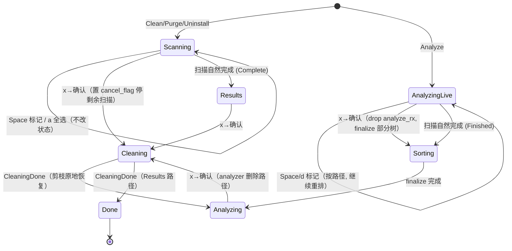

# TUI 交互统一与扫描期可操作工作区 - Plan

## Goal Capsule

- **目标**：让四个命令（Clean / Uninstall / Purge / Analyze）共享一致的交互模型，并把"扫描"从**上锁的阶段**改造成**边扫边操作的工作区**——扫描进行中即可标记，已发现项可删除。
- **产品裁决权**：用户（仓主）。所有产品决策已在 brainstorm 敲定；本文补齐实现的 HOW。
- **未决阻塞**：无。

**Product Contract 保留**：Product Contract 未改动（R1/R2/R3 与验收信号原样保留）；本次 enrich 仅新增 Planning Contract、Implementation Units、Verification Contract、Definition of Done。

---

## 背景与根因

三个用户诉求收敛为**一个根因**：四命令交互模型不统一，且扫描被当成上锁阶段。

现状（四命令 = 两套范式）：

| 命令 | 扫描态 | 结果态 | 导航 |
| --- | --- | --- | --- |
| Clean / Uninstall / Purge | `Scanning`：↑↓ + Tab 展开；`Space`/`x` 弹"扫描中不可标记" | `Results`：安全分区 → 分类 → 文件项（扁平二级），Tab/Enter 展开折叠 | 无 h/l 树导航 |
| Analyze | `AnalyzingLive`：↑↓ + h/l 进出目录；`Space`/`d`/`x` 弹"扫描中不可标记" | `Analyzing`：真·目录树，h/l 进出、任意层可删 | 有 h/l |

三个诉求的技术根因（均为历史上有意为之，非 bug）：

1. **扫描中不能标记/删除**——两个不同原因：
   - Clean/Purge：扫描完成时 `init_results`（`crates/tui/src/app.rs`）**重新播种** `marked`，会冲掉扫描期的手动标记（假反馈）。
   - Analyze：`AnalyzingLive` 列表实时按体积重排，"按位置标记"会误标此刻恰好最大的项。
2. **只有 Analyze 有左右键**——Results 是分类分组的扁平二级列表，非目录树，`h`/`l` 无"进出目录"语义可映射。
3. **Analyze 子目录内不能删除（回归）**——已核实：`0e8157f` 引入 `AnalyzingLive` 时 live 态**支持** `d` 标记删除（含子目录）；`75eaa4f`（"删除安全化"）为解决实时重排误标，用**一刀切**禁掉整个 live 阶段全部标记/删除。安全顾虑真实，但修复过宽——钻入不再剧烈变化的子目录本可安全标记却被连坐。

---

## 方向决策

已选：**方向 A（统一交互语法 + 解除扫描期封锁，保留各视图形态）为基线，Analyze 的扫描修复吸收方向 C（live 态即可操作工作区）**。

被否决：
- **方向 B（Clean/Purge 也做成可下钻目录树）**——会把规则驱动的安全预览（每项 safety/影响/恢复证据、预选）降级成裸目录树，牺牲 STRATEGY 中"每个将删文件一目了然"的核心差异点。
- **全面走方向 C**——Clean/Purge 的 `Scanning → Results` 割裂感远小于 Analyze，全面重构收益不抵改动面。

---

## Product Contract

### R1 — 键位语法全统一

- Results（Clean/Uninstall/Purge）与 Analyze 中，`Space`=标记、`x`=删除、`h`/`l` 语义一致。
- Results 中赋予 `h`/`l` 语义：`l`=展开分类，`h`=折叠 / 回到分类头。Analyze 保持 `l`=进入目录、`h`=返回上级。
- `crates/tui/src/keymap.rs` 作为键位单一事实来源（help 覆盖层 + footer 均由它生成）同步更新。
- 安全契约不变：`Enter` 永不触发删除；Risky 项仍仅经 type-to-confirm（输入 `delete`）删除。

### R2 — 全命令恢复"边扫边标记删除"

- **Clean / Uninstall / Purge（`Scanning` 态）**：放开 `Space` 标记与 `x` 删除；移除"扫描进行中不可标记/删除"提示。
  - `init_results` 由**重播种**改为**合并**：保留用户扫描期手动标记，预选随 `Found` 事件**增量播种**，而非完成时一次性覆盖。
- **Analyze（`AnalyzingLive` 态）**：恢复标记 + 删除（含子目录）；移除入口一刀切拦截。标记按**路径**绑定，列表继续实时重排。
- 删除默认移废纸篓（可恢复）。

### R3 — 回归修复：Analyze 任意深度子目录可删除

- 在 `AnalyzingLive` 与 `Analyzing` 任意层级，选中项可标记并删除。恢复 `75eaa4f` 之前的能力，但以路径绑定的安全方式实现。

### 已敲定的产品决策

- **Analyze live 态重排**：扫描中**继续实时重排**，标记锁**路径**、作用于光标当前所指路径。用户接受"排序始终最新"换"光标下的项可能跳变一帧"的轻微视觉误标（数据层因路径绑定始终正确）。
- **提交删除会先收尾当前扫描阶段**（见 KTD1）：标记全程自由；按 `x` 删除时 Clean/Purge 取消剩余扫描、Analyze 先 finalize 部分树，再执行删除，舍弃剩余未扫部分（已发现的全部保留）。
- **不做**：方向 B、CLI 改动、GUI、Cleaning/Done 状态机重构。

### 验收信号

- 四命令 `Space`/`x`/`h`/`l` 语义一致（可从 `keymap.rs` 键位表与 help 覆盖层验证）。
- 扫描进行中（`Scanning` 与 `AnalyzingLive`）可标记，已发现项可删除；不再出现"扫描中不可标记"提示。
- Clean/Purge 扫描完成后**不冲掉**用户扫描期手动标记。
- Analyze 实时重排下标记落到路径正确的项；任意深度子目录可删除。
- 现有安全测试（Risky type-to-confirm、`Enter` 不删除、取消扫描清态、`collect_marked` 剪枝、`restore_analyzer_after_delete` 部分失败）全部仍通过。

---

## Key Technical Decisions

### KTD1 — 标记全程自由；提交删除先收尾扫描阶段

**决策**：标记（`Space`/`d`）在扫描中全程可用且不改变状态机；删除（`x`→确认）在提交瞬间先让树/扫描进入稳定态再执行。

**理由**：标记只增删 `App.marked`（`HashSet<PathBuf>`），与正在生长的树、正在跑的扫描线程完全独立，零风险。删除必须把节点从树中剪除并重算各层大小（否则界面显示已删项仍在）；剪树即改 `children` 向量，会让 `IncrementalTreeBuilder` 的 `depth_stack` 存量索引失效（见 [render-layer-sort-permutation-indices](../solutions/design-patterns/render-layer-sort-permutation-indices.md)），也会让 Clean/Purge 的后台扫描线程与 Cleaning 态事件混流。故删除前先冻结：
- Clean/Purge/Uninstall：置 `cancel_flag` 停剩余规则 → 走既有 `start_cleaning` → `Cleaning` → `Done`。
- Analyze：drop `analyze_rx` 停遍历 → 走既有 `transition_to_sorting`（finalize 部分树）→ `Analyzing` → 既有 `start_cleaning_from_analyzer` 剪枝恢复。

**被否**：边删边继续扫（树变异 + 事件混流，脆弱且收益低——Clean/Purge 扫描仅数秒，Analyze 删除目标一旦命中后续遍历价值低）。

### KTD2 — live 标记按路径，经置换翻译，`.get()` 兜底

**决策**：`AnalyzingLive` 标记复用既有置换链：`size_desc_order(&children).get(cursor).and_then(|&i| children.get(i))` 取路径，再增删 `marked`。列表继续实时重排。

**理由**：这正是 `75eaa4f` 封锁前的做法，且 `draw_live` 已渲染"已标记删除: N 项"——UI 早为此设计。solution 文档明确：`.get()` 把实时重排的 TOCTOU 降为安全 no-op，一瞬错位可接受且被渲染节流限界。直接支撑用户所选"继续重排 + 标记锁路径"。

### KTD3 — preselect 播种移到 `Found`，`init_results` 不再重播种

**决策**：预选（`selected = safety != Risky && rule.preselect`）在 `Found` 首次插入某项时即写入 `marked`；`init_results` 改为仅调整 `expanded`/`cursor`，**不再覆盖 `marked`**。

**理由**：让扫描期的手动 toggle 与预选累积到同一 `marked` 上，完成时不被冲掉。仅"首次插入"播种（合并累加 size 的分支不重播），避免用户扫描期取消的预选被重新加回。

### KTD4 — h/l 在 Results 的边界语义

**决策**：`l` 落在分类头=展开该分类；落在文件项=无操作。`h`=若分类已展开则折叠、否则/或在文件项上把光标移回其分类头。Analyze 保持 `l`=进入目录、`h`=返回上级/根层返回菜单。

**理由**：Results 是二级结构，无"进入目录"语义；把 h/l 映射到展开/折叠 + 回分类头，是与 Analyze 树导航最接近的一致体感，且不改数据结构。

---

## High-Level Technical Design

扫描期"标记 vs 删除"的状态流（标记不改状态，删除先收尾）：

关键：`AnalyzingLive --x--> Sorting --> Analyzing` 复用现成的 `transition_to_sorting` + `start_cleaning_from_analyzer`；删除逻辑不新建，只是把"提交删除"作为触发 finalize 的新入口。

---

## Implementation Units

### U1. 统一键位表

- **Goal**：`keymap.rs` 的 `hints_for` 反映统一语法，作为 help + footer 单一事实来源。
- **Requirements**：R1。
- **Dependencies**：无。
- **Files**：`crates/tui/src/keymap.rs`。
- **Approach**：
  - `Scanning`：加 `Space 标记` / `x 删除已标记(移废纸篓)` / `a 全选安全项`；把"Esc/Backspace/q 取消扫描并返回"保留；移除无（原就没有标记提示行，因其在 lib.rs 内联 toast）。
  - `Results`：加 `h/l 折叠/展开` 提示（priority 3）；其余不变。
  - `AnalyzingLive`：移除 `"扫描完成后可标记与删除"` 行，替换为 `Space/d 标记` + `x 删除已标记`。
  - `Analyzing`：已有 `Space/d 标记`、`x 删除`、`Enter/l 进入`、`Backspace/h 返回`，核对文案与 Results 一致。
  - 遵守 priority 约定：删除 `x` 与帮助 `?` 恒为 priority 0。
- **Patterns to follow**：现有 `KeyHint` 表与 priority 分配注释。
- **Test scenarios**（`crates/tui/src/keymap.rs` 内 `mod tests`）：
  - `footer_line(&AppState::Scanning{..}, 200)` 含"标记"与"删除"。
  - `footer_line(&AppState::Scanning{..}, 80)` 仍含 `x` 与 `?`（priority-0 硬保留），宽度 ≤ 80。
  - `footer_line(&AppState::AnalyzingLive{..}, 200)` 含"标记"与"删除"，不再含"扫描完成后"。
  - `footer_line(&AppState::Results, 200)` 含 h/l 折叠展开提示。
- **Verification**：`?` 覆盖层与 footer 在四态下键位文案一致，无"扫描中不可标记"残留。

### U2. preselect 增量播种 + `init_results` 合并语义

- **Goal**：预选随扫描累积、不在完成时冲掉手动标记（KTD3）。
- **Requirements**：R2。
- **Dependencies**：无（U3 依赖本单元）。
- **Files**：`crates/tui/src/lib.rs`（`handle_progress` 的 `Found` 分支）、`crates/tui/src/app.rs`（`init_results`）。
- **Approach**：
  - `Found` 分支：在**新项首次 push** 时（非 `merged` 累加分支），若 `selected`（`safety != Risky && preselect`）则 `app.marked.insert(path)`。`ScanItem::new(...).with_preselect(preselect)` 已算 `selected`，此处按同一判据播种。
  - `init_results`：删除 `self.marked = default_paths;` 覆盖，改为不触碰 `marked`（仅保留 `expanded.resize` 与 cursor 归位）。
- **Approach 注意**：合并累加分支（`existing.size += size`）不得重复播种。
- **Patterns to follow**：`ScanItem::new` / `with_preselect` 的 `selected` 语义（`crates/core/src/models.rs`）。
- **Test scenarios**（`crates/tui/src/lib.rs` 内 `mod tests`，复用 `handle_progress` + `App`）：
  - 连发两条同 `(category, path)` 的 `Found`（safety=Safe, preselect=true）：`marked` 只含该 path 一次，不因合并重复。
  - `Found`（safety=Risky）：不进 `marked`。
  - `Found`（preselect=false）：不进 `marked`。
  - 扫描期手动 `toggle_selection` 取消某已预选项 → 随后 `init_results()` → 该项仍**不在** `marked`（不被重播种冲回）。
  - 扫描期手动标记某未预选项 → `init_results()` → 该项仍在 `marked`。
- **Verification**：扫描完成进入 Results，标记集 = 预选 ∪ 手动增 − 手动删，无跳变。

### U3. Scanning 态（Clean/Purge/Uninstall）标记 + 删除

- **Goal**：`Scanning` 态放开 `Space`/`a`/`x`（KTD1）。
- **Requirements**：R2。
- **Dependencies**：U2。
- **Files**：`crates/tui/src/lib.rs`（`handle_key` 的 `AppState::Scanning` 分支）。
- **Approach**：
  - `Space`：取当前 `build_flat_rows().get(result_cursor)` → `toggle_selection`（路径绑定，Scanning 列表为稳定插入序，安全）。
  - `a`：`select_all_safe()`。
  - `x`：`results_delete_list()` 非空则 `confirm_delete = Some(list)`（含 Risky 走 type-to-confirm）。
  - 删除确认接受时（`confirm_accept`）：当 `app.state` 为 `Scanning`，先 `cancel_flag.store(true)` 停剩余扫描，再走 `start_cleaning`（转 `Cleaning`）。`confirm_accept` 现有分支按 `Analyzing` 判定；新增 `Scanning` 分支置 cancel 后复用 `start_cleaning`。
  - 移除原 `KeyCode::Char(' ' | 'x')` 的 toast 分支。
  - 保留 Tab 展开/折叠。
- **Approach 注意**：置 `cancel_flag` 后，扫描线程残留的 `Found` 会因 `handle_progress` 的 `!matches!(Scanning)` 守卫在 `Cleaning` 态被忽略（既有防污染逻辑），无需额外排空。
- **Patterns to follow**：`handle_results_key` 的 `Space`/`a`/`x` 分支、`request_leave_to_menu` 的 cancel_flag 用法。
- **Test scenarios**（`crates/tui/src/lib.rs` 内 `mod tests`）：
  - Scanning 态按 `Space` 于某 Item 行 → 该 path 入 `marked`；再按 → 移除。
  - Scanning 态按 `x`（marked 非空、无 Risky）→ `confirm_delete` 置位。
  - `confirm_accept` 于 Scanning 态 → `cancel_flag` 为 true 且状态转 `Cleaning`。
  - Scanning 态按 `x`（marked 空）→ 不弹确认。
  - Scanning 态按 `Space`/`x` **不再**产生 `status_message`（toast 已移除）。
- **Verification**：扫描中勾选并按 x，扫描顺势收尾、进入清理，完成报告正确。

### U4. AnalyzingLive 态标记（含子目录）

- **Goal**：恢复 live 态 `Space`/`d` 标记，按路径经置换翻译（KTD2）。
- **Requirements**：R2、R3。
- **Dependencies**：无。
- **Files**：`crates/tui/src/lib.rs`（`handle_analyzer_live_key`）。
- **Approach**：
  - 移除入口处 `matches!(key, Char(' ' | 'd' | 'x'))` 的一刀切拦截（保留 Ctrl 修饰排除逻辑给 Ctrl+d 翻页）。
  - 新增 `Space`/`d`（非 Ctrl）分支：`order = size_desc_order(&current_node.children)`；`order.get(*cursor).and_then(|&i| current_node.children.get(i)).map(|c| c.path.clone())`；有则增删 `marked`。不改 `user_navigated`，不移光标。
- **Patterns to follow**：`handle_analyzer_live_key` 的下钻分支（已用 `size_desc_order` + `.get()`）、solution 文档"标记走完全相同的翻译链"。
- **Test scenarios**（`crates/tui/src/lib.rs` 内 `mod tests`）：
  - 构造 live 树（children 乱序 size），cursor=0（显示序最大项）按 `Space` → 标记的是**最大项路径**（经置换），非 children[0]。
  - 子目录内（nav_path 非空）按 `Space` → 标记当前层光标项，`marked` 含其路径。
  - cursor 越界（`order.get` 返回 None）按 `Space` → 无 panic、`marked` 不变。
  - 按 `Space` 后 `user_navigated` 不变、cursor 不动。
- **Verification**：live 态在根层与子目录均可标记，实测重排下落点为光标视觉所指项。

### U5. AnalyzingLive 态删除（finalize→delete，回归修复）

- **Goal**：live 态 `x` 提交删除，先 finalize 部分树再走既有 analyzer 删除路径（KTD1、R3）。
- **Requirements**：R2、R3。
- **Dependencies**：U4。
- **Files**：`crates/tui/src/lib.rs`（`handle_analyzer_live_key` 的 `x` 分支、`confirm_accept`、必要时 `transition_to_sorting` 的调用点）。
- **Approach**：
  - live 态 `x`：`collect_marked(tree_root, &marked, &mut list)`；非空则按 `evidence_for_path` 补 safety/impact/recovery（与 `handle_analyzer_key` 的 `x` 同款），`confirm_delete = Some(items)`。
  - `confirm_accept` 于 `AnalyzingLive` 态确认时：先 `transition_to_sorting`（drop analyze_rx、finalize 后台）→ 状态转 `Sorting`。**问题**：删除需在 `Analyzing`（Arc 树）上执行，而 finalize 是异步（`sort_rx`）。方案：把待删清单暂存（复用 `clean_request` 或新增 `pending_analyzer_delete: Vec<(PathBuf,u64)>`），在 `SortDone` 分支进入 `Analyzing` 后，若暂存非空则立即调用 `start_cleaning_from_analyzer`。
  - `confirm_accept` 需在转 Sorting 前保存 `confirm_delete` 项到暂存字段并清 `confirm_delete`。
- **Approach 注意**：`SortDone` 现分支恒重置 nav/cursor 到根；删除暂存执行发生在其后，`start_cleaning_from_analyzer` 会再暂存树到 `analyzer_return`，`CleaningDone` 经 `restore_analyzer_after_delete` 剪枝恢复。二者叠加需核对 nav 归零后剪枝仍正确（剪枝按路径快照，根层 nav 为空安全）。
- **Patterns to follow**：`handle_analyzer_key` 的 `x`（`evidence_for_path` 补证据）、`start_cleaning_from_analyzer` + `restore_analyzer_after_delete`、`transition_to_sorting`。
- **Test scenarios**（`crates/tui/src/lib.rs` 内 `mod tests`）：
  - live 态标记某子目录项后按 `x` → `confirm_delete` 置位，含经 `evidence_for_path` 的 safety。
  - live 态确认删除 → 暂存清单非空、状态转 `Sorting`（不直接进 Cleaning）。
  - 模拟 `SortDone` 后暂存清单被消费 → 进入 `Cleaning`（`start_cleaning_from_analyzer` 已置 `analyzer_return`）。
  - live 态标记含 Risky 路径（如 Docker 卷）按 `x` → `confirm_has_risky()` 为真（type-to-confirm）。
  - 复用既有 `restore_analyzer_prunes_only_succeeded_and_keeps_failed` 验证剪枝语义不回归。
- **Verification**：live 态（含深层子目录）标记 + `x` → 排序过渡 → 删除完成 → 停在可浏览树，删除项消失，子目录删除回归修复。

### U6. h/l 语义补齐（Results / Scanning）

- **Goal**：Results 与 Scanning 态支持 `l`=展开、`h`=折叠/回分类头（KTD4）。
- **Requirements**：R1。
- **Dependencies**：无。
- **Files**：`crates/tui/src/lib.rs`（`handle_results_key`、`Scanning` 分支）。
- **Approach**：
  - `handle_results_key`：现 `Left | Char('h')` 归入"清过滤/返回菜单"。改为：`l`/`Right` 在分类头=`toggle_expand`（展开）；`h`/`Left` 在已展开分类或其子项上=折叠该分类并把光标移回分类头；`h`/`Left` 在根层无可折叠时才走"清过滤/返回菜单"。需保留 Esc/Backspace 的"清过滤/返回菜单"语义不变（避免破坏现有退出路径）。
  - Scanning 分支：加 `l`/`h` 与 Results 同义（Tab 保留为兼容别名）。
- **Approach 注意**：`h` 的"返回菜单"回退与展开折叠的优先级需明确——建议：`h` 优先折叠/回分类头，仅当光标已在根层分类头且无过滤词时才返回菜单；`Esc`/`Backspace` 维持原直接返回语义，给用户保留一个稳定的退出键。
- **Patterns to follow**：`handle_analyzer_key` 的 `h`/`l` 分层（根层 `h` 返回菜单）、现有 `toggle_expand`。
- **Test scenarios**（`crates/tui/src/app.rs` 或 `lib.rs` 内 `mod tests`）：
  - 光标在折叠分类头按 `l` → 该分类 `expanded=true`。
  - 光标在展开分类的 Item 行按 `h` → 分类折叠、光标回到分类头行。
  - 光标在根层分类头（无过滤）按 `h` → 返回菜单。
  - 有过滤词时按 `h` 于分类头 → 先折叠而非清过滤（`Esc` 仍清过滤）。
  - `l` 落在文件项 → 无操作、无 panic。
- **Verification**：Results 与 Analyze 的 h/l 体感一致；退出路径（Esc/Backspace/q）不回归。

---

## Verification Contract

- `cargo test -p mc-tui` 全绿，含上述新增 U1–U6 场景与全部既有安全测试。
- `cargo clippy --all-targets`（pedantic 全开）无新增告警——注意本仓 `main` 分支禁改代码，须在 feature 分支/worktree 内手跑 clippy（worktree 内 hook 不生效）。
- verify-tui skill 手验四命令：扫描中标记 → footer 无"不可标记" → Analyze live 子目录标记+删除 → Clean 扫描中删除收尾 → h/l 在 Results 与 Analyze 一致。
- 回归核对：Risky type-to-confirm、`Enter` 不删除、取消扫描清态、`restore_analyzer_after_delete` 部分失败保留。

## Definition of Done

- R1/R2/R3 验收信号全部满足。
- 四态键位表统一、无"扫描中不可标记"文案残留。
- Clean/Purge 扫描完成不冲掉手动标记；Analyze live 根层与子目录可标记可删除。
- 删除按 KTD1 收尾语义工作（Clean/Purge 取消剩余扫描、Analyze finalize）。
- `cargo test -p mc-tui` + `cargo clippy` 通过；verify-tui 手验通过。

---

## Risks & Dependencies

- **R1（低）边删边扫的 walker 容错**：park walker 用可失败的 `read_dir`/`symlink_metadata`，路径中途消失降级为空/0，不 panic（`crates/core/src/park_walk.rs`）。KTD1 已让删除先停扫，进一步降低触发面。
- **R2（中）U5 的 finalize→delete 双重状态转移**：`SortDone` 归零 nav/cursor 与随后 `start_cleaning_from_analyzer` 暂存树的叠加需仔细核对剪枝按路径快照在根层 nav 为空下仍正确。以单测 + verify-tui 双验。
- **R3（低）残留视觉误标**：KTD2 已按用户决策接受（继续重排 + 标记锁路径）。缓解候选（重排 settle 延迟 / 标记后瞬时高亮）列为后续可选，不在本次范围。
- **依赖**：无外部依赖；纯 `mc-tui` 改动，`mc-core` 的 `analyze_walk`/`evidence_for_path`/`Cleaner` 接口不变。

## Deferred to Follow-Up Work

- 残留视觉误标的缓解（重排 settle 延迟 / 标记后瞬时高亮）——KTD2 残留风险的进一步打磨。
- `finalize()` 大树异步化（Issue #3 子项 #9）——与本 plan 正交，超大树 finalize 的 200–500ms 优化。

## Sources & Research

- [render-layer-sort-permutation-indices](../solutions/design-patterns/render-layer-sort-permutation-indices.md)——live 标记按路径 + `.get()` TOCTOU 兜底的既有模式与背书。
- [streaming-aggregation-key-is-action-granularity](../solutions/design-patterns/streaming-aggregation-key-is-action-granularity.md)——流式聚合按动作粒度合并的既有模式（与 U2 的 Found 合并相关）。
- git 考古：`0e8157f`（引入 AnalyzingLive，live 支持 `d` 删除）→ `75eaa4f`（"删除安全化"一刀切封锁），确认 R3 为回归。
- 源码锚点：`crates/tui/src/{keymap.rs,lib.rs,app.rs,ui/analyzer.rs}`、`crates/core/src/park_walk.rs`。
