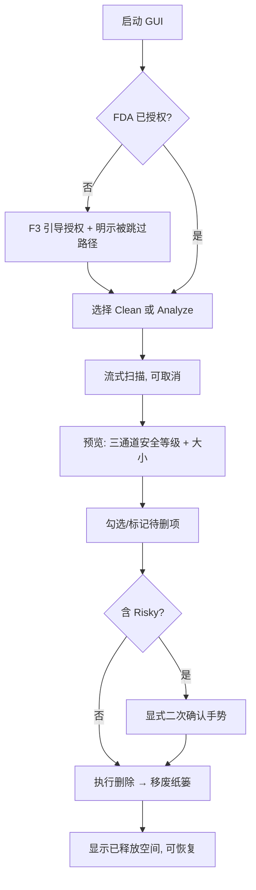

# macCleaner GUI MVP - Plan

## Goal Capsule

- 目标：定清 macCleaner 免费开源 GUI 的 MVP 边界——面向普通 Mac 用户，Tauri 桌面端，覆盖 Clean + Analyze 两命令，复用 mc-core 引擎并完整继承 TUI 安全语义。
- 产品权威：`STRATEGY.md`（多界面适配轨道）、`PRODUCT.md`（一套语义多后端）、`DESIGN.md`（框架无关语义 token + 安全三通道不变量）。本 MVP 边界由 `/ce-brainstorm` 定。
- 开放阻塞项：无强阻塞。type-to-confirm 的 GUI 手势、Tauri 引擎映射方式、Analyze 树呈现等为 Deferred to Planning。

## Product Contract

### Summary

做一个免费开源的 Tauri 桌面 GUI，面向普通 Mac 用户，MVP 覆盖 Clean（缓存清理）与 Analyze（磁盘占用可视化 + 删除大目录）。GUI 复用 mc-core 引擎、继承全部 TUI 安全语义，删除默认移废纸篓、零遥测。定位是 Mole 付费 Mac App 的免费开源对位，也是产品触达 STRATEGY 二次用户（普通用户）的唯一界面。

### Key Decisions

- **Tauri 作为桌面后端。** Rust 后端进程内直接调 mc-core，Web 前端。系统 webview 保持二进制轻量，`DESIGN.md` 的 OKLCH token 在 CSS 原生可用，且旧文档（v1 plan / 需求）已锚定 Tauri。纯 Rust GUI 与原生 Swift 被否：前者消费级精致度/生态弱、OKLCH 需手转，后者要 FFI 桥接 + 双语言栈、脱离"一套语义多后端"的复用。
- **Analyze 取代 Purge 进 MVP。** 普通用户优先，而 Purge 是开发者能力（靠 root_markers 识别 node_modules/DerivedData/target，普通用户机器上几乎扫不到）；Analyze 的"看到什么占空间"才是普通用户的磁盘价值。Purge 归二期。
- **完整继承 TUI 安全语义，不为"好用"松绑。** GUI 不得把 Risky 做成一键清理、不得默认预选可能含用户数据项、不得提供永久删除路径。安全是产品招牌，GUI 是它的第三个后端而非例外。
- **FDA 首次运行引导纳入 MVP。** 普通用户不过 Full Disk Access 这一关就用不了清理工具，是普通用户 MVP 的必答项，不能推给二期。

### Actors

- A1. 普通 Mac 用户（primary）：磁盘告警时想安全清理并看清什么占空间，不熟悉终端，需要自解释的 UX 与权限引导。
- A2. 开发者（secondary）：已有 CLI/TUI，GUI 对其可选。MVP 不为开发者单独优化（Purge 二期）。

### Requirements

**引擎复用与命令覆盖**

- R1. GUI 复用 mc-core 引擎（`Engine` facade 的 scan/clean/analyze），不新建任何扫描或清理逻辑；与 CLI/TUI 共享同一引擎，全仓不得出现第二套清理实现。
- R2. MVP 命令覆盖 Clean（系统/浏览器缓存）与 Analyze（磁盘占用钻取 + 删除大目录）两条。Purge、Uninstall 不在 MVP。
- R3. 扫描/清理进度流式呈现：GUI 实现一个 `ProgressReporter` 对端，把事件实时推到界面（对齐 TUI 边扫边填的手感），并支持协作式取消。

**安全语义继承（硬约束）**

- R4. SafetyLevel 按 `DESIGN.md` 三通道编码呈现——颜色（OKLCH）+ 形状字形（`●` Safe / `◆` Moderate / `✕` Risky）+ 文字标签，任何呈现不得退化为纯色块。
- R5. 预选与安全解耦沿用核心语义：默认勾选项 = `safety != Risky && preselect`；Risky 项永不预选。
- R6. Risky 项不可单击删除——必须经显式二次确认手势（type-to-confirm 等价物）方可删除；具体手势见 Outstanding Questions。
- R7. 删除默认移废纸篓（可恢复）；MVP 不提供永久删除路径。
- R8. 无静默删除：执行前，每个将删项及其大小、安全等级可见可审。

**首次运行与权限**

- R9. 首次运行检测 Full Disk Access 等权限缺失，解释为何需要并引导用户到系统设置授权；复用已出货的 `mc doctor` / 权限跳过诊断能力，不静默漏扫。
- R10. 权限不足时，界面明示哪些路径因权限被跳过，而非无声省略。

**打包与轻量**

- R11. 桌面端用 Tauri：Rust 后端进程内直接调 mc-core，Web 前端，使用系统 webview，不打包 Chromium。
- R12. 零遥测：GUI 不引入任何网络上报/分析，沿用产品零遥测承诺。
- R13. 免费开源：GUI 与引擎同仓开源，无付费或订阅门槛。

### Key Flows

Clean 与 Analyze 共享同一条"安全脊柱"：扫描 → 预览（含安全等级）→ 勾选/标记 → 确认 → 移废纸篓。差异只在扫描源与浏览形态（Clean 是分类勾选，Analyze 是体积排序钻取树 + 按路径标记）。

- F1. Clean 清理
  - **Trigger:** 用户选择 Clean。
  - **Actors:** A1、A2
  - **Steps:** 流式扫描系统/浏览器缓存 → 分类呈现（各项带安全等级）→ 默认勾选 Safe+preselect 项 → 确认 → 移废纸篓。
  - **Covered by:** R1, R2, R3, R4, R5, R7, R8
- F2. Analyze 磁盘占用
  - **Trigger:** 用户选择 Analyze。
  - **Actors:** A1
  - **Steps:** 流式增量建树、按体积降序钻取 → 用户按路径标记大目录 → 含 Risky 时经二次确认 → 移废纸篓 → 删除后原地留在树内继续操作（继承 TUI 的"删后不拆树"）。
  - **Covered by:** R1, R3, R4, R6, R7, R8
- F3. 首次运行权限引导
  - **Trigger:** 检测到 Full Disk Access 缺失。
  - **Actors:** A1
  - **Steps:** 说明为何需要 FDA → 引导到系统设置 → 扫描时明示因权限被跳过的路径。
  - **Covered by:** R9, R10

### Acceptance Examples

- AE1. Risky 项删除防线
  - **Covers R5, R6.** Given 扫描结果含一个 Risky 项，When 用户尝试删除，Then 该项未被预选、且必须完成显式二次确认手势才执行；单击/回车不触发删除。
- AE2. 预选与安全解耦
  - **Covers R5.** Given 一批 Safe+preselect 项、若干 Moderate 项、若干 Risky 项，When 结果呈现，Then Safe+preselect 默认勾选、Moderate 不预选、Risky 不预选。
- AE3. 删除去向
  - **Covers R7, R8.** Given 用户确认删除一批项，When 执行，Then 全部移入废纸篓可恢复，界面无任何永久删除入口。
- AE4. 权限缺失不静默
  - **Covers R9, R10.** Given 未授予 FDA，When 首次扫描，Then 界面引导授权并明示被跳过的路径，而非静默完成一次"扫不全"的扫描。

### Success Criteria

- 普通用户能在不看文档的情况下完成一次缓存清理，以及一次"看磁盘占用 → 删除大目录"。
- 首次运行能正确引导 FDA 授权，未授权时明示被跳过路径。
- 所有删除可从废纸篓恢复；不存在任何未经显式确认即删除 Risky 项的路径。
- 二进制轻量：使用系统 webview，不打包 Chromium。
- 与 CLI/TUI 共享同一 mc-core，无引擎分叉。
- 扫描性能对齐现有引擎，全盘目标 < 30s（沿用 `STRATEGY.md` 指标）。

### Scope Boundaries

**Deferred for later（二期及以后）**

- Purge（开发产物清理）、Uninstall（应用卸载 + 残留）。
- Analyze 的 treemap 可视化（MVP 先做体积排序钻取树）。
- history / undo 的 GUI 呈现。
- 规则自定义 / 规则透明度页的 GUI。
- 重复文件视图。
- 英文及其他语言本地化（MVP 中文优先）。

**Outside this product's identity（不做）**

- 永久删除路径——与 TUI 一致，GUI 也不提供。
- 遥测 / 账号 / 订阅。
- 系统"优化/加速"类恐吓营销功能（CleanMyMac 式 snake-oil）。
- 菜单栏常驻哨兵 / 后台自动清理——与轻量定位张力，非本产品身份。

### Dependencies / Assumptions

- 依赖 mc-core 的 `Engine` + `ProgressReporter` 作为稳定接口。若接口需为 GUI 显式化/加固（见上游 ideation 的"core SDK 化"），作为计划期第一个 unit 评估。
- 假设 `DESIGN.md` 的 OKLCH 桌面基准可直接落 CSS，落地时按对比度校验微调。
- 假设 macOS only；Windows/Linux 非目标。
- 假设界面语言中文优先。

### Outstanding Questions

**Deferred to Planning**

- Risky 项 type-to-confirm 在 GUI 的具体手势（输入 `delete` / 独立危险确认模态 / 长按）——硬约束是"绝不单击 + 永不预选"，形态由计划期定。
- Tauri 后端如何把 `Engine` 的调用与 `ProgressReporter` 的流式事件映射到 command + event（进程内直接调用 vs sidecar 进程）。
- mc-core 是否需为 GUI 显式导出稳定 API 面（上游 ideation #2 的 SDK 化）——计划期评估是否作为第一 unit。
- Analyze 钻取在 GUI 的呈现（列表逐层钻取 vs 单屏树）与 MVP 是否即需体积条。

### Sources / Research

- 上游决策：`docs/ideation/2026-07-07-next-step-tui-vs-gui.md`（本 MVP 的方向来源）、`docs/ideation/2026-07-05-beat-mole-product-directions.md`（#1 GUI 方向 + Mole 竞品核实）。
- 设计系统：`DESIGN.md`（框架无关语义 token + OKLCH 桌面基准 + 安全三通道不变量）。
- 产品与安全：`PRODUCT.md`（一套语义多后端）、`CONCEPTS.md`（SafetyLevel 语义）、`SECURITY.md`。
- 引擎复用点：`crates/core` 的 `Engine` facade + `ProgressReporter` trait；`mc doctor` / 权限跳过诊断（已出货，issue #23）。
- 现状核实（本会话）：workspace 仅 `crates/{core,cli,tui}` + `xtask`，GUI 零代码、零 GUI 依赖。
