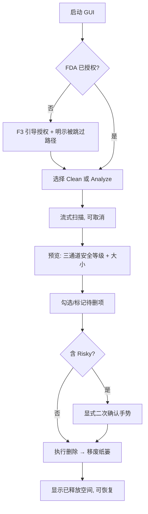
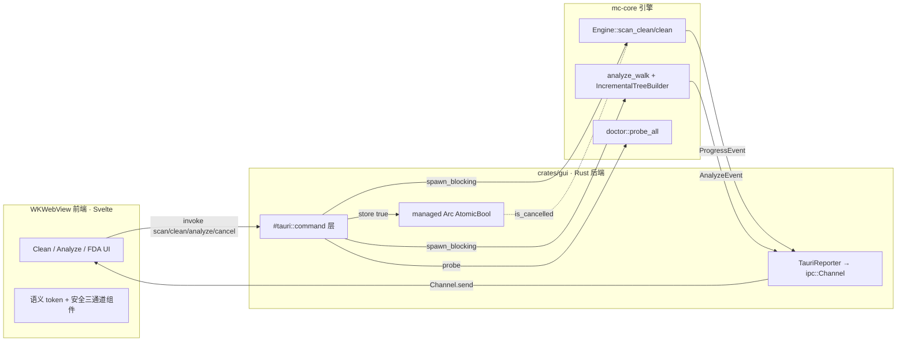

# macCleaner GUI MVP - Plan

## Goal Capsule

- 目标：交付 macCleaner 免费开源 GUI 的 MVP——面向普通 Mac 用户，Tauri 桌面端，覆盖 Clean + Analyze 两命令，复用 mc-core 引擎并完整继承 TUI 安全语义。
- 产品权威：`STRATEGY.md`（多界面适配轨道）、`PRODUCT.md`（一套语义多后端）、`DESIGN.md`（框架无关语义 token + 安全三通道不变量 + §9 桌面移植检查清单）。MVP 边界由 `/ce-brainstorm` 定，本文由 `/ce-plan` 补齐 HOW。
- 执行画像：全新 crate `crates/gui`（Tauri app），无既有 GUI 代码可改；引擎侧仅做加性 SDK 化（上提增量建树 + 补 Serde 派生），不改现有清理/扫描行为。
- 停止条件：Definition of Done 全绿——两条流程可端到端跑通、安全语义全继承、FDA 引导可用、产物用系统 WebView 且轻量、全 workspace clippy(pedantic) + test 通过。

## Product Contract

**Product Contract preservation：** Product Contract 内容与 R/A/F/AE ID 全部保持不变（未改动产品范围）；本次仅新增 Planning Contract、Implementation Units、Verification Contract、Definition of Done，并把原 Outstanding Questions 的 Deferred-to-Planning 项在 Planning Contract 中就地解析为 KTD。

### Summary

做一个免费开源的 Tauri 桌面 GUI，面向普通 Mac 用户，MVP 覆盖 Clean（缓存清理）与 Analyze（磁盘占用可视化 + 删除大目录）。GUI 复用 mc-core 引擎、继承全部 TUI 安全语义，删除默认移废纸篓、零遥测。定位是 Mole 付费 Mac App 的免费开源对位，也是产品触达 STRATEGY 二次用户（普通用户）的唯一界面。

### Key Decisions

- **Tauri 作为桌面后端。** Rust 后端进程内直接调 mc-core，Web 前端。系统 webview 保持二进制轻量，`DESIGN.md` 的 OKLCH token 在 CSS 原生可用，且旧文档（v1 plan / 需求）已锚定 Tauri。纯 Rust GUI 与原生 Swift 被否：前者消费级精致度/生态弱、OKLCH 需手转，后者要 FFI 桥接 + 双语言栈、脱离“一套语义多后端”的复用。
- **Analyze 取代 Purge 进 MVP。** 普通用户优先，而 Purge 是开发者能力（靠 root_markers 识别 node_modules/DerivedData/target，普通用户机器上几乎扫不到）；Analyze 的“看到什么占空间”才是普通用户的磁盘价值。Purge 归二期。
- **完整继承 TUI 安全语义，不为“好用”松绑。** GUI 不得把 Risky 做成一键清理、不得默认预选可能含用户数据项、不得提供永久删除路径。安全是产品招牌，GUI 是它的第三个后端而非例外。
- **FDA 首次运行引导纳入 MVP。** 普通用户不过 Full Disk Access 这一关就用不了清理工具，是普通用户 MVP 的必答项，不能推给二期。

### Actors

- A1. 普通 Mac 用户（primary）：磁盘告警时想安全清理并看清什么占空间，不熟悉终端，需要自解释的 UX 与权限引导。
- A2. 开发者（secondary）：已有 CLI/TUI，GUI 对其可选。MVP 不为开发者单独优化（Purge 二期）。

### Requirements

**引擎复用与命令覆盖**

- R1. GUI 复用 mc-core 引擎（`Engine` facade 的 scan/clean/analyze），不新建任何扫描或清理逻辑；与 CLI/TUI 共享同一引擎，全仓不得出现第二套清理实现。
- R2. MVP 命令覆盖 Clean（系统/浏览器缓存）与 Analyze（磁盘占用钻取 + 删除大目录）两条。Purge、Uninstall 不在 MVP。
- R3. 扫描/清理进度流式呈现：GUI 实现一个 `ProgressReporter` 对端，把事件实时推到界面（对齐 TUI 边扫边填的手感），并支持协作式取消。

**安全语义继承（硬约束）**

- R4. SafetyLevel 按 `DESIGN.md` 三通道编码呈现——颜色（OKLCH）+ 形状字形（`●` Safe / `◆` Moderate / `✕` Risky）+ 文字标签，任何呈现不得退化为纯色块。
- R5. 预选与安全解耦沿用核心语义：默认勾选项 = `safety != Risky && preselect`；Risky 项永不预选。
- R6. Risky 项不可单击删除——必须经显式二次确认手势（type-to-confirm 等价物）方可删除；具体手势见 KTD-8。
- R7. 删除默认移废纸篓（可恢复）；MVP 不提供永久删除路径。
- R8. 无静默删除：执行前，每个将删项及其大小、安全等级可见可审。

**首次运行与权限**

- R9. 首次运行检测 Full Disk Access 等权限缺失，解释为何需要并引导用户到系统设置授权；复用已出货的 `mc doctor` / 权限跳过诊断能力，不静默漏扫。
- R10. 权限不足时，界面明示哪些路径因权限被跳过，而非无声省略。

**打包与轻量**

- R11. 桌面端用 Tauri：Rust 后端进程内直接调 mc-core，Web 前端，使用系统 webview，不打包 Chromium。
- R12. 零遥测：GUI 不引入任何网络上报/分析，沿用产品零遥测承诺。
- R13. 免费开源：GUI 与引擎同仓开源，无付费或订阅门槛。

### Key Flows

Clean 与 Analyze 共享同一条“安全脊柱”：扫描 → 预览（含安全等级）→ 勾选/标记 → 确认 → 移废纸篓。差异只在扫描源与浏览形态（Clean 是分类勾选，Analyze 是体积排序钻取树 + 按路径标记）。



- F1. Clean 清理
  - **Trigger:** 用户选择 Clean。
  - **Actors:** A1、A2
  - **Steps:** 流式扫描系统/浏览器缓存 → 分类呈现（各项带安全等级）→ 默认勾选 Safe+preselect 项 → 确认 → 移废纸篓。
  - **Covered by:** R1, R2, R3, R4, R5, R7, R8
- F2. Analyze 磁盘占用
  - **Trigger:** 用户选择 Analyze。
  - **Actors:** A1
  - **Steps:** 流式增量建树、按体积降序钻取 → 用户按路径标记大目录 → 含 Risky 时经二次确认 → 移废纸篓 → 删除后原地留在树内继续操作（继承 TUI 的“删后不拆树”）。
  - **Covered by:** R1, R3, R4, R6, R7, R8
- F3. 首次运行权限引导
  - **Trigger:** 检测到 Full Disk Access 缺失。
  - **Actors:** A1
  - **Steps:** 说明为何需要 FDA → 引导到系统设置 → 扫描时明示因权限被跳过的路径。
  - **Covered by:** R9, R10

### Acceptance Examples

- AE1. Risky 项删除防线
  - **Covers R5, R6.** Given 扫描结果含一个 Risky 项，When 用户尝试删除，Then 该项未被预选、且必须完成显式二次确认手势才执行；单击/回车不触发删除。
- AE2. 预选与安全解耦
  - **Covers R5.** Given 一批 Safe+preselect 项、若干 Moderate 项、若干 Risky 项，When 结果呈现，Then Safe+preselect 默认勾选、Moderate 不预选、Risky 不预选。
- AE3. 删除去向
  - **Covers R7, R8.** Given 用户确认删除一批项，When 执行，Then 全部移入废纸篓可恢复，界面无任何永久删除入口。
- AE4. 权限缺失不静默
  - **Covers R9, R10.** Given 未授予 FDA，When 首次扫描，Then 界面引导授权并明示被跳过的路径，而非静默完成一次“扫不全”的扫描。

### Success Criteria

- 普通用户能在不看文档的情况下完成一次缓存清理，以及一次“看磁盘占用 → 删除大目录”。
- 首次运行能正确引导 FDA 授权，未授权时明示被跳过路径。
- 所有删除可从废纸篓恢复；不存在任何未经显式确认即删除 Risky 项的路径。
- 二进制轻量：使用系统 webview，不打包 Chromium。
- 与 CLI/TUI 共享同一 mc-core，无引擎分叉。
- 扫描性能对齐现有引擎，全盘目标 < 30s（沿用 `STRATEGY.md` 指标）。

### Scope Boundaries

**Deferred for later（二期及以后）**

- Purge（开发产物清理）、Uninstall（应用卸载 + 残留）。
- Analyze 的 treemap 可视化（MVP 先做体积排序钻取树）。
- history / undo 的 GUI 呈现。
- 规则自定义 / 规则透明度页的 GUI。
- 重复文件视图。
- 英文及其他语言本地化（MVP 中文优先）。

**Outside this product's identity（不做）**

- 永久删除路径——与 TUI 一致，GUI 也不提供。
- 遥测 / 账号 / 订阅。
- 系统“优化/加速”类恐吓营销功能（CleanMyMac 式 snake-oil）。
- 菜单栏常驻哨兵 / 后台自动清理——与轻量定位张力，非本产品身份。

**Deferred to Follow-Up Work（本计划实现期发现、留后续 PR）**

- 亮色主题（MVP 只落 `DESIGN.md` §2 暗色基准；亮色作后续变体）。
- Windows/Linux 打包（本 MVP macOS only）。
- 前端组件的完整 6 态（default/hover/focus/active/disabled/loading）打磨与自动化视觉回归——MVP 先保证 default + 交互态可用。
- 代码签名 + 公证的 CI 自动化（MVP 先能本地产 `.dmg`，签名/公证走后续）。

### Dependencies / Assumptions

- 依赖 mc-core 的 `Engine` + `ProgressReporter` 作为稳定接口；本计划把接口为 GUI 显式加固（U1 SDK 化）作为第一个 unit。
- 假设 `DESIGN.md` 的 OKLCH 桌面基准可直接落 CSS，落地时按对比度校验微调。
- 假设 macOS only；Windows/Linux 非目标。
- 假设界面语言中文优先。

### Outstanding Questions

原 Deferred-to-Planning 四问已在本次计划解析，指针如下（详见 Planning Contract）：

- Risky type-to-confirm 的 GUI 手势 → 由 KTD-8 定：危险确认模态 + 输入 `delete` token。
- Engine/ProgressReporter → Tauri command+event 映射（进程内 vs sidecar）→ 由 KTD-1/KTD-3 定：进程内 path 依赖 + `ipc::Channel`。
- mc-core 是否需为 GUI 显式导出稳定 API 面 → 由 KTD-2 定：是，作为第一个 unit（U1）。
- Analyze 钻取的 GUI 呈现 → 由 KTD-9 定：逐层钻取列表 + 体积条，复用 mc-core 增量树。

---

## Planning Contract

### Key Technical Decisions

- KTD-1. **引擎进程内直调，不用 sidecar。** `crates/gui/Cargo.toml` 以 `mc-core = { path = "../core" }` 直接依赖，命令体内 `use mc_core` 同进程调用。Sidecar 只用于打包外部可执行文件，对纯 Rust 引擎是反模式（多一次进程边界 + IPC 序列化）。（解析 Outstanding Q2）
- KTD-2. **mc-core SDK 化作为第一个 unit（U1）。** 两处加固：① `IncrementalTreeBuilder` 目前 `pub(crate)` 埋在 `crates/tui`，GUI 新 crate 用不了——上提到 mc-core 并 `pub`，TUI 改用 core 版（消除未来分叉）；② `ProgressEvent` / `AnalyzeEvent` 当前**未 derive Serialize**（已 grep 证实），过 `ipc::Channel<T>` 必须可序列化——为二者补 `#[derive(Serialize)]`（`SafetyLevel`/`DeleteMode`/`PathBuf`/doctor 类型均已 Serde，加性小改）。（解析 Outstanding Q3）
- KTD-3. **进度流式用 `tauri::ipc::Channel<T>`，不用 `emit`。** 官方明示 event 系统不为高频/低延迟设计（payload→JSON→eval JS），Channel 专为有序快速投递（download progress / 子进程输出）设计，正配我们的高频 delta 事件。适配器 `TauriReporter { channel }` 的 `on_event()` 调 `channel.send(evt)`——与现有 `TuiReporter`（送 crossbeam channel）结构同构，只换出口。`Channel<T>` 是 owned，可 move 进阻塞闭包。`emit` 仅留给低频一次性通知。（解析 Outstanding Q2）
- KTD-4. **长任务用 `async fn` 命令 + `tauri::async_runtime::spawn_blocking`（或 `std::thread::spawn`，与 TUI 现有后台线程一致）。** 非 async 命令在主线程跑会冻 UI；async task 内直接跑同步阻塞会占死 tokio worker——引擎那一步必须挪进阻塞线程池。
- KTD-5. **协作式取消 = managed `Arc<AtomicBool>`。** `Builder::manage(ScanCancel(Arc::new(AtomicBool::new(false))))`；`TauriReporter::is_cancelled()` 读它，无缝接现有协作式取消。**陷阱**：async 命令不能持有借用参数 `State<'_, T>`——取消命令用同步 fn（`store` 瞬时非阻塞）；扫描命令进闭包前先从 state 克隆出 owned `Arc`。
- KTD-6. **非沙盒 app + WKWebView entitlements。** 清理工具需读遍全盘，**不开** App Sandbox（否则被限在容器内读不到用户缓存）；WKWebView 需 JIT，故 `.entitlements` 必带 `com.apple.security.cs.allow-jit` + `com.apple.security.cs.allow-unsigned-executable-memory`。非沙盒 + Developer ID 签名 + 公证走 DMG 分发（签名/公证归 Follow-Up）。
- KTD-7. **FDA 无法编程申请——探针 + 引导。** FDA 是不弹系统授权框的 TCC 权限，TCC 库非公开 API。做法：① 用 `mc_core::doctor::probe_all(standard_fda_paths())` 探测受保护路径，失败即判未授权；② 引导 UI 用 `x-apple.systempreferences:com.apple.preference.security?Privacy_AllFiles` URL scheme 一键跳系统设置（Rust 侧 `open` crate 或 `Command::new("open")`）；③ 授权后通常需重启 app，UI 提示。（解析 Outstanding Q1）
- KTD-8. **Risky type-to-confirm 的 GUI 手势 = 危险确认模态 + 输入 `delete`。** 沿用 TUI 的 `CONFIRM_TOKEN = "delete"` 语义与 `state.danger` 视觉；单击/回车不触发，必须在模态内键入 token 才启用删除按钮。模态是最后手段但删除不可逆，正当。（解析 Outstanding Q4）
- KTD-9. **Analyze 呈现 = 逐层钻取列表 + 体积条，复用 mc-core 增量树。** 后端跑 `analyze_walk` + 上提后的 `IncrementalTreeBuilder` 增量建树，流式 `AnalyzeEvent` 推前端；前端按当前目录层级体积降序渲染，`accent.explore` 色体积条，点目录进入下一层。treemap 归二期。（解析 Outstanding Q4）
- KTD-10. **前端栈 Svelte + Vite。** 编译期框架、无虚拟 DOM 运行时、产物极小，契合轻量桌面工具；`create-tauri-app` 一等支持。OKLCH 在 WKWebView（Safari 15.4+ / macOS 12.3+）原生可用，无需 fallback；`bundle.macOS.minimumSystemVersion` 设到达标下限即可。
- KTD-11. **DTO 边界收敛在 GUI crate。** 前端消费的类型（安全等级、进度事件、树节点、探针结果）尽量直接透传 mc-core 的 Serde 类型；仅当核心类型不便直传时，在 `crates/gui` 内定义薄 DTO 转换，**不**把 UI 关注点渗回 mc-core（core 只加 Serde 派生，不加 UI 字段）。

### High-Level Technical Design

三进程内分层：mc-core（引擎，加性 SDK 化）→ crates/gui Rust 后端（命令 + Reporter 适配 + 取消状态）→ WKWebView 前端（Svelte，语义 token + 安全三通道）。进度与分析事件经 `ipc::Channel` 单向流向前端；命令调用与取消经 `invoke` 反向。



### Assumptions（计划期押注）

- 后端把增量树建在 Rust 侧、向前端流式推送“层级快照/条目”，比把海量原始条目全量推给前端再建树更省 IPC——MVP 采前者。
- 安全三通道的字形/标签映射复用 mc-core 语义值（Safe/Moderate/Risky），OKLCH 色值由前端 token 层承载（`theme.rs` 的 ratatui `Color` 不跨后端复用，只复用其语义决策）。
- Tauri app 纳入现有 `.claude/hooks`（改 `.rs` 后 crate 级 clippy、main 分支禁写）与 workspace pedantic lints，无需为 GUI crate 破例。

### Sequencing

- Phase A 引擎 SDK 化与脚手架：U1 → U2（U2 依赖 U1 的可序列化事件与公开树构建器可选，但可并行起脚手架）。
- Phase B 后端桥接：U3、U4 依赖 U1+U2。
- Phase C 前端与安全语言：U5 依赖 U2；U6 依赖 U3+U5；U7 依赖 U4+U5；U8 依赖 U6+U7。
- Phase D 权限与打包：U9 依赖 U2+U5（后端 doctor 已在 core）；U10 依赖全部。

---

## Output Structure

```
crates/gui/
  Cargo.toml              # tauri + tauri-build(build-dep) + mc-core path 依赖
  build.rs                # tauri_build::build()
  tauri.conf.json         # bundle(dmg) / entitlements / minimumSystemVersion / frontendDist
  macos.entitlements      # allow-jit + allow-unsigned-executable-memory（非沙盒）
  src/
    lib.rs                # run(): Builder + manage(ScanCancel) + generate_handler!
    main.rs               # 调 lib::run()
    reporter.rs           # TauriReporter: ProgressReporter → ipc::Channel
    commands/
      clean.rs            # scan_clean / clean / cancel_scan
      analyze.rs          # analyze / 删除标记目录
      permission.rs       # check_fda / open_fda_settings
    dto.rs                # 仅在核心类型不便直传时的薄转换
  frontend/               # Svelte + Vite 项目
    package.json
    index.html
    src/
      main.ts
      lib/tokens.css      # DESIGN.md §2 OKLCH 暗色基准 → CSS 变量
      lib/Safety.svelte   # 安全三通道组件（色+字形+标签）
      routes/Clean.svelte
      routes/Analyze.svelte
      routes/Onboarding.svelte  # FDA 引导
```

---

## Implementation Units

### U1. mc-core SDK 化：上提增量建树 + 补事件 Serde 派生

- **Goal:** 让 GUI 新 crate 能复用增量建树、并能把进度/分析事件过 IPC 序列化——把 mc-core 加固成可被第三个后端消费的稳定 API 面。
- **Requirements:** R1, R3；解析 Outstanding Q3（KTD-2）。
- **Dependencies:** 无。
- **Files:**
  - `crates/core/src/tree_builder.rs`（新增，从 `crates/tui/src/tree_builder.rs` 迁移并改 `pub`）
  - `crates/core/src/lib.rs`（`pub mod tree_builder;` + re-export）
  - `crates/core/src/progress.rs`（`ProgressEvent`、`AnalyzeEvent` 加 `#[derive(Serialize)]`）
  - `crates/tui/src/tree_builder.rs`（删除本地实现，改用 `mc_core::tree_builder::IncrementalTreeBuilder`）
  - `crates/tui/src/lib.rs`（更新 import 路径）
  - 测试：`crates/core/src/tree_builder.rs`（`#[cfg(test)]` 迁移 TUI 原有建树测试）、`crates/core/src/progress.rs`（序列化 round-trip 测试）
- **Approach:** 迁移时保持 `IncrementalTreeBuilder` 的路径键插入 + 乱序父节点 orphan 缓存语义（delivery-order-independent）不变，仅可见性从 `pub(crate)` 提为 `pub`；`DirNode` 已是 public 无需改。`ProgressEvent`/`AnalyzeEvent` 内含的 `PathBuf`/`SafetyLevel` 均已可序列化，直接派生即可。TUI 删本地副本后行为应零变化。
- **Execution note:** 先迁测试再迁实现（tree_builder 的乱序整合是行为契约）；改完 core 与 tui 两个 crate 都要过 clippy。
- **Patterns to follow:** 现有 `crates/tui/src/tree_builder.rs` 的整合/finalize 逻辑；`crates/core/src/models.rs` 里 `SafetyLevel`/`DeleteMode` 的 `#[derive(Serialize, Deserialize)]` 写法。
- **Test scenarios:**
  - 乱序整合：先投递子节点条目、后投递父目录，`integrate_entry` 后 `finalize` 得到正确父子结构（happy + 边界：orphan 缓存命中）。
  - finalize 递归按 size 降序排序 children。
  - `ProgressEvent::Found`（含 `SafetyLevel::Risky`、非空 `impact/recovery`）serde round-trip 保真。
  - `AnalyzeEvent::Entry`（`is_file` true/false、`size`）与 `Progress`/`Finished` 序列化字段稳定。
  - 迁移回归：TUI 改用 core 版后，原 tree_builder 测试全绿。

### U2. crates/gui Tauri 脚手架 + workspace 接线 + 前端骨架

- **Goal:** 建立可编译、可 `cargo build` 的空 Tauri app 骨架，纳入 workspace 与既有 lint/hook，前端 Svelte+Vite 起步、打包配置就位。
- **Requirements:** R11, R13；KTD-1、KTD-6、KTD-10。
- **Dependencies:** U1（事件可序列化便于后续；脚手架本身可并行起）。
- **Files:**
  - `Cargo.toml`（根，`[workspace] members` 加 `crates/gui`）
  - `crates/gui/Cargo.toml`（`tauri`、`tauri-build`、`serde`、`mc-core = { path = "../core" }`；`[lints] workspace = true`）
  - `crates/gui/build.rs`、`crates/gui/src/main.rs`、`crates/gui/src/lib.rs`
  - `crates/gui/tauri.conf.json`（`bundle.active`、`bundle.targets=["app","dmg"]`、`bundle.macOS.entitlements`、`minimumSystemVersion`、`build.frontendDist`/`devUrl`）
  - `crates/gui/macos.entitlements`（allow-jit + allow-unsigned-executable-memory）
  - `crates/gui/frontend/`（`package.json`、`vite.config`、`index.html`、`src/main.ts`）
- **Approach:** 用 `create-tauri-app`（Svelte + TS）产骨架后搬进 `crates/gui`，确保 `tauri.conf.json` 与 `Cargo.toml` 同级。**不开** app-sandbox。先跑通 `cargo build -p mc-gui` 与一个 hello 窗口。
- **Execution note:** 主要是脚手架/配置；优先 `cargo build -p mc-gui` + `tauri dev` 起窗口的运行时冒烟，而非单测。
- **Patterns to follow:** 现有 crate 的 `[lints] workspace = true` 约定；根 `Cargo.toml` release profile。
- **Test scenarios:** `Test expectation: none -- 纯脚手架/配置；以 cargo build 与窗口启动冒烟为验收（见 Verification）。`

### U3. Clean 后端：Reporter 适配 + scan_clean/clean 命令 + 取消

- **Goal:** GUI 后端能流式扫描系统/浏览器缓存、执行移废纸篓删除、协作式取消——全部经 mc-core `Engine`。
- **Requirements:** R1, R2, R3, R7, R8；KTD-3、KTD-4、KTD-5。
- **Dependencies:** U1, U2。
- **Files:**
  - `crates/gui/src/reporter.rs`（`TauriReporter { channel: ipc::Channel<ProgressEvent>, cancelled: Arc<AtomicBool> }`）
  - `crates/gui/src/commands/clean.rs`（`scan_clean`、`clean`、`cancel_scan`）
  - `crates/gui/src/lib.rs`（`manage(ScanCancel(...))` + `generate_handler!`）
  - 测试：`crates/gui/src/reporter.rs`、`crates/gui/src/commands/clean.rs`（`#[cfg(test)]`）
- **Approach:** `TauriReporter::on_event` 调 `channel.send(evt)`（cancelled 置位时丢弃，复刻 TUI 反污染）；`is_cancelled` 读 `Arc<AtomicBool>`。`scan_clean` 为 `async fn`，进入前从 `State<ScanCancel>` 克隆 owned `Arc`（避免 async 借用 State），`spawn_blocking` 内跑 `Engine::scan_clean(&reporter)`，结果回传（`ScanResult` 已 Serde）。`clean` 接收前端选中项，映射为 `&[&ScanItem]`，`Engine::clean(refs, DeleteMode::Trash, &reporter)`——**硬编码 Trash，无 Permanent 入口**（R7）。`cancel_scan` 为同步 fn，`state.0.store(true, Relaxed)`。
- **Execution note:** 取消/反污染是行为契约，先写 reporter 的丢弃语义测试。
- **Patterns to follow:** `crates/tui/src/reporter.rs`（TuiReporter 的丢弃 + is_cancelled）；`crates/tui/src/lib.rs` 的 per-command cancel_flag + 后台线程 + catch_unwind→Error 事件模式。
- **Test scenarios:**
  - `on_event` 在 cancelled 未置位时把事件送入 channel；置位后丢弃事件（不 send）。
  - `is_cancelled` 反映 `AtomicBool` 状态。
  - `clean` 恒用 `DeleteMode::Trash`，命令签名/路由中不存在 Permanent 分支（Covers AE3）。
  - 选中项映射：前端传来的项集正确转成 `Engine::clean` 的 `&[&ScanItem]`（含空集边界）。
  - 后台线程 panic 经 catch_unwind 转成 `ProgressEvent::Error` 而非卡死。

### U4. Analyze 后端：analyze_walk + 增量树 + AnalyzeEvent 流式 + 删除

- **Goal:** GUI 后端能流式增量建磁盘占用树、向前端推层级数据、并按标记路径移废纸篓删除。
- **Requirements:** R1, R2, R3, R7, R8；KTD-9。
- **Dependencies:** U1, U2。
- **Files:**
  - `crates/gui/src/commands/analyze.rs`（`analyze`、`delete_marked`）
  - `crates/gui/src/lib.rs`（注册命令）
  - 测试：`crates/gui/src/commands/analyze.rs`
- **Approach:** `analyze` 为 `async fn`，`spawn_blocking` 内跑 `mc_core::analyze_walk(root, is_cancelled, on_entry)`，`on_entry` 喂 `IncrementalTreeBuilder::integrate_entry`；按 KTD-9 决策向前端 `ipc::Channel<AnalyzeEvent>` 流式推条目/进度快照，`finalize` 后推 `Finished`。`delete_marked` 接收 marked 路径集，走 `Engine::clean`（Trash）——与 Clean 复用同一删除脊柱；删除后前端据 `CleaningDone.deleted_paths` 原地剪树（继承 TUI“删后不拆树”）。取消复用 U3 的 `ScanCancel`。
- **Execution note:** 复用 U1 上提的 `IncrementalTreeBuilder`，勿在 GUI 重写第二套建树。
- **Patterns to follow:** `crates/tui/src/lib.rs` 的独立 AnalyzeEvent channel + IncrementalTreeBuilder + finalize offload 模式。
- **Test scenarios:**
  - `analyze` 把 `analyze_walk` 的乱序条目正确整合成树、`Finished` 前完成 finalize（体积降序）。
  - `delete_marked` 恒用 Trash；`deleted_paths` 仅含成功项（供前端剪树）。
  - 取消置位后 analyze 及时停止并停发事件。
  - 空目录 / 权限受限根目录的边界不崩。

### U5. 前端语义 token 层 + 安全三通道组件

- **Goal:** 落地识别核心——OKLCH 暗色 token 与安全等级三通道组件（色 + 字形 + 标签），供两条流程复用。
- **Requirements:** R4；`DESIGN.md` §1/§2/§9。
- **Dependencies:** U2。
- **Files:**
  - `crates/gui/frontend/src/lib/tokens.css`（§2 暗色基准全量 OKLCH → CSS 变量）
  - `crates/gui/frontend/src/lib/Safety.svelte`（接收 `SafetyLevel`，渲染 `●/◆/✕` + 中文标签 + 对应色）
  - `crates/gui/frontend/src/lib/safety.ts`（`SafetyLevel` → 字形/标签/token 映射）
- **Approach:** 把 `DESIGN.md` §2 桌面基准列逐条落成 CSS 变量（safety/state/ink/surface/accent/border）；`Safety.svelte` **永不**退化为纯色块——三通道恒同现（不变量）。安全符独占非三角家族 `●◆✕`，与导航三角 `▶▼` 分轴。预留高对比/单色降级 hook（§8）。
- **Execution note:** 先实现这个（§9“识别核心先落”）；主要是样式/组件，以运行时视觉冒烟 + 映射单测验收。
- **Patterns to follow:** `crates/tui/src/theme.rs` 的 `safety_symbol`/`safety_label` 语义值（`●/◆/✕`、安全/中等/危险）——复用语义，不复用 ratatui 色值。
- **Test scenarios:**
  - `safety.ts` 映射：Safe→`●`/安全、Moderate→`◆`/中等、Risky→`✕`/危险（happy 三例）。
  - `Safety.svelte` 三个等级均同时渲染 字形 + 文字标签 + 色 class，无纯色块分支（Covers R4）。
  - `tokens.css` 定义了 §2 全部语义变量（存在性断言）。

### U6. Clean 流程 UI

- **Goal:** 用户能选 Clean、看流式扫描、按分类勾选（预选语义正确）、确认后移废纸篓、看已释放空间。
- **Requirements:** R2, R3, R4, R5, R7, R8；F1、AE2。
- **Dependencies:** U3, U5。
- **Files:**
  - `crates/gui/frontend/src/routes/Clean.svelte`
  - `crates/gui/frontend/src/lib/ipc.ts`（`invoke` + `Channel` 封装）
- **Approach:** `invoke('scan_clean', { onEvent })`，`Channel.onmessage` 边扫边填分类列表（复用 U5 Safety 组件）；默认勾选 = `safety != Risky && preselect`（前端据事件的 `safety`/`preselect` 复刻 R5，或直接消费核心 `ScanItem.selected`）；确认走 type-to-confirm（U8）若含 Risky；`invoke('clean', {...})` 后展示 `CleaningDone.freed`。取消按钮 `invoke('cancel_scan')`。
- **Execution note:** 主要前端；以 `tauri dev` 端到端冒烟为主，预选语义可加轻量组件测。
- **Patterns to follow:** `DESIGN.md` §5.1 三行外壳→标题栏/内容/状态栏；§6.0 统一行文法（复选 + 安全符列序）。
- **Test scenarios:**
  - Covers AE2. 给定 Safe+preselect / Moderate / Risky 混合，列表默认勾选状态：Safe+preselect 勾、Moderate 不勾、Risky 不勾。
  - 流式事件边到边填充分类（不等扫完才显示）。
  - 取消按钮触发 `cancel_scan` 且列表停止增长。
  - 删除完成后展示释放空间。

### U7. Analyze 流程 UI

- **Goal:** 用户能看磁盘占用树、按体积降序逐层钻取、标记大目录、删除后原地留树继续操作。
- **Requirements:** R2, R3, R4, R7, R8；F2、KTD-9。
- **Dependencies:** U4, U5。
- **Files:**
  - `crates/gui/frontend/src/routes/Analyze.svelte`
  - `crates/gui/frontend/src/lib/tree.ts`（层级导航 + 体积降序 + marked 集）
- **Approach:** `invoke('analyze', { onEvent })` 边建边显；当前层按 size 降序、`accent.explore` 体积条；点目录进入下层，面包屑回溯；`marked` 路径集叠 `state.danger` + 删除线；含 Risky 经 U8 确认；`delete_marked` 后据 `deleted_paths` 原地剪树（不重扫、不拆树）。
- **Execution note:** 复用 U5 token 与 Safety 组件；显示序（体积降序）与存储序解耦，导航走路径键而非位置索引（对齐 TUI 的置换索引经验，避免流式重排误标）。
- **Patterns to follow:** `crates/tui/src/ui/analyzer.rs` 行文法（进入符 + 复选 + 名称 + 体积条）；`docs/solutions/design-patterns/render-layer-sort-permutation-indices.md`。
- **Test scenarios:**
  - `tree.ts` 当前层按 size 降序渲染；进入/回溯层级正确。
  - 按路径标记/取消标记，marked 集正确增删。
  - 删除后据 `deleted_paths` 剪掉对应节点，其余节点与光标位置不错乱。
  - 流式建树期间禁止按位置标记（避免实时重排误标）。

### U8. Risky type-to-confirm 的 GUI 手势

- **Goal:** 任何含 Risky 的删除必须经危险确认模态、键入 `delete` token 才可执行；单击/回车不触发。
- **Requirements:** R5, R6；AE1、KTD-8。
- **Dependencies:** U6, U7。
- **Files:**
  - `crates/gui/frontend/src/lib/ConfirmDelete.svelte`（危险模态，type-to-confirm）
  - `crates/gui/frontend/src/lib/confirm.ts`（token 校验，复用 `CONFIRM_TOKEN="delete"`）
- **Approach:** 模态列出将删项（Risky 置顶、含 impact/recovery），删除按钮默认禁用，仅当输入框精确等于 `delete` 才启用；Enter 不绑定确认（须显式点已启用的按钮）。非 Risky 批量删除可用更轻确认，但 Risky 强制 token。`state.danger` 边框 + “移废纸篓可恢复”注脚。
- **Execution note:** 这是安全防线，token 校验必须有单测。
- **Patterns to follow:** `crates/tui/src/ui/confirm.rs` 的 type-to-confirm + Risky 置顶 + 钉底操作区。
- **Test scenarios:**
  - Covers AE1. 含 Risky 项时删除按钮初始禁用；输入非 `delete`（含大小写/空格变体）保持禁用；精确 `delete` 才启用。
  - 单击列表项 / 回车不触发删除。
  - 模态展示每个将删项的大小与安全等级（Covers R8）。

### U9. FDA 首次运行引导 + 被跳过路径明示

- **Goal:** 首次运行检测 FDA 缺失、解释并一键跳系统设置授权；扫描时明示因权限被跳过的路径。
- **Requirements:** R9, R10；F3、AE4、KTD-7。
- **Dependencies:** U2, U5。
- **Files:**
  - `crates/gui/src/commands/permission.rs`（`check_fda` 调 `doctor::probe_all(standard_fda_paths())`；`open_fda_settings` 用 URL scheme）
  - `crates/gui/frontend/src/routes/Onboarding.svelte`
  - `crates/gui/frontend/src/lib/skipped.ts`（收集 `SkippedNoPermission` 事件路径）
  - 测试：`crates/gui/src/commands/permission.rs`
- **Approach:** 启动时 `check_fda`——任一受保护路径 `NoPermission` 即判未授权，展示 Onboarding（说明为何需 FDA）；`open_fda_settings` `invoke` 后台 `open x-apple.systempreferences:...?Privacy_AllFiles`，提示授权后重启。扫描期间前端累积 `ProgressEvent::SkippedNoPermission` 路径，结果区明示“因权限跳过 N 项”并链引导——不静默省略。
- **Execution note:** `doctor` 已在 mc-core（只读、Serde），后端命令是薄封装；重点是 UX 不静默。
- **Patterns to follow:** `crates/cli/src/commands/doctor.rs` 的 probe_all 渲染；`crates/cli/src/commands/clean.rs` 的“跳过（需授权）”区块。
- **Test scenarios:**
  - Covers AE4. `check_fda` 在存在 `NoPermission` 探针结果时返回“未授权”，触发引导态。
  - `SkippedNoPermission` 事件被收集并在结果区计数明示（非静默）。
  - 全部探针 `Readable` 时不显示引导，直接进主界面。

### U10. 打包 .dmg + 零遥测/轻量验证

- **Goal:** 产出可分发的 `.dmg`，验证系统 WebView（无 Chromium）、零网络出口、体积轻量。
- **Requirements:** R11, R12, R13；Success Criteria 的轻量/无分叉项。
- **Dependencies:** U1–U9。
- **Files:**
  - `crates/gui/tauri.conf.json`（终稿 bundle 配置）
  - `crates/gui/macos.entitlements`（终稿）
  - `README`/`docs` 打包说明（如需）
- **Approach:** `tauri build` 产 `.app`/`.dmg`；核对产物体积在系统 WebView 量级（单位数～十几 MB，非 Electron 级）；审计前端依赖与后端无任何网络上报/分析代码（R12）；确认非沙盒 entitlements 生效、app 能读用户缓存路径。签名/公证归 Follow-Up。
- **Execution note:** 以打包产物 + 运行时冒烟验收；零遥测靠代码审计（无 http/analytics 依赖）+ 运行时无出站连接确认。
- **Patterns to follow:** KTD-6 entitlements；KTD-10 minimumSystemVersion。
- **Test scenarios:** `Test expectation: none -- 打包/审计类；以 dmg 产出、体积核对、无网络依赖审计、FDA 读取冒烟为验收（见 Verification）。`

---

## Verification Contract

| 门 | 命令 / 方式 | 适用单元 | 完成信号 |
| --- | --- | --- | --- |
| Rust 单测 | `cargo test`（全 workspace）；`cargo test -p mc-core`、`cargo test -p mc-gui` | U1, U3, U4, U9 | 全绿；U1 迁移测试与序列化 round-trip 通过 |
| Lint | `cargo clippy --all-targets`（pedantic 全开） | 全部含 `.rs` 的单元 | 零 warning（GUI crate 亦 `[lints] workspace = true`） |
| 构建 | `cargo build -p mc-gui` | U2–U10 | 编译通过 |
| 运行时冒烟 | `tauri dev` / `tauri build` 后手动跑一遍 Clean、Analyze、FDA 引导 | U6, U7, U8, U9, U10 | 两流程端到端可用；FDA 引导可跳转 |
| 前端映射单测 | Svelte/vitest（若脚手架含）对 `safety.ts`/`confirm.ts` | U5, U8 | 安全映射与 token 校验断言通过 |
| 打包核对 | `tauri build` 产物体积 + 依赖审计 | U10 | `.dmg` 体积在系统 WebView 量级；无网络上报依赖 |

安全不变量回归（跨单元硬校验）：无 Permanent 删除路径（AE3）、Risky 永不预选且需 token（AE1/AE2）、删除只经 Trash、SkippedNoPermission 不静默（AE4）。

## Definition of Done

- Clean 流程端到端可用：流式扫描 → 三通道预览 → 预选语义正确 → type-to-confirm（含 Risky 时）→ 移废纸篓 → 显示释放空间。
- Analyze 流程端到端可用：流式增量树 → 体积降序钻取 → 按路径标记 → 删除后原地留树。
- FDA 首次运行引导可用：未授权时解释 + 一键跳系统设置；扫描时明示被跳过路径（AE4）。
- 安全语义全继承：AE1/AE2/AE3 均满足；无永久删除入口；删除只移废纸篓。
- mc-core 无分叉：GUI 复用 `Engine`/`analyze_walk`/上提后的 `IncrementalTreeBuilder`/`doctor`；引擎侧仅加性改动（可见性 + Serde 派生），CLI/TUI 行为零变化。
- 产物用系统 WebView、不打包 Chromium，`.dmg` 可产出且体积轻量；零遥测审计通过。
- `cargo test` 全 workspace 绿、`cargo clippy --all-targets` 零 warning。

---

## Sources / Research

- 上游决策：`docs/ideation/2026-07-07-next-step-tui-vs-gui.md`（方向来源）、`docs/ideation/2026-07-05-beat-mole-product-directions.md`（#1 GUI 方向 + Mole 竞品核实）。
- 设计系统：`DESIGN.md`（框架无关语义 token + OKLCH 桌面基准 + 安全三通道不变量 + §9 桌面移植检查清单）。
- 产品与安全：`PRODUCT.md`（一套语义多后端）、`CONCEPTS.md`（SafetyLevel 语义）、`STRATEGY.md`（多界面适配轨道）、`SECURITY.md`。
- 引擎 API 面（本会话核实，带 file:line）：`crates/core/src/engine.rs`（`Engine` 关联函数 scan_clean/scan_purge/scan_uninstall/clean/dry_run，**无 analyze**）；`crates/core/src/progress.rs`（`ProgressReporter` trait、`ProgressEvent`/`AnalyzeEvent`，**未 derive Serialize**、含 `SkippedNoPermission`）；`crates/core/src/scanner.rs` L86 `analyze_walk` 自由函数；`crates/tui/src/tree_builder.rs`（`IncrementalTreeBuilder` 当前 `pub(crate)`）；`crates/core/src/models.rs`（`ScanItem`/`SafetyLevel`/`DeleteMode`/`DirNode`/`selected_items`）；`crates/tui/src/reporter.rs`（TuiReporter 模式）；`crates/tui/src/theme.rs`（safety 三通道）；`crates/core/src/doctor.rs`（probe_all/standard_fda_paths，只读、Serde）。
- Tauri 2.x 落地（本会话外部调研）：进程内 path 依赖调库、`ipc::Channel<T>` 流式（v2.tauri.app/develop/calling-frontend）、`async_runtime::spawn_blocking`、managed `Arc<AtomicBool>` 取消（async 命令不可持有 `State<'_,_>`）、非沙盒 entitlements `allow-jit`/`allow-unsigned-executable-memory`、FDA 无法编程申请（`x-apple.systempreferences:...?Privacy_AllFiles` 引导）、OKLCH WKWebView 原生（Safari 15.4+）、Svelte+Vite、新 crate 落 `crates/gui`。
