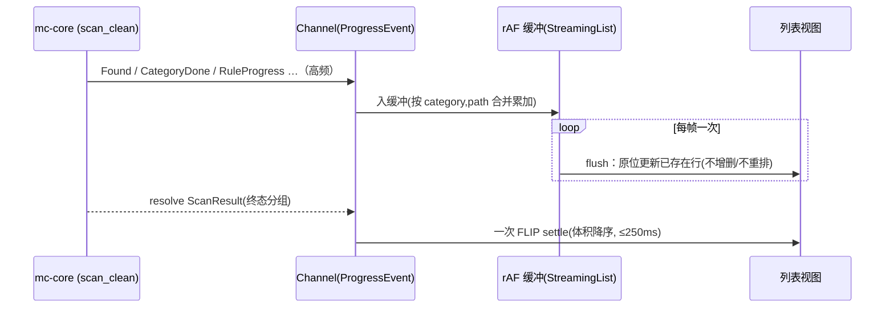

# macCleaner GUI 重设计 v1（普通用户优先·止跳变） - Plan

## Goal Capsule

- **Objective:** 把 Clean 流程的 GUI 从"跳变的 TUI 像素级移植"重设计为"普通用户优先、稳定不跳、信任可读"的连贯呈现层——本版做 move 1–4（稳定基座 / 首屏答案 / 诚实删除即恢复 / 证据+回执）。
- **Product authority:** 用户（产品负责人）＋ `STRATEGY.md`。
- **Open blockers:** 无。计划期技术问题已在 Key Technical Decisions 定夺。

> **Product Contract preservation:** changed — R11/R13（改为诚实删除即恢复，见 KTD4 路 B）；R9/R12 标注 v1 Clean 无内容（`clean_rules.toml` 核实全 Safe，机制随 v2 purge 激活）。其余 Product Contract 文本与 R-ID 不变。

---

## Product Contract

### Summary

把 Clean 流程重设计为：稳定不跳变的外壳，打开即一句"可安全释放 X GB"＋分段横条，一键把可自动补回的项移废纸篓（真移、不延迟），配诚实的"已移废纸篓·在访达中恢复"提示，每项常驻可见证据文案。纯呈现层复用 `mc-core`，暗色优先。

### Problem Frame

当前 GUI 是终端 TUI 的像素级移植（病根在 `DESIGN.md §9` 的"移植清单"定位），三重痛点：① 扫描时布局剧烈上下跳变——相位切换整块增删、流式行从底部挤出、数字抖动；② 全等宽文本网格难看、无层次、无体积可视化；③ 未区分两类用户，对新手太生、对开发者不比 TUI 强。CLI+TUI 已充分服务开发者，GUI 的战略目的是触达它们到不了的普通 Mac 用户，移植式 GUI 两头不讨好，且跳变直接摧毁信任。

### Key Decisions

- **只改呈现层为主，完整继承安全语义。** 复用 `mc-core` Engine facade + ProgressReporter，不改扫描/删除引擎、不改 CLI/TUI。继承 SafetyLevel 三通道、`selected = safety != Risky && preselect`、type-to-confirm、默认 Trash。（唯一可能的后端触点见 U5：若"打开废纸篓"须小命令。）
- **v1 = move 1–4；move 5/6/7、仪表盘、真一键 undo 均为后续。**
- **v1 Clean 全为 Safe 项**（`clean_rules.toml` 核实：仅 系统缓存/浏览器缓存 两类、6 规则全 `safety=Safe`）。故首屏是单一"可安全释放 X"＝按钮量；R9（Moderate 另起一行）/R12（Risky type-to-confirm）机制建入共享组件但 v1 Clean 无内容，随 purge/uninstall（v2，含 Moderate/Risky）激活。
- **删除即恢复走诚实路线（路 B）**，见 KTD4：立即真移废纸篓 + 诚实 toast + "在访达中恢复"（系统原生放回）。**不做延迟执行的假 undo。** 真一键 undo 是独立功能（`mc undo`）。
- **复用后端已有但前端未消费的契约**（KTD5）：`RuleProgress`/`CategoryDone`/resolved `ScanResult`/`CleanReport`。
- **设计系统扩展 `tokens.css`，不推翻**；impeccable 5 原则为全单元硬约束（见 R17–R19）。
- **`DESIGN.md §9`"移植清单"定位作废**，改"共享语义、各自形态"。

### Actors

- **A1. 普通 Mac 用户（v1 首要）** — 磁盘告警时想安全腾空间，需界面自解释、清楚"删这个安不安全"。
- **A2. Mac 开发者（次要）** — 已被 CLI/TUI 充分服务；GUI 里靠展开列表拿逐项审查。

### Key Flows

- **F1. 新手清理（默认路径）。** **Trigger:** 打开 App（FDA 已授权）。首屏"可安全释放 X GB"＋分段横条＋主按钮 → 点主按钮 → 项立即移废纸篓 ＋ 单实例 toast"已移到废纸篓 · 在访达中恢复" → 排版化回执。**全程无需展开任何列表行。**
- **F2. 展开审查（进阶）。** **Trigger:** 首屏点"查看/管理明细"→ 第二层列表（稳定基座 ＋ 每项常驻证据文案 ＋ 复选框），可勾选调整后删除。（单项"展开=换问题+等价CLI"是 move 6，v2。）

### Requirements

**稳定基座与防跳变（move 1）**

- R1. 外壳三区（摘要 / 列表 / 操作）稳定性下沉到 route 内部：相位切换（idle→scanning→results）只替换槽位内容，DOM 区块永不 mount/unmount。
- R2. 扫描开始即把已知分类渲染为占位行（骨架＋计数）；流式 `Found` 只在原位更新已存在行，扫描全程无行新增/移除。
- R3. 命中为 0 的分类在扫描完成时一次性收拢——不逐个消失。
- R4. 扫描进行中行序锁死；体积降序重排仅在扫描完成时用 resolved `ScanResult` 做一次 FLIP settle（≤250ms）。
- R5. 防跳变手段（rAF 批处理 / FLIP settle / 骨架 / tabular-nums）封装为可复用列表原语，v1 接入 Clean。
- R6. 移除终端残留物：braille spinner、`direction:rtl` 截断 hack、`▶` 字符按钮。

**首屏答案（move 2）**

- R7. Clean 默认屏呈现"可安全释放 X GB"＋ macOS 储存空间式静态分段横条（低饱和、图例带精确值）＋ 主按钮；逐条列表降为第二层。
- R8. 首屏主数字来自当前扫描累加（无需新数据源）。
- R10. 主删除按钮的量 = 当前已选项总和，与按钮文案一致；默认态首屏主数字与按钮量相等。（v1 Clean 全 Safe → 默认态两者即全部项。）
- R9. *（v1 Clean 无内容，机制备用于 v2）* 当结果含预选 Moderate 项时，以独立一行"另有 Y GB · 需手动重建"呈现，默认不计入一键主按钮。

**删除与恢复（move 3，诚实路线）**

- R11. Clean 删除（v1 全 Safe）：无确认弹窗，立即真移废纸篓 ＋ 底部单实例 toast"已移到废纸篓 · 在访达中恢复"；"在访达中恢复"打开系统废纸篓（用 Finder 原生"放回原处"）。**不延迟执行、不假装。**
- R12. *（v1 Clean 无内容，机制备用于 v2/Analyze）* 含任一 Risky 项的批次保留 `ConfirmDelete` modal ＋ type-to-confirm（输入 `delete`）；Enter 不代替确认。
- R13. 删除默认移废纸篓；所有文案表述为"已移到废纸篓，可恢复"，不表述为"已删除"。真正的一键 undo（应用内直接放回）不在 v1，见 Scope Boundaries。

**证据与信任（move 4）**

- R14. 每项常驻显示 `impact`/`recovery` 证据文案（`Found` 已带数据）；折叠态为弱化次要文字（muted，非填色 chip）。
- R15. 清理完成呈现排版化回执，数据源为 `CleanReport`（cleaned[]/total_freed/success_count/failure_count）；禁 confetti、禁大绿勾 hero；失败项优雅分列。
- R16. 信任信息就地相关：删除现场只呈现"移废纸篓·可恢复"；开源/零遥测归 About/Onboarding。

**设计系统约束（impeccable，跨单元硬约束）**

- R17. 字体管辖权：等宽只给数据（路径、体积）；标签/标题/证据文案用系统无衬线；字阶 ≤3 级，首屏大数字靠 weight 非 display 尺寸。
- R18. 红色跟随语义、永不装饰：`--state-danger` 只与 Risky/不可逆动作共现；安全色只落小指示物，不染分区背景；Safe 分段不出现红系。
- R19. 动效只传达状态：150–250ms ease-out，仅限填充/展开/一次 FLIP settle/toast 进出；无入场编排、无 settle 后 count-up、全 app 无 spinner；`prefers-reduced-motion` 瞬切。

### Acceptance Examples

- AE1. **Covers R2, R3.** 扫描中某分类首次命中 → 占位行原位更新，不新增行；完成时命中为 0 的分类一次性收拢。
- AE2. **Covers R4.** 扫描中不重排任何行；完成瞬间按体积降序一次平滑 settle（≤250ms），此后不自发重排。
- AE3. **Covers R8, R10.** 默认态（v1 Clean 全 Safe）：首屏"可安全释放 8.1 GB" ＝ 主按钮"移入废纸篓 · 释放 8.1 GB"；扫描累加时数字增长、完成定格且无 count-up。
- AE4. **Covers R11, R12.** Clean 批次（全 Safe）点删除 → 无弹窗、立即移废纸篓 ＋ "已移到废纸篓·在访达中恢复" toast。含 Risky 的批次（Analyze 路径）→ 弹 `ConfirmDelete` 要求输入 `delete`，Enter 不放行。
- AE5. **Covers R14.** 列表每项默认可见一行证据文案（"缓存 · 会自动重建"），无需 hover/展开。

### Success Criteria

- 扫描全程逐帧无行新增/移除、无行位置变化；相位切换无区块 mount/unmount、无整体重排（录屏可验证）。
- 默认态首屏"可安全释放"数字 == 主按钮删除量。
- 一个非技术用户冷启动 → 完成一次 Safe 清理，全程无需展开任何列表行。
- 每项证据文案默认可见（无需 hover/展开）。
- 全 app 无 braille spinner、无 `rtl` 截断 hack、无 `▶` 字符按钮、无 spinner。
- Clean（全 Safe）删除无确认弹窗；删除后 toast 诚实、"在访达中恢复"可打开废纸篓看到文件。
- 无延迟执行、无"已删除但其实没删"之类欺骗性文案或行为。

### Scope Boundaries

**Deferred for later（要做，不在 v1）**

- **真一键 undo（`mc undo`）** —— 应用内直接把文件从废纸篓放回原位。是非平凡独立问题：`trash` crate 在 macOS 不支持 restore（`platform.rs:108` 用 `trash::delete_all`）、`history.rs:11` 已记"Trash 非事务日志、undo 是独立命题"；须建模跨卷/重名/清空/部分失败，可能走"删除时记录原路径→后端移回"或 AppleScript Finder 放回。单独立项认真做，不塞 v1。
- move 5 安全空间地理分区；move 6 渐进披露·展开=换问题+等价CLI；move 7 补 purge/uninstall GUI 入口（`lib.rs:62-71` 缺口）＋顶部可见导航＋Cmd+K。
- 磁盘空间总览增强 ＋ 菜单栏 HUD（品类基本盘，须单独一轮定形态且轻量实现——非因"竞品有/要不一样"，见 `docs/solutions/product-decisions/differentiation-on-execution-not-opposition.md`）。
- Analyze 路由交互重构（v1 仅做残留物清理与共享组件复用，树导航不改）。
- 亮色/高对比主题变体。

**Outside this product's identity（定位性排除）**

- CleanMyMac 式恐吓营销（威胁计数、伪造问题、红色轰炸）。
- 暗黑模式预选；GUI 一键永不纳入 Risky。
- 常驻高频后台扫描（撞 `STRATEGY.md` "不成为系统负担"）。
- 永久删除路径（GUI 无，只移废纸篓）。
- **任何欺骗性实现**（假 undo、延迟执行却谎称已删、伪造进度/数字）。

### Dependencies / Assumptions

- 复用 `mc-core` Engine facade + ProgressReporter；后端流式契约已足（`RuleProgress`/`CategoryDone`/resolved `ScanResult`/`CleanReport` 现成）。
- v1 以纯前端为主（`crates/gui/frontend`）；唯一可能的后端触点是 U5 的"打开废纸篓"——优先用 `tauri-plugin-opener` 打开 `~/.Trash`，不行才加最小命令 `open_trash`（届时在分支/worktree，触发 clippy）。
- `clean_rules.toml` 核实为全 Safe（系统缓存/浏览器缓存），v1 Clean 无 Moderate/Risky 项。
- `Onboarding.svelte` 的 FDA 授权流程保留不动。

---

## Planning Contract

### Key Technical Decisions

- **KTD1 — 稳定外壳。** route 内用 CSS grid 三固定 slot（摘要/列表/操作），phase 只切各 slot 内容与禁用态，**不用 `{#if}` 增删区块**；相位过渡用 `document.startViewTransition` 包裹，`prefers-reduced-motion` 瞬切。基线：`App.svelte` 现有 `.shell` 三区。
- **KTD2 — 防跳变原语。** 新 `StreamingList.svelte` 封装：流式 `Found` 入 rAF 缓冲、每帧 flush 一次并按 `(category,path)` 合并累加（搬现 `Clean.svelte:60-91` 的 `indexByKey` 逻辑）；扫描期行序=发现序锁死；完成时以 `scanClean` resolve 的 `ScanResult` 为权威做一次 `svelte/animate` flip settle（≤250ms）；体积/计数 `tabular-nums` + 固定列宽。
- **KTD3 — 首屏口径。** v1 Clean 全 Safe，首屏=单一"可安全释放 X"=按钮量；R9/R12 机制建入共享组件但 v1 无内容，随 v2 purge/uninstall 激活。
- **KTD4 — 删除即恢复（路 B，诚实）。** 立即真移废纸篓（复用现 `clean` 命令，全 Safe 时空 token、不弹 modal）＋ 单实例 toast ＋ "在访达中恢复"打开系统废纸篓（Finder 原生放回）。**不延迟、不假装。** 真一键 undo 因 macOS 恢复是非平凡独立问题（KTD 证据见 Scope Boundaries）而单独立项，绝不用假 undo 顶替。
- **KTD5 — 复用后端已有契约。** `RuleProgress{current,total}` 驱动确定性进度（替代 spinner）；`CategoryDone` 给分类终值；resolved `ScanResult` 是权威 settle 源；`CleanReport` 是回执源。均已在 `ipc.ts` 定义、前端当前未消费。
- **KTD6 — 设计系统扩展非推翻。** `tokens.css` 新增 motion（`--dur-*`/`--ease-out-quart`）与 elevation；impeccable 5 原则（R17–R19）为全单元约束。`ConfirmDelete` 现用 `--state-danger` 边框保留（它只在含 Risky 时出现＝语义正确），但 Clean 的 Safe 删除不再弹它。

### High-Level Technical Design

稳定外壳 + 流式数据路径（扫描期只填不增删，完成时一次 settle）：

```
route(Clean) = Shell 三固定 slot（内容替换，区块永不 mount/unmount）
┌ 摘要 slot ─ SummaryHeader：可安全释放 X · 分段横条 · 主按钮 ┐
├ 列表 slot ─ StreamingList（overflow, 视口恒高）              │
│    分类头(预印) → 行(发现序, 原位填数字/条, tabular-nums)     │
├ 操作 slot ─ 主按钮/重扫（禁用↔激活切换，位置恒定）           │
└──────────────────────────────────────────────────────────┘
```



---

## Implementation Units

### U1. 稳定三区外壳原语（Shell + Slot）

- **Goal:** route 内三固定区（摘要/列表/操作）恒在，phase 只切内容，区块永不 mount/unmount。
- **Requirements:** R1
- **Dependencies:** 无
- **Files:** `crates/gui/frontend/src/lib/Shell.svelte`（新）、`crates/gui/frontend/src/routes/Clean.svelte`（改）
- **Approach:** CSS grid 三行固定高度/弹性；各 slot 用具名 snippet/slot 传入内容；phase 只驱动 slot 内容与禁用态，不用 `{#if}` 包裹整块。相位过渡 `document.startViewTransition`，reduced-motion 瞬切。
- **Patterns to follow:** `App.svelte` 的 `.shell`（header/main/footer 固定三区）。
- **Test scenarios:** DOM 断言相位切换（scanning→results）前后三区根节点为同一元素（未卸载重建）。Covers SC「相位切换无 mount/unmount」。
- **Verification:** idle→scanning→results，摘要/列表/操作区节点持续存在，页面高度与分区数不变。

### U2. StreamingList 原语（防跳变四件套）

- **Goal:** keyed 行 + 预印分类头 + rAF 批处理 + 骨架 + tabular-nums + 完成时一次 FLIP settle。
- **Requirements:** R2, R4, R5
- **Dependencies:** U1
- **Files:** `crates/gui/frontend/src/lib/StreamingList.svelte`（新）、`crates/gui/frontend/src/routes/Clean.svelte`（接入）、`crates/gui/frontend/src/lib/format.ts`（聚合/格式化辅助）
- **Approach:** 见 KTD2。分类头集合来自 `clean_rules` 已知类（系统缓存/浏览器缓存）；流式期只填不增删、行序=发现序；完成用 resolved `ScanResult` 一次 flip settle。可选用 `RuleProgress` 显示确定性进度。
- **Patterns to follow:** 现 `Clean.svelte:34/60-91` 的 `indexByKey` 合并语义（搬进原语）；`docs/solutions/design-patterns/streaming-aggregation-key-is-action-granularity.md`。
- **Test scenarios:** N 个 `Found` 经 rAF 合并为每帧一次渲染（happy）；同 `(category,path)` 多次 delta 累加不产生重复行（edge）；扫描期行序不变；settle 只发生一次（edge）。Covers AE1, AE2.
- **Verification:** 扫描录屏逐帧无行增删/无位置变化；完成时一次平滑重排。
- **Execution note:** 先写合并/批处理的纯逻辑单测，再接 UI。

### U3. 清除终端残留物 + tokens 扩展

- **Goal:** 去 braille spinner / `direction:rtl` 截断 hack / `▶` 字符按钮；扩展 `tokens.css`（motion、elevation）；数字列 tabular-nums。
- **Requirements:** R6, R17（部分）, R19
- **Dependencies:** U1, U2
- **Files:** `crates/gui/frontend/src/lib/tokens.css`、`crates/gui/frontend/src/routes/Clean.svelte`、`crates/gui/frontend/src/routes/Analyze.svelte`、`crates/gui/frontend/src/lib/ConfirmDelete.svelte`
- **Approach:** rtl hack → 中间省略/左对齐截断组件；spinner → 无 spinner（不定进度用累加数字/填充条，确定进度用 `RuleProgress`）；`▶` → 图标或规范按钮样式；tokens 新增 `--dur-fast`/`--ease-out-quart`/`--elevation-*`。
- **Patterns to follow:** 现 `tokens.css` 结构与命名。
- **Test scenarios:** Test expectation: none —— 纯样式与标记清理，无行为逻辑；靠 grep + 手动核对。
- **Verification:** 全仓 grep 无 `⠋` / `direction: rtl` / `▶` 字符按钮；reduced-motion 下过渡瞬切。

### U4. 首屏摘要（一句话答案 + 分段横条 + 主按钮）

- **Goal:** Clean 默认屏"可安全释放 X GB" + 分段横条 + 主按钮；列表降为第二层。
- **Requirements:** R7, R8, R10
- **Dependencies:** U1, U2
- **Files:** `crates/gui/frontend/src/lib/SummaryHeader.svelte`（新）、`crates/gui/frontend/src/routes/Clean.svelte`、`crates/gui/frontend/src/lib/format.ts`
- **Approach:** 数字=已选总和（v1 Clean 全 Safe=全部）=按钮量，来自扫描累加/终态；weight 强调非 display 尺寸、tabular-nums、settle 后无 count-up；分段横条按 2 分类占比着色、低饱和、图例带精确值、Safe 段不用红；列表在"查看/管理明细"展开。
- **Patterns to follow:** `DESIGN.md` 分段条（macOS 储存空间参考）。
- **Test scenarios:** 数字==按钮量（happy, AE3）；扫描累加增长、完成定格无 count-up（edge）；分段占比计算正确（format 纯单测）。Covers AE3.
- **Verification:** 默认态数字==按钮删除量；不展开列表即可完成清理（手动）。

### U5. 删除即真移废纸篓 + 诚实撤销

- **Goal:** Clean 删除（全 Safe）→ 无弹窗、立即真移废纸篓 + 单实例 toast"已移到废纸篓·在访达中恢复"；"在访达中恢复"打开系统废纸篓。含 Risky 批次仍走 `ConfirmDelete`（v1 Clean 不触发；保留给 Analyze/未来）。
- **Requirements:** R11, R12, R13
- **Dependencies:** U1
- **Files:** `crates/gui/frontend/src/lib/UndoToast.svelte`（新）、`crates/gui/frontend/src/routes/Clean.svelte`、`crates/gui/frontend/src/lib/ipc.ts`（"打开废纸篓"）、`crates/gui/frontend/src/lib/ConfirmDelete.svelte`（保留）
- **Approach:** Clean 全 Safe → 直接 `clean(paths, "", onEvent)`（空 token、无 modal）；成功后乐观移除 + 底部单实例 toast；"在访达中恢复"优先用 `tauri-plugin-opener` 打开 `~/.Trash`，不行才加最小后端命令 `open_trash`（`crates/gui/src/commands/`，在分支/worktree）。**不延迟、不假装。**
- **Patterns to follow:** 现 `clean()`（`ipc.ts:100`）与 `CleanReport`；`tauri-plugin-opener` 已是依赖。
- **Test scenarios:** 全 Safe 批次点删除 → 无 modal、直接 `clean`（happy, AE4）；含 Risky → 仍弹 `ConfirmDelete` type-to-confirm（Analyze 回归, AE4）；toast 单实例不堆叠（edge）；"在访达中恢复"触发打开废纸篓（happy）。Covers AE4.
- **Verification:** Clean 删除无弹窗、真移废纸篓、toast 诚实、可打开废纸篓看到文件；无任何"已删除但未删"路径。
- **Execution note:** 优先纯前端 opener；若必须加 `open_trash` 命令则在分支/worktree（`.rs` 编辑触发 clippy）。

### U6. EvidenceCard + 证据文案常驻渲染

- **Goal:** 每项常驻显示 `impact`/`recovery`（muted 文字，非填色 chip）；抽 `EvidenceCard` 复用于 Clean 行与 `ConfirmDelete`。
- **Requirements:** R14, R17, R18
- **Dependencies:** U2
- **Files:** `crates/gui/frontend/src/lib/EvidenceCard.svelte`（新）、`crates/gui/frontend/src/routes/Clean.svelte`、`crates/gui/frontend/src/lib/ConfirmDelete.svelte`
- **Approach:** `Found` 已带 `impact`/`recovery`（`ipc.ts:15-23`）；折叠行显示一行弱化证据（如"缓存 · 会自动重建"）；mono 只给路径/体积，证据文案用无衬线 muted；不加填色 chip；分区/安全色不与证据文案冗余。
- **Patterns to follow:** `Safety.svelte` 三通道；规则 `impact`/`recovery` 数据。
- **Test scenarios:** 每项渲染其 impact/recovery（happy, AE5）；空文案降级不崩（edge）。Covers AE5.
- **Verification:** 列表每项默认可见证据文案，无需 hover。

### U7. 清理回执 Done 态

- **Goal:** 完成态用 `CleanReport` 排版化回执（成功项/释放量/成功失败计数/去向废纸篓/如何恢复），替代裸 done；无 confetti/大绿勾；失败项优雅分列。
- **Requirements:** R15, R16
- **Dependencies:** U5
- **Files:** `crates/gui/frontend/src/lib/CleanReceipt.svelte`（新）、`crates/gui/frontend/src/routes/Clean.svelte`
- **Approach:** `clean()` resolve 的 `CleanReport`（`ipc.ts:69-74`）驱动；"已释放"只列成功项，失败项单列（继承逐项优雅降级语义）；文案"已移废纸篓可恢复"；开源/零遥测不放这里（归 About）。
- **Patterns to follow:** 现 `Clean.svelte:250-256` done 屏。
- **Test scenarios:** 回执数字来自 `CleanReport` 且=成功项释放量（happy）；含失败项时成功/失败分列（error path）。
- **Verification:** 完成态显示排版化回执，无 confetti。

---

## Verification Contract

- **前端构建：** `crates/gui/frontend` 构建通过（`npm run build` 或项目脚本）。
- **单测（vitest）：** 现有 `confirm.test.ts`/`format.test.ts`/`safety.test.ts` 通过；新增覆盖 StreamingList 合并/批处理、format 分段与回执聚合、undo toast 单实例逻辑。
- **后端（仅当 U5 加 `open_trash`）：** `cargo build -p mc-gui` + `cargo clippy` 通过（分支/worktree）。
- **手动烟测（关键——防跳变本质是视觉）：** 录屏一次完整 Clean 扫描，逐帧核对无行增删/无位置跳变、相位切换无整体重排；默认态数字==按钮量；删除→诚实 toast→"在访达中恢复"能在废纸篓看到文件；每项证据文案默认可见；reduced-motion 下过渡瞬切、无 spinner。
- **Analyze 回归：** 清理 rtl/braille 后，Analyze 树导航与删除（含 Risky type-to-confirm）仍正常。

## Definition of Done

- R1–R8、R10、R11、R13–R19 在 Clean 流程满足；R9/R12 机制就位（v1 Clean 无内容，已注明）。
- 全部 Success Criteria 达成（含录屏验证无跳变、数字==按钮量、证据默认可见、残留物清除、Safe 删除无弹窗、删除文案与行为诚实）。
- 前端构建 + vitest 通过；如涉后端则 `cargo build` + `clippy` 通过。
- 无假 undo、无延迟执行伪装、无欺骗性文案；"在访达中恢复"确实打开系统废纸篓。
- 实现在分支/worktree（非 main）完成。

---

## Sources & Research

- 需求与方向：`docs/plans/2026-07-08-015-feat-gui-redesign-v1-plan.md`（本文，enrich 自同名 requirements-only 版本）、`docs/ideation/2026-07-07-gui-redesign-ideation.md`、`docs/ideation/2026-07-07-gui-redesign-research.md`。
- 决策原则：`docs/solutions/product-decisions/differentiation-on-execution-not-opposition.md`。
- 关键源码核实：`crates/gui/frontend/src/lib/ipc.ts`（`ProgressEvent`/`RuleProgress`/`CategoryDone`/`ScanResult`/`CleanReport` 契约）；`crates/gui/frontend/src/routes/Clean.svelte:34/60-91/195-197/250-256`（合并逻辑、证据未渲染、done 屏）；`crates/gui/frontend/src/lib/ConfirmDelete.svelte:20-21/148`（非 Risky 走模态、rtl hack）；`crates/core/src/clean_rules.toml`（2 类目、全 Safe）；`crates/core/src/platform.rs:108` 与 `crates/core/src/history.rs:11`（trash crate、Trash 非事务日志=真 undo 是独立难题）；`crates/gui/src/lib.rs:62-71`（purge/uninstall 缺口，v2）。
- 防跳变技法：`docs/ideation/2026-07-07-gui-redesign-research.md §3.2`（rAF/FLIP/骨架/tabular-nums/View Transition/contain）。
