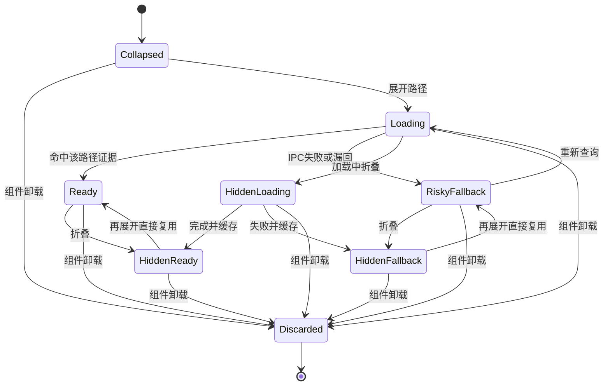
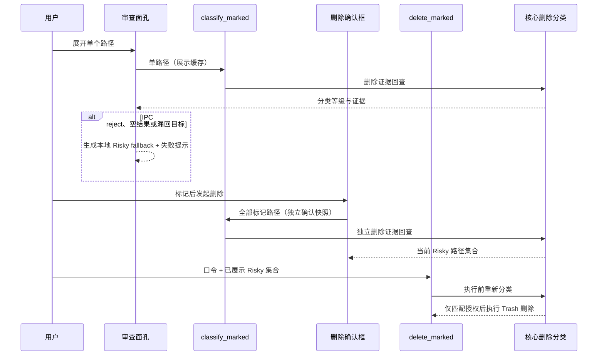

# macCleaner GUI Analyze 审查面孔 - Plan

## Goal Capsule

- **Objective:** 完成 move 6 的 Analyze 第二段：当前层折叠行继续回答“谁在占空间”，独立展开的审查面孔回答路径完整身份与保守删除姿态；命中内置规则时再展示路径特定后果，并提供 Finder、复制与真实可执行的 CLI 出口。
- **Product authority:** `STRATEGY.md` 的普通用户优先与多界面适配；`docs/ideation/2026-07-07-gui-redesign-ideation.md` 的 move 6；`docs/plans/2026-07-10-018-feat-gui-move6-progressive-disclosure-plan.md` 明确列出的下一段工作；`CONCEPTS.md` 的 Analyze 与 fail-closed 定义。
- **Execution profile:** Standard 级前端行为变更；以 Svelte 路由和前端测试为主，复用现有 Tauri IPC 与核心安全分类。
- **Stop conditions:** 不把审查缓存接入删除授权，不新增任意路径删除的“等价 CLI”，不改变 Marked、Risky type-to-confirm 或 Trash 删除语义。
- **Tail ownership:** 实现后由 LFG 继续完成精简、审查、浏览器测试、提交、PR 与 CI。

---

## Product Contract

### Summary

Analyze 在现有当前层占用列表上增加恰好一层、可多开的审查面孔。展开后始终展示完整路径、删除安全等级、保守删除姿态、复制路径和 Finder 定位；命中内置规则时展示路径特定的影响与恢复证据。存在展开面孔时，当前目录提供一次可复制的 `mc analyze <path>` 出口，让开发者在终端继续只读分析。

### Problem Frame

计划 017 已让 Analyze 首屏能稳定回答“哪里占空间”，但当前行仍只提供名称、体积与导航。开发者若要核对一个候选路径，只能依赖截断名称或直接进入目录，无法在同一上下文看到完整路径、规则证据并跳到 Finder。

Clean 的 move 6 已证明“折叠做决策、展开做审查”的两层形态可用。Analyze 不能照搬 Clean 的分类列表：它浏览任意文件系统节点，未知路径必须 fail-closed，且 `mc analyze <path>` 只是从某目录继续分析，不等价于删除任意标记项。

### Actors

- A1. 普通 Mac 用户：默认只看当前层名称、占比和体积，逐层找到空间大户。
- A2. Mac 开发者：展开单个路径核对完整身份、删除后果与恢复方式，再选择 Finder、CLI、标记或继续导航。

### Key Flows

- F1. 当前层决策：分析完成后，用户不展开即可按体积列表与分段条判断空间分布；现有 checkbox 和目录导航保持可用。
- F2. 路径审查：用户点独立审查入口，面板立即展开并惰性回查该路径的删除证据；多个节点可同时展开。
- F3. 外部核对：用户复制完整路径、在 Finder 中定位，或复制当前目录的 CLI 命令继续只读分析。
- F4. 安全删除：用户标记路径并发起删除；确认框重新回查整个标记集，后端执行前再次分类，审查快照不参与授权。

### Requirements

**折叠层与交互边界**

- R1. 当前层折叠行保留名称、相对占比、体积、checkbox 与目录导航语义，新增审查入口不得吞掉或联动现有手势。
- R2. 每个节点都有独立 disclosure；文件和空目录虽不可进入，仍可审查；同一当前层允许多项同时展开，不增加第三层模式或全局 Advanced 开关。
- R3. 展开、折叠、复制、Finder 操作均不得改变 Marked；导航保持跨层 Marked，重新分析继续按现有行为清空 Marked。

**审查证据与 fail-closed**

- R4. 首次展开某路径时按路径惰性调用现有 `classify_marked`；面板先显示完整路径及可用动作，安全证据显示加载态，当前层内折叠再展开复用结果。
- R5. 已知路径展示 `Safety` 三通道等级和 `EvidenceCard full` 的 impact/recovery 全文；文案明确这是删除安全等级和删除后果，不把路径本身宣称为“安全”。
- R6. 分类调用失败、返回空集或漏回目标路径时，审查面孔以非空的通用 Risky 证据降级并提示查询失败，不得默认为 Safe 或隐藏证据；面板提供原地“重新查询”，重试期间保留路径与外部动作并阻止重复提交。
- R7. 展开状态、证据状态及所有动作以完整绝对路径为身份键，不依赖列表下标、basename 或显示顺序。
- R8. 路由以完整路径维护当前层 disclosure 集合，节点审查组件独占证据缓存与请求令牌；折叠只隐藏面板，不取消同组件请求，导航、重扫或节点被剪除清空 disclosure 并卸载组件，重试乱序结果由组件请求令牌丢弃。

**Finder 与 CLI 出口**

- R9. 审查面孔复用 `CopyButton` 与 `reveal_in_finder`；Finder 调用携目标完整路径，失败以可见 alert 降级且不关闭审查面孔。
- R10. ready 状态下仅当当前层至少一个审查面孔展开时显示一次“在命令行继续分析此目录”的出口，全部折叠后隐藏；命令由 `currentNode.path` 派生并随导航更新，不得使用“等价删除”措辞。
- R11. CLI 命令对空格、单引号、Unicode 和 shell 元字符路径保持单一参数语义，复制后可在项目支持的 macOS shell 中直接执行。

**安全不变量与范围约束**

- R12. 审查证据只是展示快照；`openConfirm` 必须独立重新分类全部标记路径，并继续对 IPC 失败或漏回逐项 fail-closed，禁止把审查证据转换或复用为确认项。
- R13. `delete_marked` 继续在后端执行前重新分类并校验 `confirmed_risky_paths`；Risky type-to-confirm、默认 Trash、成功路径剪树与 toast 行为不变。
- R14. 本次不新增 Rust/Tauri 命令、capability 或 IPC 类型，不改核心扫描、规则、树与删除契约。
- R16. 在 Tauri 最小窗口 720×520 下，checkbox、进入目录和审查控件保持可见可点击；名称与占比条优先收缩，体积不被遮挡，展开面板动作可换行且页面无横向滚动。
- R17. 审查证据的 Loading、Ready 与 RiskyFallback 状态对辅助技术可感知；证据失败与 Finder 失败使用包含目标路径的 alert 语义，键盘可分别操作 checkbox、进入、审查和重试。
- R18. 未匹配内置规则的路径仍显示 Risky，但必须明确标注“未匹配内置清理规则”的证据边界；证据区标注为只读审查快照，并说明删除前会重新核对。

### Acceptance Examples

- AE1. **Given** 当前层含两个节点，**when** 分别点两次审查，**then** 两个面板同时保持打开，各自只首次请求一次证据，checkbox 与导航状态不变。
- AE2. **Given** 分类 IPC 抛错、返回空集或遗漏目标路径，**when** 展开该节点，**then** 面板显示 Risky 三通道、非空通用影响/恢复文案、查询失败提示与重试入口；重试成功后以真实证据替换 fallback。
- AE3. **Given** 节点已在审查态显示为 Safe，**when** 用户勾选并发起删除且确认前分类结果升级为 Risky，**then** 确认框采用新结果并强制 type-to-confirm。
- AE4. **Given** 当前目录路径含空格、单引号或 shell 元字符，**when** 用户复制 CLI 命令，**then** shell 将路径解析为未展开、未拆分的单一原始参数。
- AE5. **Given** 审查证据请求仍在途，**when** 用户进入目录、面包屑回退或重新分析，**then** 旧结果完成后不会出现在新的当前层。
- AE6. **Given** Finder 定位失败，**when** 用户点击“在 Finder 中显示”，**then** 页面显示错误 alert，审查内容、Marked 与导航均保留。
- AE8. **Given** 路径未命中任何内置规则但分类调用成功，**when** 展开该节点，**then** 面板显示 Risky 与“未匹配内置清理规则”的通用证据，不把它误写成规则已确认的特定危险。

### Success Criteria

- Analyze 默认列表不展开即可完成现有占用判断和导航，审查入口与 checkbox/进入目录手势互不触发。
- 展开面孔完整呈现路径、删除安全等级、impact/recovery、复制和 Finder 动作，多项可同时打开。
- 所有证据错误均 fail-closed；审查分类、确认前分类和后端执行前分类三条边界保持独立。
- 当前目录 CLI 出口只在审查层出现一次、随 breadcrumb 更新，并对特殊字符路径生成可直接粘贴执行的命令。
- 导航、回退、重扫和异步返回不会串层；Marked 仍按原有跨层/重扫规则工作。
- 未知路径明确呈现“未匹配内置规则”的保守证据，不承诺不存在的路径特定知识；审查面孔标注证据是只读快照、删除前会重新核对。
- 720×520 最小窗口无横向滚动或被遮挡操作，异步证据与错误状态可被键盘和辅助技术感知。
- 前端 check、build、Vitest、Playwright E2E 全绿；workspace test 与 pedantic clippy 无回归。

### Scope Boundaries

#### In Scope

- Analyze 当前层节点的两层 disclosure、惰性证据状态、异步代际隔离和审查 UI。
- 当前目录 CLI 命令构造与 shell-safe 路径引用。
- 前端纯函数测试与 Analyze E2E，保留既有安全删除覆盖。

#### Deferred to Follow-Up Work

- move 7：Purge/Uninstall GUI 入口、可见导航与 Cmd+K。
- Analyze 后端增量树事件化、扫描期逐项树流式与矩形 treemap。
- CLI 对任意 Analyze 标记路径的删除命令；当前不存在，不在 UI 中假造。
- 基于文件句柄或文件标识消除“最终分类后、Trash 操作前”的文件系统 TOCTOU；本计划只保证不扩大现有窗口。
- `openConfirm` 分类在途时 Marked/树变化可能恢复陈旧 modal 的既有竞态；作为独立安全修复记录，不混入只读审查交付。

#### Out of Scope

- 修改 `mc-core` 安全等级、规则匹配或删除授权模型。
- 新增 Simple/Advanced 模式、第三层详情、永久删除或 GUI 任意路径批量 CLI 生成。
- 重构 Clean 的 `StreamingList`；只复用其审查组合与交互模式。

---

## Planning Contract

### Key Technical Decisions

- KTD1. **拆出 Analyze 节点审查边界。** Clean 的 `StreamingList` 以分类聚合为行，Analyze 以树节点为行；新增节点审查组件承载路径证据生命周期与 Finder 动作，路由仅保留跨行 disclosure 集合以驱动多开和单实例 CLI 提示，并继续编排分析、导航、Marked、确认和删除，不把 `DirNode` 适配成 `LiveItem`。
- KTD2. **checkbox、进入目录、审查是三个独立控件。** 这避免整行点击的事件嵌套和误操作，并保持计划 017 已出货的导航/标记肌肉记忆。
- KTD3. **审查证据按路径惰性加载并由 keyed 组件独占。** 不一次分类宽目录的全部子节点；路由的 disclosure 集合只表达哪些行展开，不持有证据。折叠允许在途结果进入组件缓存，导航、重扫或节点移除销毁组件，显式重试用请求令牌拒绝乱序旧结果。
- KTD4. **安全分类保持三个所有者和生命周期。** 审查缓存以节点组件与路径为边界、只读且可过期；确认快照由现有 `openConfirm` 独立获取并仅服务 modal；执行授权由后端当前树重建和当前分类独占，禁止从审查证据生成确认项。
- KTD5. **CLI 出口绑定当前目录而非展开节点。** `mc analyze <currentNode.path>` 对目录有真实语义，且只读；文件节点不生成误导命令，任意标记删除也没有虚构等价命令。
- KTD6. **命令构造是可单测纯函数。** 路径始终按 shell 单一参数处理，测试特殊字符的可观察解析结果；计划不锁死具体 helper 名或字符串拼接写法。

### High-Level Technical Design

#### 审查面孔状态

#### 安全证据与删除授权边界

### Safety Boundary Matrix

| State domain | Owner and input | Lifetime | Failure semantics | Can authorize deletion? |
|---|---|---|---|---|
| Review evidence | keyed 节点审查组件；单个绝对路径 + 请求令牌 | 组件生命周期；折叠可保留，卸载即不可见 | IPC 失败或漏回即 Risky fallback，可显式重试 | 否，只读 |
| Confirmation snapshot | Analyze 路由；精确 Marked 集合 | 单次 modal；沿用现有确认流程 | IPC 失败或漏回逐项 Risky | 仅授权用户看到的当前快照 |
| Execution authorization | Rust 后端；当前保存树重建项 + 当前规则分类 | 单次 `delete_marked` 调用 | 新增 Risky 未在确认集合即拒绝 | 是，唯一最终闸门 |

### Assumptions

- “下一个任务”按计划 018 的明确顺序解释为 Analyze 审查面孔，而非 move 7。
- 当前目录 CLI 提示仅在至少一个审查面孔展开时显示一次；这是开发者审查层内容，全部折叠后不进入普通用户默认面孔。
- `classify_marked` 虽以 marked 命名，但后端接受任意路径并直接调用核心删除证据入口，可安全复用于只读审查。
- 导航清空 disclosure 集合并通过 keyed 行卸载清除 evidence，但保留 Marked；重新分析同时重建审查组件并清空 Marked，沿用当前产品行为。
- 节点审查拆成独立组件；组件不持有 Marked、disclosure 集合或删除状态，路由不持有审查证据缓存。

### Risks and Mitigations

- **异步陈旧写回：** 用户可在分类返回前导航或重扫；keyed 组件卸载隔离旧实例，显式重试用请求令牌丢弃乱序结果，并用可控 deferred mock 覆盖同路径新实例场景。
- **安全缓存误复用：** 审查 Safe 可能在确认前变成 Risky；保持 `openConfirm` 独立调用并以调用次数/顺序 E2E 证明边界。
- **控件密度与误触：** 新 disclosure 与 checkbox/导航并列可能拥挤；用明确可访问名称、小型次级控件和浏览器实测校验，不把整行变成嵌套按钮。
- **命令转义错误：** 路径可能含 shell 元字符；纯函数测试覆盖单一参数语义，UI 只展示/复制函数产物。
- **错误提示争抢：** 证据失败与 Finder 失败可能并存；证据失败留在对应面板，Finder 失败走页面 alert，避免一个全局字符串覆盖另一类状态。
- **残余文件系统 TOCTOU：** 后端分类与 Trash 操作之间不是原子句柄操作，同机进程仍可能替换路径；本次前端改动不扩大窗口且不宣称原子保证，真正修复独立立项。

### Sources and Research

- `docs/plans/2026-07-10-018-feat-gui-move6-progressive-disclosure-plan.md`：把 Analyze 审查面孔列为 move 6 第二段，并限定 CLI 只能表述为继续分析。
- `docs/solutions/security-issues/analyze-unknown-path-deletion-fail-closed.md`：审查、确认和执行必须分别 fail-closed，未知路径不得本地降级为 Safe。
- `docs/solutions/design-patterns/render-layer-sort-permutation-indices.md`：显示顺序与动作身份分离；审查状态必须按路径而非下标绑定。
- `docs/solutions/design-patterns/streaming-aggregation-key-is-action-granularity.md`：完整路径是复制、Finder、标记与删除的统一动作粒度。
- `crates/gui/frontend/src/lib/StreamingList.svelte`：Clean move 6 的多开 disclosure、完整证据、复制与 Finder 组合。
- `crates/gui/frontend/src/routes/Analyze.svelte` 与 `crates/gui/src/commands/analyze.rs`：当前导航/Marked 状态及三重安全边界。

---

## Implementation Units

### U1. 构造 shell-safe 的当前目录 CLI 出口

- **Goal:** 生成真实可执行、语义诚实的当前目录 Analyze 命令文本。
- **Requirements:** R10、R11；F3；AE4。
- **Dependencies:** 无。
- **Files:** `crates/gui/frontend/src/lib/format.ts`、`crates/gui/frontend/src/lib/format.test.ts`。
- **Approach:** 在格式层增加纯命令构造能力，保证绝对路径作为单一 shell 参数；UI 的当前路径绑定与披露时机由 U2 集成。
- **Patterns to follow:** `StreamingList.svelte` 的一次性 CLI hint 与 `CopyButton.svelte` 的复制反馈；`format.test.ts` 的表驱动边界测试。
- **Test scenarios:**
  - Covers AE4. 普通绝对路径、空格、单引号、换行、反斜杠、Unicode 及含分号、`$()`/反引号的路径经 zsh 实际解析后均回到原始单一参数，元字符不执行、不拆分。
- **Verification:** 特殊字符路径测试证明命令文本在 zsh 中解析成原始单一参数。

### U4. 建立审查态可控异步返回回归基建

- **Goal:** 让测试可以在导航、折叠、重试或重扫后精确释放旧 IPC 结果，先证明已卸载实例与乱序重试结果不会污染可见审查态。
- **Requirements:** R8、R12；AE5。
- **Dependencies:** 无。
- **Files:** `crates/gui/frontend/e2e/support/tauri-mock.ts`、`crates/gui/frontend/e2e/analyze.spec.ts`。
- **Approach:** 扩展 Tauri mock 的确定性 deferred/sequence 能力，使测试能控制同一命令多次调用的结果与释放顺序；先写同路径新组件实例、加载中折叠和重试乱序场景，再接 UI 状态。
- **Patterns to follow:** 现有 mock 的纯数据 handler、调用记录与 pending 取消能力；新增能力保持未注册命令明确失败，不进入生产代码。
- **Test scenarios:**
  - 同一路径在旧组件与新组件各发起一次分类，先释放新结果再释放旧结果，页面只呈现新实例证据。
  - 加载中折叠后释放结果，折叠再开复用同代缓存且不产生第二次 IPC。
  - fallback 发起两次重试并乱序返回时，只接受最后一次请求结果。
- **Verification:** E2E 能稳定复现并区分旧/新请求次序，不靠计时或真实磁盘速度制造竞态。

### U2. 增加路径级审查 disclosure 与安全证据状态

- **Goal:** 在不破坏导航、标记和删除信任链的前提下，为每个 Analyze 节点提供可多开的审查面孔。
- **Requirements:** R1–R14、R16–R18；F1–F4；AE1–AE6、AE8。
- **Dependencies:** U1、U4。
- **Files:** `crates/gui/frontend/src/lib/AnalyzeReviewRow.svelte`、`crates/gui/frontend/src/routes/Analyze.svelte`、`crates/gui/frontend/e2e/analyze.spec.ts`。
- **Approach:** 路由以路径集合控制多行 disclosure 和单实例 CLI 提示；keyed 节点审查组件独占证据，首次展开单路径分类，立即呈现完整路径、复制与 Finder，证据异步进入 ready 或 Risky fallback。导航/重扫清空 disclosure 并卸载旧实例；删除确认不读审查缓存。
- **Execution note:** 先用 U4 写出 disclosure 三手势、同路径新实例、加载中折叠和重试乱序的失败证据，再接入组件；保留既有 Analyze Safe/Risky/unknown/missing 测试不放宽。
- **Patterns to follow:** `StreamingList.svelte` 的 `Set` 多开、`aria-expanded`、Finder 错误处理；`openConfirm` 的通用 Risky fallback；`Safety.svelte`、`EvidenceCard.svelte`、`CopyButton.svelte` 现有原语。
- **Test scenarios:**
  - Covers AE1. 两个节点可同时展开；每路径首次展开只分类一次，折叠再开复用证据；审查、checkbox 和进入目录互不触发。
  - 已知 Safe、Moderate、Risky 路径分别展示完整路径、三通道等级及 impact/recovery 全文，复制与 Finder 使用同一完整路径。
  - Covers AE2. 分类 reject、空结果与漏回目标三种情况均渲染 Risky fallback、失败提示与可重试动作；重试期间状态可感知且成功后替换证据。
  - Covers AE5. 延迟分类期间进入目录、面包屑回退或重扫，旧结果不得回写；导航保留 Marked，重扫清空 Marked。
  - Covers AE6. Finder 成功调用精确路径；失败显示 alert 且审查、标记和导航状态保留。
  - 未展开任何审查面孔时不显示 CLI 提示；展开一个或多个节点后只显示一个提示，当前节点从主目录进入子目录或经面包屑回退后命令路径同步更新；分析中不显示旧命令。
  - Covers AE3. 展开分类后发起删除会再次调用分类；第二次结果升级为 Risky 时确认框要求口令，证明审查缓存未授权删除。
  - 删除后路径被剪树时，其审查状态不残留；既有祖先删除清理后代 Marked 的行为继续通过。
  - 720×520 视口下三个行控件可见可用，名称/占比条按约定收缩，详情动作换行且无横向滚动。
  - Loading 使用 busy/status 语义，Ready 以 polite 状态完成，证据与 Finder 失败 alert 包含目标路径；键盘可到达审查与重试。
- **Verification:** 浏览器中两层审查可用，所有错误 fail-closed，现有删除主干与 type-to-confirm E2E 全绿。

### U3. 完成跨层回归与交付验证

- **Goal:** 证明纯前端改动没有扩大后端契约或回退 GUI/核心安全质量门禁。
- **Requirements:** R12–R14、R16–R18；全部 Success Criteria。
- **Dependencies:** U1、U4、U2。
- **Files:** `crates/gui/frontend/e2e/analyze.spec.ts`；仅在测试发现真实契约缺口时调整前述实现文件。
- **Approach:** 跑前端类型、构建、单测、E2E 和 workspace Rust 门禁；核对 Tauri command 列表、capability 与 IPC wrapper 无改动；用真实浏览器检查布局、焦点、展开动效和错误可见性。
- **Test scenarios:**
  - Clean move 6、Analyze 原有主干、Risky type-to-confirm、未知路径 fail-closed 与 tab 状态隔离全部回归通过。
  - 新增审查功能未引入未注册 Tauri command，`contract.test.ts` 的命令集合无需修改。
  - reduced-motion 下 disclosure 不依赖动画表达状态，键盘焦点可分别到达 checkbox、进入与审查控件。
  - 以 720×520 Tauri 最小窗口做视觉验收，页面无横向滚动或被遮挡操作。
- **Verification:** 全部 Verification Contract 门禁通过，浏览器行为与 Product Contract 一致，diff 中没有后端契约或无关重构。

---

## Verification Contract

| Gate | Command / Method | Proves | Units |
|---|---|---|---|
| Frontend types | `pnpm check`（`crates/gui/frontend`） | Svelte/TypeScript 状态与组件 props 正确 | U1、U2 |
| Frontend build | `pnpm build`（`crates/gui/frontend`） | Vite 生产构建和模块边界有效 | U1、U2 |
| Unit tests | `pnpm test`（`crates/gui/frontend`） | 命令构造特殊字符与已有格式/安全纯函数无回归 | U1 |
| Browser E2E | `pnpm e2e`（`crates/gui/frontend`） | disclosure、证据、Finder、CLI、导航、可控异步与删除信任链 | U4、U2、U3 |
| Rust tests | `cargo test --workspace` | 核心 fail-closed、Risky 授权和其他 crate 无回归 | U3 |
| Lint | `cargo clippy --workspace --all-targets -- -D warnings` | pedantic 与 workspace 质量门禁 | U3 |
| Visual/interaction | `ce-test-browser mode:pipeline` | 控件独立性、布局、动效、焦点与错误可见性 | U2、U3 |

---

## Definition of Done

- U1：当前目录 CLI 命令只出现一次、随导航更新，特殊字符路径保持单一参数语义，复制反馈可用。
- U4：测试可确定性释放乱序 IPC 结果，并证明同路径新组件、加载中折叠与重试乱序不会污染可见状态。
- U2：节点审查面孔可多开，完整路径、Safety、全文证据、复制和 Finder 均可用；错误 fail-closed，异步结果不串层。
- U2：审查分类、确认前分类、执行前分类仍彼此独立；Risky type-to-confirm、Trash、Marked 与剪树行为无回退。
- U3：前端 check/build/test/e2e、workspace test/clippy 和浏览器验证全部通过。
- Git diff 仅包含计划、Analyze 审查实现与相应测试；无新增 IPC/后端命令、无无关重构、无废弃实验代码或已知问题。
