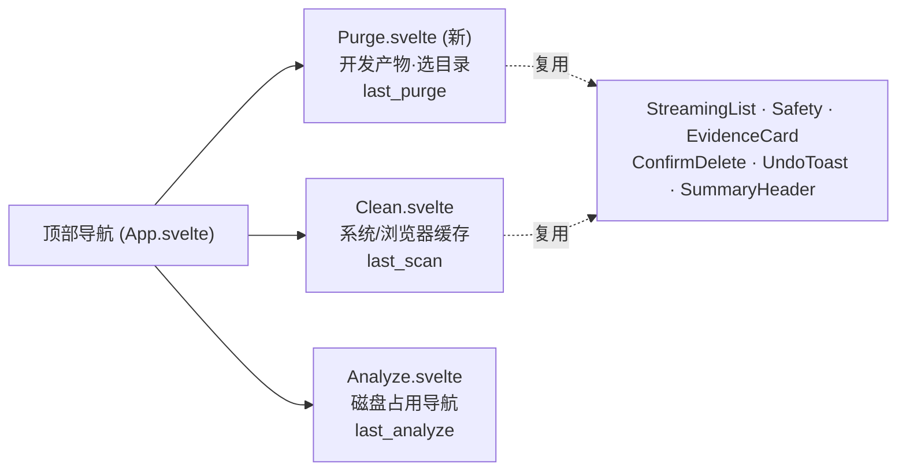
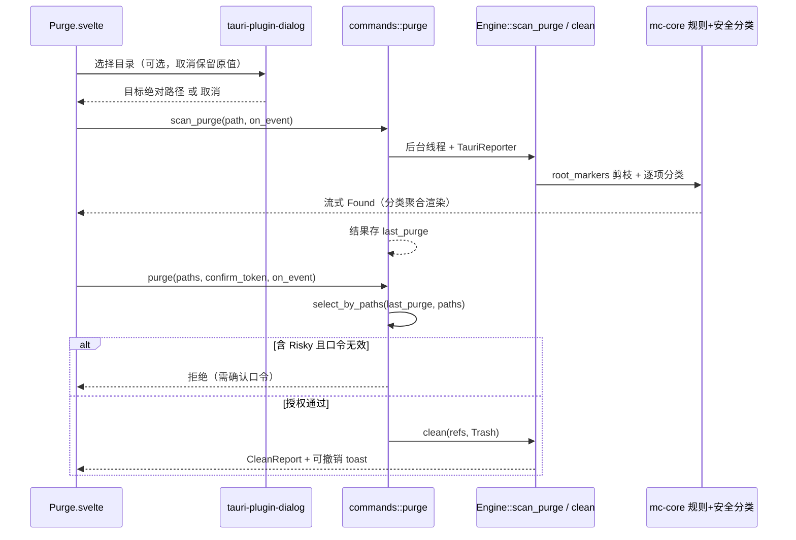

# macCleaner GUI move 7 第一段 — Purge 开发清理入口与可见导航 - Plan

## Goal Capsule

- **Objective:** 补上 GUI 层缺失的 **Purge（开发产物清理）** 能力：把已存在的 `Engine::scan_purge` 接入 GUI，用可见的三 tab 顶部导航承载，让开发者能选定一个目录、扫描并安全清理 `node_modules`/`target`/`DerivedData` 等开发缓存——全程复用 Clean 已出货的 StreamingList、安全模型、证据与删除信任链。
- **Product authority:** `STRATEGY.md` 的「开发者专项清理」track 与「多界面适配」track；`docs/ideation/2026-07-07-gui-redesign-ideation.md` 的 move 7（补 purge/uninstall 功能缺口 + 可见导航 + Cmd+K）；`docs/plans/2026-07-11-019-feat-gui-analyze-review-face-plan.md` 明确把 move 7 列为下一段 follow-up；`CONCEPTS.md` 的 Purge 定义。
- **Execution profile:** Standard 级前端 + 薄命令层变更；主要在 Svelte 路由、Tauri 命令注册与前端测试，复用现有 IPC 流式契约、`ProgressReporter`、`mc-core` 规则与安全分类。新增一个标准 Tauri 插件（目录选择）。
- **Stop conditions:** 不做 Uninstall GUI（应用为中心的另一套 UX，独立 move）；不做 Cmd+K 命令面板（须建立在多目的地导航之上，独立后续）；不改 `mc-core` 扫描/规则/安全/删除授权模型；不新增永久删除路径；不改 Clean/Analyze 现有行为。
- **Tail ownership:** 实现后由 LFG 继续完成精简、审查、浏览器测试、提交、PR 与 CI。

---

## Product Contract

> **Product Contract preservation:** 本计划为 solo（`ce-plan-bootstrap`）产出，无上游 brainstorm 需求文档。产品意图直接锚定 `STRATEGY.md` 两条 track 与 move 7 ideation；下述范围裁剪（仅 Purge、导航；defer Uninstall 与 Cmd+K）见 [Assumptions](#assumptions)。

### Summary

GUI 现只有「清理」「分析」两个 tab，`mc-core` 已实现的 `scan_purge`（开发产物清理，规则驱动、按 `root_markers` 剪枝）在 GUI 完全不可达。本段把顶部导航从双 tab 扩为三 tab（清理 / 开发清理 / 分析），新增一条「开发清理」路径：用户选定一个目录（默认 `~/`，可经原生目录选择器改选），流式扫描其中的开发产物并按分类聚合展示，走与 Clean 完全一致的安全预选、证据披露、type-to-confirm 与移废纸篓删除流程。

### Problem Frame

macCleaner 的主要用户是 Mac 开发者，其磁盘被 `node_modules`、Rust `target`、Xcode `DerivedData`、Docker、brew 缓存等开发产物持续占满——这正是 `STRATEGY.md` 的「开发者专项清理」track 与竞品覆盖不到的差异化领域。`mc-core` 早已实现 `Engine::scan_purge`（CLI `mc purge` 与 TUI 均在用），但 GUI 的 `invoke_handler!`（`crates/gui/src/lib.rs`）只注册了 clean/analyze，开发者要用 GUI 清理开发缓存无路可走，只能回退 CLI（普通用户更不可能）。

Clean 的 move 1–6 已把「稳定三区 + 流式 StreamingList + 安全地理 + 证据披露 + type-to-confirm + 移废纸篓」打磨为可复用形态。Purge 的扫描产物 `ScanResult` 与 Clean **同形**（分类聚合、逐项 `SafetyLevel` 与证据），删除可复用 Clean 的 `select_by_paths` + `is_confirmed` 纯函数。二者唯一实质差异：**Purge 需要一个用户选定的目标目录**（Clean 扫固定系统位置，Purge 扫任意开发工作区）。因此本段是「把成熟的 Clean 形态套用到 Purge，并补一层目录选择」，而非新造清理引擎。

### Actors

- A1. Mac 开发者：选定某个代码工作区目录，扫描并批量清理其中的开发产物，释放大块空间；核对每类产物的安全等级与恢复方式后再删。
- A2. 普通 Mac 用户：本段不是主要面向对象；「开发清理」tab 对其可见但默认目标 `~/` 的扫描结果仍套用同一安全模型（多数开发产物为 Safe/Moderate，可放心）。

### Key Flows

- F1. 选目录：进入「开发清理」tab，默认目标为 `~/`；用户可点「选择目录」经原生目录选择器改选任意可读目录，选择后目标路径可见。
- F2. 流式扫描：用户发起扫描，`scan_purge` 在后台线程按 `root_markers` 剪枝遍历并逐项流式 emit，前端按分类聚合边扫边填充；扫描可协作式取消。
- F3. 审查与预选：扫描完成后按分类展示体积、占比与安全等级；Safe/Moderate 默认预选、Risky 永不预选，证据（impact/recovery）可披露核对——与 Clean 语义一致。
- F4. 安全删除：用户发起删除；纯 Safe/Moderate 批次直接移废纸篓 + 可撤销 toast；含 Risky 项须经 type-to-confirm，后端执行前重新校验口令与授权。

### Requirements

**导航与入口**

- R1. 顶部导航从「清理 / 分析」双 tab 扩为「清理 / 开发清理 / 分析」三 tab；新增 tab 不改变现有清理/分析 tab 的行为、样式契约与键盘可达性。
- R2. tab 切换保持各自路由独立生命周期；切到「开发清理」进入其 idle 态（可选目录、未扫描），不与 Clean/Analyze 的扫描状态或结果串扰。

**目录选择**

- R3. 「开发清理」默认目标目录为用户主目录（`~/`），与 CLI `mc purge` 默认一致；界面明确显示当前目标路径。
- R4. 用户可经原生目录选择器改选目标目录；仅接受目录（非文件），取消选择保留原目标不变。
- R5. 目录选择失败或用户取消不得使界面进入错误态；目标路径始终是一个合法可展示的绝对路径。

**扫描与结果**

- R6. `scan_purge` 经 GUI 命令流式上报进度（复用现有 `ProgressEvent` Channel 与 `TauriReporter`），前端按分类聚合渲染，沿用 move 1 的稳定三区与防跳变（预印已知 purge 分类占位行、完成时一次 settle）。
- R7. 扫描支持协作式取消，复用现有 `cancel_scan` 与 `begin_operation` 取消 flag 语义；取消不污染后续扫描结果。
- R8. purge 扫描结果与 clean 扫描结果在后端相互隔离（独立状态槽），切 tab 或交替扫描不会让一方的删除误取另一方的项。

**安全与删除（继承不变量）**

- R9. Purge 项的安全等级、预选与证据完全由 `mc-core` 规则与安全分类决定：`selected = safety != Risky && preselect`；Risky 永不预选。
- R10. 删除恒用 `DeleteMode::Trash`（GUI 无永久删除路径）；纯 Safe/Moderate 批次直接删 + 可撤销 toast；含 Risky 项须 type-to-confirm，且后端 `purge` 删除命令在执行前二次校验确认口令（复用 `is_confirmed`），防前端绕过。
- R11. purge 删除命令按路径从其扫描结果精确取项（复用 `select_by_paths`），不接受前端回传的完整 `ScanItem`。

**契约与范围约束**

- R12. 新增的 Tauri 命令（`scan_purge`、`purge`）在 `lib.rs` 注册、命令签名与 `ipc.ts` 封装三方一致，通过既有 `contract.test.ts` 静态守卫。
- R13. 本段不改 `mc-core` 的扫描器、规则表、安全模型或删除授权；不新增永久删除；不触碰 Clean/Analyze 现有命令与路由行为。
- R14. 新增目录选择依赖为标准 Tauri 插件，随之在 capability 中按最小权限授予目录打开能力，不放开无关 capability。

**可访问性与布局**

- R15. 在 Tauri 最小窗口 720×520 下，三 tab、目录选择控件、扫描/删除操作可见可点击，无横向滚动；沿用 Clean 的响应式收缩约定。
- R16. 目录选择、扫描、取消、删除的状态对辅助技术可感知；扫描进度沿用 move 1 的「数字与长条即进度、无 spinner」约定。

### Acceptance Examples

- AE1. **Given** 用户进入「开发清理」tab 且未改目录，**when** 发起扫描，**then** 后端以 `~/` 为目标调用 `scan_purge`，前端按 purge 分类流式聚合并在完成时一次 settle。
- AE2. **Given** 用户点「选择目录」并在原生选择器中选定某工作区目录，**when** 选定完成，**then** 目标路径更新为该目录且可见；随后扫描以该目录为根。
- AE3. **Given** 用户在原生选择器中点取消，**when** 关闭选择器，**then** 目标路径保持原值，界面停留在 idle 态、无错误提示。
- AE4. **Given** purge 扫描出含 Risky 的项，**when** 用户默认预选后发起删除，**then** Risky 项未被预选、删除批次不含它；仅当用户显式勾选 Risky 并 type-to-confirm 后，后端才在校验口令通过后删除。
- AE5. **Given** 用户先在「清理」tab 扫描系统缓存、切到「开发清理」tab 扫描某目录，**when** 在开发清理 tab 发起删除，**then** 删除只作用于 purge 扫描结果的项，不误删 clean 结果的项（后端状态隔离）。
- AE6. **Given** purge 扫描进行中，**when** 用户点取消或切走 tab，**then** 扫描协作式停止，返回或再次扫描时结果不残留上次事件。
- AE7. **Given** 纯 Safe/Moderate 的 purge 删除批次，**when** 用户确认删除，**then** 直接移废纸篓并出可撤销 toast，无 type-to-confirm 模态（与 Clean move 3 语义一致）。

### Success Criteria

- GUI 三 tab 导航可见可用，「开发清理」可选目录、扫描、审查、删除，全程复用 Clean 的 StreamingList / Safety / EvidenceCard / ConfirmDelete / 可撤销 toast。
- Purge 安全语义与 Clean 完全一致：Risky 永不预选、type-to-confirm 仅 Risky、默认移废纸篓、后端二次校验口令。
- clean 与 purge 扫描结果后端隔离，交叉操作不串项。
- 新增两条 IPC 命令三方一致，`contract.test.ts` 绿；不新增 `mc-core` 改动。
- 前端 check / build / Vitest / Playwright E2E 全绿；`cargo test --workspace` 与 pedantic clippy 无回归。
- 720×520 最小窗口无横向滚动或被遮挡操作；异步与错误状态可被键盘与辅助技术感知。

### Scope Boundaries

#### In Scope

- 顶部导航双 tab → 三 tab（清理 / 开发清理 / 分析）。
- 新增 `scan_purge` / `purge` GUI 命令、`last_purge` 状态槽、目录选择依赖与 capability。
- 新增 `Purge.svelte` 路由，复用 Clean 的呈现与删除原语，补一层目录选择与生命周期。
- purge 分类的前端 parity（预印占位行与图例顺序）与 E2E 覆盖。

#### Deferred to Follow-Up Work

- **move 7 第二段：Uninstall GUI** —— 应用为中心的另一套 UX（扫已装应用 → 选应用 → 找残留 → 删），需新的后端残留解析 GUI 命令与全新界面，独立立项。
- **move 7 第三段：Cmd+K 命令面板** —— 开发者加速器，须建立在可见的多目的地导航之上，且半成品面板比没有更糟；待三 tab 落地后独立立项。
- purge 扫描的矩形 treemap / 更丰富的目录级可视化。
- 目录选择的历史记录 / 收藏工作区。

#### Out of Scope

- 修改 `mc-core` 的 `scan_purge`、`purge_rules.toml`、`SafetyLevel` 或删除授权模型。
- 新增永久删除、Simple/Advanced 模式开关或 GUI 任意路径批量删除。
- 重构 Clean 的 `StreamingList` 或改动 Clean/Analyze 现有行为——仅复用其组合与交互模式。

---

## Planning Contract

### Key Technical Decisions

- **KTD1. Purge 命令层镜像 Clean，复用其纯函数。** 新增 `commands/purge.rs`：`scan_purge(path, on_event)` → `ScanResult` 存入 `last_purge` 槽；`purge(paths, confirm_token, on_event)` 删除时复用 `crate::commands::clean::select_by_paths` 与 `crate::commands::is_confirmed`，不复制取项/校验逻辑。扫描与删除均走 `Engine::scan_purge` / `Engine::clean(DeleteMode::Trash)`，无核心改动。
- **KTD2. 独立 `last_purge` 状态槽，与 `last_scan`/`last_analyze` 并列。** 每功能一个扫描结果槽是仓库既有模式（analyze 已有 `last_analyze`）。隔离避免切 tab 或交替扫描时删除误取另一路径的项（R8/AE5）。取消 flag 仍走共享的 `begin_operation`（当前操作语义已正确处理并发）。
- **KTD3. 目录选择用 `tauri-plugin-dialog`，前端调用。** 原生目录选择器（`open({ directory: true })`）对开发者选工作区是正确 UX，胜过易错的手输路径。新增 workspace 依赖 `tauri-plugin-dialog`、crate 依赖、`@tauri-apps/plugin-dialog`、`lib.rs` 插件 init 与 capability 的 `dialog:default`（最小权限）。默认目标 `~/` 与 CLI 对齐，避免「未选目录就无法扫描」。
- **KTD4. 复用 Clean 的稳定三区与防跳变契约。** Purge 结果也是分类聚合，`Purge.svelte` 复用 `StreamingList` + `SummaryHeader` + `aggregateByCategory` + `computeSegments`。为防「分类中途插入＝跳变」，新增 `KNOWN_PURGE_CATEGORIES` 并用 parity 测试锁定与 `purge_rules.toml` 的 category 集合一致（镜像 `categories.test.ts`）。
- **KTD5. 删除信任链原样继承，不为 Purge 另设一套。** 预选、type-to-confirm、移废纸篓、可撤销 toast、后端二次校验口令全部复用 Clean 组件与语义。Purge 不引入任何新的安全等级或授权路径。
- **KTD6. 严格限定本段范围为 Purge + 导航。** Uninstall 与 Cmd+K 虽同属 move 7，但架构/风险各异（见 Scope Boundaries 与 Assumptions），本段不触碰，保证一个可独立交付、可回滚的 PR。

### High-Level Technical Design

#### 三 tab 导航与路由



#### Purge 扫描—删除命令流（复用 Clean 边界）



### Assumptions

- **「下一步」= move 7 且首段为 Purge + 导航。** move 1–6 已随 plan 015/017/018/019 出货；019 的 Deferred 明确把 move 7 列为下一段。move 7 整体（purge + uninstall + Cmd+K）为 Medium-High，一次交付过大，故按可交付里程碑切为三段，本计划只做第一段。
- **Uninstall 独立成段。** `Engine::scan_uninstall` 只流式扫已装应用（`AppResolver::scan_apps_streaming`），是应用为中心的 UX，缺少残留解析与逐应用删除的 GUI 命令契约，工程面与 Purge 迥异，不并入本段。
- **Cmd+K 独立成段。** 设计原则（ideation move 7 Downsides）要求命令面板是加速器而非唯一入口、须有可见导航承载、半成品比没有更糟；应在三 tab 落地后再做。
- **默认目标 `~/`。** 与 CLI `mc purge` 默认一致；purge 的 `root_markers` 剪枝使全 `~/` 扫描有界，不会无限深入。
- **`tauri-plugin-dialog` 满足「轻量」约束。** 它是按需的对话框插件，不引入常驻进程/后台扫描/角标通知，不违反 `STRATEGY.md` 的「不成为系统负担」。
- **purge 结果可用 StreamingList 的分类聚合渲染。** purge `ScanResult` 与 clean 同为分类聚合结构，逐项带 `SafetyLevel` 与证据。

### Risks and Mitigations

- **分类占位行密度：** purge 已知分类有 ~13 个（Node.js/Rust/Python/Docker/Xcode…），对只含少数产物的目录预印全部占位行偏空。缓解：沿用 move 1 已确立的「预印 + 完成时 settle 空行」契约保持一致；把密度观感作为浏览器验收关注点，若确显噪则在 settle 时收拢空分类（不改防跳变契约）。作为 U4 的验收观察项记录，不预先过度设计。
- **后端状态串扰：** clean/purge 若共用 `last_scan` 会在交替扫描时误删。缓解：KTD2 独立 `last_purge` 槽 + AE5 专门 E2E 证明隔离。
- **契约漂移（按钮静默失效）：** 新命令若三方不一致会静默失效。缓解：`contract.test.ts` 自动解析三方，新增命令同步 `lib.rs`/`purge.rs`/`ipc.ts` 即保持绿；U6 显式跑该守卫。
- **capability 过授：** 引入 dialog 插件可能顺手放开过多权限。缓解：只加 `dialog:default`（目录打开所需最小集），U2 审 diff 确认无关权限未开。
- **取消/异步残留：** 切 tab 或取消后旧扫描事件回写。缓解：复用 `begin_operation` 当前操作 flag 与 Clean 的「resolve 后按权威结果重建、迟到事件丢弃」模式；AE6 覆盖。
- **误伤 Clean/Analyze：** 导航改造可能回退现有行为。缓解：R13/U6 全量回归 Clean move 6、Analyze、Risky type-to-confirm、未知路径 fail-closed E2E。

### Sources and Research

- `docs/ideation/2026-07-07-gui-redesign-ideation.md`（move 7）：补 purge/uninstall 功能缺口 + 可见导航 + Cmd+K；护栏——Cmd+K 只能是加速器、须可见导航承载、半成品比没有更糟。
- `docs/plans/2026-07-11-019-feat-gui-analyze-review-face-plan.md`：把 move 7 列为下一段 follow-up。
- `STRATEGY.md`：「开发者专项清理」与「多界面适配」track；「不成为新的系统负担」轻量约束。
- `crates/gui/src/commands/clean.rs`：`scan_clean`/`clean`/`select_by_paths`/`is_confirmed` 与后端二次校验口令模式（本段镜像复用）。
- `crates/gui/src/lib.rs`：`invoke_handler!` 命令注册、`AppState` 状态槽与 `begin_operation` 取消语义。
- `crates/core/src/engine.rs` + `crates/core/src/scanner.rs`：`scan_purge(path, reporter)` 已实现，`root_markers` 剪枝并行计算目录大小、逐项流式 emit。
- `crates/gui/frontend/src/routes/Clean.svelte`：稳定三区、rAF 批处理、StreamingList/ConfirmDelete/UndoToast 生命周期（Purge 路由蓝本）。
- `crates/gui/frontend/src/lib/categories.ts` + `categories.test.ts`：分类 parity 守卫模式（purge 分类照此新增）。
- `crates/gui/frontend/e2e/contract.test.ts`：IPC 三方一致静态守卫。

---

## Output Structure

```
crates/gui/
├── src/
│   ├── lib.rs                         # 注册 scan_purge/purge、init dialog 插件、AppState 加 last_purge
│   └── commands/
│       ├── mod.rs                     # pub mod purge;
│       └── purge.rs                   # 新：scan_purge / purge（镜像 clean.rs）
├── capabilities/
│   └── default.json                  # 加 dialog:default
└── frontend/
    ├── package.json                  # 加 @tauri-apps/plugin-dialog
    └── src/
        ├── App.svelte                # 双 tab → 三 tab
        ├── routes/
        │   └── Purge.svelte          # 新：目录选择 + 扫描/结果/删除生命周期
        └── lib/
            ├── ipc.ts                # 加 scanPurge / purge 封装
            ├── categories.ts         # 加 KNOWN_PURGE_CATEGORIES
            └── categories.test.ts    # 加 purge 分类 parity 断言
Cargo.toml                            # workspace 加 tauri-plugin-dialog
```

---

## Implementation Units

### U1. 后端 Purge 命令层与隔离状态槽

- **Goal:** 在 GUI 后端接入 `Engine::scan_purge` 与对应移废纸篓删除，并与 clean 结果隔离。
- **Requirements:** R6、R7、R8、R9、R10、R11、R12、R13。
- **Dependencies:** 无。
- **Files:** `crates/gui/src/commands/purge.rs`（新）、`crates/gui/src/commands/mod.rs`、`crates/gui/src/lib.rs`。
- **Approach:** 镜像 `clean.rs`：`scan_purge(app, path: String, on_event)` 在 `spawn_blocking` 内以 `TauriReporter` 调 `Engine::scan_purge(Path::new(&path), &reporter)`，结果存 `AppState.last_purge`；`purge(app, paths, confirm_token, on_event)` 在短临界区从 `last_purge` clone 出待删项（复用 `crate::commands::clean::select_by_paths`），含 Risky 时用 `crate::commands::is_confirmed` 二次校验后 `Engine::clean(&refs, DeleteMode::Trash, &reporter)`。`AppState` 新增 `last_purge: Arc<Mutex<Option<ScanResult>>>`；`lib.rs` 的 `generate_handler!` 注册两命令。取消复用现有 `cancel_scan` + `begin_operation`。
- **Execution note:** 优先复用 clean 的纯函数与临界区/锁毒化处理模式，不复制取项或口令校验逻辑。
- **Patterns to follow:** `crates/gui/src/commands/clean.rs`（`scan_clean`/`clean`/`select_by_paths`/锁释放时机）、`crates/gui/src/lib.rs` 的 `AppState`/`begin_operation`。
- **Test scenarios:**
  - Covers AE5. `purge` 删除只从 `last_purge` 取项：给定 purge 结果含 `/p`、clean 结果含 `/c`，请求删 `/c` 时不命中（隔离）。（复用 `select_by_paths` 的既有单测形态，针对 purge 槽。）
  - 含 Risky 项且 `confirm_token` 无效时 `purge` 拒删；口令有效（trim/大小写不敏感 `delete`）时放行。
  - 空选择集删除得空结果；未知路径被忽略。
- **Verification:** `cargo test -p mc-gui` 通过；`cargo clippy -p mc-gui --all-targets -- -D warnings` 无警告。

### U2. 目录选择依赖与最小 capability

- **Goal:** 引入原生目录选择能力，按最小权限授予。
- **Requirements:** R4、R5、R14。
- **Dependencies:** 无。
- **Files:** `Cargo.toml`（workspace `[workspace.dependencies]`）、`crates/gui/Cargo.toml`、`crates/gui/src/lib.rs`（`.plugin(tauri_plugin_dialog::init())`）、`crates/gui/capabilities/default.json`（加 `dialog:default`）、`crates/gui/frontend/package.json`（`@tauri-apps/plugin-dialog`）。
- **Approach:** 在 workspace 依赖加 `tauri-plugin-dialog = "2"`，crate 依赖引用；`lib.rs` 注册插件；capability 仅追加 `dialog:default`，不放开无关权限；前端加 JS 插件包。
- **Execution note:** 纯依赖/配置接入；不含行为逻辑，行为由 U4 集成验证。
- **Patterns to follow:** 现有 `tauri-plugin-opener` 的接入方式（workspace dep + `.plugin(...)` + capability 的 `opener:default`）。
- **Test scenarios:**
  - Test expectation: none —— 纯依赖与 capability 配置，无独立可测行为；由 U4 的 E2E（目录选择成功/取消）与 U6 的 build/契约门禁覆盖。
- **Verification:** `cargo build -p mc-gui` 通过；`pnpm install` 后 `@tauri-apps/plugin-dialog` 可解析；capability diff 仅新增 `dialog:default`。

### U3. 前端 IPC 封装与 purge 分类 parity

- **Goal:** 暴露 `scanPurge`/`purge` 前端调用，并锁定 purge 分类与规则表一致。
- **Requirements:** R6、R12；防跳变前置（R6 的预印占位行依赖此分类集）。
- **Dependencies:** U1。
- **Files:** `crates/gui/frontend/src/lib/ipc.ts`、`crates/gui/frontend/src/lib/categories.ts`、`crates/gui/frontend/src/lib/categories.test.ts`。
- **Approach:** `ipc.ts` 加 `scanPurge(path, onEvent)` → `invoke<ScanResult>("scan_purge", { path, onEvent })` 与 `purge(paths, confirmToken, onEvent)` → `invoke<CleanReport>("purge", ...)`，参数键 camelCase 对齐 Rust snake_case。`categories.ts` 加 `KNOWN_PURGE_CATEGORIES`（Node.js/Rust/Python/Build Output/Gradle/Xcode/CocoaPods/Docker/Java/Homebrew/Go/Android/JetBrains，按规则表顺序）。`categories.test.ts` 增断言：`KNOWN_PURGE_CATEGORIES` 集合等于 `purge_rules.toml` 解析出的 category 集合。
- **Patterns to follow:** `ipc.ts` 现有 `scanClean`/`clean` 封装；`categories.test.ts` 直接读 TOML 做 parity 的既有断言。
- **Test scenarios:**
  - `KNOWN_PURGE_CATEGORIES` 与 `purge_rules.toml` 的 category 集合完全一致（多/少一个即红）。
  - 现有 clean 分类 parity 断言不回归。
- **Verification:** `pnpm test`（`crates/gui/frontend`）通过；`pnpm check` 类型无误。

### U4. Purge.svelte 路由（目录选择 + 扫描/结果/删除生命周期）

- **Goal:** 提供「开发清理」完整界面，复用 Clean 呈现与删除原语，补目录选择。
- **Requirements:** R2、R3、R4、R5、R6、R7、R9、R10、R15、R16；F1–F4；AE1–AE4、AE6、AE7。
- **Dependencies:** U1、U2、U3。
- **Files:** `crates/gui/frontend/src/routes/Purge.svelte`（新）、`crates/gui/frontend/e2e/purge.spec.ts`（新）。
- **Approach:** 以 `Clean.svelte` 为蓝本：`idle → scanning → results → cleaning → done` 相位、rAF 批处理流式 Found、稳定三区（`Shell` + `SummaryHeader` + `StreamingList`）、`ConfirmDelete` + `UndoToast` 删除信任链。idle 态显示当前目标路径（默认 `~/`）与「选择目录」按钮（调 `@tauri-apps/plugin-dialog` `open({ directory: true })`，取消保留原值）；扫描调 `scanPurge(target)`，聚合用 `KNOWN_PURGE_CATEGORIES`；删除调 `purge(paths, confirmToken)`。取消复用 `cancelScan`。
- **Execution note:** 先写 e2e 覆盖目录选择成功/取消、扫描聚合、Risky 不预选与 type-to-confirm、纯 Safe/Moderate 直删 toast、取消/切 tab 不残留，再接入组件；用 Tauri mock 提供确定性 `scan_purge`/`purge`/dialog 结果。
- **Patterns to follow:** `crates/gui/frontend/src/routes/Clean.svelte`（相位机、flush、StreamingList 用法、ConfirmDelete/UndoToast 组合）；`crates/gui/frontend/e2e/clean.spec.ts` 与 `support/tauri-mock.ts` 的 mock 模式。
- **Test scenarios:**
  - Covers AE1. 默认 `~/` 扫描：流式 Found 按 purge 分类聚合，完成时 settle；扫描期无 spinner、行序稳定。
  - Covers AE2/AE3. 选择目录成功后目标路径更新并作为扫描根；选择取消后目标保持原值、停 idle、无错误。
  - Covers AE4/AE7. Risky 项未预选；纯 Safe/Moderate 删除直接移废纸篓 + 可撤销 toast、无模态；含 Risky 走 type-to-confirm。
  - Covers AE6. 扫描中取消或切 tab：协作式停止，返回/再扫无残留事件。
  - 720×520 视口下三 tab、目录选择、扫描/删除控件可见可用、无横向滚动；键盘可达。
- **Verification:** 浏览器中「开发清理」可选目录、扫描、审查、删除；删除信任链与 Clean 一致；`pnpm e2e` 相关用例绿。

### U5. 三 tab 导航接入

- **Goal:** 把顶部导航从双 tab 扩为三 tab 并挂载 Purge 路由。
- **Requirements:** R1、R2、R15。
- **Dependencies:** U4。
- **Files:** `crates/gui/frontend/src/App.svelte`。
- **Approach:** `Tab` 类型加 `"purge"`；导航加「开发清理」按钮（置于 清理 与 分析 之间），`content` 分支挂 `Purge`；沿用现有 tab 样式与 active 语义，为 purge 选一致的强调色（复用现有 token，不新增视觉系统）。statusbar 模式文案补 purge 分支。
- **Patterns to follow:** `App.svelte` 现有 clean/analyze tab 结构与 `.tab`/`.active` 样式。
- **Test scenarios:**
  - 三 tab 均可切换且各自路由独立挂载；切到「开发清理」进入其 idle 态，不带入 clean/analyze 状态。
  - 现有 clean/analyze tab 切换与样式不回归。
- **Verification:** `pnpm check`/`pnpm build` 通过；浏览器中三 tab 切换正常，Clean/Analyze 行为无回退。

### U6. 跨层回归与交付验证

- **Goal:** 证明本段仅接入 Purge + 导航，未回退既有 GUI/核心质量门禁或扩大后端契约。
- **Requirements:** R12、R13、全部 Success Criteria。
- **Dependencies:** U1、U2、U3、U4、U5。
- **Files:** `crates/gui/frontend/e2e/contract.test.ts`（如三方已同步则无需改，仅跑）；仅在测试发现真实缺口时回改前述实现文件。
- **Approach:** 跑前端 check/build/test/e2e 与 workspace Rust 门禁；核对 `contract.test.ts` 认可新命令集合（`scan_purge`/`purge` 三方一致）；真实浏览器验证三 tab、目录选择、扫描防跳变、删除信任链与 720×520 布局。
- **Test scenarios:**
  - Clean move 6、Analyze 主干、Risky type-to-confirm、未知路径 fail-closed、tab 状态隔离全部回归通过。
  - `contract.test.ts` 认可新增命令且三方一致；无其它未注册命令。
  - reduced-motion 下无依赖动画表达状态；键盘焦点可分别到达三 tab 与各操作控件。
- **Verification:** 全部 Verification Contract 门禁通过；diff 仅含计划、Purge 实现、导航改造与相应测试，无 `mc-core` 改动、无无关重构。

---

## Verification Contract

| Gate | Command / Method | Proves | Units |
|---|---|---|---|
| Rust tests | `cargo test -p mc-gui` | purge 命令取项隔离、口令二次校验、纯函数复用 | U1 |
| Rust build | `cargo build -p mc-gui` | dialog 插件与命令注册编译通过 | U1、U2 |
| Frontend types | `pnpm check`（`crates/gui/frontend`） | ipc/组件 props/Tab 类型正确 | U3、U4、U5 |
| Frontend build | `pnpm build`（`crates/gui/frontend`） | Vite 生产构建与模块边界有效 | U3、U4、U5 |
| Unit tests | `pnpm test`（`crates/gui/frontend`） | purge 分类 parity 与既有纯函数无回归 | U3 |
| IPC contract | `pnpm test` → `contract.test.ts` | `scan_purge`/`purge` 三方一致、无静默失效 | U1、U3、U6 |
| Browser E2E | `pnpm e2e`（`crates/gui/frontend`） | 目录选择、扫描防跳变、删除信任链、导航、隔离、取消 | U4、U5、U6 |
| Workspace tests | `cargo test --workspace` | 核心与其它 crate 无回归 | U6 |
| Lint | `cargo clippy --workspace --all-targets -- -D warnings` | pedantic 与 workspace 质量门禁 | U1、U6 |
| Visual/interaction | `ce-test-browser mode:pipeline` | 三 tab、目录选择、布局、焦点与状态可见性 | U4、U5、U6 |

---

## Definition of Done

- U1：`scan_purge`/`purge` 接入 `Engine`，`last_purge` 与 clean 结果隔离，删除复用 `select_by_paths` 且含 Risky 时后端二次校验口令通过方删。
- U2：`tauri-plugin-dialog` 按最小权限（仅 `dialog:default`）接入，无关 capability 未放开。
- U3：`scanPurge`/`purge` 三方一致；`KNOWN_PURGE_CATEGORIES` 与 `purge_rules.toml` parity 锁定。
- U4：「开发清理」可选目录（取消保留原值）、流式扫描防跳变、审查证据、删除走 type-to-confirm/Trash/可撤销 toast；取消与切 tab 不残留。
- U5：三 tab 导航可见可用，Clean/Analyze 行为无回退。
- U6：前端 check/build/test/e2e、`contract.test.ts`、workspace test/clippy 与浏览器验证全部通过。
- Git diff 仅含本计划、Purge 命令与路由、导航改造、依赖/capability 与相应测试；无 `mc-core` 改动、无 Uninstall/Cmd+K 夹带、无无关重构或已知问题遗留。
