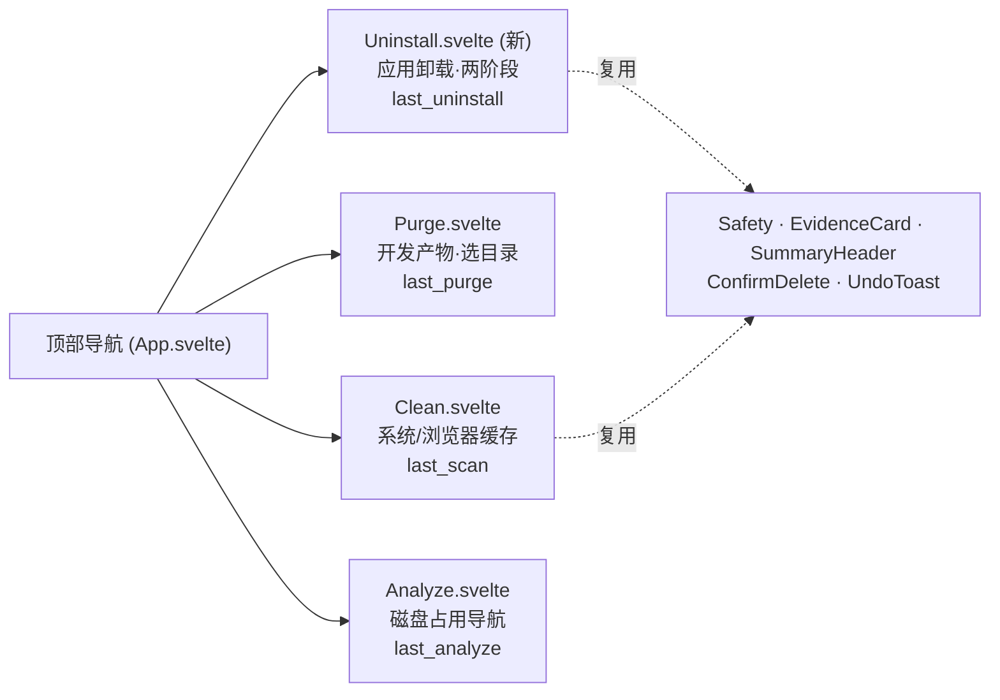
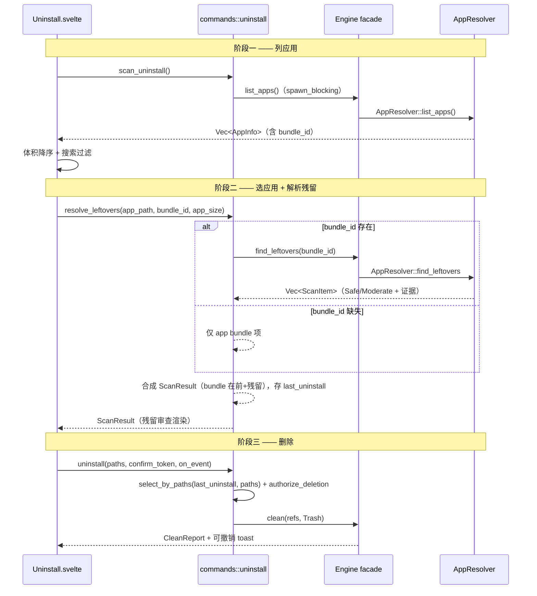

# macCleaner GUI move 7 第二段 — Uninstall 应用卸载与残留清理 - Plan

## Goal Capsule

- **Objective:** 补上 GUI 层缺失的 **Uninstall（应用卸载 + 残留清理）** 能力：把 CLI 已出货的「列已装应用 → 选中一个 → 解析 `~/Library` 残留 → 移废纸篓删 bundle+残留」两阶段数据流接入 GUI，用第四个顶部 tab「卸载」承载，让用户更干净地卸载应用（应用本体 + `~/Library` 常见残留）而非只拖进废纸篓留一堆残留——对标 CleanMyMac/AppCleaner 的招牌能力、普通用户最痛的需求（`STRATEGY.md` 核心能力清单明列「应用卸载残留」）。残留检测范围与 CLI 现有 `find_leftovers` 平价（8 个 `~/Library` 子目录，**不含 `Containers`**，沙盒应用限制见 [Assumptions](#assumptions)）。
- **Product authority:** `STRATEGY.md`「核心能力」清单（缓存清理、**应用卸载残留**、系统日志、大文件）与「多界面适配」track；`docs/ideation/2026-07-07-gui-redesign-ideation.md` move 7（补 purge/**uninstall** 功能缺口 + 可见导航）；`docs/plans/2026-07-11-020-feat-gui-move7-purge-entry-plan.md` 把 Uninstall 明列为 move 7 第二段 follow-up；`CONCEPTS.md` 的 Uninstall 定义。
- **Execution profile:** Standard 级跨层前端 + 薄命令层变更：mc-core 仅加两个 **additive facade passthrough**（`Engine::list_apps` / `Engine::find_leftovers`，纯委托，不改扫描/规则/安全/删除逻辑）；主体在 GUI Tauri 命令、一个新 Svelte 路由（app 选择器 + 残留审查两阶段视图）与前端测试。删除信任链、安全模型、证据披露全部复用 Clean 已出货原语。
- **Stop conditions:** 不做 Cmd+K 命令面板（move 7 第三段，须建立在多目的地导航之上，独立立项）；不改 `mc-core` 的 `find_leftovers`/`AppResolver` 残留搜索逻辑、`SafetyLevel` 或删除授权模型；不提取应用图标（`AppInfo` 无 icon 字段，纯文本列表）；不新增永久删除路径；不改 Clean/Purge/Analyze 现有行为。
- **Tail ownership:** 实现后由 LFG 继续完成精简、审查、浏览器测试、提交、PR 与 CI。

---

## Product Contract

> **Product Contract preservation:** 本计划为 solo（`ce-plan-bootstrap`）产出，无上游 brainstorm 需求文档。产品意图直接锚定 `STRATEGY.md` 核心能力清单与 move 7 ideation；下述范围裁剪（仅 Uninstall + 第四 tab；defer Cmd+K；不提取图标）见 [Assumptions](#assumptions)。

### Summary

GUI 现有「清理 / 开发清理 / 分析」三 tab，`mc-core` 的应用卸载能力（CLI `mc uninstall` 在用的 `AppResolver::list_apps` + `find_leftovers`）在 GUI 完全不可达。本段把顶部导航扩为四 tab（清理 / 开发清理 / **卸载** / 分析），新增一条「卸载」路径：**阶段一**列出已安装应用（可搜索、按体积排序），**阶段二**用户选中一个应用后解析其 `~/Library` 残留（缓存/偏好/Application Support 等），把应用 bundle 与残留合成一份可审查清单，走与 Clean 完全一致的安全预选（用户数据残留 Moderate 不预选）、证据披露、type-to-confirm 与移废纸篓删除流程。

### Problem Frame

macOS 的应用卸载是出名的「拖进废纸篓不干净」——`~/Library` 下的 Caches/Preferences/Application Support/WebKit 等会留下大量残留，普通用户无从清理，这正是 CleanMyMac/AppCleaner 的招牌卖点。`mc-core` 早已实现两阶段卸载能力：`AppResolver::list_apps()` 返回含 `bundle_id` 的 `AppInfo` 列表，`AppResolver::find_leftovers(bundle_id)` 按 bundle_id 前缀在 `~/Library` 8 个子目录下解析残留并附安全分级与证据。CLI `mc uninstall` 完整消费了这条链，但 GUI 的 `invoke_handler!`（`crates/gui/src/lib.rs`）只注册了 clean/purge/analyze，GUI 用户要彻底卸载应用无路可走。

**关键结构性差异（务必区别于 Clean/Purge，也区别于 TUI）：** Clean/Purge 是单阶段「扫一批可清理项 → 删」。Uninstall 是**应用为中心的两阶段**：先列应用列表，再对**用户选定的单个应用**解析残留。TUI 的 Uninstall 是「伪装成 Clean 的单阶段」——只把已装应用当普通 `Found` 流式塞进多选列表，勾选后**只删 bundle、从不解析残留**（`find_leftovers` 在 TUI crate 从未被调用）。因此 GUI 必须**镜像 CLI 的两阶段数据流，而非 TUI**。此外 `Engine::scan_uninstall` 的流式 `Found` 事件丢弃了 `bundle_id`（`app_resolver.rs:127-135` 只留 path/size），无法据以解析残留——故 GUI 走**同步 `list_apps()`**（保留 bundle_id），不走流式扫描。

### Actors

- A1. 普通 Mac 用户（**本段主要面向对象**）：想彻底卸载某个应用并清掉它散落在 `~/Library` 的残留，释放空间、不留垃圾；核对残留的安全等级（尤其可能含数据的 Application Support）后再删。
- A2. Mac 开发者：同样受益于「卸载即清残留」，但其主战场是「开发清理」tab；卸载对其是补充能力。

### Key Flows

- F1. 列应用：进入「卸载」tab 触发扫描，后端 `list_apps()` 返回已装应用列表；前端按体积降序展示（名称 / 版本 / 体积），可按名称或 bundle_id 大小写不敏感搜索过滤。
- F2. 选应用：用户点选一个应用进入残留审查态；后端 `find_leftovers(bundle_id)` 解析该应用残留，与应用 bundle 本身合成一份 `ScanResult`（bundle 在前，残留在后）。
- F3. 审查与预选：残留按子目录展示体积与安全等级；应用 bundle 与可再生残留（Caches/Preferences/Logs…）为 Safe 默认预选，可能含用户数据的残留（Application Support/WebKit/HTTPStorages/Saved Application State）为 Moderate **不预选**、证据（impact/recovery）可披露核对——与 CLI 语义一致。
- F4. 安全删除：用户发起删除；纯 Safe/Moderate 批次直接移废纸篓 + 可撤销 toast；含 Risky 项须经 type-to-confirm，后端执行前重新校验口令与授权。删完可返回应用列表继续卸载下一个。

### Requirements

**导航与入口**

- R1. 顶部导航从三 tab 扩为「清理 / 开发清理 / 卸载 / 分析」四 tab；新增 tab 不改变现有清理/开发清理/分析 tab 的行为、样式契约与键盘可达性。
- R2. 「卸载」tab 保持独立路由生命周期；切入进入其阶段一 idle/列表态，不与 Clean/Purge/Analyze 的扫描状态或结果串扰。

**阶段一：应用列表**

- R3. 进入「卸载」tab 后可扫描并列出 `/Applications` 与 `~/Applications` 下的已安装应用，展示名称、版本（若有）、体积，按体积降序。
- R4. 应用列表可按名称或 bundle_id 做大小写不敏感子串搜索过滤；空搜索显示全部；零命中显示区别于真空扫描的「无匹配」空态。
- R5. 应用扫描期间界面呈可感知的加载态（非冻结）；扫描失败（如目录不可读）以可见错误态呈现，不使界面卡死。

**阶段二：残留解析与审查**

- R6. 用户选中一个应用后，后端解析其 `~/Library` 残留并把应用 bundle 与残留合成一份 `ScanResult`（bundle 作为 `SafetyLevel::Safe` 项在前，残留在后），前端按类目展示体积、占比与安全等级。
- R7. bundle_id 缺失（应用无 Info.plist）时不解析残留，仅提供删除应用 bundle 本身的选项，界面明示「未能解析残留」而非报错卡死。
- R8. 残留的安全等级、预选与证据完全由 `find_leftovers` 决定：可能含用户数据的残留为 Moderate 且**不预选**、附非空 impact/recovery 证据；可再生残留为 Safe 默认预选。前端尊重 `ScanItem.selected` 而非无脑全选。
- R9. 从残留审查态可返回应用列表（阶段一），不丢失或串扰列表结果。
- R18. 删除成功后返回应用列表时，已卸载的应用从列表中剔除（照 Analyze 删后剪树，避免重选已删 bundle 空转）；界面回到应用列表态。

**安全与删除（继承不变量）**

- R10. 删除恒用 `DeleteMode::Trash`（GUI 无永久删除路径）；纯 Safe/Moderate 批次直接删 + 可撤销 toast；含 Risky 项须 type-to-confirm，且后端 `uninstall` 删除命令在执行前二次校验确认口令（复用 `authorize_deletion`），防前端绕过。
- R11. uninstall 删除命令按路径从其残留审查结果（后端状态槽）精确取项（复用 `select_by_paths`），不接受前端回传的完整 `ScanItem`；且 `resolve_leftovers` 写入删除槽前**服务端校验 app bundle 路径**（`canonicalize` 后须落在 `/Applications` 或 `~/Applications` 下且为存在的 `.app`），防前端注入任意路径成为 Safe 预选删除项（信任边界在残留合成注入点也须成立）。
- R12. uninstall 的删除结果与 clean/purge 后端相互隔离（独立状态槽），切 tab 或交替操作不会让一方的删除误取另一方的项。

**契约与范围约束**

- R13. 新增的 Tauri 命令（`scan_uninstall`、`resolve_leftovers`、`uninstall`）在 `lib.rs` 注册、命令签名与 `ipc.ts` 封装三方一致，通过既有 `contract.test.ts` 静态守卫。
- R14. mc-core 仅新增 `Engine::list_apps` / `Engine::find_leftovers` 两个**纯委托** facade 方法（转调既有 `AppResolver`），不改 `AppResolver` 内部残留搜索/安全分级逻辑、不改 `SafetyLevel`、规则表或删除授权模型；不新增永久删除；不触碰 Clean/Purge/Analyze 现有命令与路由行为。
- R15. 不提取或展示应用图标（`AppInfo` 无 icon 字段）；应用列表为纯文本呈现。

**可访问性与布局**

- R16. 在 Tauri 最小窗口 720×520 下，四 tab、应用列表/搜索、残留审查与删除操作可见可点击，无横向滚动；沿用 Clean 的响应式收缩约定。
- R17. 扫描、搜索、选应用、删除的状态对辅助技术可感知；进度沿用 GUI 既有「无依赖动画表达状态」约定。

### Acceptance Examples

- AE1. **Given** 用户进入「卸载」tab，**when** 发起扫描，**then** 后端 `list_apps()` 返回已装应用，前端按体积降序展示名称/版本/体积，扫描期呈加载态。
- AE2. **Given** 应用列表已展示，**when** 用户在搜索框输入 "safari"（或 "SAFARI"），**then** 列表过滤为名称/bundle_id 含该子串的应用；清空搜索恢复全部。
- AE3. **Given** 用户选中某应用（有 bundle_id），**when** 进入残留审查，**then** 后端 `find_leftovers` 结果与应用 bundle 合成清单展示；Application Support 类残留标 Moderate 且未预选、附证据，Caches 类标 Safe 且预选。
- AE4. **Given** 用户选中某无 Info.plist 的应用，**when** 进入审查，**then** 仅展示应用 bundle 可删项并明示「未能解析残留」，界面不报错卡死。
- AE5. **Given** 残留审查态含默认预选项，**when** 用户确认删除（纯 Safe/Moderate），**then** 直接移废纸篓并出可撤销 toast，无 type-to-confirm 模态。
- AE6. **Given** 用户先在「清理」tab 扫描系统缓存、切到「卸载」tab 卸载某应用，**when** 在卸载 tab 发起删除，**then** 删除只作用于该应用残留审查结果的项，不误删 clean 结果的项（后端状态隔离）。
- AE7. **Given** 残留审查态，**when** 用户返回应用列表，**then** 回到阶段一且列表结果保留，可继续选另一应用；再次选应用重新解析其残留、不残留上次的项。
- AE8. **Given** `scan_uninstall` 失败（如应用目录不可读），**when** 进入卸载 tab 扫描，**then** 呈可见错误态、UI 不冻结、可重试，不显示为「无应用」。
- AE9. **Given** 用户成功卸载某应用，**when** 返回应用列表，**then** 该应用已从列表剔除，重选不会对不存在的 bundle 空转。
- AE10. **Given** 某应用有 bundle_id 但无残留，**when** 进入残留审查，**then** 明示「未发现残留，仅移除应用本体」，措辞区别于无 bundle_id 的「未能解析残留」。

### Success Criteria

- GUI 四 tab 导航可见可用，「卸载」可扫应用、搜索、选应用、审查残留、删除，全程复用 Clean 的 Safety / EvidenceCard / ConfirmDelete / 可撤销 toast。
- 两阶段数据流镜像 CLI：`list_apps`（含 bundle_id）→ 选应用 → `find_leftovers` → bundle+残留合并 → `Engine::clean(Trash)`。
- 残留安全语义与 core 一致：用户数据残留 Moderate 不预选、附证据；可再生残留 Safe 预选；Risky（若有）type-to-confirm；后端二次校验口令。
- uninstall 与 clean/purge 删除结果后端隔离，交叉操作不串项。
- 新增三条 IPC 命令三方一致，`contract.test.ts` 绿；mc-core 仅含两个纯委托 facade 方法（附委托测试），无扫描/规则/安全/删除逻辑改动。
- 前端 check / build / Vitest / Playwright E2E 全绿；`cargo test --workspace` 与 pedantic clippy 无回归。
- 720×520 最小窗口无横向滚动或被遮挡操作；异步与错误状态可被键盘与辅助技术感知。

### Scope Boundaries

#### In Scope

- 顶部导航三 tab → 四 tab（清理 / 开发清理 / 卸载 / 分析）。
- mc-core 加 `Engine::list_apps` / `Engine::find_leftovers` 两个纯委托 facade 方法。
- 新增 `scan_uninstall` / `resolve_leftovers` / `uninstall` GUI 命令、`last_uninstall` 状态槽。
- 新增 `Uninstall.svelte` 路由（应用选择器 + 残留审查两阶段视图），复用 Clean 的删除与证据原语。
- `AppInfo` 前端类型、`scanUninstall`/`resolveLeftovers`/`uninstall` IPC 封装与 E2E 覆盖。

#### Deferred to Follow-Up Work

- **move 7 第三段：Cmd+K 命令面板** —— 开发者加速器，须建立在可见的多目的地导航（现四 tab）之上，且半成品面板比没有更糟；待四 tab 落地后独立立项。
- **应用图标提取与展示** —— 需从 `.app` 的 `.icns`/asset catalog 提取并过 IPC 传图，工程量独立；本段纯文本列表先满足功能。
- **流式应用扫描 + 体积懒算** —— 若 `list_apps` 同步全量算体积在应用多时观感偏慢，可改为流式扫描 + 携带 bundle_id 的新事件（需 core 小改）；作为性能 follow-up，非本段。
- **应用列表多选批量卸载** —— 本段是「选单个应用逐个卸载」（对齐 CLI 与残留解析心智）；批量卸载多个应用 + 各自残留是独立 UX。

#### Out of Scope

- 修改 `mc-core` 的 `find_leftovers` 残留搜索路径/匹配逻辑、`AppResolver` 内部、`SafetyLevel` 或删除授权模型。
- 新增永久删除、Simple/Advanced 模式开关或 GUI 任意路径批量删除。
- 重构 Clean 的删除信任链或改动 Clean/Purge/Analyze 现有行为——仅复用其组合与交互模式。

---

## Planning Contract

### Key Technical Decisions

- **KTD1. 走同步 `list_apps()` 而非流式 `scan_uninstall`（避开 bundle_id 缺口）。** `Engine::scan_uninstall` 的流式 `Found` 事件只携带 path/size，丢弃了 `bundle_id`（`app_resolver.rs:127-135`），而阶段二 `find_leftovers(bundle_id)` 必须要 bundle_id。`AppResolver::list_apps()` 同步返回含 `bundle_id` 的 `Vec<AppInfo>`（已 `Serialize`，CLI `--json` 已在用），可直接过 IPC 返回前端。故阶段一用同步 `list_apps` + 加载态，不用流式扫描——这是 GUI 数据流与 CLI 一致、与 TUI（单阶段无残留）不同的根因。
- **KTD2. mc-core 只加两个纯委托 facade 方法。** 为让 GUI 守「所有 UI 经 `Engine` facade」约定（`AppResolver` 是 core 内部解析器），新增 `Engine::list_apps() -> Vec<AppInfo>` 与 `Engine::find_leftovers(bundle_id: &str) -> Vec<ScanItem>`，方法体仅 `AppResolver::list_apps()` / `AppResolver::find_leftovers(bundle_id)` 一行委托。**这是 additive、无逻辑变更**，与 plan 020「不改 mc-core」的实质约束（不动扫描/规则/安全/删除内部）不冲突——它只补 facade 平价。
- **KTD3. 三条 GUI 命令承载两阶段。** `scan_uninstall(app) -> Vec<AppInfo>`（`spawn_blocking` 调 `Engine::list_apps`，无需 reporter）；`resolve_leftovers(app_path, bundle_id: Option<String>, app_size) -> ScanResult`（把 app bundle 组一个 `SafetyLevel::Safe` ScanItem + `Engine::find_leftovers` 残留，合成 `ScanResult` 存入 `last_uninstall` 槽）；`uninstall(paths, confirm_token, on_event) -> CleanReport`（从 `last_uninstall` 复用 `select_by_paths` 取项 + `authorize_deletion` 二次校验 + `Engine::clean(Trash)`）。删除阶段流式进度复用现有 `TauriReporter`。
- **KTD4. 独立 `last_uninstall` 状态槽，与 `last_scan`/`last_purge`/`last_analyze` 并列。** 每功能一个删除结果槽是仓库既有模式；隔离避免切 tab 或交替操作时删除误取另一路径的项（R12/AE6）。槽只存**当前选定应用**的合成 `ScanResult`；重选应用时覆盖，返回列表不需清（重选自然覆盖）。应用列表本身返回前端直接持有，不需入删除槽。
- **KTD5. 删除信任链原样继承，残留合成顺序照 CLI。** 合成清单顺序：app bundle（Safe）在前，`find_leftovers` 残留在后（对齐 `crates/cli/src/commands/uninstall.rs:91-101`）。预选、type-to-confirm、移废纸篓、可撤销 toast、后端二次校验口令全部复用 Clean 的 `authorize_deletion`/`select_by_paths`/`ConfirmDelete`/`UndoToast`。不引入任何新安全等级或授权路径。**信任边界补强**：与 clean/purge 不同，uninstall 的删除槽里 app bundle 项的路径来自前端 `resolve_leftovers` 入参，故 `resolve_leftovers` 服务端校验该路径落在 `/Applications`/`~/Applications` 且为 `.app` 后才写入槽——否则「不接受前端 ScanItem」的信任模型（R11）在合成注入点被绕过（前端可注入任意路径成为 Safe 预选、AE5 无 type-to-confirm 静默移废纸篓）。
- **KTD6. Uninstall.svelte 是两阶段视图，复用 Clean 的呈现原语但不套 StreamingList 流式契约。** 阶段一是 app 选择器（搜索 + 体积降序静态列表），阶段二残留是 `resolve_leftovers` **一次性返回**的已 settle `ScanResult`（非流式增量），故直接静态渲染类目 + 复用 `Safety`/`EvidenceCard`/`SummaryHeader`，不需要 move 1 的防跳变/预印占位契约（那是给流式增量的）。但「非流式」不等于「瞬时」：`find_leftovers` 对每个命中残留递归算体积（`calc_app_size`），多 GB 残留可数秒，故命令走 `spawn_blocking`、前端配 `reviewLoading`/`reviewError` 态（见 U2/U4），不在 Tauri async 线程上直接遍历。删除态复用 `ConfirmDelete`/`UndoToast`。
- **KTD7. 严格限定本段范围为 Uninstall + 第四 tab。** Cmd+K 与图标提取虽同属或临近 move 7，架构/工程量各异（见 Scope Boundaries 与 Assumptions），本段不触碰，保证一个可独立交付、可回滚的 PR。

### High-Level Technical Design

#### 四 tab 导航与路由



#### Uninstall 两阶段扫描—删除命令流（镜像 CLI，复用 Clean 删除边界）



### Assumptions

- **「下一步」= move 7 第二段 Uninstall。** move 7 第一段（Purge + 三 tab）随 plan 020 / PR #49 已出货，其 Deferred 明列「第二段：Uninstall GUI」为下一段；第三段 Cmd+K 须建立在可见多目的地导航之上，故本段先落 Uninstall 补齐第四目的地。
- **镜像 CLI 而非 TUI。** TUI 的 Uninstall 只删 bundle、从不调 `find_leftovers`（残留解析缺失）；CLI 是唯一完整的两阶段实现。GUI 要做「卸载即清残留」必须照 CLI。
- **同步 `list_apps` 的加载观感可接受。** `list_apps` 对每个 `.app` 同步 `calc_app_size`（递归遍历 bundle），应用多时可能数秒。假设应用数量有界（数十级），配加载态可接受；若实测偏慢，流式化列为 follow-up（见 Scope Boundaries），本段不预先过度设计。
- **残留解析在 `spawn_blocking` 上执行、一次性返回但非瞬时。** `find_leftovers` 遍历 `~/Library` 8 个子目录按 bundle_id 前缀匹配，并对每个命中残留递归 `calc_app_size`——对 Electron/Chromium 类应用的多 GB Application Support/Caches 可达数秒。故 `resolve_leftovers` 必须走 `spawn_blocking`（同 `scan_uninstall`），阶段二配 `reviewLoading`/`reviewError` 态；不需要流式 `ProgressReporter`（结果一次性返回），但不是「同步瞬时」。
- **残留检测范围 = CLI 现有 `find_leftovers`（8 个 `~/Library` 子目录），不含 `Containers`/`Group Containers`。** 沙盒（Mac App Store）应用的数据主要落在 `~/Library/Containers`，本段不扩展 `LEFTOVER_SUBDIRS`（属 Out of Scope 的 mc-core 改动）。故对沙盒应用「彻底卸载」是**与 CLI 平价的检测**而非穷尽清除——沙盒应用残留可能扫不全（Goal 已 qualify）。扩展 `LEFTOVER_SUBDIRS` 含 Containers 列为 mc-core 独立 follow-up。
- **正常路径不触发 Risky 强确认。** app bundle 组为 Safe、残留最高 Moderate，故 type-to-confirm 一般不触发；但后端 `authorize_deletion` 闸原样保留（防未来提级或直连 IPC 绕过），前端删除态复用 Clean 的 ConfirmDelete 组合。
- **facade passthrough 不违反「不改 mc-core」精神。** plan 020 的约束实质是不动扫描器/规则表/安全模型/删除授权；本段新增的两个 `Engine` 方法是零逻辑委托，属 facade 平价补齐。

### Risks and Mitigations

- **应用扫描延迟（同步全量算体积）：** `list_apps` 同步算每个 bundle 体积，应用多时观感偏慢甚至短暂无响应。缓解：`spawn_blocking` 保主线程不冻结 + 明确加载态（R5）；把「可感知延迟」作为浏览器验收观察项，确慢则记 follow-up 流式化，不本段过度设计。
- **bundle_id 缺失致残留解析空转：** 无 Info.plist 的应用 `bundle_id=None`，`find_leftovers` 无从调用。缓解：R7/AE4 显式处理——仅提供删 bundle、明示「未能解析残留」，不报错卡死。
- **后端状态串扰（误删）：** clean/purge/uninstall 若共用槽会在交替操作时误删。缓解：KTD4 独立 `last_uninstall` 槽 + AE6 专门 E2E 证明隔离。
- **契约漂移（按钮静默失效）：** 三条新命令若三方不一致会静默失效。缓解：`contract.test.ts` 自动解析三方，同步 `lib.rs`/`uninstall.rs`/`ipc.ts` 即保持绿；U6 显式跑该守卫。
- **四 tab 在 720×520 挤压：** 第四个 tab 可能在最小窗口横向溢出。缓解：R16/U5 在最小窗口验证四 tab 与操作可见无横向滚动；必要时收缩 tab 文案/内边距（复用现有 token，不新增视觉系统）。
- **残留证据/预选被前端无脑全选覆盖：** 用户数据残留 Moderate 不预选是核心安全语义，前端若默认全勾会静默默认删可能含数据的项。缓解：R8 明确前端尊重 `ScanItem.selected`；AE3 E2E 断言 Application Support 类未预选。
- **误伤 Clean/Purge/Analyze：** 导航改造可能回退现有行为。缓解：R14/U6 全量回归 Clean move 6、Purge、Analyze、Risky type-to-confirm、未知路径 fail-closed、tab 状态隔离 E2E。
- **前端注入删除路径（信任边界）：** `resolve_leftovers` 的 app bundle 项路径来自前端入参，若不校验，直连 IPC 可注入任意路径成为 Safe 预选、经 AE5 无模态直删。缓解：R11/KTD5/U2 要求服务端校验路径落在 `/Applications`/`~/Applications` 且为 `.app`；U2 加注入拒绝测试。
- **应用扫描不可取消：** `scan_uninstall` 为纯查询、未接 `begin_operation` 取消 flag；装了 Xcode 等大包时数秒扫描期用户无法中止。缓解：`spawn_blocking` 不冻结主线程 + 加载态；若实测确长，接入 `begin_operation` 取消列 follow-up，本段记为已知取舍。
- **bundle_id 前缀过匹配：** `find_leftovers` 按 bundle_id 前缀（`.`/`-` 边界）匹配，卸载 `com.google.Chrome` 可能连带匹配 `com.google.Chrome.canary` 残留；GUI 预选 + 一键移废纸篓的爆炸半径高于 CLI 编号确认。缓解：继承 CLI 行为（core 匹配逻辑 Out of Scope），残留默认移废纸篓可撤销；过匹配观感列浏览器验收观察项。
- **沙盒应用残留扫不全：** 见 Assumptions——`Containers` 不在检测范围。缓解：Goal 已 qualify 为「与 CLI 平价检测」，Containers 扩展列 mc-core follow-up。

### Sources and Research

- `docs/ideation/2026-07-07-gui-redesign-ideation.md`（move 7，第 128-135 行）：补 purge/uninstall 功能缺口 + 可见导航；护栏——Cmd+K 只能是加速器、须可见导航承载。
- `docs/plans/2026-07-11-020-feat-gui-move7-purge-entry-plan.md`：把「move 7 第二段 Uninstall GUI」明列为下一段 follow-up；Purge 命令层/状态槽/信任链复用模式（本段镜像）。
- `STRATEGY.md`：核心能力清单明列「应用卸载残留」；「多界面适配」track；「不成为系统负担」轻量约束。
- `crates/cli/src/commands/uninstall.rs`：**两阶段权威实现**——`list_apps()` → 选应用 → app bundle(Safe) + `find_leftovers(bundle_id)` 残留合并 → `Engine::clean`；残留 impact/recovery 证据展示（本段镜像其数据流与合成顺序）。
- `crates/core/src/app_resolver.rs`：`list_apps() -> Vec<AppInfo>`（含 bundle_id）、`find_leftovers(bundle_id) -> Vec<ScanItem>`（Safe/Moderate + 证据分级，`USER_DATA_SUBDIRS` 不预选）、`scan_apps_streaming` 的 `Found` 丢弃 bundle_id（故不用流式）。
- `crates/core/src/models.rs`：`AppInfo { name, bundle_id: Option<String>, path, size, version }`（已 Serialize，无 icon）、`ScanItem`。
- `crates/core/src/engine.rs`：`Engine` facade 现有 `scan_uninstall`/`clean`；本段加 `list_apps`/`find_leftovers` 纯委托。
- `crates/gui/src/commands/purge.rs` + `clean.rs` + `mod.rs`：`scan_purge`/`purge`/`select_by_paths`/`authorize_deletion`/`begin_operation`/`spawn_blocking`+`TauriReporter` 与后端二次校验口令模式（本段镜像复用）。
- `crates/gui/src/lib.rs`：`invoke_handler!` 命令注册、`AppState` 状态槽（`last_scan`/`last_purge`/`last_analyze`）与 `begin_operation` 取消语义。
- `crates/gui/frontend/src/routes/Clean.svelte` + `Analyze.svelte`：删除信任链生命周期（Clean）与非流式导航/选择视图（Analyze）——Uninstall 两阶段视图的双蓝本。
- `crates/gui/frontend/src/lib/ipc.ts`：`scanClean`/`clean`/`scanPurge`/`purge` 封装形态与类型（`AppInfo` 照此新增）。
- `crates/gui/frontend/e2e/contract.test.ts` + `support/tauri-mock.ts`：IPC 三方一致静态守卫与 mock 模式。

---

## Output Structure

```
crates/gui/
├── src/
│   ├── lib.rs                         # 注册 scan_uninstall/resolve_leftovers/uninstall、AppState 加 last_uninstall
│   └── commands/
│       ├── mod.rs                     # pub mod uninstall;
│       └── uninstall.rs               # 新：scan_uninstall / resolve_leftovers / uninstall
└── frontend/
    ├── src/
    │   ├── App.svelte                # 三 tab → 四 tab（加「卸载」）
    │   ├── routes/
    │   │   └── Uninstall.svelte      # 新：app 选择器 + 残留审查两阶段视图（相位机）
    │   └── lib/
    │       └── ipc.ts                # 加 AppInfo 类型 + scanUninstall / resolveLeftovers / uninstall 封装
    └── e2e/
        └── uninstall.spec.ts         # 新：两阶段相位、各状态、删后剪树、隔离 E2E
crates/core/src/engine.rs             # 加 list_apps / find_leftovers 纯委托 facade
```

---

## Implementation Units

### U1. mc-core Engine facade 纯委托方法

- **Goal:** 让 GUI 经 `Engine` facade 触达应用列表与残留解析，守住「UI 经 Engine」约定。
- **Requirements:** R14。
- **Dependencies:** 无。
- **Files:** `crates/core/src/engine.rs`。
- **Approach:** 在 `impl Engine` 加 `pub fn list_apps() -> Vec<AppInfo>` 委托 `crate::app_resolver::AppResolver::list_apps()`；`pub fn find_leftovers(bundle_id: &str) -> Vec<ScanItem>` 委托 `AppResolver::find_leftovers(bundle_id)`。方法体各一行，文档注释说明是 facade 平价（对齐既有 `scan_uninstall` 的注释风格），并注明不含逻辑。补必要的 `use`（`AppInfo`）。
- **Execution note:** 纯委托，不复制或改写 `AppResolver` 逻辑；测试只需证明委托生效（薄）。
- **Patterns to follow:** `crates/core/src/engine.rs` 现有 `scan_uninstall` 委托 `AppResolver::scan_apps_streaming` 的形态与注释。
- **Test scenarios:**
  - `Engine::list_apps()` 与 `AppResolver::list_apps()` 返回一致（同环境下等价——委托断言，可用长度/内容对比）。
  - `Engine::find_leftovers("com.test.nonexistent")` 返回空 Vec（委托生效、不 panic）。
- **Verification:** `cargo test -p mc-core` 通过；`cargo clippy -p mc-core --all-targets -- -D warnings` 无警告。

### U2. GUI 后端 Uninstall 命令层与隔离状态槽

- **Goal:** 在 GUI 后端接入两阶段卸载（列应用 / 解析残留 / 删除），并与 clean/purge 结果隔离。
- **Requirements:** R6、R7、R10、R11、R12、R13、R14。
- **Dependencies:** U1。
- **Files:** `crates/gui/src/commands/uninstall.rs`（新）、`crates/gui/src/commands/mod.rs`、`crates/gui/src/lib.rs`。
- **Approach:** 新建 `uninstall.rs`：
  - `scan_uninstall(app) -> Result<Vec<AppInfo>, String>`：`spawn_blocking` 调 `Engine::list_apps()` 返回（无需 reporter/取消，纯查询）；错误映射为字符串。
  - `resolve_leftovers(app, app_path: String, bundle_id: Option<String>, app_size: u64) -> Result<ScanResult, String>`：在 `spawn_blocking` 内执行（`find_leftovers` 递归算残留体积，非瞬时）。**先服务端校验 `app_path`**：`canonicalize` 后须落在 `/Applications` 或 `~/Applications` 下且为存在的 `.app`，否则拒绝——该 path 会成为 `last_uninstall` 里 `Safe` 预选项的删除目标，不能直接信任前端回传（R11 信任边界须在此注入点成立，防直连 IPC 注入任意路径静默移废纸篓）。校验通过后构造 app bundle 的 `ScanItem`（`Safe`，category 如「应用」）在前，`bundle_id` 存在时 extend `Engine::find_leftovers(&bid)` 残留（保 core 给的 safety/preselect/evidence）；合成 `ScanResult`（bundle 类目 + 残留类目，按 `ScanResult::from_categories` 组织）存入 `AppState.last_uninstall` 后 clone 返回。bundle_id=None 时只含 app bundle。`app_size` 仅供展示，不作删除依据（删除以校验后的真实路径为准）。
  - `uninstall(app, paths, confirm_token, on_event) -> Result<CleanReport, String>`：镜像 `purge`——短临界区从 `last_uninstall` clone 出 `select_by_paths` 命中项，`authorize_deletion` 二次校验后 `Engine::clean(&refs, DeleteMode::Trash, &reporter)`。
  - `AppState` 加 `last_uninstall: Arc<Mutex<Option<ScanResult>>>`（Default 初始化 None）；`lib.rs` `generate_handler!` 注册三命令。
- **Execution note:** 优先复用 `commands::clean::select_by_paths`、`commands::authorize_deletion` 与 purge 的临界区/锁毒化/`spawn_blocking` 模式，不复制取项或口令校验逻辑。
- **Patterns to follow:** `crates/gui/src/commands/purge.rs`（`scan_purge`/`purge`/短临界区 clone/`begin_operation`）、`crates/gui/src/lib.rs` 的 `AppState`/`generate_handler!`。
- **Test scenarios:**
  - Covers AE6. `uninstall` 删除只从 `last_uninstall` 取项：给定 uninstall 结果含 `/App.app`、clean 结果含 `/c`，请求删 `/c` 不命中（隔离，复用 `select_by_paths` 单测形态针对 uninstall 槽）。
  - `resolve_leftovers` 合成顺序：app bundle 项在残留项之前；bundle_id=None 时仅含 app bundle、不 panic（AE4 后端面）。
  - `resolve_leftovers` 路径校验：`app_path` 不在 `/Applications`/`~/Applications` 下或非 `.app` 时被拒绝，不写入 `last_uninstall`（防前端注入任意删除路径，R11 信任边界）。
  - 含 Risky 项且 `confirm_token` 无效 → `uninstall` 经 `authorize_deletion` 拒删；口令有效放行（复用既有闸，薄断言即可）。
  - 空选择集删除得空结果；未知路径被忽略。
- **Verification:** `cargo test -p mc-gui` 通过；`cargo clippy -p mc-gui --all-targets -- -D warnings` 无警告。

### U3. 前端 AppInfo 类型与 IPC 封装

- **Goal:** 暴露 `scanUninstall`/`resolveLeftovers`/`uninstall` 前端调用与 `AppInfo` 类型。
- **Requirements:** R3、R6、R13。
- **Dependencies:** U2。
- **Files:** `crates/gui/frontend/src/lib/ipc.ts`。
- **Approach:** 加 `export type AppInfo = { name: string; bundle_id: string | null; path: string; size: number; version: string | null }`。**返回体字段用 snake_case**：`AppInfo`（`models.rs`）无 `#[serde(rename_all)]`，Tauri 返回即 snake_case（与 ipc.ts 既有 `total_size`/`deleted_paths` 等一致）；若写成 `bundleId` 会运行时 `undefined`、导致每个应用都落入「未能解析残留」分支，核心功能静默失效。加封装：`scanUninstall(): Promise<AppInfo[]>` → `invoke("scan_uninstall")`；`resolveLeftovers(appPath, bundleId, appSize): Promise<ScanResult>` → `invoke("resolve_leftovers", { appPath, bundleId, appSize })`（**入参键仍 camelCase**，Tauri 映射到 Rust snake_case 形参）；`uninstall(paths, confirmToken, onEvent): Promise<CleanReport>` → 带 Channel，形态同 `purge`。
- **Execution note:** 核实 `AppInfo` 经 Tauri IPC 的实际 JSON 字段命名（bundle_id vs bundleId）后再定 TS 类型，避免类型与运行时不符。
- **Patterns to follow:** `ipc.ts` 现有 `scanPurge`/`purge` 封装与类型定义；CLI `--json` 输出的 `AppInfo` 形状。
- **Test scenarios:**
  - Test expectation: none —— 纯类型与 IPC 薄封装，无独立可测逻辑；由 U2 的后端测试、U4 的 E2E（mock `scan_uninstall`/`resolve_leftovers`/`uninstall`）与 U6 的 `contract.test.ts` 三方一致门禁覆盖。
- **Verification:** `pnpm check`（`crates/gui/frontend`）类型无误；`pnpm build` 通过。

### U4. Uninstall.svelte 路由（应用选择器 + 残留审查两阶段）

- **Goal:** 提供「卸载」完整界面，两阶段承载、复用 Clean 删除与证据原语。
- **Requirements:** R2、R3、R4、R5、R6、R7、R8、R9、R10、R15、R16、R17、R18；F1–F4；AE1–AE10。
- **Dependencies:** U3。
- **Files:** `crates/gui/frontend/src/routes/Uninstall.svelte`（新）、`crates/gui/frontend/e2e/uninstall.spec.ts`（新）。
- **Approach:** 两阶段视图，**先显式定义相位机**（Uninstall 不能照搬 Clean/Purge 的 `idle/scanning/results/cleaning/done`——它是 list→review→delete 的新流程，每状态漏定义即成空白/冻结屏）：
  `Phase = 'listLoading' | 'listReady' | 'listEmpty' | 'listError' | 'reviewLoading' | 'reviewReady' | 'reviewError' | 'deleting' | 'done'`。每相位映射到 summary/list/actions 渲染（照 `Clean.svelte` 的相位→渲染分支）。
  - **阶段一（app 选择器）**：进入触发 `scanUninstall()`→`listLoading`（静态骨架行 + `aria-live`「扫描应用中…」，无 spinner——无流式进度事件、遵 reduced-motion）；成功→`listReady` 按 `size` 降序展示（名称/版本/体积，复用 `format`）；零应用→`listEmpty`；`scanUninstall` reject→`listError`（role=alert、UI 不冻结、可重试，R5/AE8）。搜索对 name/bundle_id 大小写不敏感子串过滤；**零命中显示「没有匹配「{query}」的应用」空态**（区别于 `listEmpty` 真空扫描）。点选应用 → 阶段二。
  - **阶段二（残留审查）**：调 `resolveLeftovers`→`reviewLoading`（选中行 pending 态，`find_leftovers` 递归算体积可数秒）；成功→`reviewReady` 静态渲染类目 + `Safety` + `EvidenceCard` + `SummaryHeader`，尊重 `ScanItem.selected`（用户数据残留不预选）；reject→`reviewError`（role=alert + 返回列表）。bundle_id=None → 明示「未能解析残留」仅列 app bundle（R7/AE4）；**bundle_id 存在但残留为空 → 明示「未发现残留，仅移除应用本体」**（措辞区别于「未能解析残留」，AE10）。「返回」回 `listReady` 保留列表（R9/AE7）。
  - **删除**：复用 `ConfirmDelete` + `UndoToast`；调 `uninstall(paths, confirmToken, onEvent)`→`deleting`；纯 Safe/Moderate 直删+toast、含 Risky（若有）type-to-confirm。**删成功后从缓存 `AppInfo[]` 剔除已卸载应用（照 Analyze 删后剪树）再回 `listReady`**，避免重选已删应用对不存在 bundle 空转（R18/AE9/F4 的 delete-then-return）。
- **Execution note:** 先写 e2e 覆盖全部相位与状态（见 Test scenarios），再接入组件；用 Tauri mock 提供确定性 `scan_uninstall`/`resolve_leftovers`/`uninstall` 结果与 reject 分支。
- **Patterns to follow:** `crates/gui/frontend/src/routes/Clean.svelte`（相位→渲染分支、删除态、catch 错误处理、ConfirmDelete/UndoToast 组合）、`Analyze.svelte`（非流式导航/选择视图、删后剪树）；`crates/gui/frontend/e2e/purge.spec.ts` 与 `support/tauri-mock.ts` 的 mock 模式。
- **Test scenarios:**
  - Covers AE1. 扫描后应用按体积降序展示；`listLoading` 呈骨架/aria-live、无 spinner。
  - Covers AE2. 搜索 "safari"/"SAFARI" 过滤命中、清空恢复全部；零命中显示「无匹配」空态，区别于真空扫描 `listEmpty`。
  - Covers AE8. `scanUninstall` reject → `listError` 可见错误态、UI 不冻结、可重试（R5）。
  - Covers AE3. 选应用后残留审查：Application Support 类 Moderate 未预选且证据可披露，Caches 类 Safe 预选；app bundle 在前。
  - Covers AE4/AE10. 无 Info.plist → 「未能解析残留」仅 app bundle；有 bundle_id 但零残留 → 「未发现残留，仅移除应用本体」（两措辞不同）；均不报错卡死。`resolveLeftovers` reject → `reviewError` role=alert + 可返回；in-flight 呈 `reviewLoading`。
  - Covers AE5. 纯 Safe/Moderate 删除直接移废纸篓 + 可撤销 toast、无模态。
  - Covers AE7/AE9. 从审查返回列表保留结果、重选重新解析不残留上次项；删成功后已卸载应用从列表剔除、重选不空转。
  - 720×520 视口下四 tab、搜索、列表、审查、删除控件可见可用、无横向滚动；键盘可达。
- **Verification:** 浏览器中「卸载」可扫应用、搜索、选应用、审查残留、删除；删除信任链与 Clean 一致；`pnpm e2e` 相关用例绿。

### U5. 四 tab 导航接入

- **Goal:** 把顶部导航从三 tab 扩为四 tab 并挂载 Uninstall 路由。
- **Requirements:** R1、R2、R16。
- **Dependencies:** U4。
- **Files:** `crates/gui/frontend/src/App.svelte`。
- **Approach:** `Tab` 类型加 `"uninstall"`；`TAB_LABELS` 补 `uninstall: "卸载模式"`；导航加「卸载」按钮（置于 开发清理 与 分析 之间），`content` 分支挂 `Uninstall`；沿用现有 tab 样式与 active 语义。核对四 tab 在 720×520 无横向溢出，必要时微调 tab 内边距/文案（复用现有 token，不新增视觉系统）。
- **Patterns to follow:** `App.svelte` 现有 clean/purge/analyze tab 结构、`TAB_LABELS` 查表与 `.tab`/`.active` 样式。
- **Test scenarios:**
  - 四 tab 均可切换且各自路由独立挂载；切到「卸载」进入其阶段一 idle/列表态，不带入 clean/purge/analyze 状态。
  - 现有 clean/purge/analyze tab 切换与样式不回归；statusbar 模式文案对「卸载」正确。
- **Verification:** `pnpm check`/`pnpm build` 通过；浏览器中四 tab 切换正常，Clean/Purge/Analyze 行为无回退，720×520 无横向滚动。

### U6. 跨层回归与交付验证

- **Goal:** 证明本段仅接入 Uninstall + 第四 tab + facade 平价，未回退既有 GUI/核心质量门禁或扩大后端契约。
- **Requirements:** R13、R14、全部 Success Criteria。
- **Dependencies:** U1、U2、U3、U4、U5。
- **Files:** `crates/gui/frontend/e2e/contract.test.ts`（如三方已同步则无需改，仅跑）；仅在测试发现真实缺口时回改前述实现文件。
- **Approach:** 跑前端 check/build/test/e2e 与 workspace Rust 门禁；核对 `contract.test.ts` 认可新命令集合（`scan_uninstall`/`resolve_leftovers`/`uninstall` 三方一致）；真实浏览器验证四 tab、应用扫描加载态、搜索、残留审查预选/证据、删除信任链与 720×520 布局。
- **Test scenarios:**
  - Clean move 6、Purge、Analyze 主干、Risky type-to-confirm、未知路径 fail-closed、tab 状态隔离全部回归通过。
  - `contract.test.ts` 认可新增三命令且三方一致；无其它未注册命令。
  - reduced-motion 下无依赖动画表达状态；键盘焦点可分别到达四 tab 与各操作控件。
  - mc-core diff 仅含 `Engine::list_apps`/`find_leftovers` 两个纯委托方法 + 其委托测试，无 `AppResolver`/规则/安全/删除逻辑改动。
- **Verification:** 全部 Verification Contract 门禁通过；diff 仅含计划、facade 委托、Uninstall 实现、导航改造与相应测试，无 Cmd+K/图标夹带、无无关重构。

---

## Verification Contract

| Gate | Command / Method | Proves | Units |
|---|---|---|---|
| Core tests | `cargo test -p mc-core` | facade 委托生效、不 panic | U1 |
| Rust tests | `cargo test -p mc-gui` | uninstall 命令取项隔离、口令二次校验、残留合成顺序、纯函数复用 | U2 |
| Rust build | `cargo build -p mc-gui` | 三命令注册与 facade 调用编译通过 | U1、U2 |
| Frontend types | `pnpm check`（`crates/gui/frontend`） | AppInfo/ipc/组件 props/Tab 类型正确 | U3、U4、U5 |
| Frontend build | `pnpm build`（`crates/gui/frontend`） | Vite 生产构建与模块边界有效 | U3、U4、U5 |
| Unit tests | `pnpm test`（`crates/gui/frontend`） | 既有纯函数与 mock 契约无回归 | U3、U4 |
| IPC contract | `pnpm test` → `contract.test.ts` | `scan_uninstall`/`resolve_leftovers`/`uninstall` 三方一致、无静默失效 | U2、U3、U6 |
| Browser E2E | `pnpm e2e`（`crates/gui/frontend`） | 应用扫描/搜索、残留审查预选与证据、删除信任链、四 tab、隔离、返回列表 | U4、U5、U6 |
| Workspace tests | `cargo test --workspace` | 核心与其它 crate 无回归 | U6 |
| Lint | `cargo clippy --workspace --all-targets -- -D warnings` | pedantic 与 workspace 质量门禁 | U1、U2、U6 |
| Visual/interaction | `ce-test-browser mode:pipeline` | 四 tab、加载态、残留审查、布局、焦点与状态可见性 | U4、U5、U6 |

---

## Definition of Done

- U1：`Engine::list_apps`/`Engine::find_leftovers` 纯委托接入并测试通过，`AppResolver` 内部零改动。
- U2：`scan_uninstall`/`resolve_leftovers`/`uninstall` 接入 `Engine` facade，均走 `spawn_blocking`；`resolve_leftovers` 服务端校验 app 路径（`/Applications`/`~/Applications` 下的 `.app`）后才写槽；`last_uninstall` 与 clean/purge 结果隔离，残留合成 bundle 在前，删除复用 `select_by_paths`+`authorize_deletion` 且含 Risky 时后端二次校验口令通过方删；bundle_id 缺失优雅降级。
- U3：`AppInfo` 类型与 `scanUninstall`/`resolveLeftovers`/`uninstall` 三方一致，字段命名与后端 serde 对齐。
- U4：「卸载」两阶段相位机可用——各状态（listLoading/Ready/Empty/Error、零命中搜索空态、reviewLoading/Ready/Error、无 Info.plist 与零残留两措辞、deleting/done）均有渲染；应用体积降序+搜索过滤、选应用解析残留（尊重预选、证据可披露）、删除走 type-to-confirm/Trash/可撤销 toast、删成功后剔除已卸载应用回列表、返回列表保留；tab 隔离。
- U5：四 tab 导航可见可用，Clean/Purge/Analyze 行为无回退，720×520 无横向滚动。
- U6：core/gui 测试、前端 check/build/test/e2e、`contract.test.ts`、workspace test/clippy 与浏览器验证全部通过。
- Git diff 仅含本计划、facade 委托、Uninstall 命令与路由、导航改造与相应测试；无 `AppResolver`/规则/安全逻辑改动、无 Cmd+K/图标夹带、无无关重构或已知问题遗留。
