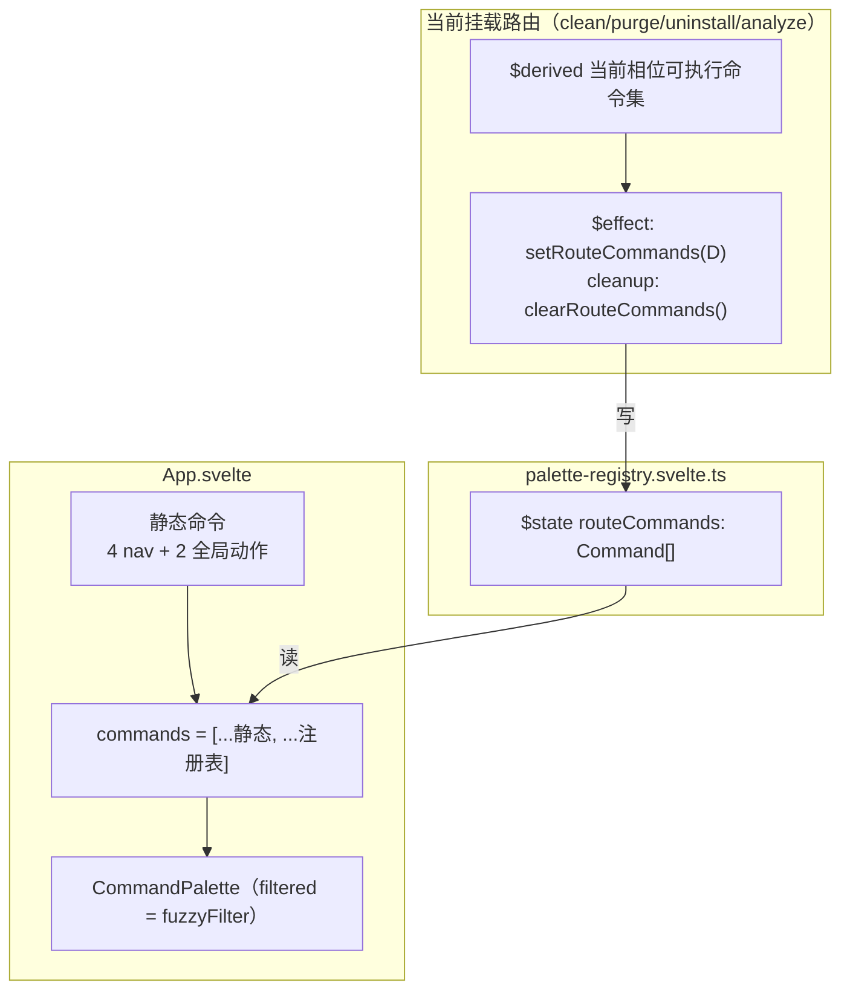

# feat: GUI 命令面板路由内动作命令（命令注册表）

给 `Cmd+K` 命令面板补上**路由内动作命令**——当前面板只有 4 条导航 + 2 条全局动作（都不依赖路由内部状态）。本轮让每个路由（clean/purge/uninstall/analyze）在挂载时把自己的**当前可用动作**（开始/取消扫描、移入废纸篓、删除标记等）注册进面板，卸载时注销。这是 move 7 命令面板（PR #51）**明列的下一段延后项**，机制在上一轮已预留（`Command.run: () => void` 扩展点，KTD3）。

**Product Contract preservation:** 无独立需求文档（solo 直接规划）；产品意图取自 ideation #7 与计划 022 的 Scope Deferred，未改动任何既有产品范围。

---

## 问题框定

面板机制在 PR #51 已完整（模糊匹配、焦点陷阱、键盘导航、与全局 modal 视觉一致），但命令集是 `App.svelte` 里的**静态数组**，只含跨路由通用项：

```
nav.clean / nav.purge / nav.uninstall / nav.analyze  （切 tab）
act.trash / act.fda                                    （全局动作）
```

路由内动作（"开始清理扫描""移入废纸篓""删除标记"）依赖各路由**内部 `$state`**（`phase`、`selectedItems`、`marked`…），静态数组无法表达。计划 022 因此把它列为延后项，并预留了两个扩展点：`Command` 模型的 `run: () => void`（导航与动作同构）、`App.svelte` 的 R4 焦点还原已预判"触发元素随导航命令卸载"的情形。

**要解决的缺口：** 开发者（主要用户）用面板只能切 tab，不能在面板里直接触发当前路由的主操作——而"键盘唤起 → 执行主操作"正是 Raycast/Linear 式加速器的核心价值。补上它，让面板从"导航器"变成"动作执行器"。

**不解决：** 参数化动作（进入某目录、选某个 App、跳面包屑）——它们需要"哪个项"的入参，不适合扁平命令列表；本轮只暴露**无参的路由级顶层动作**。

---

## 需求

- **R1｜路由动态注册：** 每个路由在挂载后把自己**当前相位下可用**的动作命令注册进面板，卸载时注销；面板显示 `静态命令 + 当前路由命令` 的并集。
- **R2｜反映相位：** 路由命令随内部相位/选择态变化（如 `scanning` 时"开始扫描"变为"取消扫描"、`selectedItems` 为空时不出现"移入废纸篓"）——命令集**只含此刻真能执行的动作**，不显示死命令（ideation #7 护栏「半成品比没有更糟」）。
- **R3｜安全模型零绕过（硬约束）：** 删除类命令必须触发路由既有的 `primaryDelete`/`openConfirm` **分流器**（纯 Safe/Moderate 直删、含 Risky 弹 `ConfirmDelete` 走 type-to-confirm），**绝不**直调删除 IPC 或绕过 `ConfirmDelete`。type-to-confirm 只在 modal 内发生，面板内不承载确认。见 `CONCEPTS.md` 安全模型与 `crates/gui/frontend/src/lib/ConfirmDelete.svelte`。
- **R4｜焦点交接：** 删除命令执行时面板关闭；若随即弹出 `ConfirmDelete`，焦点须落入 modal，不因面板关闭的焦点还原逻辑而落到错误元素。
- **R5｜加速器不越位（回归护栏）：** 四 tab 可见导航、既有 6 条静态命令、既有面板键盘/焦点契约（R1/R3/R4/R5/R7 e2e）全部不回归——面板仍是加速器，路由动作命令是**镜像既有按钮**的第二入口，不是唯一入口。
- **R6｜Analyze 词汇一致：** Analyze 是"浏览 + 逐项标记"模型（非类目多选），其删除命令用"删除标记"而非"移入废纸篓"，尊重其独立心智模型（ideation #7 护栏）。

---

## 关键技术决策

- **KTD1｜命令注册表用共享 rune 模块（非 context）：** 新增 `crates/gui/frontend/src/lib/palette-registry.svelte.ts`，内部持一个模块级 `$state<Command[]>` 与 `setRouteCommands(cmds)` / `clearRouteCommands()`。`App.svelte` 读该 state 与自己的静态数组合并成 `commands` 传给面板；路由 import 后在 `$effect` 里写入。
  - **为何不用 `setContext`/`getContext`：** context 需 App 作为 provider 包裹路由、路由 `getContext` 取——三处样板。仅 App + 当前路由两方共享、且同一时刻只有一个路由挂载，模块级 `$state` 更直接。Svelte 5 的 `.svelte.ts` rune 模块正是为此设计。
  - **单路由不变量：** tab 切换会卸载旧路由、挂载新路由，故注册表任一时刻只含**一个**路由的命令；`clearRouteCommands()` 在路由 `$effect` cleanup 中调用，天然随卸载清空。

- **KTD2｜反应式注册当前有效命令集（非 disabled 标记）：** 路由用 `$derived` 算出"此刻可执行的命令列表"，在 `$effect` 里 `setRouteCommands(list)`；相位/选择态变化触发 `$effect` 重跑、注册表随之更新、面板 `$derived filtered` 自动重排。
  - **为何不给 `Command` 加 `disabled` 字段：** 那需同时改 `palette.ts` 模型、`CommandPalette.svelte` 渲染（灰显 + Enter/click no-op）、`fuzzyFilter`；而"扫描中把'开始扫描'换成'取消扫描'"本就是按钮的既有交互（互斥出现），反应式注册即可镜像，`palette.ts` 保持零改动、纯函数不变。
  - **代价（已接受）：** 面板打开期间路由状态变了，命令集会实时增删（如扫描完成"取消"消失、"移入废纸篓"出现）——这是 Raycast 式上下文命令的预期行为，非缺陷。

- **KTD3｜删除命令 = 触发既有分流器：** 各路由删除命令的 `run` 直接调该路由既有的删除入口函数（Clean/Purge/Uninstall 的 `primaryDelete`、Analyze 的 `openConfirm`），复用其内部 Risky 判定与 `ConfirmDelete` 分流。命令层**不**碰 `doClean`/`doPurge`/`doUninstall`/`runDelete`/`deleteMarked` 等真正删除 IPC。这把 R3 硬约束落到"命令只是按钮的第二触发点"这一最小语义上。

- **KTD4｜命令 id 按路由命名空间：** `clean.scan` / `clean.cancel` / `clean.trash`、`purge.chooseDir` / `purge.scan` / …、`uninstall.rescan` / `uninstall.back` / `uninstall.delete`、`analyze.start` / `analyze.cancel` / `analyze.deleteMarked`。面板 `{#each … (cmd.id)}` 按 id keyed，命名空间保证跨路由唯一、且卸载注销后不与新路由命令冲突。

- **KTD5｜参数化动作出范围：** `selectApp`（选哪个 App）、`enter`（进哪个目录）、`gotoTrail`（跳哪层面包屑）需入参，不适合扁平列表——本轮不做（见 Scope Deferred）。`restoreInFinder` 是 toast/done 相位的瞬态上下文动作，同样延后。

---

## High-Level Technical Design

命令注册表的数据流与生命周期——静态命令常驻，路由命令随挂载/相位反应式流入、随卸载清空：



生命周期时序（以 Clean 为例）：

```
挂载 → onMount 自动开扫 → phase=scanning
       $effect 注册 [clean.cancel]（此刻只有"取消"可执行）
扫描完成 → phase=results, selectedItems 非空
       $effect 重跑 → 注册 [clean.scan(重扫), clean.trash(移废纸篓)]
切走 tab → 路由卸载 → $effect cleanup → clearRouteCommands()
       面板回到只剩静态 6 命令
```

关键不变量：注册表任一时刻 ≤ 一个路由的命令（单路由挂载）；命令集只含"此刻可执行"项（KTD2）；删除命令永远经分流器（KTD3）。

---

## 实现单元

### U1. 命令注册表原语 + App 接线

**Goal:** 建立路由命令的注册/合并/清空机制，让面板显示 `静态 + 当前路由` 命令并集，并处理删除命令关闭面板后的焦点交接。

**Requirements:** R1、R4、R5

**Dependencies:** 无

**Files:**
- `crates/gui/frontend/src/lib/palette-registry.svelte.ts`（新增）—— 模块级 `$state<Command[]>`、`routeCommands` getter、`setRouteCommands`、`clearRouteCommands`
- `crates/gui/frontend/src/App.svelte`（改）—— import 注册表；把静态 `commands` 改为 `$derived([...静态, ...routeCommands])` 传给面板；核验 `closePalette` 的 R4 焦点还原对"删除命令关闭面板 → ConfirmDelete 弹出"路径成立
- `crates/gui/frontend/src/lib/palette.ts`（**不改**，`Command` 模型保持 `{id,title,keywords?,run}`）

**Approach:**
- 注册表模块导出 `routeCommands`（读）、`setRouteCommands(cmds: Command[])`（覆盖式写，非 append——单路由不变量）、`clearRouteCommands()`（置空）。
- `App.svelte`：`commands` 从常量数组改为 `$derived`；静态 6 命令仍写在 App（KTD1「App 拥有 nav 与全局动作」），路由命令来自注册表。
- 焦点交接（R4）：既有 `closePalette` 已在触发元素脱离 DOM 时回退到 `.tab.active`。删除命令场景下触发元素是面板 input（关闭即卸载）→ 回退到 active tab，随后 `ConfirmDelete` 挂载应自聚焦。**核验** `ConfirmDelete.svelte` 是否挂载自聚焦；若否，此单元补最小聚焦（不扩散到删除逻辑）。

**Patterns to follow:** `App.svelte:32-39` 静态命令数组；`App.svelte:45-54` 焦点还原；`CommandPalette.svelte:28` `filtered` 反应式；Svelte 5 `.svelte.ts` rune 模块（仓库暂无先例，`$state` 在 `.svelte.ts` 顶层合法）。

**Test scenarios:**
- happy path：`setRouteCommands([a,b])` 后 `routeCommands` 等于 `[a,b]`；`clearRouteCommands()` 后为空。
- 覆盖语义：连续两次 `setRouteCommands`，第二次**替换**而非追加（长度不累积）。
- App 合并：注册表非空时面板命令数 = 6 + 路由命令数；为空时 = 6（回归静态）。
- 边界：路由命令 id 与静态 id 无碰撞（命名空间前缀，KTD4）——加一条断言/单测防回归。

**Verification:** `pnpm test`（vitest）注册表单测通过；`pnpm build`（svelte-check）无类型错误；面板在任一 tab 打开都能看到静态 6 命令。

---

### U2. Clean & Purge 路由命令（五相位模型）

**Goal:** Clean 与 Purge（共享 `idle|scanning|results|cleaning|done` 相位）注册各自的扫描/取消/删除命令，反应式镜像按钮的可用性。

**Requirements:** R1、R2、R3

**Dependencies:** U1

**Files:**
- `crates/gui/frontend/src/routes/Clean.svelte`（改）—— `$derived` 命令集 + `$effect` 注册/清空
- `crates/gui/frontend/src/routes/Purge.svelte`（改）—— 同上，含 `chooseDir` 与 `!target` 门禁

**Approach:**
- Clean 命令集（按 `phase`/`selectedItems`）：
  - `scanning` → `[{clean.cancel, "取消扫描", run: cancel}]`
  - `idle|results|done` → `[{clean.scan, "重新扫描", run: startScan}]` +（`selectedItems.length>0` 时）`{clean.trash, "移入废纸篓", run: primaryDelete}`
- Purge 命令集：
  - 恒含 `{purge.chooseDir, "选择目录", run: chooseDir}`（`scanning|cleaning` 时省略——按钮此时 disabled）
  - `idle` 且 `target` → `{purge.scan, "开始扫描", run: startScan}`；`results|done` → "重新扫描"
  - `scanning` → `{purge.cancel, "取消扫描", run: cancel}`
  - `selectedItems.length>0` → `{purge.trash, "移入废纸篓", run: primaryDelete}`
- `$effect(() => { setRouteCommands(cmds); return clearRouteCommands; })`——cleanup 随卸载/依赖变化触发。
- `run` 直接引既有函数名（`startScan`/`cancel`/`primaryDelete`/`chooseDir`），不复制逻辑（KTD3）。

**Patterns to follow:** `Clean.svelte:83/138/147` 动作函数；`Purge.svelte:83/120/177/186`；App 静态命令的 `{id,title,keywords,run}` 形状。

**Test scenarios（e2e，见 U5 统一落）：** 本单元产出被 U5 的 e2e 验证——此处列行为契约：
- Clean 扫描中打开面板 → 见"取消扫描"、不见"移入废纸篓"。
- Clean 扫描完成且有选中 → 见"重新扫描"+"移入废纸篓"；执行"移入废纸篓"关闭面板并触发既有删除流（纯 Safe 直删）。
- Purge 未选目录 idle → 见"选择目录"、不见"开始扫描"。
- 切离 Clean tab → 路由命令消失（面板回到静态 6）。
- Test expectation：路由命令的纯逻辑（`$derived` 命令集）若抽为可测纯函数则加单测；否则由 e2e 覆盖。

**Verification:** 手动/e2e 确认命令随相位增删；删除命令走既有确认流。

---

### U3. Uninstall 路由命令（九态两阶段模型）

**Goal:** Uninstall（`listReady`/`reviewReady`/`done` 等九态）注册重扫、返回列表、删除命令，尊重两阶段结构。

**Requirements:** R1、R2、R3

**Dependencies:** U1

**Files:**
- `crates/gui/frontend/src/routes/Uninstall.svelte`（改）

**Approach:**
- 命令集按 `phase`：
  - `listReady|listEmpty|listError` → `{uninstall.rescan, "重新扫描应用", run: startListScan}`
  - `reviewReady|reviewError|done` → `{uninstall.back, "返回应用列表", run: backToList}`
  - `reviewReady` 且 `selectedItems.length>0` → `{uninstall.delete, "移入废纸篓", run: primaryDelete}`
- `selectApp` 需入参（选哪个 App）→ 出范围（KTD5）。
- 复用 U1 的 `$effect` 注册模式。

**Patterns to follow:** `Uninstall.svelte:99/139/151`；`reviewing` 派生（`:73-75`）判断阶段。

**Test scenarios（e2e，U5 落）：**
- listReady 打开面板 → 见"重新扫描应用"、不见"移入废纸篓"。
- reviewReady 且有选中 → 见"移入废纸篓"；执行 → 触发既有删除分流（含 Risky 时弹 ConfirmDelete）。
- done → 见"返回应用列表"。

**Verification:** e2e 覆盖三相位命令差异；删除命令保留 Risky 分流。

---

### U4. Analyze 路由命令（树/标记模型 + 最严格安全）

**Goal:** Analyze（`idle|analyzing|ready|deleting`，浏览+标记模型）注册分析/取消/删除标记命令，用其独立词汇，且删除命令保留最严格的 fail-closed 安全分流。

**Requirements:** R1、R2、R3、R6

**Dependencies:** U1

**Files:**
- `crates/gui/frontend/src/routes/Analyze.svelte`（改）

**Approach:**
- 命令集：
  - `idle|ready` → `{analyze.start, "分析主目录"/"重新分析", run: startAnalyze}`
  - `analyzing` → `{analyze.cancel, "取消", run: cancel}`
  - `ready` 且 `marked.size>0` → `{analyze.deleteMarked, "删除标记", run: openConfirm}`（**词汇"删除标记"非"移入废纸篓"**，R6）
- `openConfirm`（`:172`）本就先 `classifyMarked` 回查安全分级、查询失败保守归 Risky（fail-closed），命令层直接引它即继承该保护（R3/KTD3）。
- `enter`/`gotoTrail` 需入参 → 出范围（KTD5）。

**Patterns to follow:** `Analyze.svelte:99/130/172`；fail-closed 分级（`:177-181,194`）；`CONCEPTS.md` 的 Analyze 与 fail-closed 定义。

**Test scenarios（e2e，U5 落）：**
- ready 且有标记 → 见"删除标记"（非"移入废纸篓"）；执行 → 走 `openConfirm`（弹 ConfirmDelete，保守项要求 type-to-confirm）。
- ready 无标记 → 不见"删除标记"。
- analyzing → 见"取消"、不见"删除标记"。

**Verification:** e2e 确认词汇与 fail-closed 分流；删除标记命令绝不绕过 ConfirmDelete。

---

### U5. 测试：注册表单测 + 路由动作命令 e2e + 安全/回归护栏

**Goal:** 把 U1–U4 的行为契约固化为测试；确保既有面板契约与安全模型零回归。

**Requirements:** R1–R6 全部

**Dependencies:** U1、U2、U3、U4

**Files:**
- `crates/gui/frontend/src/lib/palette-registry.test.ts`（新增，若注册表逻辑可纯测）—— set/clear/覆盖语义、id 无碰撞
- `crates/gui/frontend/e2e/command-palette-actions.spec.ts`（新增）—— 路由动作命令 e2e，复用 `support/tauri-mock.ts` + `fixtures.ts`
- `crates/gui/frontend/e2e/command-palette.spec.ts`（**不改**，作为既有契约回归基线）

**Approach:**
- e2e 每路由驱动到目标相位（mock 后端返回 fixture）→ `Cmd+K` 打开 → 断言命令出现/消失 → Enter/click 执行 → 断言副作用（IPC 被调 / ConfirmDelete 弹出 / 面板关闭）。
- 安全非回归：Analyze 删除标记命令执行后**必须**出现 ConfirmDelete 对保守项要求 token；断言不直接触发 `delete_marked` IPC。

**Test scenarios:**
- Covers R1：切到某 tab → 该路由命令出现在面板；切走 → 消失。
- Covers R2：Clean 扫描中只见"取消扫描"；完成后见"重新扫描"+"移入废纸篓"。
- Covers R3/R6：Analyze"删除标记"→ ConfirmDelete 弹出（保守项 requiresToken），未输入 token 时删除 IPC 不被调用。
- Covers R4：执行删除命令关闭面板后 ConfirmDelete 获焦（input 或确认按钮 focused）。
- Covers R5（回归）：既有 `command-palette.spec.ts` 全绿；四 tab 可见导航仍在；静态 6 命令仍可执行。
- 边界：路由无可执行动作的相位（如 Purge idle 未选目录）打开面板 → 只见"选择目录"+静态命令，不崩、不显死命令。

**Verification:** `pnpm test` + `pnpm test:e2e`（或项目既有 e2e 命令）全绿；既有面板 spec 无回归。

---

## 范围边界

### Deferred to Follow-Up Work
- **参数化动作命令**：`selectApp`（选 App）、`enter`（进目录）、`gotoTrail`（跳面包屑）——需"哪个项"入参，须命令面板支持二级选择/参数补全，独立一轮。
- **`restoreInFinder` 命令**：toast/done 相位的瞬态上下文动作，价值低且生命周期短，延后。
- **命令项副标题/分组/图标**：面板当前单行标题；路由命令多起来后可加"当前路由"分组标签或 `subtitle`，本轮不做（保持 `palette.ts` 模型不变）。
- **`Command.disabled` 灰显模型**：本轮用反应式注册"只显示可执行命令"（KTD2）替代；若未来需要"可见但灰显"提示，再引入 disabled 字段。

### 非目标（不属本产品当前形态）
- 面板承载 type-to-confirm 或任何删除确认——安全确认恒在 `ConfirmDelete` modal（R3 硬约束）。
- 面板成为路由动作的唯一入口——四 tab 导航与路由内按钮保留（R5）。

---

## 风险与依赖

- **R-A｜焦点交接错位（中）：** 删除命令关闭面板 → `ConfirmDelete` 弹出，若 modal 未自聚焦，焦点可能落到 active tab（App 回退逻辑）而非 modal。**缓解：** U1 核验 `ConfirmDelete` 挂载自聚焦；U5 加焦点断言。
- **R-B｜`$effect` 注册与相位重排竞态（低）：** 相位切换瞬间 `$effect` 重跑注册新命令集，与面板 `filtered` 重算同帧——Svelte 5 的 rune 依赖追踪保证一致，且命令集变化是幂等覆盖（`setRouteCommands`）。风险低，e2e 的"扫描完成"场景覆盖。
- **R-C｜卸载清空遗漏（低）：** 若某路由漏调 `clearRouteCommands`（`$effect` cleanup 未返回），切 tab 后旧命令残留。**缓解：** 统一用 `$effect(() => { setRouteCommands(x); return clearRouteCommands; })` 模式；U5 "切走 tab → 命令消失"断言防回归。
- **依赖：** 无新后端 IPC、无新依赖（零依赖模糊匹配与既有 IPC 复用）；纯呈现层。

---

## Definition of Done

- 四路由在各自相位下向命令面板注册可执行动作命令，切换/卸载时正确清空（R1/R2）。
- 所有删除类命令经既有 `primaryDelete`/`openConfirm` 分流器，Risky 项仍必经 `ConfirmDelete` type-to-confirm，无 IPC 绕过（R3/R6）。
- 删除命令关闭面板后焦点正确落入 `ConfirmDelete`（R4）。
- 既有 `command-palette.spec.ts` 与四 tab 导航零回归；静态 6 命令仍在（R5）。
- `palette.ts` 模型未改动（`Command` 仍 `{id,title,keywords?,run}`）。
- 新增注册表单测 + 路由动作命令 e2e 全绿；`svelte-check` 无类型错误；`cargo build`（GUI crate）不受影响（本轮不改 Rust）。

---

## Sources & Research

- `docs/ideation/2026-07-07-gui-redesign-ideation.md` Ranked Idea #7——面板是加速器非唯一入口、Analyze 独立心智模型、半成品比没有更糟等护栏。
- `docs/plans/2026-07-13-022-feat-gui-cmdk-command-palette-plan.md`——命令面板机制（KTD1 面板状态归 App、KTD3 `run` 扩展点）与 Scope Deferred「路由内动作命令」。
- `crates/gui/frontend/src/lib/palette.ts` / `CommandPalette.svelte` / `App.svelte`——现有命令模型、浮层、接线与 R4 焦点还原。
- 四路由动作面勘察（本轮）：各路由动作函数、相位门禁、选择门禁、删除安全分流（`primaryDelete`/`openConfirm` + `ConfirmDelete` + fail-closed 分级）。
- `CONCEPTS.md`——安全模型、Analyze、fail-closed、type-to-confirm 定义。
