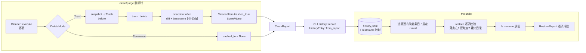

# feat: mc undo — 从废纸篓确定性放回上次清理

## Summary

给 macCleaner 补上 **`mc undo`**：把上一次 `clean`/`purge` 移入废纸篓的文件**确定性地放回原处**。beat-mole 分析里 `mc history` 只读账本已出货（#24），`undo` 是明列的"打赢项"仍空。

真实平台约束（已核实）：`trash` crate v5 的 `os_limited`（`list`/`restore_all`）**仅 Windows/Linux，macOS 明确排除**，且 macOS `trashItemAtURL_resultingItemURL_error(&url, None)` 丢弃了落点 URL——所以无法"事后枚举废纸篓再恢复"。本计划的核心决策：**在删除的单一咽喉点 `Cleaner::move_to_trash` 用"删除前后快照 `~/.Trash` 差集 + basename 词干匹配"确定性捕获落点**，经 `CleanReport → CleanedItem` 线程化到 CLI 记账，落入账本；`mc undo` 读账本映射逐项 `fs::rename` 放回，带完整安全护栏与优雅降级。无需引入 FFI/`unsafe`，不改移入系统废纸篓的既有安全承诺。

**Product Contract preservation:** 无独立需求文档（solo 直接规划）；产品意图取自 ideation `2026-07-07-next-step-tui-vs-gui.md` 的 beat-mole #4，未改动任何既有产品范围。

---

## Problem Frame

- **痛点**：用户清理后偶尔后悔（删错了/想找回某类缓存）。当前只能自己开 Finder 逐个"放回原处"，且账本只告诉他"删了什么"，给不出一键找回。CLI/无头场景更是完全没有恢复路径。
- **为什么现在做**：`mc history` 只读账本 + 只含成功项的 `deleted_paths` 已就位（#24），恢复闭环只差"落点记录 + 放回动作"。这是 beat-mole 经 Codex 核实的**打赢项**（竞品 `mc history` 追平后的差异化正面收益）。
- **产品原则约束**（`STRATEGY.md` / `CONCEPTS.md`）：安全、透明、确定性、零遥测、无静默危险操作。恢复必须**不覆盖**任何现有文件、失败逐项降级、可预览（dry-run）。

---

## Scope

### 本计划做

- CLI 新增 `mc undo [run-id]`：默认恢复**最近一条有落点映射**的账本条目；可指定 run-id。
- 在删除咽喉点捕获废纸篓落点，扩展 `CleanedItem` / `HistoryEntry` 携带 `原始路径 → 废纸篓落点` 映射（向后兼容旧账本行）。
- core 新增只读安全的 `restore` 恢复引擎 + `RestoreReport`。
- `--dry-run` 预览、`--json` 输出、无映射时降级到 Finder"放回原处"提示。

### Deferred to Follow-Up Work

- **TUI/GUI undo 入口**：GUI 已有 `open_trash`（委托 Finder"放回原处"）；把 `mc undo` 的确定性恢复接进 TUI Done 屏 / GUI UndoToast 是独立 UX，单独立项。
- **GUI analyze 删除路径（`platform::delete_all` 批量）的落点捕获**：analyze/uninstall 当前不写账本（仅 clean/purge 经 `history::record`），故不在本轮恢复范围；接入需先给这些路径补记账。
- **`undo` 动作本身入账**（记录"哪次 undo 放回了什么"）：本轮 undo 靠"放回后落点消失 → 二次 undo 自然 skip"实现幂等，不写反向账本。
- **外置卷 / 网络卷回收**：删除落到 `/Volumes/X/.Trashes/<uid>` 而非 `~/.Trash` 的项，落点捕获返回 `None`（记为不可确定性恢复），提示用户用 Finder。

### Out of Scope

- 修改 `mc-core` 的 `SafetyLevel`、规则匹配、删除授权模型或预选语义。
- 恢复**永久删除**（`--permanent`）的项——不可逆，物理上无法恢复，`undo` 明确不涉及。
- 恢复**已被用户清空废纸篓 / 手动放回**的项（落点已不存在 → 逐项 skip + 提示）。
- 引入任何 FFI / `unsafe` / 新第三方依赖。

---

## Requirements

- **R1 落点捕获（确定性）**：`Cleaner::execute` 在 `DeleteMode::Trash` 下，对每个成功移入废纸篓的项捕获其 `~/.Trash` 落点路径；`DeleteMode::Permanent` 恒为 `None`。捕获失败（无法读 `~/.Trash`、非 home 卷、差集歧义）不报错、记 `None`、清理主流程不受影响。
- **R2 账本携带映射**：账本条目在既有 `deleted_paths` 之外，新增 `原始路径 → 废纸篓落点` 的映射，**只含成功且捕获到落点的项**。旧账本行（无该字段）仍能正常加载（serde default）。
- **R3 恢复动作安全**：`restore` 逐项校验后 `fs::rename` 放回——① 落点仍存在于废纸篓；② 原址当前**空闲**（存在则 skip，绝不覆盖）；③ 原址父目录不存在则重建。任一项失败只记录并继续（优雅降级），返回逐项结果。
- **R4 `mc undo` 命令**：无参恢复最近一条有映射的账本条目；`mc undo <run-id>` 恢复指定条目；`--dry-run` 只预览不动文件；`--json` 输出结构化结果；账本无映射条目时提示"用 Finder 放回原处 + 打开 `~/.Trash`"。
- **R5 零回归**：`clean`/`purge`/`history` 现有行为、账本既有字段、只含成功项的语义、移废纸篓可恢复承诺全部不变。

---

## High-Level Technical Design

### 数据流：捕获 → 记账 → 恢复

### 落点捕获的确定性论证

- `Cleaner::execute` 是**单线程逐项**删除（`for item in items`），故可在**每个** `trash::delete` 前后各读一次 `~/.Trash` 顶层目录名集合。
- 落点 = `after \ before`（差集）中**名字词干匹配原文件 basename** 的那一个。词干匹配（如 `foo.log` 命中 `foo.log`/`foo 2.log`）用于排除并发进程（如 Finder）在同一瞬间产生的无关新条目——把"并发噪声误配"降为可判定。
- 差集为空或多于一个匹配 → 判定为不可确定 → `None`（诚实降级，不猜）。

---

## Key Technical Decisions

- **KTD1｜落点捕获放在 core `Cleaner::move_to_trash`，不引 FFI。** 这是所有 Trash 删除的单一咽喉点（clean/purge/uninstall 经 `Engine` 都走这里）。用 `std::fs::read_dir(~/.Trash)` 差集捕获，纯 std，**不碰 `trashItemAtURL` FFI、不加 `unsafe`**（守 CLAUDE.md：core 唯一 `unsafe` 仅 scanner.rs）。备选"自己调 NSFileManager 捕获 resultingItemURL"被否——需在 core 引入 objc2 FFI + unsafe，违反 core 无 UI 依赖/最小 unsafe 约束。
- **KTD2｜落点经 `CleanedItem.trashed_to: Option<PathBuf>` 线程化，不新开旁路。** 记账在 CLI 层（`history::record` 从 `CleanReport` 构建 `HistoryEntry`），故落点必须搭 `CleanReport` 的车到达记账点。`CleanedItem` 加一个 `Option` 字段最短路径，`#[serde(default)]` 保证 GUI/其他 `CleanReport` 消费者向后兼容。
- **KTD3｜账本用并行映射 `restorable: Vec<RestoreEntry{original, trashed_to}>`，`#[serde(default)]` 兼容旧行。** 不改动既有 `deleted_paths`（TUI 剪树等消费者依赖它）。旧账本行反序列化时 `restorable` 默认空 → `mc undo` 对旧条目自然给"用 Finder 放回"提示。
- **KTD4｜恢复引擎在 core 独立模块 `restore.rs`，纯文件操作 + 逐项 `RestoreReport`，镜像 cleaner 的优雅降级契约。** `fs::rename` 放回（同卷内原子）；跨卷（落点与原址不同卷，罕见）`rename` 会失败 → 记录该项失败并提示，不做复制回退（避免半复制的新风险面）。
- **KTD5｜绝不覆盖：原址存在即 skip。** 恢复的第一护栏。用户可能在删除后又在原址创建了同名文件；覆盖 = 新的数据丢失。存在即跳过 + 明确告知，把选择权交回用户。
- **KTD6｜`mc undo` 无参 = 最近一条有映射的条目，不是"最近一条"。** 旧条目（无映射）跳过不算数，避免"undo 却说没东西可恢复"的困惑。选择逻辑抽成可单测纯函数（输入 `&[HistoryEntry]` → 目标条目）。

---

## Implementation Units

### U1. 落点捕获：`Cleaner` 在 Trash 删除时确定性记录 `~/.Trash` 落点

- **Goal**：让每次成功移入废纸篓的项带上其废纸篓落点路径（捕获不到则 `None`），为记账与恢复提供确定性数据源。
- **Requirements**：R1、R5
- **Dependencies**：无
- **Files**：
  - `crates/core/src/models.rs`（`CleanedItem` 加 `trashed_to: Option<PathBuf>`，`#[serde(default)]`）
  - `crates/core/src/cleaner.rs`（`move_to_trash` 改为返回落点；`execute` 填入 `CleanedItem.trashed_to`）
  - `crates/core/src/platform.rs`（可选：`trash_dir()` 助手返回 `~/.Trash`，复用 `get_home_dir`）
- **Approach**：
  - 新增内部 `capture_trash_dest(path) -> Option<PathBuf>`：删除前读 `~/.Trash` 顶层名集合 `before`；`trash::delete(path)` 成功后读 `after`；取 `after \ before` 中 basename 词干匹配 `path.file_name()` 词干的唯一项，拼成 `~/.Trash/<name>` 返回；差集空/多义/读目录失败 → `None`。
  - `DeleteMode::Permanent` 分支不捕获，`trashed_to = None`。
  - 捕获逻辑对 `success == false` 的项不执行。
- **Patterns to follow**：`cleaner.rs` 现有优雅降级（`log::warn!` + 继续）；`platform::get_home_dir`。
- **Execution note**：先写捕获纯函数的单测（用临时目录模拟 `~/.Trash`，注入 before/after 名集合验证差集+词干匹配判定），再接进 `execute`。捕获函数应可脱离真实 `~/.Trash` 单测（把"读目录名集合"作为可注入的入参或内部小函数）。
- **Test scenarios**：
  - 差集恰一项且词干匹配 → 返回该落点路径。
  - 差集为空（删除未产生新条目 / 读不到目录）→ `None`。
  - 差集多项但仅一项词干匹配原 basename → 返回匹配项（并发噪声不误配）。
  - 差集多项且多项词干匹配 → `None`（不可确定，诚实降级）。
  - `DeleteMode::Permanent` 成功删除 → `trashed_to` 恒 `None`。
  - 删除失败项 → `success == false` 且 `trashed_to == None`，不影响其余项（沿用 `test_mixed_success_and_failure` 结构）。
  - `CleanedItem` 加字段后 `CleanReport` serde 往返正常；缺该字段的旧 JSON 能反序列化（`#[serde(default)]`）。

### U2. 账本 schema：`HistoryEntry` 携带 `restorable` 映射且向后兼容

- **Goal**：把 U1 捕获的落点落进账本，供 `mc undo` 读取；旧账本行无缝加载。
- **Requirements**：R2、R5
- **Dependencies**：U1
- **Files**：
  - `crates/core/src/history.rs`（新增 `RestoreEntry { original: PathBuf, trashed_to: PathBuf }`；`HistoryEntry` 加 `#[serde(default)] restorable: Vec<RestoreEntry>`；`from_report` 从 `report.cleaned` 里 `success && trashed_to.is_some()` 的项构建）
- **Approach**：`from_report` 遍历成功项时，若 `trashed_to` 为 `Some`，push 一条 `RestoreEntry`。既有 `deleted_paths`/`categories`/`freed`/`count` 逻辑不动。
- **Patterns to follow**：`history.rs` 既有 `from_report` 的"只计成功项"聚合；`entry_roundtrips_through_json` 测试风格。
- **Execution note**：给旧行兼容写一条显式回归测试（手写一段不含 `restorable` 字段的 JSON 行，`load` 后 `restorable` 为空 Vec）。
- **Test scenarios**：
  - `from_report`：两成功项其一有落点、一失败 → `restorable` 仅含有落点的成功项。
  - 全部无落点（如全 Permanent）→ `restorable` 为空。
  - 序列化-反序列化往返：含 `restorable` 完整还原。
  - **向后兼容**：加载不含 `restorable` 字段的旧账本行 → `restorable == vec![]`，其余字段正常（保护 #24 已写入的历史账本）。
  - `load_skips_malformed_lines` 等既有测试仍通过（不回归）。

### U3. 恢复引擎：core `restore` 模块，逐项校验后放回

- **Goal**：给定一组 `RestoreEntry`，安全地把废纸篓落点放回原址，逐项降级并汇报。
- **Requirements**：R3
- **Dependencies**：U2
- **Files**：
  - `crates/core/src/restore.rs`（新建：`RestoreOutcome`/`RestoreReport`；`restore(entries, dry_run) -> RestoreReport`）
  - `crates/core/src/lib.rs`（`pub mod restore;`）
- **Approach**：
  - 每项：`dry_run` 时只判定"可恢复/将 skip"不动文件；否则 ① 落点不存在 → skip(`TrashMissing`)；② 原址已存在 → skip(`TargetOccupied`，不覆盖，KTD5)；③ 原址父目录不存在 → `create_dir_all`；④ `fs::rename(trashed_to, original)`，失败（如跨卷）→ 记 `Failed(err)`。
  - `RestoreReport` 汇总 restored / skipped(原因) / failed 逐项，附计数。
- **Patterns to follow**：`cleaner.rs` 的 `CleanReport`/`CleanedItem` 逐项成败结构与优雅降级。
- **Execution note**：核心安全断言优先——"原址被占绝不覆盖"必须有红→绿测试锁定。
- **Test scenarios**：
  - 正常：落点在废纸篓、原址空、父目录在 → rename 放回，原址出现、落点消失，`restored` 计 1。
  - 原址父目录不存在 → 自动 `create_dir_all` 后放回成功。
  - **原址已被占**（同名文件已重新存在）→ skip(`TargetOccupied`)，**原文件内容不被覆盖**（断言原址内容不变），落点保持不动。
  - 落点已不在废纸篓（模拟用户清空）→ skip(`TrashMissing`)，不报错。
  - `dry_run == true` → 不动任何文件，报告标注每项将执行的动作。
  - 幂等：对同一批连续 restore 两次，第二次全部 skip(`TrashMissing`)（落点已被第一次移走）。
  - 混合批次：一项成功、一项占用 skip、一项落点缺失 skip → 计数分别正确，互不影响。

### U4. `mc undo` CLI 命令

- **Goal**：把恢复能力暴露为 `mc undo [run-id]`，含预览、JSON、无映射降级提示。
- **Requirements**：R4、R5
- **Dependencies**：U3
- **Files**：
  - `crates/cli/src/main.rs`（`Commands::Undo { run_id: Option<String> }` + 分发）
  - `crates/cli/src/commands/undo.rs`（新建：选条目 + 调 `restore` + 渲染）
  - `crates/cli/src/commands/mod.rs`（`pub mod undo;`）
- **Approach**：
  - 选条目纯函数 `select_entry(entries, run_id) -> Option<&HistoryEntry>`：给 run-id 精确匹配；否则取**最后一条 `restorable` 非空**的条目。
  - 目标条目为空/无映射 → 打印"该次清理无确定性落点记录，可打开 `~/.Trash` 用 Finder『放回原处』"，并（非 dry-run 且 tty 时）友好提示路径；不视为错误。
  - `cli.dry_run` 透传给 `restore`；`cli.json` 输出 `RestoreReport` 的结构化 JSON。
  - 复用 `history::default_path()` / `history::load()`。
- **Patterns to follow**：`commands/history.rs`（load + json 分支 + 中文渲染 + `humanize_age` 风格）；`main.rs` 现有子命令注册。
- **Execution note**：`select_entry` 是纯函数，优先单测；文件系统交互复用 U3 已测的 `restore`，CLI 层只测选择/降级/渲染分支。
- **Test scenarios**：
  - `select_entry`：多条目、最后一条有映射 → 选它；最后一条无映射但更早的有 → 选更早那条有映射的；给定存在的 run-id → 精确命中；给定不存在的 run-id → `None`。
  - 空账本 / 全无映射 → 命令走降级提示分支，返回 `Ok`（非 Err），提示含 `~/.Trash`。
  - `--json` → 输出可解析的 `RestoreReport` JSON。
  - `--dry-run` → 不动文件（由 U3 保证，CLI 层断言透传）。
  - `Covers R4.` 无参调用选中最近有映射条目并触发 restore。

---

## Verification Contract

- `cargo test -p mc-core restore::` 与 `cargo test -p mc-core history::` 全绿；新增捕获/兼容/安全护栏测试通过。
- `cargo test -p mc`（CLI）覆盖 `select_entry` 与降级分支。
- `cargo clippy --all-targets` 无新增告警（pedantic 全开）。
- 手动冒烟（开发机）：建临时文件 → `mc clean`/或构造一次经 `Cleaner` 的 Trash 删除 → `mc undo --dry-run` 预览 → `mc undo` 放回 → 确认文件回到原址、`~/.Trash` 对应项消失；再 `mc undo` 应全部 skip（幂等）。
- 兼容冒烟：用 #24 已存在的旧 `history.jsonl`（无 `restorable`）→ `mc history` 正常、`mc undo` 给 Finder 降级提示、不 panic。

## Definition of Done

- U1–U4 全部实现，测试场景全部有对应测试且通过。
- R1–R5 满足；"原址被占绝不覆盖""失败逐项降级""永久删除不涉及"三条安全不变量有测试锁定。
- 账本向后兼容（旧行加载不丢、`deleted_paths` 语义不变）。
- 无新增 `unsafe`、无新第三方依赖、clippy 干净。
- LFG 续跑精简、审查、（如适用）浏览器测试、提交、PR、CI。

---

## Assumptions（pipeline 模式下自动决策，供 PR 验收时纠偏）

- **A1 采用确定性自管恢复（方案 A），非 Finder 委托（方案 B）/basename 尽力匹配（方案 C）。** 依据：用户明确要"undo 撤销闭环"且 GUI 已有 Finder 委托（`open_trash`），要的是真正一键 undo；仓库 ethos 要求确定性、不可猜。
- **A2 落点捕获用"快照差集 + 词干匹配"而非 NSFileManager FFI。** 守 core 无 UI 依赖 / 最小 `unsafe`。代价：并发极端情形/非 home 卷会降级为 `None`（诚实不猜）。
- **A3 undo 仅对本功能上线后的删除生效。** 历史账本条目无落点映射 → 走 Finder 降级提示。这是"记录落点"方案的固有边界，非缺陷。
- **A4 MVP 仅 CLI `mc undo`（clean/purge 路径）。** TUI/GUI 入口、GUI analyze 批量删除路径的捕获均列为 follow-up。
- **A5 首个恢复目标条目按"最近一条有映射"选取**（无参形态），而非严格"最近一条"。
