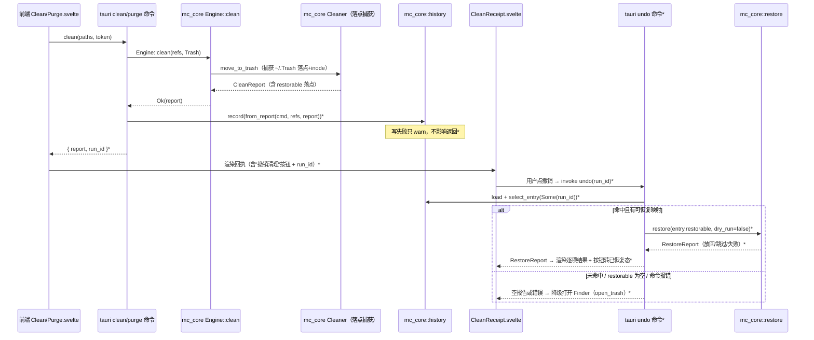

# feat: GUI 一键 undo — 清理回执里确定性放回上次清理

## Summary

给 GUI 补上**真一键 undo**：清理回执上的"在访达中恢复"（只打开 Finder 让用户手动放回）升级为**确定性放回原处**，复用 CLI `mc undo` 已出货的 UI 无关核心引擎（`mc_core::history` 账本 + `mc_core::restore` 恢复）。

核心事实（已核实代码）：

1. **GUI 从不写清理账本**。`crates/gui/src/commands/clean.rs` / `purge.rs` 调 `Engine::clean(DeleteMode::Trash)` 后直接返回 `CleanReport`——core 已在删除咽喉点捕获废纸篓落点（`cleaner.rs:25`），但 GUI 没有 CLI 那样的 `history::record` 旁路写入，落点被丢弃。没有账本 = 没有 undo 数据源。
2. **GUI 只做假 undo**。`crates/gui/src/commands/trash.rs` 的 `open_trash` 明确注释"不做延迟执行的假 undo……单独立项，见计划 Scope Boundaries"——它等的就是本计划要接的核心引擎。
3. **核心引擎全部 UI 无关、可直接复用**：`mc_core::history::{record, load, default_path, HistoryEntry::from_report}` + `mc_core::restore::{restore, RestoreReport, RestoreStatus}`。CLI 只是薄封装（`crates/cli/src/commands/history.rs` 的 `record` 包装 + `undo.rs` 的 `select_entry` + 渲染）。

本计划：GUI clean/purge 成功后写账本（与 CLI 同源、同样优雅降级）；新增 `undo` tauri 命令读账本 + 调 `restore`；回执 UI 把"打开 Finder"换成真放回、渲染 `RestoreReport`、对无落点项降级回 Finder。无新 FFI、无 `unsafe`、不改移废纸篓的既有安全承诺。

**Product Contract preservation:** 无独立需求文档（solo 直接规划）；产品意图取自 beat-mole ideation #1×#4 与已出货的 024 CLI undo 计划，未改动任何既有产品范围。

---

## Problem Frame

- **痛点**：GUI 用户清理后想反悔，只能点"在访达中恢复"→ 自己在 Finder 里逐个"放回原处"。CLI 用户已有 `mc undo` 一键确定性放回（PR #53），GUI（#1 打赢 Mole 的核心界面）反而落后——界面越"友好"越该有一键 undo。
- **为什么现在做**：undo 是 beat-mole 明列的**打赢项**（Mole 缺 undo）。CLI 侧刚把核心引擎（账本落点捕获 + restore 恢复）打磨到确定性可用并出货；GUI 复用它的边际成本很低，是"同一引擎、多界面适配"策略（STRATEGY.md「多界面适配」track）的直接兑现。
- **产品原则约束**（`STRATEGY.md` / `CONCEPTS.md`）：安全、透明、确定性、零遥测、无静默危险操作。恢复必须**不覆盖**任何现有文件（`restore` 引擎已保证）、失败逐项降级、账本写入失败绝不影响清理主流程。

---

## Scope

### 本计划做

- GUI `clean` / `purge` 成功清理后**写清理账本**（`HistoryEntry::from_report` + `history::record`），与 CLI 同源、同样优雅降级（写失败只 warn、不影响删除结果、无成功项不写）。
- 新增 `undo` tauri 命令：读账本、选取目标条目、调 `mc_core::restore::restore`、返回 `RestoreReport`。
- 回执组件 `CleanReceipt.svelte`（及 purge 回执，若有）把"在访达中恢复"升级为**"撤销清理 / 放回原处"**一键：调 `undo` → 渲染 `RestoreReport`（放回 N 项 / 跳过 M 项 / 失败 K 项）；无确定性落点时降级到打开 Finder。
- 把 CLI `undo.rs` 的 `select_entry` 选取逻辑上提到 `mc_core::history`（两界面共享，消除重复）。
- 单测（core 选取函数、GUI 命令）+ 前端 e2e（撤销触发 undo、渲染结果、无落点降级）。

### 不做（Deferred to Follow-Up Work）

- **按历史 run 选择 undo**：本计划 undo 绑定**回执自身的 run_id**（撤销"这张回执那次"，见 KTD1）。把某个更早历史 run 的 undo（需在历史视图里选择任意 run-id）留待 GUI history 视图落地时做。
- **GUI history 视图**（`mc history` 的可视化）：本计划只写账本 + undo，不做历史列表/趋势 UI。
- **uninstall/analyze 路由的真 undo**：这两条路由本计划**不写账本、不给真 undo**，其回执/浮层的"在访达中恢复"保持仅开 Finder（KTD5）。是否给它们写账本 + 真 undo 属后续独立项——需先想清 uninstall 残留放回的语义（app 已卸载后放回残留是否有意义）。
- **permanent 删除的 undo**：不可行（沿用 CLI 硬约束，永久删除无落点）。GUI 当前恒走 `DeleteMode::Trash`，无 permanent 路径，不受影响。

---

## Requirements

- **R1** GUI 每次成功的 clean/purge 都写一条账本记录，携带 `restorable`（原始路径→废纸篓落点）映射，并把该条目 `run_id` 回传前端；写入失败优雅降级不影响清理结果。
- **R2** 回执提供一键"撤销清理"，用回执自身的 `run_id` 精确命中本次清理，对可确定性放回的项调用核心 restore 引擎放回原处（**只**限 clean/purge 路由）。
- **R3** restore 结果向用户如实呈现：放回 N 项、跳过 M 项（如原位置已被占用，与失败**视觉分列**）、失败 K 项，逐项可见失败原因；结果区带 `aria-live` 供屏幕阅读器播报。
- **R4** 本次清理无任何确定性落点（本次 run_id 条目 `restorable` 为空），或 undo 命令报错时，降级为打开 Finder 的手动放回提示，绝不假装成功、绝不放回别的清理。
- **R5** 恢复动作复用 `mc_core::restore`，继承其安全护栏：不覆盖现有文件、逐项校验（inode 身份）、逐项失败降级。
- **R6** 账本写入与选取逻辑与 CLI 同源，不引入第二套语义（`select_entry` 上提到 core 共享，CLI/GUI 共用）。
- **R7** 撤销成功后按钮进入已恢复态（禁用/隐藏），二次点击不得对已放回的文件重跑 restore 而产生"全失败"报告；uninstall/analyze 回执与 toast 的恢复入口行为不变（仍仅开 Finder）。

---

## Key Technical Decisions

### KTD1 — undo 绑定回执自身的 run_id（不用"全局最近"选取）

**（评审修正：原设计用 `select_entry(None)` 全局最近条目，被证伪。）** 账本 `~/.local/state/mc/history.jsonl` 是 **CLI 与 GUI 共享的单一文件**（System-Wide Impact 明列双向读写），`select_entry(None)` = `entries.iter().rev().find(|e| !e.restorable.is_empty())` 取的是**跨所有写入方的全局最近含落点条目**，不是"本回执那次"。三个真实反例会导致**放回错误的清理**：

1. 用户 GUI clean 后、点撤销前，在终端跑了 `mc clean`/`mc purge`——较新的 CLI 条目被 undo 命中，复活终端清理的文件，GUI 自己的文件仍在废纸篓，用户以为撤销了 GUI 清理，实则相反。
2. 用户连续两次 GUI clean（回执仍停留在第一次），点第一张回执的撤销——放回的是第二次。
3. 落点未捕获时本次条目 `restorable` 为空，`select_entry(None)` **跳过**它返回更旧的条目——R4 的"无落点→Finder 降级"分支永不可达（coherence 证实）。

**修正决策**：GUI clean/purge 写账本后，把该条目的 `run_id` 经 IPC 回传前端；回执持有它；点撤销时 undo 命令收 `run_id: String`，用 `select_entry(Some(&run_id))` **精确命中本回执那次**。命中的条目若 `restorable` 为空 → 返回空报告 → 前端走 Finder 降级（R4 恢复可达）。

_权衡_：多一次 `run_id` IPC 回传（写账本时顺带返回，非新往返轮次），换取确定性正确——回执撤销永远只作用于它自己那次清理，杜绝共享账本竞态与顺序回执错配。这直接兑现"确定性/无静默危险操作"产品原则。此决策同时**确定命令签名为 `run_id: String`**（非 `Option`，消除原 A4 的签名二义）。

### KTD2 — 账本写入在 GUI 命令层旁路，不进 `Engine`/`Cleaner`

账本是**旁路观测**，不是清理的一部分（CLI 也在命令层写，`history.rs:record`）。GUI 在 `clean`/`purge` 的 `spawn_blocking` 闭包里、`Engine::clean` 返回 `Ok(report)` 之后写：`let entry = HistoryEntry::from_report(cmd, &refs, &report); history::record(&entry, &history::default_path())`，失败只 `log::warn!` 不改变返回给前端的 `CleanReport`；命令把 `entry.run_id` 一并回传前端供回执撤销（KTD1）。**前置**：`crates/gui/Cargo.toml` 当前**无 `log` 依赖**（评审核实，GUI 无处用 log 宏），须先加 `log = { workspace = true }`（镜像 `crates/cli/Cargo.toml`），否则 `log::warn!` 不编译。

_权衡_：不把账本下沉进 `Engine::clean`——那会让核心引擎耦合账本落点/持久化，且 CLI 已确立"命令层写账本"的架构惯例。保持两界面对称。

### KTD3 — `select_entry` 上提到 `mc_core::history`，CLI 改为调用

当前 `select_entry` 在 `crates/cli/src/commands/undo.rs`，是纯函数 `fn(&[HistoryEntry], Option<&str>) -> Option<&HistoryEntry>`。GUI undo 需要同一逻辑。上提为 `mc_core::history::select_entry`（或 `select_restorable`），CLI 改为 `pub use` / 转调，GUI 直接用。消除复制，保证两界面选取语义永不漂移（R6）。

_权衡_：一次极小的 core 表面扩张，换来单一真源。替代方案"GUI 复制一份"会埋下两套逻辑漂移的隐患，违反 CONCEPTS 的确定性/一致性原则。

### KTD4 — 回执 undo 复用现有 IPC/命令模式，不引入延迟执行

新 `undo` 命令与既有 tauri 命令同构（`#[tauri::command] async fn`、返回 `Result<RestoreReport, String>`），在 `lib.rs` 的 `generate_handler!` 注册。`trash.rs::open_trash` 保留为降级路径（R4），不删除。**不做**"延迟真正删除、点撤销就中止"这类假 undo——真放回走已出货的确定性 restore 引擎。

### KTD5 — 只有 clean/purge 回执得到真 undo；共享组件按路由传入行为，不误伤 uninstall/analyze

**（评审核实的组件拓扑，纠正原 A2 的"仅 clean/purge 共享回执"误判。）** `CleanReceipt.svelte` **也被 `Uninstall.svelte` 复用**；更醒目的恢复入口是 `UndoToast.svelte`，它在**四条删除路由**（Clean/Purge/Uninstall/Analyze）都渲染，各自带一个仍旧只开 Finder 的"在访达中恢复"按钮。若把 `CleanReceipt`/`UndoToast` 的按钮统一改成调 `undo`，会让 uninstall/analyze 回执的撤销去放回**一次无关的 clean/purge**（这两条路由本计划不写账本、无本次 run_id）——又一个错误放回。

**修正决策**：真 undo 只给写账本的 clean/purge。共享组件（`CleanReceipt` / `UndoToast`）**不硬编码撤销行为**，改为由路由传入 `onRestore` 回调 + 可选 `runId`：

- clean/purge 路由传"真 undo 流"（带本次 `run_id`）；
- uninstall/analyze 路由**保持传原 `open_trash`（仅开 Finder）**，行为不变；
- undo 成功后由持有方 dismiss 对应 `UndoToast`，避免 toast 的"已移到废纸篓"文案与已撤销事实相矛盾。

uninstall/analyze 是否也写账本 + 得真 undo，属 Deferred（见 Scope）。本决策把"共享组件被四路由复用"从隐患变成显式的按路由注入，杜绝跨路由错误放回。

---

## High-Level Technical Design

清理 → 写账本 → 撤销 → 放回的数据流（新增部分标 `*`）：

---

## Implementation Units

### U1. 上提 `select_entry` 到 `mc_core::history`，CLI 转调

**Goal:** 把账本条目选取逻辑变成两界面单一真源（KTD3 / R6）。

**Requirements:** R6

**Dependencies:** 无

**Files:**
- `crates/core/src/history.rs`（新增 `pub fn select_entry(entries, run_id)`，带文档注释与单测）
- `crates/cli/src/commands/undo.rs`（删除本地 `select_entry`，改调 `history::select_entry`；保留其余渲染/降级逻辑不变）

**Approach:** 原样搬迁纯函数（`Some(id) => find by run_id`；`None => rev().find(!restorable.is_empty())`）。CLI 侧 `use mc_core::history::select_entry` 或 `history::select_entry(...)`。不改变任何行为，纯重构 + 复用点扩张。

**Execution note:** 先跑既有 CLI undo 测试作为特征基线，搬迁后必须全绿（行为不变）。

**Patterns to follow:** `crates/core/src/history.rs` 既有 `pub fn`（`record`/`load`/`default_path`）的文档密度与测试风格。

**Test scenarios:**
- `select_entry(entries, Some(id))` 命中对应 run_id（即便该条目 `restorable` 为空也返回，降级判断交调用方）。
- `select_entry(entries, Some(不存在的 id))` 返回 `None`。
- `select_entry(entries, None)` 跳过 `restorable` 为空的旧记录，返回最近一条**含**可恢复映射的条目。
- `select_entry(&[], None)` 返回 `None`。
- 全部条目 `restorable` 为空时 `select_entry(entries, None)` 返回 `None`。

**Verification:** `cargo test -p mc-core history::` 与既有 `cargo test -p mc undo`（或对应模块）全绿。

---

### U2. GUI clean/purge 成功后写清理账本并回传 run_id

**Goal:** 让 GUI 删除产生账本记录，携带确定性落点映射，并把本次 `run_id` 回传前端，成为 undo 的数据源与撤销目标锚点（R1 / KTD1 / KTD2）。

**Requirements:** R1

**Dependencies:** 无（可与 U1 并行）

**Files:**
- `crates/gui/Cargo.toml`（**前置**：加 `log = { workspace = true }`——GUI 当前无 log 依赖，`log::warn!` 否则不编译；镜像 `crates/cli/Cargo.toml`）
- `crates/gui/src/commands/clean.rs`（`Engine::clean` 返回 Ok 后写账本；返回类型改为携带 `run_id`）
- `crates/gui/src/commands/purge.rs`（同上，`HistoryCommand::Purge`）
- 可选：`crates/gui/src/commands/mod.rs` 或新 `history.rs` 放共享的 GUI 写账本薄封装（避免 clean/purge 复制），镜像 CLI `commands/history.rs::record` 的降级语义

**Approach:** 在 `spawn_blocking` 闭包内、拿到 `report` 后：`let entry = HistoryEntry::from_report(HistoryCommand::Clean, &refs, &report); if let Err(e) = history::record(&entry, &history::default_path()) { log::warn!(...) }`。`refs` 已存在（提交给 `Engine::clean` 的 `Vec<&ScanItem>`）。**成功项为 0 不写**（`from_report`/`record` 语义），写失败不改变返回的清理数据。命令返回类型从 `CleanReport` 扩为携带 `run_id` 的响应（如 `CleanResponse { report: CleanReport, run_id: Option<String> }`，`Serialize`；无成功项/写失败时 `run_id = None`，前端据此不显示撤销按钮）。purge 用 `HistoryCommand::Purge`。

**Execution note:** 账本是旁路——测试要证明"写失败/无成功项不影响清理返回值"，而非只测 happy path。返回类型变更会波及 clean/purge 的前端调用点（U4 一并改）。

**Patterns to follow:** `crates/cli/src/commands/history.rs::record`（无成功项跳过、写失败只 warn 不返 Err）；`crates/gui/src/commands/clean.rs` 既有 `spawn_blocking` + 短临界区取项模式。

**Test scenarios:**
- clean 成功删除若干项后，账本文件新增一条 `HistoryEntry`，`command == Clean`，`restorable` 含捕获到落点的成功项；命令返回的 `run_id` == 该新条目的 `run_id`（用 tempfile + 临时 `~/.Trash` 或注入 `default_path`，与 core `cleaner.rs` 测试同法）。
- purge 成功后写入 `command == Purge` 的条目，返回对应 `run_id`。
- 成功项为 0（全部失败/空选）时**不写**账本、返回 `run_id == None`（无空记录污染、前端不显撤销）。
- 账本写入失败（如目录不可写）时命令仍返回正常清理数据、`run_id == None`（旁路降级）。
- Covers R1. 落点捕获细节由 core `cleaner.rs` 既有测试保证，本单元只验证"GUI 确实调用了写账本、回传 run_id 且降级正确"。

**Verification:** `cargo test -p mc-gui`（或对应 crate 名）clean/purge 模块全绿；`cargo build -p mc-gui`（验证 log 依赖已加）；手动跑 GUI clean 后 `~/.local/state/mc/history.jsonl` 出现新行含 `restorable`。

---

### U3. 新增 `undo` tauri 命令（run_id 精确命中）

**Goal:** 后端提供一键确定性放回：按回执 run_id 精确命中账本条目 → restore → 返回结果（R2 / R3 / R4 / R5 / KTD1 / KTD4）。

**Requirements:** R2, R3, R4, R5

**Dependencies:** U1（用 `history::select_entry`）、U2（有账本可读 + run_id 来源）

**Files:**
- `crates/gui/src/commands/undo.rs`（新文件，`#[tauri::command] pub async fn undo(run_id: String) -> Result<RestoreReport, String>`）
- `crates/gui/src/commands/mod.rs`（挂载模块）
- `crates/gui/src/lib.rs`（`generate_handler!` 注册 `commands::undo::undo`）

**Approach:** 收前端传来的本回执 `run_id`（KTD1，签名定为 `run_id: String`，非 `Option`）：`let entries = history::load(&history::default_path()); let Some(entry) = history::select_entry(&entries, Some(&run_id)) else { return Ok(RestoreReport::default()) };`。命中的条目若 `restorable` 为空（落点未捕获）→ 同样返回空 `RestoreReport`（前端据此走 Finder 降级，R4）。否则在 `spawn_blocking` 里 `restore::restore(&entry.restorable, dry_run=false)`（`fs::rename` 是阻塞 IO）返回 `RestoreReport`。**不用** `select_entry(None)`——那会命中跨界面/跨次清理的全局最近条目（KTD1 反例）。

**Execution note:** `RestoreReport`/`RestoreOutcome`/`RestoreStatus` 已 derive `Serialize`（`restore.rs:27/41/50`，已核实），可直接过 IPC，无需改 core。但 `restored_count`/`skipped_count`/`failed_count` 是 `RestoreReport` 的**方法而非序列化字段**（序列化只含 `outcomes` + `dry_run`，评审核实）——前端不能镜像出计数字段，须由 `outcomes` 按 `RestoreStatus` 派生（见 U4）。

**Patterns to follow:** `crates/cli/src/commands/undo.rs::run`（选取 + 降级分支）；`crates/gui/src/commands/clean.rs` 的 `spawn_blocking` + 错误 `map_err(|e| format!(...))` 模式。

**Test scenarios:**
- 账本有匹配 `run_id` 且含 `restorable` 的条目 → `undo(run_id)` 返回的 `RestoreReport` 放回项数 == 落点项数（用临时账本 + 真实临时文件在临时 Trash，端到端放回并断言文件回到原路径）。
- `run_id` 不存在于账本 → 返回空 `RestoreReport`（`restored_count() == 0`），不 panic（R4 降级触发点）。
- 命中条目但 `restorable` 为空（模拟落点未捕获）→ 返回空 `RestoreReport`（R4 降级可达——这是原全局选取会漏掉的分支）。
- **共享账本竞态**：账本里存在一条**更新的、不同 run_id** 的含落点条目时，`undo(旧 run_id)` 仍只放回旧条目的项，不碰新条目（锁死 KTD1 修正）。
- restore 逐项降级：原位置已被占用的项计入 skipped 而非 failed，其余仍放回（委托 `mc_core::restore` 既有护栏，GUI 侧断言报告如实透传）。
- Covers R2, R3, R4, R5.

**Verification:** `cargo test -p mc-gui undo`；`cargo clippy -p mc-gui --all-targets` 无警告（注意 `unused_async`）。

---

### U4. 回执/浮层前端：撤销清理一键 + 结果渲染 + 降级 + 已恢复态（按路由注入）

**Goal:** 把 clean/purge 回执与浮层的"在访达中恢复"升级为真一键撤销，如实渲染 restore 结果，覆盖错误/无落点/已恢复态；uninstall/analyze 行为不变（R2 / R3 / R4 / R7 / KTD5）。

**Requirements:** R2, R3, R4, R7

**Dependencies:** U3（`undo` 命令可用）、U2（前端拿到 `run_id`、返回类型已变）

**Files:**
- `crates/gui/frontend/src/lib/CleanReceipt.svelte`（回执按钮行为改为**由 props 注入的 `onRestore` + 可选 `runId`**，不硬编码；渲染 `RestoreReport`；结果区加 `role="status" aria-live="polite"`；skip 与 fail 视觉分列；成功后进已恢复态）
- `crates/gui/frontend/src/lib/UndoToast.svelte`（**评审核实：四路由都渲染的第二恢复入口**——同样改为按注入行为；clean/purge 传真 undo、undo 成功后 dismiss 该 toast；uninstall/analyze 保持 `open_trash`）
- `crates/gui/frontend/src/lib/ipc.ts`（新增 `undo(runId)` 包装 + `RestoreReport`/`RestoreOutcome`/`RestoreStatus` 类型；类型只含 `outcomes` + `dry_run`，**计数由前端按 `RestoreStatus` 过滤 `outcomes` 派生**，不假设有 count 字段）
- `crates/gui/frontend/src/routes/Clean.svelte` / `Purge.svelte`（接线真 undo 流：持有 U2 返回的 `run_id`，传给回执/toast 的 `onRestore`）
- `crates/gui/frontend/src/routes/Uninstall.svelte` / `Analyze.svelte`（**保持**传 `open_trash` 的 `onRestore`，行为不变——防共享组件误伤）

**Approach:** clean/purge 路由：按钮文案"打开 Finder"→"撤销清理 / 放回原处"，点击 → `await undo(runId)`。三态 + 边界：
- `restored_count > 0`（由 `outcomes` 派生）→ 渲染"已放回 N 项（+跳过 M / 失败 K，逐项原因）"，skip 项用**中性**样式（表达"原位置已占用、原文件未受影响"）与红色 failures 段分列；
- 空报告（未命中/落点为空）→ "本次清理无法自动放回"并保留"在访达中恢复"（`open_trash`）降级入口（R4）；
- `undo()` **reject**（账本读失败/IPC 错误）→ try/catch 呈现失败提示 + 保留 Finder 兜底（沿用既有 clean 的 error 横幅模式）；
- 撤销**进行中**禁用按钮；**成功后**按钮转已恢复态（禁用/隐藏），杜绝二次点击对已放回文件重跑 restore 产生"全失败"报告（R7）。

uninstall/analyze 路由：`onRestore` 仍是 `open_trash`，无撤销、无 run_id，组件按注入行为渲染，行为与今天一致。视觉沿用回执现有克制风格（无 confetti、无 hero，见 `CleanReceipt` 注释）。

**Execution note:** 纯前端行为改动 + 组件契约（props）变更，优先写 e2e 覆盖三态 + 错误态 + 二次点击 + uninstall 不变，再实现——沿用本仓 GUI e2e 惯例。

**Patterns to follow:** `CleanReceipt.svelte` 既有 props/`$derived` 与样式 token、failures 分列先例；`UndoToast.svelte` 既有 `role="status"`、扫描进度 `aria-live="polite"`、错误 `role="alert"` 的无障碍先例；`ipc.ts` 既有 tauri `invoke` 包装。

**Test scenarios:**
- Covers R2. clean 回执点"撤销清理"以正确 `run_id` 触发后端 `undo`（e2e：断言 invoke 带本次 run_id）。
- Covers R3. 放回 N / 跳过 M / 失败 K → 如实显示三类计数（前端由 `outcomes` 派生）与逐项失败原因；skip 与 fail 视觉分列。
- Covers R4（无落点）。空报告 → "无法自动放回" + 保留"在访达中恢复"（`open_trash`）。
- Covers R4（错误）。`undo()` reject → 失败提示 + Finder 兜底，不静默、不放回别的清理。
- Covers R7。撤销成功后按钮已恢复态，二次点击不再触发 restore。
- **共享组件不误伤**：uninstall 回执/toast 的"在访达中恢复"仍只 `open_trash`，不触发 undo（e2e 在 uninstall 路由断言）。
- 撤销进行中按钮禁用、不可重复触发。

**Verification:** `crates/gui/frontend` e2e（clean.spec.ts "在访达中恢复"用例改写为撤销多态；uninstall.spec.ts 断言行为不变；`.first()` 选择器歧义随 UndoToast 改动一并消解）通过；`npm run check`（svelte-check / tsc）无错。

---

### U5. 端到端接线校验与回归

**Goal:** 证明"GUI clean → 写账本 → 点撤销 → 文件回到原处"整链在真实构建里成立（R1–R5 汇总）。

**Requirements:** R1, R2, R3, R4, R5

**Dependencies:** U2, U3, U4

**Files:**
- `crates/gui/frontend/e2e/clean.spec.ts`（扩展：撤销后文件确实放回；无落点降级）
- 可选 `crates/gui/frontend/e2e/undo.spec.ts`（若拆分更清晰）

**Approach:** 沿用本仓 GUI e2e 沙箱惯例（见 memory：手动起 dev + `PW_NO_WEBSERVER=1`，避免 Playwright 自启 vite 超时）。用临时目录 + 临时 Trash 构造可放回场景，断言撤销后原路径文件恢复；构造无落点场景断言降级到 Finder 提示。

**Execution note:** 环境为主的验证——以 e2e/运行时冒烟为准，不为接线单独堆单测（逻辑单测已在 U1–U3 覆盖）。GUI e2e 走沙箱绕行（见 Assumptions）。

**Patterns to follow:** `crates/gui/frontend/e2e/clean.spec.ts` / `uninstall.spec.ts` 既有 AE 命名与 fixture 惯例。

**Test scenarios:**
- Covers R1+R2+R5. clean 一批临时文件 → 回执点撤销 → 断言文件回到原始路径、Trash 中对应落点消失。
- Covers R4. 命中条目无落点（模拟落点未捕获）/ undo 报错 → 撤销显示降级提示、不报错、不放回别的清理。
- Covers R7. 撤销成功后按钮已恢复态；二次点击不产生"全失败"报告。
- Covers KTD5. uninstall 路由回执/toast 的"在访达中恢复"仍只开 Finder，不误触 undo。
- 回归：既有 clean/purge/analyze/uninstall e2e 不因回执/toast 组件契约改动而破。

**Verification:** 全量 `cargo test` + GUI e2e 套件通过；`cargo clippy --all-targets` 干净。

---

## System-Wide Impact

- **账本文件 `~/.local/state/mc/history.jsonl`** 现在会被 GUI 写入（此前仅 CLI 写）。格式同源（`HistoryEntry`），CLI `mc history` / `mc undo` 能读 GUI 写的记录、反之亦然——这是正向的跨界面一致性收益。`#[serde(default)]` 已保证旧行兼容。**注意**：正因为账本共享，undo 必须按 `run_id` 精确命中（KTD1）——否则 GUI 撤销会错误命中终端 `mc clean` 写的更新条目。
- **无 schema 破坏**：`HistoryEntry`/`RestoreEntry` 不改字段。GUI clean/purge 命令返回类型扩为携带 `run_id`（前端调用点随 U4 更新）。
- **共享 UI 组件**：`CleanReceipt`（clean/purge/uninstall）与 `UndoToast`（四路由）的按钮行为改为按路由注入——真 undo 仅 clean/purge，uninstall/analyze 行为不变（KTD5）。
- **安全模型不变**：仍恒走 `DeleteMode::Trash`，restore 引擎的护栏（不覆盖、inode 校验、逐项降级）原样继承。

---

## Risks & Dependencies

- **R-风险1（已核实解除）**：`mc_core::restore` 的 `RestoreStatus`/`RestoreOutcome`/`RestoreReport` 均已 derive `Serialize`（`restore.rs:27/41/50`），IPC 可直接透传，无需改 core。U3 无此前置。
- **R-风险2**：GUI e2e 在沙箱里 webServer 超时（已知）。**缓解**：沿用 memory 记录的 `PW_NO_WEBSERVER=1` + 手动 dev 绕行；不把沙箱限制写进交付配置。
- **R-风险3**：账本写入引入的 IO 失败拖累清理体验。**缓解**：KTD2 的旁路降级——写失败只 warn，清理返回值不受影响；有专门测试锁死。
- **依赖**：U3/U4/U5 依赖 U1（共享选取）+ U2（有账本）。U1、U2 可并行起步。

---

## Assumptions

（pipeline/headless 下未逐一向用户确认，按最贴合既有架构的默认推进；如有偏差实现时回溯）

- **A1**：undo 绑定回执自身 `run_id`（KTD1），撤销"这张回执那次"，不做任意历史 run 选择。
- **A2**：`CleanReceipt` 被 clean/purge/**uninstall** 三路由复用、`UndoToast` 被四路由（含 analyze）复用（评审核实）——故共享组件改为按路由注入 `onRestore`，只有 clean/purge 得真 undo（KTD5），非"仅 clean/purge 共享"。
- **A3**：GUI crate 名按 workspace 实际为准（`mc-gui`/`mc_gui_lib`），命令测试与 clippy 目标随之。
- **A4**：`undo` 命令签名定为 `run_id: String`（非 `Option`）——回执必带 run_id，签名无二义。

---

## Definition of Done

- GUI clean/purge 成功后写出含 `restorable` 的账本记录、回传 run_id，写失败优雅降级（R1）。
- 回执一键"撤销清理"按 run_id 精确命中本次清理确定性放回，如实呈现放回/跳过（视觉分列）/失败、带 aria-live（R2/R3/R5）。
- 命中无落点或 undo 报错时降级到 Finder 手动放回、不假装成功、不放回别的清理（R4）。
- 撤销成功后按钮已恢复态，二次点击不产生"全失败"报告；uninstall/analyze 恢复入口行为不变（R7 / KTD5）。
- `select_entry` 单一真源于 core，CLI/GUI 共享（R6）。
- `crates/gui/Cargo.toml` 已加 `log` 依赖；`cargo test` 全绿、`cargo clippy --all-targets` 无警告、GUI e2e 撤销多态 + 跨路由不误伤通过。

---

## Verification Contract

- 单测：`cargo test -p mc-core history::`（U1 选取）、`cargo test -p mc-gui`（U2 写账本降级 / U3 undo 三态）。
- e2e：GUI clean → 撤销 → 文件回原处；无落点降级（U5，沙箱绕行）。
- Lint：`cargo clippy --all-targets` 干净（含 `unused_async`）；前端 `npm run check`。
- 运行时冒烟：真机 GUI clean 后账本出现新行含 `restorable`，点撤销文件确回原处。

---

## Sources & Research

- `docs/plans/2026-07-15-024-feat-cli-undo-restore-plan.md` — CLI undo 计划（核心引擎设计与安全护栏来源）。
- `docs/ideation/2026-07-05-beat-mole-product-directions.md` — #1 GUI[打赢] × #4 undo[打赢] 定位。
- 代码核实：`crates/core/src/{history.rs,restore.rs,cleaner.rs}`（引擎）、`crates/cli/src/commands/{undo.rs,history.rs}`（薄封装范式）、`crates/gui/src/commands/{clean.rs,purge.rs,trash.rs}`（GUI 现状与 undo 缺口）、`crates/gui/frontend/src/lib/CleanReceipt.svelte`（回执 UI）。
- Memory：GUI e2e 沙箱 webServer 绕行（`PW_NO_WEBSERVER=1`）；别把沙箱限制写进交付配置。
