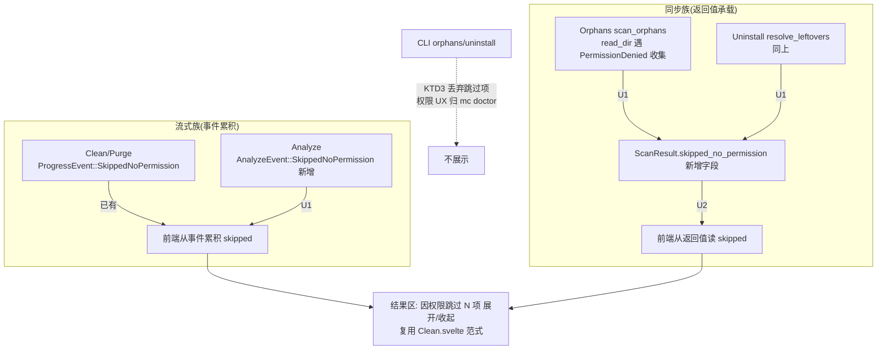

# feat: GUI 权限跳过展示五入口对齐——Analyze / Uninstall / Orphans 补齐

## Summary

GUI 五个扫描入口里,只有 Clean / Purge 在结果区展示「因权限跳过 N 项 展开/收起」——因为它们走流式 `ProgressReporter`,`scan_clean`/`scan_purge` 在 `read_dir` 遇 `PermissionDenied` 时 emit `ProgressEvent::SkippedNoPermission`,前端累积后渲染。另外三个入口(Analyze / Uninstall / Orphans)**没有这个展示**:用户在这些 tab 里因缺 Full Disk Access 遭遇静默漏扫,却看不到"扫漏了什么、为何漏、如何授权",违背 STRATEGY「透明可信」定位。

根因不是前端遗漏,而是**后端供给能力三级分化**:
- **Clean / Purge** — 流式 + 已 emit + 前端已展示 ✅(既有范式,本计划对齐目标)。
- **Analyze** — 流式(独立 `AnalyzeEvent` channel),但 `AnalyzeEvent` 枚举无权限跳过变体,core `analyze` 遍历遇权限拒未上报。
- **Uninstall / Orphans** — **同步一次性扫描**(KTD1:核心一次性返回全量快照,无 `Channel`/`on_event`),后端无事件流可承载跳过项;且 core `scan_orphans()` / `find_leftovers()` 在 `read_dir` 失败时直接 `continue` 静默丢弃。

本计划把「权限跳过是结构化信号」这条护栏上提到五入口一致(呼应 [[per-component-guards-miss-cross-surface-races]]:多入口共享同一动作时护栏要上提到最近公共祖先——这里是"扫描遇权限拒 → 结构化上报 → 前端展示"这条链)。载体按入口的流式/同步性质分两类:流式入口(Analyze)加事件变体;同步入口(Uninstall / Orphans)靠返回值承载。前端三入口复用 Clean/Purge 既有的「因权限跳过 N 项」展示范式。

**Product Contract preservation:** 无上游需求文档;纯工程加固(可观测性/透明度),不改安全分级、不改 `preselect` 语义、不改删除信任链。

---

## Problem Frame

### 现状(代码核实)

| 入口 | 扫描性质 | 后端权限跳过供给 | 前端展示 |
|---|---|---|---|
| Clean | 流式(`Channel<ProgressEvent>`) | ✅ `scan_clean` emit `SkippedNoPermission` | ✅ `Clean.svelte:306` 展示区 |
| Purge | 流式 | ✅ `scan_purge` emit | ✅ `Purge.svelte` 展示区 |
| Analyze | 流式(`Channel<AnalyzeEvent>`,`analyze.rs` 命令 `:132`;core 遍历 `scanner.rs::analyze_walk`) | ❌ `AnalyzeEvent` 无跳过变体 | ❌ 0 处 |
| Uninstall | **同步**(`scan_uninstall`/`resolve_leftovers` 返回值,无 Channel) | ❌ core streaming 虽 emit,但 GUI 走同步路径不经过 | ❌ 0 处 |
| Orphans | **同步**(`scan_orphans` 返回 `ScanResult`,无 Channel) | ❌ `app_resolver.rs` read_dir 失败静默 `continue` | ❌ 0 处 |

- 既有范式(要对齐的目标):`Clean.svelte:39-40` `skipped`/`showSkipped` 状态;`:107-108` 从事件累积;`:306-317` 结果区可展开列表;`:486` `.skipped` 样式。ipc 类型 `ProgressEvent = ... | { SkippedNoPermission: { path: string } }`(`ipc.ts:27`)。
- 同步入口结构约束(KTD1,`Orphans.svelte:7`/`Uninstall.svelte` 注释):核心一次性返回全量快照,无流式 `Found`、无进度、无取消 flag——**无事件通道可承载跳过项**。
- core 供给缺口:`scan_orphans()`(`engine.rs:48`)返回 `Vec<ScanItem>`,内部 `AppResolver`(`app_resolver.rs:67`)`read_dir` 失败仅 `warn!` 后 `continue`,不区分 `PermissionDenied`;`find_leftovers` 同理。core analyze 遍历(`scanner.rs::analyze_walk`,park 分支 no-op 回调 / jwalk 分支 `.flatten()` 丢错)未上报权限拒。

### 后果

用户在 Analyze/Uninstall/Orphans 里若某些标准路径(如 `~/Library/Mail`、`~/Library/Containers` 等需 FDA 的位置)因权限被拒,扫描结果**静默偏小**,用户误以为"这些位置很干净"或"没有残留",既做不出正确的清理决策,也得不到"去授权"的引导。这与 `mc doctor`(CLI,#23)已建立的"区分权限失败并引导授权"的产品承诺不一致。

---

## Requirements

- **R1** Analyze / Uninstall / Orphans 三入口在扫描遇 `PermissionDenied` 时,结果区展示与 Clean/Purge 一致的「因权限跳过 N 项 展开/收起」,展开列出被跳过的路径。
- **R2** 仅 `PermissionDenied` 升为结构化"需授权"信号;其它 IO 错误(`NotFound` 等)维持既有静默/`warn!` 处理(与 #23 既有语义一致,不扩大噪声)。
- **R3** 保留同步入口(Uninstall / Orphans)的现有结构性质(KTD1:一次性快照、无流式进度/取消),不为承载跳过项而把同步扫描改造成流式。
- **R4** 保留 Analyze 既有「取消 → 不 finalize、不写槽、返回 None」逻辑(R-review codex-P1),权限跳过事件不干扰取消路径。
- **R5** 不改安全分级、`preselect` 语义、删除信任链(授权闸 / Trash-only / 可信槽回查);跳过项是**只读展示**,永不进入待删集。**结构性保证**:`skipped_no_permission` 是 `ScanResult` 的独立字段,删除授权路径(`select_by_paths` / 授权闸)只遍历 `scan.categories[].items` 且从后端存储的 `last_*` 槽回查,永不读该字段、也不信任前端回传的 `ScanResult`——故跳过路径即便被前端注入或误标也对删除惰性无效。实现者不得为图省事把跳过项塞进 `categories.items` 展示(那会绕过此保证);U2 补一个**后端级**断言(不止前端 e2e):只存在于 `skipped_no_permission` 的路径永不被选择/授权函数返回。
- **R6** core 签名变更对 CLI 的波及必须显式处理——CLI 消费 `Engine::scan_orphans` / `AppResolver::find_leftovers` / `list_apps`(`cli/src/commands/orphans.rs:78`、`uninstall.rs:33/99`),不得编译破坏;CLI 是否展示跳过项由本计划显式决策(见 KTD3)。
- **R7** 无新 `unsafe`、无新 clippy 警告(pedantic 全开);`ScanResult` / `AnalyzeEvent` 序列化变更保持向后兼容(新字段 `#[serde(default)]`)。

---

## Key Technical Decisions

### KTD1 — 跳过项载体按入口的流式/同步性质分两类,不强行统一成一条通道

五入口分两族,载体各随其性质,而非硬凑一个机制:

- **流式族(Analyze)**:已有 `Channel<AnalyzeEvent>`,给枚举加 `SkippedNoPermission { path }` 变体,core 遍历遇权限拒 `send` 一条,前端累积——**与 Clean/Purge 的事件累积模型同构**。
- **同步族(Uninstall / Orphans)**:无事件通道(KTD1 结构约束),跳过项**只能随返回值回传**。给 `ScanResult` 加 `skipped_no_permission: Vec<PathBuf>` 字段(`#[serde(default)]` 向后兼容),同步入口填充它,前端从返回值读。

**为何不统一给 `ScanResult` 加字段让五入口都用它**:Clean/Purge/Analyze 走流式,skipped 天然从事件流增量到达,前端边扫边填;把它们改成"扫完从 ScanResult 读"反而丢掉流式增量性、且与既有前端逻辑冲突。**为何不给同步入口硬加 Channel**:违反 R3(KTD1 的一次性快照是刻意设计,加 Channel 是无收益的结构复杂化)。

### KTD2 — core 层:`PermissionDenied` 探测复用 `is_permission_denied` 既有判定,只在 read_dir 失败分支收集

core 已有区分权限拒的先例:`scanner.rs:782` 的 `err.kind() == ErrorKind::PermissionDenied` 判定 + `scan_apps_streaming`(`app_resolver.rs:123`)已 emit `SkippedNoPermission`。本计划在同步扫描的 `read_dir` 失败分支(`app_resolver.rs:67` orphans、`find_leftovers` 内对应处)同样只对 `PermissionDenied` 收集跳过路径,其它错误维持 `warn!`+`continue`(R2)。analyze 遍历遇权限拒同理只对 `PermissionDenied` 发事件。

### KTD3 — core 函数返回跳过项(委托包装形状),CLI 显式忽略(本轮不在 CLI 展示)

**返回形状锁定为委托包装(原选项 (c))**:保留 `scan_orphans() -> Vec<ScanItem>` 与 `find_leftovers(bundle_id) -> Vec<ScanItem>` 旧签名不变供 CLI 用,**新增** `scan_orphans_with_skips() -> (Vec<ScanItem>, Vec<PathBuf>)` 与 `find_leftovers_with_skips(bundle_id) -> (Vec<ScanItem>, Vec<PathBuf>)` 供 GUI 用;旧函数委托新函数并丢弃跳过项。此形状让 R6(CLI 零破坏)平凡成立、把改动局部化,优于"改旧签名返回元组"(波及 CLI)或"下沉 ScanResult 到 core"(改变 CLI 收到的类型、blast radius 大)。

**CLI 本轮显式忽略跳过项**——CLI 已有独立的 `mc doctor` 命令(#23)专门做权限体检与授权引导,orphans/uninstall CLI 子命令不重复展示;CLI 继续调旧签名 `scan_orphans()`/`find_leftovers()`,天然拿不到也不展示跳过项(R6:不破坏编译、CLI 行为零变更)。跳过展示是本轮的 **GUI-only** 增强。

**代价**:core 多两个 `_with_skips` 函数;**收益**:CLI 签名与行为零变更、范围收敛、避免在两处重复权限 UX。CLI 展示跳过项若有价值,留 Deferred。

### KTD4 — 前端三入口复用 Clean/Purge 展示范式,不新造组件

三入口 `.svelte` 各自加与 `Clean.svelte:306-317` 同构的展示块(`skipped` 状态 + `showSkipped` 折叠 + `.skipped-list`)。**为何不抽公共组件**:三入口相位机不同(Uninstall 是 `list→review→delete`、Orphans 是 `loading→ready`、Analyze 是增量树),插入点和数据来源(事件 vs 返回值)各异,过早抽象反增耦合;先对齐行为与样式,组件化留 Deferred。样式复用同一份 `.skipped` CSS(可在各文件重复,或本轮抽到共享样式——见 U2 待实现决策)。

### KTD5 — Uninstall 的跳过主要在 `resolve_leftovers`,不在 `scan_uninstall`

`scan_uninstall` 读 `/Applications`(通常无需 FDA);权限拒主要发生在 core `find_leftovers`(`app_resolver.rs`)探测 `~/Library` 各残留位置时的 `read_dir`——**收集点在 core `find_leftovers`,非 GUI `resolve_leftovers`**。GUI `resolve_leftovers` 命令(`gui/src/commands/uninstall.rs`)只是在 review 相位承载并转发 core 返回的跳过项。故 Uninstall 入口的跳过展示挂在 **review 相位**(`resolveLeftovers` 返回后),而非 list 相位。此判断在 U2 实现时以实际 read_dir 位置复核。

**list 相位(`scan_uninstall`)范围界定**:`/Applications` 与 `~/Applications` 是标准可读位置、不依赖 FDA,list 相位的权限拒实际不发生,故本计划**不**为 list 相位实现跳过收集/展示。若 U1 实现时发现 `scan_uninstall` 的 read_dir 确会遇 `PermissionDenied`(如自定义应用目录),则跳过项一并收集并挂 list 相位——但默认按"list 相位无权限拒"处理,不强求。

---

## High-Level Technical Design

两族的差异仅在"跳过项如何到达前端":流式族经事件通道增量到达,同步族随一次性返回值到达。到达前端后,三入口的展示 UI 与 Clean/Purge 完全一致(KTD4)。CLI 消费同一批 core 函数但丢弃跳过项(KTD3)。

---

## Implementation Units

### U1. core 供给层:三入口权限跳过数据收集

**Goal:** 让 core 在 Analyze / Orphans / Uninstall 的扫描路径遇 `PermissionDenied` 时结构化收集被跳过路径——Analyze 经新增 `AnalyzeEvent` 变体,Orphans/Uninstall 经返回值;CLI 调用点适配(丢弃跳过项,不破坏编译)。

**Requirements:** R2, R3, R6, R7

**Dependencies:** 无

**Files:**
- `crates/core/src/progress.rs` — `AnalyzeEvent` 加 `SkippedNoPermission { path: PathBuf }` 变体(序列化字段稳定,补往返测试,同 `ProgressEvent::SkippedNoPermission` 的 `:104` 测试)。
- `crates/core/src/models.rs` — `ScanResult` 加 `skipped_no_permission: Vec<PathBuf>` 字段,`#[serde(default)]` 向后兼容;`from_categories` 默认空,补一个可携带跳过项的构造入口(如 `with_skipped` 或参数扩展)。
- `crates/core/src/app_resolver.rs` — `scan_orphans` 内 `read_dir` 失败分支(`:67`)与 `find_leftovers` 内对应处:仅 `PermissionDenied` 收集路径并随返回值上抛;其它错误维持 `warn!`+`continue`(R2)。复用 `PermissionDenied` 判定(参照 `scanner.rs:782` / `scan_apps_streaming:123`)。新增 `scan_orphans_with_skips()`/`find_leftovers_with_skips()`,旧同名函数委托并丢弃跳过项(KTD3)。
- `crates/core/src/scanner.rs` — **`analyze_walk` 增加权限跳过回调参数**:park 分支现有 `|_p, _err| {}` no-op 改为接回调、jwalk 分支 `.into_iter().flatten()` 改为保留 Err 并经 `emit_if_permission_denied`(`:761-782`)判定后回调。这是 analyze 权限拒的真实落点(非 engine.rs)。
- `crates/core/src/engine.rs` — `scan_orphans` facade 保留旧签名(委托 `app_resolver` 新函数);GUI 侧经新 `_with_skips` 函数取跳过项(engine 是否加 facade 平价的 `_with_skips` 入口由实现定,保持 facade 平价风格)。
- `crates/cli/src/commands/analyze.rs`、`crates/tui/src/command.rs` — `analyze_walk` 新回调参数传 no-op(CLI/TUI 行为零变更)。
- `crates/cli/src/commands/orphans.rs`、`crates/cli/src/commands/uninstall.rs` — 继续调旧签名 `scan_orphans()`/`find_leftovers()`,天然不拿跳过项(KTD3),CLI 行为不变。

**Approach:**
- `AnalyzeEvent::SkippedNoPermission { path }`:镜像既有 `ProgressEvent::SkippedNoPermission` 的形状与序列化契约。
- `ScanResult.skipped_no_permission`:同步族的跳过载体。Clean/Purge 的 `ScanResult` 此字段恒空(它们的 skipped 走事件流,不从这里读)——这是刻意的:字段存在但仅同步族填充。
- core 返回形状(**已锁定,见 KTD3**):委托包装——保留 `scan_orphans()`/`find_leftovers()` 旧签名供 CLI,新增 `scan_orphans_with_skips()`/`find_leftovers_with_skips()` 返回 `(Vec<ScanItem>, Vec<PathBuf>)` 供 GUI。旧函数委托新函数并丢弃跳过项。
- **analyze 遍历入口(已核实,落点 `scanner.rs::analyze_walk`)**:analyze 走独立 `AnalyzeEvent` 通道,遍历入口是 `crates/core/src/scanner.rs` 的 `analyze_walk`(**非 engine.rs**),运行时同时支持 jwalk 与 park 两条分支,被 **gui/cli/tui 三处调用**。**当前无权限回调**:park 分支硬编码 `|_p, _err| {}` no-op、jwalk 分支 `.into_iter().flatten()` 会静默丢弃 Err。故 U1 必须**给 `analyze_walk` 增加权限跳过回调参数**(架构改动,非"定位即可"):park 分支接回调、jwalk 分支改为保留 Err 以复用 `emit_if_permission_denied`/`is_permission_denied`(`scanner.rs:761-782`)。**连带适配三个 caller**:`crates/cli/src/commands/analyze.rs` 与 `crates/tui/src/command.rs` 传 no-op 回调(行为不变),`crates/gui/src/commands/analyze.rs` 传发 `AnalyzeEvent::SkippedNoPermission` 的回调。此改动波及 CLI/TUI(仅传 no-op,零行为变更),是本单元已知范围的一部分,非意外扩张。

**Patterns to follow:** `scanner.rs:761-782` 的 `is_permission_denied` 判定与"仅 PermissionDenied 升结构化事件"注释(#23);`app_resolver.rs:123` `scan_apps_streaming` 已 emit `SkippedNoPermission` 的写法;`progress.rs:104` `SkippedNoPermission` 序列化往返测试。

**Test scenarios(`core` 单测):**
- `AnalyzeEvent::SkippedNoPermission` 序列化往返:构造含 path 的变体,序列化再反序列化,path 相等(镜像 `progress.rs:107` 既有测试)。
- `ScanResult` 向后兼容:反序列化一个**不含** `skipped_no_permission` 字段的旧 JSON,得到空 Vec(`#[serde(default)]` 生效)。
- `scan_orphans` 收集权限跳过:构造一个 `read_dir` 会返回 `PermissionDenied` 的目录(或注入),断言返回的跳过路径含该目录、`items` 不含该目录下项;`NotFound` 目录**不**进跳过集(R2)。
- `find_leftovers` 同上:权限拒的残留探测位置进跳过集。
- **`analyze_walk` 真发权限跳过事件(P2 覆盖,双引擎)**:对 `analyze_walk` 用 `chmod 000` 目录(复用 `scan_purge_emits_skipped_for_permission_denied_dir` 的构造法),断言 **park 引擎(默认)与 jwalk 引擎(`MC_WALK_ENGINE=jwalk`)下均**经新回调收到该权限拒路径。这是三入口中最复杂的供给路径(双引擎 + 原 flatten 丢错),必须有端到端 core 测试证明遇 `PermissionDenied` 真的回调,而非仅测 `AnalyzeEvent` 序列化。
- **测试根注入(P3)**:`scan_orphans`/`find_leftovers` 扫固定系统路径(`/Applications`、`~/Library` 硬编码),`chmod 000` 临时目录夹具够不到。实现时确认这些函数是否接受可注入 scan root(或加测试接缝 / trait mock `fs::read_dir`);若根硬编码,采用替代测试策略并在 U1 注明。`analyze_walk` 接路径参数,无此问题。
- CLI 调用点编译与行为:CLI orphans/uninstall 丢弃跳过项后,既有输出不变(既有 CLI 测试不回归)。
- Test expectation: core 纯逻辑,无 tauri runtime;权限拒可用临时目录 `chmod 000` 或错误注入模拟(参照 `scanner.rs:1354` `scan_purge_emits_skipped_for_permission_denied_dir` 的构造法)。

**Verification:** `cargo build`(全 workspace,含 CLI);`cargo test -p mc-core`;`cargo test -p mc`(CLI 不回归);`cargo clippy --all-targets` 无新警告。

---

### U2. GUI 后端 + 前端:三入口接线并复用展示范式

**Goal:** GUI 三入口把 core 的跳过项传到前端并渲染 Clean/Purge 同构的「因权限跳过 N 项」展示——Analyze 从 `AnalyzeEvent` 累积,Orphans/Uninstall 从 `ScanResult.skipped_no_permission` 读。

**Requirements:** R1, R3, R4, R5

**Dependencies:** U1

**Files:**
- `crates/gui/src/commands/analyze.rs` — `analyze` 命令的 `on_event: Channel<AnalyzeEvent>` 已存在,新增的 `SkippedNoPermission` 变体自动流经(确认 TauriReporter/channel 转发无需改;取消路径不受影响,R4)。
- `crates/gui/src/commands/orphans.rs` — `scan_orphans`(`:34`)把 core 返回的跳过项填入 `ScanResult.skipped_no_permission`(若 U1 选形状 (b)/(c),此处适配)。
- `crates/gui/src/commands/uninstall.rs` — `resolve_leftovers`(`:40`)同上填充(KTD5:跳过主要在此而非 `scan_uninstall`)。
- `crates/gui/frontend/src/lib/ipc.ts` — `AnalyzeEvent` TS 类型加 `{ SkippedNoPermission: { path: string } }`;`ScanResult` 类型加 `skipped_no_permission?: string[]`(可选,兼容旧)。
- `crates/gui/frontend/src/routes/Analyze.svelte` — `skipped`/`showSkipped` 状态 + 事件循环里 `"SkippedNoPermission" in e` 分支累积 + 展示块(镜像 `Clean.svelte:107/306`);挂在树视图结果区。
- `crates/gui/frontend/src/routes/Orphans.svelte` — 从 `scanOrphans()` 返回的 `result.skipped_no_permission` 填 `skipped` + 展示块;挂 `ready` 相位。
- `crates/gui/frontend/src/routes/Uninstall.svelte` — 从 `resolveLeftovers()` 返回读 skipped + 展示块;挂 `reviewReady` 相位(KTD5)。
- (待实现决策)共享 `.skipped` 样式:各文件重复 CSS,或抽到共享样式文件。

**Approach:**
- Analyze:流式,与 Clean 完全同构——事件循环加分支 `else if ("SkippedNoPermission" in e) skipped.push(e.SkippedNoPermission.path)`;每次扫描开始清空 `skipped`(同 `Clean.svelte:94`);取消路径不触碰(R4)。
- Orphans/Uninstall:同步,扫描函数返回后 `skipped = result.skipped_no_permission ?? []`;展示块条件 `{#if <结果相位> && skipped.length > 0}`。
- 展示块结构与 `Clean.svelte:306-317` 逐行对齐(折叠按钮文案「因权限跳过 {N} 项 {展开/收起}」+ `.skipped-list` 列表 + `title={p}`)。
- 跳过项**只读展示**,不进 `selected`/`marked`(R5);不加 toggle、不参与删除。

**Patterns to follow:** `Clean.svelte:39-40/94/107-108/306-317/486-496` 的完整展示范式(状态、清空、累积、渲染、样式);`Purge.svelte` 同构块;三入口各自既有相位机(不破坏 `Uninstall.svelte:38` 代码注释标注的 KTD6 相位、`Orphans.svelte:37` 相位、`Analyze.svelte:28` 相位——此处 KTD6 是 Uninstall.svelte 代码内注释标签,非本计划决策条目)。

**Test scenarios:**
- 前端 e2e(`crates/gui/frontend/e2e/`,tauri-mock):
  - `analyze.spec.ts` — mock `analyze` 命令发一条 `SkippedNoPermission` 事件,断言结果区出现「因权限跳过 1 项」,点击展开列出该路径。
  - `orphans.spec.ts` — mock `scan_orphans` 返回带 `skipped_no_permission: ["/x"]` 的 ScanResult,断言 ready 相位展示跳过区。
  - `uninstall.spec.ts` — mock `resolve_leftovers` 返回带跳过项,断言 reviewReady 相位展示。
  - 对照:mock 返回**空** skipped 时,三入口**不**出现跳过区(证明条件渲染正确,非恒显)。
- 既有 e2e(clean/purge/orphans/uninstall/analyze spec)不回归。
- Test expectation: 前端行为经 Playwright + tauri-mock 覆盖(参照既有 spec 与 `support/tauri-mock.ts`);后端命令为 `#[tauri::command]`,以既有单测不回归 + 结构正确为准。

**Verification:** `cargo build -p mc-gui`;`cargo test -p mc-gui` 不回归;前端 `pnpm test`/`playwright test` 三入口新 spec 通过、既有不回归;`cargo clippy --all-targets` 无新警告;真机冒烟:无 FDA 授权时打开 Analyze/Uninstall/Orphans,遇受保护路径应出现跳过区。

---

### U3. 回归测试收口 + 一致性契约

**Goal:** 用测试锁死"五入口权限跳过展示一致"这一不变量,防止未来新增扫描入口或重构时再度只做一部分;必要时沉淀可复用模式。

**Requirements:** R1, R6

**Dependencies:** U1, U2

**Files:**
- `crates/core/src/progress.rs` / `models.rs` — 确保 U1 的序列化往返 + 向后兼容测试作为命名回归存在。
- `crates/gui/frontend/e2e/` — 确保 U2 的三入口跳过展示 spec 作为命名回归存在,注释点明"与 Clean/Purge 对齐,防多入口只做一处"(引用 [[per-component-guards-miss-cross-surface-races]])。
- `docs/solutions/`(可选)— 若沉淀出"多入口可观测性信号对齐"可复用模式,留 `/ce-compound` 阶段处理,本计划不强制。

**Approach:**
- 回归契约以"五入口都能展示权限跳过"为断言目标:core 侧证明三入口的供给路径会收集 `PermissionDenied`;前端侧证明三入口会渲染。
- 注释显式引用教训与本计划,形成"根因 → 五入口对齐"闭环记录。

**Patterns to follow:** PR#58 竞态修复的回归契约风格(命名测试 + 注释引用 origin/教训,见 `crates/gui/src/slot.rs` 测试模块);既有 orphans e2e 的对照断言风格(命中 vs 不命中都断言)。

**Test scenarios:**
- core:`PermissionDenied` 进跳过集、`NotFound` 不进(R2 对照,已在 U1 列出,此处确保命名 + 注释)。
- 前端:空 skipped 不显示、非空显示(R1 对照,已在 U2 列出,此处确保命名 + 注释引用教训)。
- Test expectation: 均为 U1/U2 已列测试的收口与命名,不新增被测面。

**Verification:** `cargo test -p mc-core` + 前端 e2e 全绿;回归测试注释引用教训与本计划。

---

## Scope Boundaries

### 本计划做
- Analyze / Uninstall / Orphans 三入口的权限跳过展示补齐,与 Clean/Purge 对齐(GUI + core 供给)。
- core 层 `PermissionDenied` 结构化收集(AnalyzeEvent 变体 + ScanResult 字段)。
- 三入口前端展示 + 回归测试。

### Deferred to Follow-Up Work
- **CLI 展示权限跳过**:本轮 CLI 显式丢弃跳过项(KTD3),权限 UX 归 `mc doctor`。若 orphans/uninstall CLI 子命令展示跳过项有价值,后续评估。
- **跳过展示组件化**:三入口相位机各异,本轮各自实现同构块(KTD4);若重复度证明值得,后续抽公共 Svelte 组件 + 共享样式。
- **授权引导深化**:本轮只展示"跳过了什么",不做入口内一键跳转 FDA 设置(GUI 已有 `openFdaSettings` 命令 + 命令面板 `act.fda`,可后续在跳过区加引导按钮)。

### 非目标(产品身份边界)
- 不改安全分级、`preselect` 语义、删除信任链(授权闸 / Trash-only / 可信槽回查)。
- 不把同步扫描(Uninstall/Orphans)改造成流式(R3,KTD1 一次性快照是刻意设计)。
- 不改 CLI/TUI 的**行为**:CLI orphans/uninstall 不展示跳过项(KTD3);`analyze_walk` 签名变更对 CLI/TUI 仅传 no-op 回调,零行为变更(见 System-Wide Impact)。
- 不改 Clean/Purge 既有展示(它们是对齐目标,不动)。

---

## System-Wide Impact

- **`ScanResult` 新增字段**:`skipped_no_permission: Vec<PathBuf>`(`#[serde(default)]`)。被 clean/purge/uninstall/orphans 的 GUI 命令 + CLI 消费;向后兼容,旧序列化数据反序列化得空 Vec。
- **`AnalyzeEvent` 新增变体**:`SkippedNoPermission { path }`。仅 analyze 通道使用;前端 TS 类型同步。
- **`analyze_walk` 签名变更(`scanner.rs`)**:新增权限跳过回调参数,波及三个 caller——`crates/cli/src/commands/analyze.rs`、`crates/tui/src/command.rs`(均传 no-op,行为零变更)、`crates/gui/src/commands/analyze.rs`(传发事件的回调)。这是本计划**唯一触及 TUI** 之处,且仅为传 no-op 适配签名,不改 TUI 行为。
- **core `scan_orphans` 签名变更**:波及 CLI(`cli/src/commands/orphans.rs:78`)——U1 显式适配丢弃跳过项(R6)。
- **core `find_leftovers` 签名变更**:U1 让其收集并返回跳过项,故波及 CLI(`cli/src/commands/uninstall.rs:99`),同样 U1 显式适配丢弃(R6)。若 A5 择用"保留旧签名委托新函数"形状,则 `find_leftovers` 签名可保持不变、CLI 无需改——实现时与 A5 一并定夺,两处(此处与 U1)措辞随之统一。
- **CLI 行为零变更**(KTD3):CLI 消费新签名但不展示跳过项。
- **无新 IPC 命令**:`generate_handler!` 命令表不变;`capabilities/default.json` 无需动。

---

## Risks & Dependencies

| 风险 | 缓解 |
|---|---|
| **core 签名变更破坏 CLI 编译**(R6) | U1 显式列出 CLI 调用点(orphans.rs:78 / uninstall.rs:33/99),`cargo build` 全 workspace 验证;倾向"保留旧签名委托"形状(KTD3 待实现决策 (c))进一步降波及。 |
| **`ScanResult` 加字段影响 clean/purge**(它们该字段应恒空) | 字段 `#[serde(default)]`;clean/purge 的 GUI 命令不填充它(skipped 走事件流);前端 clean/purge 维持从事件读,不从 ScanResult 读——两族来源不混。 |
| **analyze 权限事件干扰取消路径**(回退 R-review codex-P1) | R4:取消 → 返回 None 不 finalize/不写槽的逻辑不动;`SkippedNoPermission` 只是遍历期增量事件,与 finalize/取消正交;U2 确认不在取消分支触发。 |
| **analyze core 遍历入口定位错误**(权限拒未真正发事件) | U1 实现时先定位 core analyze 用 jwalk 还是 park_walk,在其真实 read_dir/entry 失败回调加事件;真机冒烟(无 FDA)复核。 |
| **前端已串行/受保护路径在真机不可复现** | 与 PR#58 同款纵深防御定位:展示是可观测性增强,乱序/权限场景由测试(错误注入 + tauri-mock)保证,不依赖真机必现。 |
| **跳过项误入待删集**(违反 R5) | 展示块只读渲染,不加 toggle、不进 `selected`/`marked`;U2 测试对照断言跳过项不可选。 |

**Dependencies:** 无外部依赖。U1(core 供给)→ U2(GUI 接线)→ U3(回归收口)严格依赖顺序。

---

## Verification Contract

- `cargo build`(全 workspace,含 CLI)通过——core 签名变更不破坏 CLI。
- `cargo clippy --all-targets` 无新警告(pedantic 全开),无新 `unsafe`。
- `cargo test -p mc-core`:`AnalyzeEvent::SkippedNoPermission` 序列化往返、`ScanResult` 向后兼容、`scan_orphans`/`find_leftovers` 权限拒收集(仅 PermissionDenied)全绿。
- `cargo test -p mc`(CLI)+ `cargo test -p mc-gui` 既有测试不回归。
- 前端 `playwright test`:三入口(analyze/orphans/uninstall)新 spec 通过(有跳过项显示、无则不显示),既有 spec 不回归。
- 一致性检查:五入口(clean/purge/analyze/uninstall/orphans)`.svelte` 均含权限跳过展示块(`rg "因权限跳过" crates/gui/frontend/src/routes/` 应五命中)。
- 真机冒烟:撤销 Full Disk Access 后,Analyze/Uninstall/Orphans 遇受保护路径应出现「因权限跳过 N 项」,展开列出路径;授权后跳过区消失。

---

## Definition of Done

- [ ] U1:`AnalyzeEvent::SkippedNoPermission` 变体 + `ScanResult.skipped_no_permission` 字段;`scan_orphans`/`find_leftovers` 收集权限拒;CLI 调用点适配丢弃;core 单测(序列化往返 + 向后兼容 + 权限拒收集)全绿。
- [ ] U2:三入口 GUI 命令填充/转发跳过项;三入口 `.svelte` 复用 Clean/Purge 展示范式;ipc TS 类型同步;前端 e2e 三入口 spec 通过。
- [ ] U3:命名回归测试锁死五入口一致性,注释引用教训与本计划。
- [ ] Verification Contract 全部通过。
- [ ] 无新 clippy 警告、无新 `unsafe`;安全分级/preselect/删除信任链不变;跳过项只读不可选。

---

## Assumptions

pipeline 模式下无用户在场确认,以下决策取合理默认并记录,实现或评审时可修正:

- **A1(KTD3)**:CLI 本轮**不**展示权限跳过项,只 GUI 展示——因 CLI 已有 `mc doctor` 专司权限体检。若期望 CLI orphans/uninstall 也展示,属范围变更。
- **A2(KTD1 载体)**:同步入口用 `ScanResult` 加字段承载跳过项,而非改同步扫描为流式——保留 KTD1 一次性快照设计(R3)。
- **A3(KTD5)**:Uninstall 的跳过展示挂 review 相位(`resolveLeftovers` 后),因权限拒主要在 `~/Library` 残留探测而非 `/Applications` 列表;实现时以实际 read_dir 位置复核。
- **A4(KTD4)**:三入口各自实现同构展示块而非抽公共组件,组件化留 Deferred。
- **A5**:core `scan_orphans` 返回形状取"最小化 CLI 波及"的变体(倾向下沉 ScanResult 到 core 或保留旧签名委托),实现时择一并在 PR 说明。

---

## Sources & Research

- 代码核实:`crates/gui/frontend/src/routes/Clean.svelte:39-40/94/107-108/306-317/486-496`(既有展示范式)、`Purge.svelte`(同构)、`Analyze.svelte:28/132`、`Uninstall.svelte:38/115-140`、`Orphans.svelte:7/33-55`。
- core:`crates/core/src/progress.rs:22-24/53-65/104-110`(`SkippedNoPermission` 事件 + `AnalyzeEvent`)、`models.rs:97-115`(`ScanResult`)、`engine.rs:48`(`scan_orphans`)、`app_resolver.rs:67/123`(read_dir 静默 vs streaming emit)、`scanner.rs:761-782/1354`(`PermissionDenied` 判定 + 既有测试)。
- CLI 波及:`crates/cli/src/commands/orphans.rs:78`、`uninstall.rs:33/99`;`mc doctor`(`crates/core/src/doctor.rs`,#23 权限体检内核)。
- 前端类型:`crates/gui/frontend/src/lib/ipc.ts:27/145-151/317-322`。
- 教训:[[per-component-guards-miss-cross-surface-races]](多入口共享同一动作,护栏上提到最近公共祖先)、[[forcing-one-trust-axis-misses-sibling-axis]](外部信号每属性×每消费面都要问是否覆盖)。
- 相关 PR:PR#58(`2026-07-20-001-fix-gui-scan-slot-race-plan.md`,同类"多入口只做一处"根治,回归契约风格参照)。
- 战略锚点:`STRATEGY.md`(透明可信、无静默失败是产品区别于竞品的根基)。
