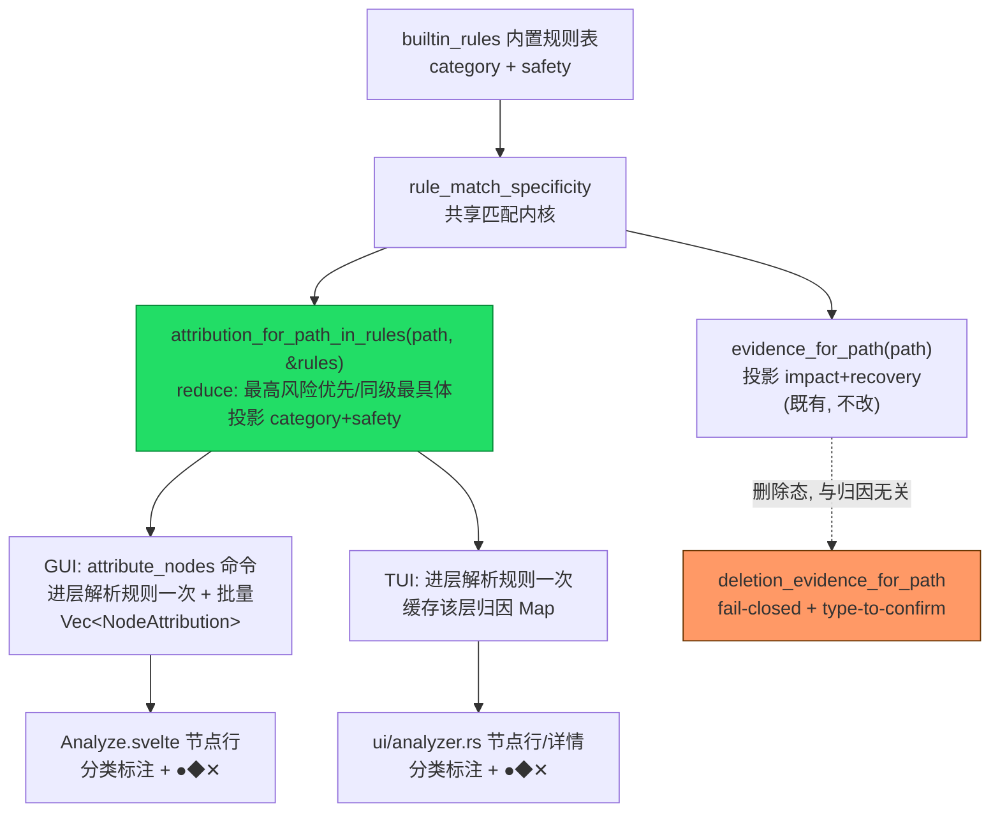

# feat: Analyze 归因——大目录清理归属只读标注

## Summary

在 Analyze 磁盘导航视图里，为每个目录节点**只读标注**它是否落在某条内置清理规则的覆盖范围内，以及归属的清理分类（如 `node_modules → Node.js`、`~/Library/Caches → 系统缓存`）。用户浏览"什么占了空间"时，能一眼看出"这 8 GB 是可 purge 的开发产物"还是"未识别的用户数据"，无需先标记再看确认框里的证据。

这是 beat-mole roadmap #6（Analyze 归因/大文件只读）的**归因 MVP**，复用既有的 `evidence_for_path` 规则反查管线与规则的 `category` 字段。**严格只读**：归因标注只增强"这是什么"的认知，绝不改变风险分级、预选、删除授权或最终动作语义——删除仍统一走 `deletion_evidence_for_path`（见 [Analyze 未知路径] 契约）。

**为什么现在做这个（排序理由）：** beat-mole roadmap #1-#5 的打赢/追平主线均已出货（GUI MVP、信任资产、权限诊断、undo、孤儿残留），#6 是优先序里下一个、且是**唯一一个一 PR 可闭合的有界项**（#26 GUI epic 需先 brainstorm 定边界，不是 plan-ready）。它复用既有底座、边际成本低，是把已铺管线兑现成用户可见价值的低风险增量。诚实定位：这是**追平 + 打磨**项（Mole 的 `mo analyze` 已有 disk insights），非竞争性打赢；其差异化的另一半（未识别大目录起草规则草稿喂规则库）在 Scope Boundaries 显式推迟为独立 PR。

**覆盖率预期（诚实边界，见 [Analyze 归因失效面]）：** `Exact` 规则匹配是 `path.starts_with(base)`，只有规则路径**或其后代**归因，祖先目录一律 `None`。因此本 MVP 的目标画像是**开发者的 dev-artifact 目录**（`node_modules`/`target`/`DerivedData`/各类缓存）——这些正是规则命中面。对通用磁盘探索（`analyze ~` 首屏的 `Application Support`/`Containers`/`Documents` 等无规则大目录），归因会大面积显示"未识别"，这是预期行为而非缺陷：未识别 = 无内置规则可证明可清理，本就该保守呈现。不承诺"通用磁盘归因洞察"。

---

## Problem Frame

Analyze 视图目前只呈现路径 + 体积的树导航。规则归属信息（这个大目录是不是某条清理规则覆盖的、属于哪个分类）只在用户**标记路径并打开删除确认框**时、经 `deletion_evidence_for_paths` 回查后才出现（`crates/gui/src/commands/analyze.rs:100` / TUI 删除确认路径）。

结果是：浏览态与判断态割裂。用户看到 `~/Library/Developer/Xcode/DerivedData` 占 12 GB，但要判断"这能不能安全删"必须先标记、再读确认框文案。对位竞品 Mole 的 `mo analyze` 已有 disk insights，而我们的 Analyze 停在"纯体积树"，归因能力已在 core 就绪却没有在浏览态露出。

**要解决的**：把已有的规则归因能力从"删除确认态"前移到"浏览态"，作为只读的辅助认知层。

**不解决的**（见 Scope Boundaries）：大文件专项视图、重复文件、未识别大目录"一键起草规则草稿"、归因驱动的自动预选。

---

## Requirements

- **R1** — core 提供一个只读的路径→归因查询：给定路径，返回它命中的内置清理规则的**分类名**与**安全等级**，或 `None`（未被任何内置规则覆盖）。多规则命中时沿用既有"最高风险优先、同级取最具体"的 reduce 语义。
- **R2** — 归因只信任 `builtin_rules()`，与 [Analyze 未知路径] 契约一致：用户叠加规则**不能**让路径显示为"可清理归类"。未命中内置规则的路径归因为 `None`，UI 呈现为"未识别"，绝不呈现为 Safe 或可删。
- **R3** — GUI Analyze 树的每个节点行展示归因标注：命中时显示分类名 + 安全等级色/形标记（复用 `SafetyLevel` 的 ●/◆/✕ 语义——circle/diamond/cross，三角族 ▶/▼ 专属导航轴，不得用于安全等级）；未命中显示中性"未识别"占位或留空，不误导。
- **R4** — TUI Analyze（`AnalyzingLive` / `Analyzing`）在节点行或详情区展示同样的归因信息，与 GUI 消费同一个 core 入口，不各自实现。
- **R5** — 归因是**纯只读**：不改变 `marked` 集、不改变预选、不改变删除授权。删除路径仍完整走 `deletion_evidence_for_path(s)` 的 fail-closed 分类与 type-to-confirm，不得以浏览态归因替代删除前的重新分类。
- **R6** — 归因查询在增量建树/流式重排进行中调用是安全的：按路径查询（不依赖 children 索引），与既有置换底座（见 `docs/solutions/design-patterns/render-layer-sort-permutation-indices.md`）不冲突。

---

## Key Technical Decisions

- **KTD1 — 复用 `evidence_for_path_in_rules` 的 reduce，但归因需要 `category`，现有函数只返回 `(safety, impact, recovery)`。** 新增两个平行的核心函数：`attribution_for_path_in_rules(path, &[CleanRule]) -> Option<Attribution>`（接收已解析规则，供渲染层/批量入口复用）与便捷包装 `attribution_for_path(path) -> Option<Attribution>`（内部 `builtin_rules()` 一次性加载后委托前者）。复用与 `evidence_for_path_in_rules` **相同**的 `rule_match_specificity` filter + reduce，返回携带 `category` 的结构。**不改** `evidence_for_path` 的签名。
  - _Rationale:_ 归因关心"属于哪一类清理"，删除证据关心"删了有什么后果"，两者语义不同但共享同一条规则匹配逻辑。**接收 `&[CleanRule]` 的变体是必需的**——TUI 渲染层与 GUI 命令都要在"进入某层/拿到 children 时解析一次 `builtin_rules()`、对该层节点复用"，而非每节点每帧重解析两张 TOML 表（`builtin_rules()` 无缓存，每次 `toml::from_str`；且 `DirName` 规则的 `rule_match_specificity` 含 `symlink_metadata` + root_marker fs syscall）。镜像既有 `evidence_for_path_in_rules` 的分层。
- **KTD2 — 归因只用 `builtin_rules()`，不用 `all_rules()`。** 与 `deletion_evidence_for_path` 同一信任边界（见 [Analyze 未知路径] / [用户叠加规则]）。
  - _Rationale:_ 若用 `all_rules()`，用户在 `~/.config/mc/rules.toml` 里把 `~/Documents` 声明成某分类，Analyze 就会显示"Documents → 可清理"，这正是安全模型要封死的信任漏洞。归因是认知辅助，同样不能被未审计的用户规则污染。
- **KTD3 — 归因结果的传输结构独立于 `PathSafety`。** GUI 侧新增 `NodeAttribution { path, category: Option<String>, safety: Option<SafetyLevel> }`，不复用 `PathSafety`（后者语义是删除证据、字段是 impact/recovery，且 safety 非 optional）。
  - _Rationale:_ 混用会让"未识别"被迫塞成 Risky（PathSafety 的删除语义），与只读归因的"未识别 = 无归类"语义冲突。类型分离让"未命中"能诚实表达为 `None`。
- **KTD4 — GUI 批量查询走一次命令，避免每节点一次 IPC。** 新增 `#[tauri::command] attribute_nodes(paths: Vec<PathBuf>) -> Vec<NodeAttribution>`，前端在拿到某层 children 后一次性查询该层可见节点。命令内部只加载一次 `builtin_rules()`、对每个 path 调 `attribution_for_path_in_rules`。
  - _Rationale:_ 与既有 `classify_marked` 批量模式一致，`builtin_rules()` 只加载一次。
- **KTD5 — 归因粒度限于规则命中节点本身与其后代（`Exact`）/命中叶子（`DirName`）；祖先/聚合层不归因。** 首版**不做**子孙归因上卷（把某目录下所有已归因子项聚合到父层显示）。
  - _Rationale:_ `Exact` 匹配是 `starts_with`，`DirName` 只命中满足 root_markers 的目录本身，故 `~/projects`、各 repo 根、`~/Library` 这类聚合大目录首版显示 `None`。上卷虽能提升"一眼看出父层可清理"的价值，但涉及"部分子孙已归因/混合安全等级如何聚合展示"的设计，是独立增量（见 Deferred）。首版诚实止步于叶子/后代归因，避免 scope 蔓延。

---

## High-Level Technical Design

归因数据流——从规则表到两个 UI，与删除证据管线并行、共享匹配内核：

关键点：归因（绿）与删除证据（橙）**共享匹配内核但投影不同字段**；删除授权路径完全不经过归因，R5 的只读边界在数据流上即成立。

---

## Implementation Units

### U1. core：`attribution_for_path` 归因查询

**Goal:** 在 `crates/core/src/rules.rs` 提供只读的路径→归因查询，复用规则匹配内核，返回 `category` + `safety`。

**Requirements:** R1, R2, R6

**Dependencies:** 无

**Files:**
- `crates/core/src/rules.rs`（新增函数 + 归因结构 + 单测）
- `crates/core/src/lib.rs`（若需 re-export 归因结构）

**Approach:**
- 新增结构 `Attribution { category: String, safety: SafetyLevel }`（`#[derive(Debug, Clone, Serialize, Deserialize, PartialEq)]`，供 GUI 序列化复用）。
- 新增 `pub fn attribution_for_path_in_rules(path: &Path, rules: &[CleanRule]) -> Option<Attribution>`（接收已解析规则，供渲染层/批量入口复用，镜像既有 `evidence_for_path_in_rules` 的分层）与便捷包装 `pub fn attribution_for_path(path: &Path) -> Option<Attribution>`（内部 `builtin_rules()` 一次性加载后委托前者）。用与 `evidence_for_path_in_rules` **相同**的 `rule_match_specificity` filter + reduce（最高 `safety_rank` 优先，同级取最大 specificity），命中则投影 `(rule.category, rule.safety)`，未命中返回 `None`。
- 抽取共享：把 `evidence_for_path_in_rules` 里的"filter_map specificity + reduce 选最佳规则"逻辑抽成一个返回 `Option<&CleanRule>` 的内部 helper（如 `best_matching_rule`），`evidence_for_path_in_rules` 与新归因函数都调用它、各自 `.map` 投影不同字段。这样删除证据与归因保证用同一套匹配规则，演进不漂移。
- **不改** `evidence_for_path` / `deletion_evidence_for_path` 的公开签名。

**Patterns to follow:** `evidence_for_path_in_rules`（`crates/core/src/rules.rs:286`）的 reduce 结构；`safety_rank`（`:311`）；`deletion_evidence_for_paths` 的"builtin_rules 只加载一次"批量模式（`:265`）。

**Test scenarios:**
- `node_modules`（旁有 `package.json`）归因为分类 `Node.js`、safety `Moderate`（DirName 规则命中真实目录 + 满足 root_markers）。Covers R1.
- `~/Library/Caches`（Exact 规则）归因为对应系统缓存分类、safety `Safe`。Covers R1.
- 未被任何内置规则覆盖的路径（如 `~/Documents/report.txt`）归因为 `None`——不是 Safe、不是任意分类。Covers R2。
- 用户叠加规则声明的路径（构造一条 `user_rules` 命中的路径）归因仍为 `None`——归因只信 `builtin_rules()`，与 `deletion_evidence_for_path` 同边界。Covers R2。
- 多规则同时命中同一路径时，取最高风险；同风险取最具体规则（构造重叠 Exact + DirName）。Covers R1。
- `DirName` 名字命中但**不满足 root_markers**（如裸 `target` 旁无 `Cargo.toml`）→ 归因为 `None`，不能仅凭目录名归类。Covers R2/R6。
- **交叉一致性**：对同一 builtin 命中路径，`attribution_for_path` 投影的 `safety` 与 `deletion_evidence_for_path` 返回的 `safety` 相同——把"归因与删除证据用同一套匹配"从间接（两侧各自测试）升为显式断言，守卫共享 `best_matching_rule` helper 抽取不引入偏差。Covers R2/KTD1。

**Verification:** `cargo test -p mc-core rules::` 通过；`evidence_for_path` 既有测试全绿（证明抽取共享 helper 未回归删除证据路径）。

---

### U2. GUI：`attribute_nodes` 命令 + Analyze 树归因标注

**Goal:** GUI Analyze 视图为可见节点批量查询归因，并在每行只读展示分类 + 安全标记。

**Requirements:** R3, R4(共享入口), R5

**Dependencies:** U1

**Files:**
- `crates/gui/src/commands/analyze.rs`（新增 `NodeAttribution` + `attribute_nodes` 命令 + 单测）
- `crates/gui/src/lib.rs`（注册命令到 invoke_handler）
- `crates/gui/frontend/src/routes/Analyze.svelte`（拿到 children 后调用命令、渲染归因）
- `crates/gui/frontend/src/lib/AnalyzeReviewRow.svelte` 或节点行组件（归因标注渲染）
- `crates/gui/frontend/e2e/analyze.spec.ts`（e2e：归因标注出现且只读）

**Approach:**
- GUI 侧结构 `NodeAttribution { path: PathBuf, category: Option<String>, safety: Option<SafetyLevel> }`（KTD3；非 U1 的 core 侧 `Attribution`——后者字段非 optional），`attribute_nodes(paths)` 内部只加载一次 `builtin_rules()`、对每个 path 调 `attribution_for_path_in_rules`，命中投影 category+safety、未命中两者 `None`。
- 前端在进入某层 / 拿到某层 children 后，取可见节点路径一次性调 `attribute_nodes`，用 `Map<path, attribution>` 渲染。命中显示分类名 + `SafetyLevel` 对应色/形标记（复用既有 ●/◆/✕ 与配色，见 `safety.ts` 的 `safetyDescriptor(level).glyph`——不硬编码字形）；未命中显示中性"未识别"或留空。
- **只读边界（R5）**：归因数据仅用于展示，不写入 `marked`、不影响勾选、不参与 `delete_marked` 授权。删除仍走既有 `classify_marked` → `delete_marked` 路径。

**Patterns to follow:** `classify_marked` / `classify_paths`（`crates/gui/src/commands/analyze.rs:100/117`）的批量查询与命令注册；`Analyze.svelte` 既有 `evidenceByPath` Map 渲染（`:206`）；`SafetyLevel` 色/形约定（DESIGN.md / theme.rs）。

**Test scenarios:**
- （rust 单测）`attribute_nodes` 对已知规则路径返回 category+safety，对未知路径返回双 `None`，顺序与输入一致。Covers R3。
- （e2e）Analyze 树中一个命中规则的目录行显示分类标注与安全标记。Covers R3。
- （e2e）一个未识别目录行显示"未识别"/留空，**不显示**任何"可安全删除"暗示。Covers R2/R3。
- （e2e）归因标注出现**不改变**该行的勾选态、不自动预选；删除确认仍独立弹出并显示删除证据。Covers R5。

**Verification:** `cargo test -p mc-gui`（或 workspace 测试涵盖该 crate）通过；GUI e2e `analyze.spec.ts` 通过（沙箱 webServer 绕行见 [[gui-e2e-sandbox-webserver-workaround]]）；手动：进入 Analyze，命中/未命中目录标注正确且不改勾选。

---

### U3. TUI：Analyze 节点行/详情归因标注

**Goal:** TUI 的 `AnalyzingLive` / `Analyzing` 视图为当前层节点展示归因，与 GUI 消费同一 core 入口。

**Requirements:** R4, R5, R6

**Dependencies:** U1

**Files:**
- `crates/tui/src/ui/analyzer.rs`（节点行或详情区渲染归因）
- `crates/tui/src/lib.rs` 或 `analyzer_ops.rs`（进入某层/拿到 children 时解析一次 `builtin_rules()` 并对该层节点缓存归因 Map；见 Approach）

**Approach:**
- **进层查一次、缓存该层 Map**（不是每帧现查）：进入某层 / 拿到该层 children 时，解析一次 `builtin_rules()`，对该层可见节点各调 `attribution_for_path_in_rules(path, &rules)`，得 `Map<PathBuf, Attribution>` 供本层渲染复用。渲染节点行（或选中项详情）时查该 Map，命中则在行尾/详情追加分类名 + `SafetyLevel` 的 ●/◆/✕ 标记（复用 `theme::safety_symbol`，不硬编码字形），未命中显示中性态。
  - _为何不"渲染时对每节点调 `attribution_for_path`"：_ `AnalyzingLive` spinner 每 tick 重绘，而 `attribution_for_path` 每次调用都 `builtin_rules()` 重解析两张 TOML 表 + `DirName` 规则含 `symlink_metadata`/root-marker fs syscall；逐节点逐帧现查会把这些成本放大到每帧。用接收 `&[CleanRule]` 的 `_in_rules` 变体（KTD1）做进层一次解析，与 GUI `attribute_nodes` 的批量语义对齐。
- **按路径查询**（不依赖 children 索引），天然兼容置换底座与流式重排（R6）；缓存 Map 键为 `PathBuf`，与显示序/存储序解耦（见 `docs/solutions/design-patterns/render-layer-sort-permutation-indices.md`）。归因 Map 是从规则表派生的展示缓存，非新增权威状态。
- **只读（R5）**：不触碰 `marked`、`user_navigated`、光标或删除授权。

**Patterns to follow:** `ui/analyzer.rs` 既有节点行/详情渲染；`path_at_display_index`（`:28`）拿显示序路径；`theme::safety_symbol` 的安全字形；派生优先于冗余存储（CLAUDE.md TUI 约束）。

**Test scenarios:**
- （渲染/单元）给定含已知规则目录的树，选中该节点时详情/行含正确分类名与安全标记。Covers R4。
- （单元）未识别目录节点渲染中性归因，不呈现可删暗示。Covers R2/R4。
- （单元）归因渲染路径不修改 `marked` / `user_navigated` / 光标（断言这些状态在渲染前后不变，或归因逻辑不接触它们）。Covers R5。

**Verification:** `cargo test -p mc-tui` 通过；`cargo clippy -p mc-tui --all-targets` 无警告；手动：`cargo run -p mc`（TUI）进入 Analyze，命中目录显示归因、未识别中性、勾选/导航不受影响。

---

## Scope Boundaries

**In scope:**
- 只读归因标注（分类名 + 安全等级）在 GUI 与 TUI 的 Analyze 浏览态露出。
- core 归因查询函数，信任边界与删除证据一致（仅 builtin_rules）。

**Deferred to Follow-Up Work:**
- **大文件专项视图**（>阈值文件列表/排序）——beat-mole #6 的另一半，独立 PR。
- **未识别大目录"一键起草规则草稿"**（喂 #2 用户规则库）——依赖规则草稿 UX，独立设计。这是本方向的差异化"打赢"半，首版 MVP 先出识别半（诚实定位见 Summary）。
- **子孙归因上卷**（把某目录下已归因子项聚合到父层显示，缓解 `~/projects`、repo 根等聚合层显示 `None`，见 KTD5）——涉及混合安全等级如何聚合的设计，独立增量。
- 归因命中率统计 / 归因驱动的"跳转到 Clean/Purge 清理此类"动作。

**Outside this product's identity（永不做或明确排除）:**
- 归因**驱动自动预选或自动删除**——违反 [安全分级] 的预选解耦与只读边界（R5）。
- 让用户叠加规则影响归因显示——违反信任边界（R2/KTD2）。
- 重复文件归因（永远最后做、永不预选，见 beat-mole #6 尾注）。

---

## System-Wide Impact

- **core → 两 UI 的契约**：新增 `attribution_for_path` / `attribution_for_path_in_rules` 是纯增量的只读入口，不改既有 `evidence_for_path` / `deletion_evidence_for_path` 签名，故删除路径、CLI 确认、GUI 确认框零回归风险。抽取共享 `best_matching_rule` helper 是内部重构，由 U1 的"既有 evidence 测试全绿"+"归因/删除证据同一路径 safety 一致"两条测试守卫。两 UI 均经 `_in_rules` 变体做"进层解析规则一次、对该层复用"，消除逐节点重解析 TOML。
- **安全模型**：归因与删除授权在数据流上解耦（见 HTD），R5 只读边界是本计划最重要的不变量——评审重点核对"归因是否被误接进预选/删除/勾选任一路径"。参考既有教训 [[forcing-one-trust-axis-misses-sibling-axis]]（外部/规则数据的每个属性 × 每个消费面都要问是否被信任）与 [[per-component-guards-miss-cross-surface-races]]（GUI/TUI 两面共享同一 core 入口，避免各自解释）。

---

## Risks & Dependencies

- **风险：归因被误当作"可删信号"。** 缓解：未命中诚实显示"未识别"而非留白暗示安全；文案不出现"可安全删除"；删除仍独立走确认。评审与 e2e（U2/U3 的 R5 场景）双重守卫。
- **风险：抽取共享匹配 helper 时改动 `evidence_for_path` 行为。** 缓解：U1 保留 evidence 既有全部单测作为回归契约，helper 只是提取不改语义。
- **风险：TUI 渲染层每帧对每节点查规则的开销。** 缓解：U3 采用"进层解析规则一次、缓存该层归因 Map"（经 `attribution_for_path_in_rules` 接收预加载 `&[CleanRule]`），而非每帧对每节点调 `attribution_for_path` 重解析两张 TOML + 发起 `DirName` 的 fs syscall；只对当前可见层查询（非整树）。若 profile 显示热点再优化（本机 EDR 会放大 syscall 测量，见 [[dev-mac-has-edr-distorts-perf]]，勿据本机数据过早优化）。
- **风险：归因覆盖率低于用户预期，通用磁盘探索大面积"未识别"。** `Exact` 是 `starts_with`、`DirName` 只命中满足 root_markers 的叶子，故 `~/Library/Application Support`、`Containers`、`~/projects` 等聚合大目录首版归因 `None`（见 KTD5）。缓解：Summary 显式把目标画像限定为开发者 dev-artifact 目录、诚实标注这是预期行为而非缺陷；子孙上卷列入 Deferred。评审核对文案不把"未识别"渲染成"有问题/不可清理"的负面暗示。
- **依赖**：无外部依赖；纯复用既有 core 规则表与 UI 渲染管线。

---

## Definition of Done

- U1–U3 全部实现，各单元 test scenarios 覆盖并通过。
- `cargo test`（workspace）、`cargo clippy --all-targets`（pedantic 全开）零警告。
- GUI e2e `analyze.spec.ts` 归因相关用例通过。
- 手动验证：GUI 与 TUI 的 Analyze 浏览态，命中规则目录显示正确分类 + 安全标记，未识别目录中性显示，且归因**不改变**任何勾选/预选/删除授权。
- 归因只信 `builtin_rules()`（R2 单测锁定），只读边界（R5）由测试 + 评审确认。

---

## Verification Contract

- **契约测试**：`cargo test -p mc-core rules::` 覆盖 R1/R2/R6 的归因语义（含"未知路径 None""用户规则不参与归因""root_markers 守卫""最高风险优先"）。
- **回归守卫**：`evidence_for_path` 既有单测全绿，证明共享 helper 抽取无删除证据回归。
- **跨面一致**：GUI 与 TUI 均调用同一 `attribution_for_path`，无本地 fallback（评审核对）。
- **只读不变量**：U2/U3 各含一条断言"归因不触碰 marked/预选/删除授权"的测试。
